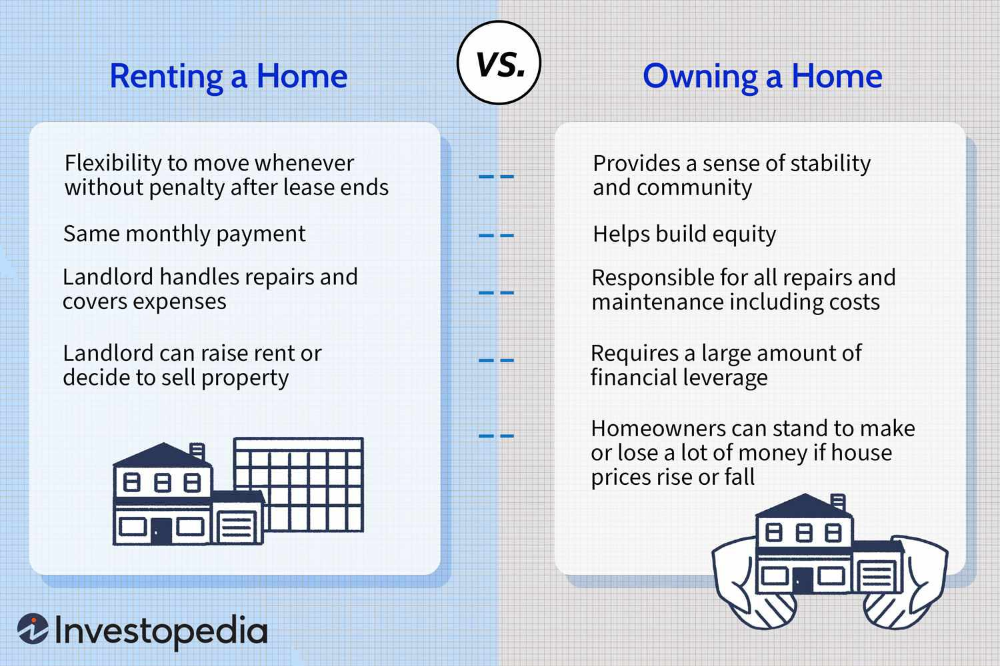

The real estate investment landscape offers a myriad of opportunities, each characterized by distinct advantages and challenges. In making strategic decisions, investors frequently encounter three primary avenues: direct real estate investment, Real Estate Investment Trusts (REITs), and algorithmic trading. Each of these strategies presents unique characteristics that can optimize investment returns when comprehensively understood and appropriately leveraged.

Direct real estate investment involves purchasing and managing physical properties. This approach can lead to substantial cash flows and tax benefits while providing investors with robust control over their assets. However, it also involves significant time commitment and potential liquidity issues. On the other hand, REITs provide a passive investment option, allowing individuals to earn dividends from pooled real estate investments without the intricacies of property management. REITs offer liquidity and diversification similar to stocks but remain sensitive to market volatility and interest rate changes.

Algorithmic trading introduces a technologically advanced strategy to real estate markets, deploying computer algorithms to execute trades based on predefined criteria. This method delivers speed and efficiency, enabling real-time, data-driven decision-making. Nevertheless, it requires considerable technical knowledge, meticulous testing, and effective risk management.

By comparing these approaches, investors can gain insights into their specific advantages, risks, and the necessary prerequisites for implementation. Understanding each strategy's characteristics is crucial for optimizing returns, aligning with personal and financial goals, and effectively navigating the dynamic real estate investment environment.

## Table of Contents

## Direct Real Estate Investment

Direct real estate investment involves the acquisition and management of tangible properties with the intention of generating income or realizing appreciation in value over time. This form of investment is characterized by the direct ownership of residential, commercial, industrial, or undeveloped land, offering investors the opportunity to both increase wealth and diversify their portfolios.

One of the primary advantages of direct real estate investment is the potential for substantial cash flows. Through rental income, investors can achieve a steady stream of revenue, which, depending on market conditions and property management, can result in significant financial returns. Additionally, real estate investments offer notable tax benefits. These benefits include deductions on mortgage interest, property depreciation, and operational expenses, which can reduce taxable income and effectively increase return on investment.

Full control over property management decisions is another key benefit. Investors have the autonomy to make strategic choices regarding property repairs, tenant selection, rental pricing, and broader management practices. This degree of control allows investors to tailor their property strategies according to their risk tolerance, preferences, and specific financial goals.

Nevertheless, direct real estate investment presents several challenges. The management of physical properties demands a considerable time commitment, encompassing tasks such as maintenance, tenant management, and compliance with legal obligations. Financing can also pose significant difficulties, as obtaining mortgages or loans may require substantial down payments and can be affected by credit conditions and interest rates. Furthermore, real estate is inherently illiquid compared to other investment vehicles like stocks or bonds. Selling properties can be time-consuming and often depends on market conditions, which can fluctuate unpredictably.

To navigate these challenges, investors can employ several strategies. Mortgage refinancing can ease financing burdens by lowering interest rates or payment terms, ultimately improving cash flow. Evaluating profitable locations before purchase is crucial, as investing in regions with strong economic growth, job availability, and population expansion typically results in better returns. Effective tenant management is another essential component, involving thorough screening processes, clear lease agreements, and responsive communication to maintain occupancy rates and minimize rental disputes.

By understanding and implementing these strategies, investors can enhance their success in direct real estate investment, balancing risks with the potential for lucrative returns.

## REITs: A Passive Investment Option

Real Estate Investment Trusts (REITs) offer investors an opportunity to enter the real estate market without the burdens of property management. By investing in REITs, individuals pool their capital to acquire, operate, or finance income-generating real estate. This structure enables investors to earn dividends from the collective income produced by these real estate assets.

One of the primary advantages of REITs is their ability to provide high dividend yields. By law, REITs must distribute at least 90% of their taxable income to shareholders annually, making them attractive to income-seeking investors. This compulsory distribution often results in yields that surpass those of many other equity investments.

Additionally, REITs offer diversification benefits. Investments span various real estate sectors, including residential, commercial, industrial, and healthcare properties. This diversification can mitigate the risks associated with reliance on a single property sector. Moreover, as publicly traded entities, many REITs provide [liquidity](/wiki/liquidity-risk-premium) similar to stocks, allowing investors to buy and sell shares with relative ease on major stock exchanges.

Despite these benefits, investors must be cognizant of certain inherent risks. REITs are particularly sensitive to [interest rate](/wiki/interest-rate-trading-strategies) fluctuations. When interest rates rise, the cost of borrowing increases, which can compress profit margins for REITs and make their dividend yields less attractive compared to fixed-income investments.

Tax benefits associated with REITs are also limited. While investors may enjoy some level of tax deferral due to the depreciation of assets, REIT dividends are typically taxed as ordinary income rather than being eligible for the lower tax rates applicable to qualified dividends.

Furthermore, market concentration risks can affect REIT investments. REITs focused on specific real estate sectors may be vulnerable to sector-specific risks. For instance, a downturn in the retail industry could significantly impact a REIT heavily invested in shopping malls.

Investors can mitigate some of these risks through diversification across various REIT sectors. By allocating investments among diverse property types and geographic locations, they can reduce exposure to any single sector's potential downturns. Additionally, examining macroeconomic indicators such as interest rates and economic growth patterns can aid in selecting REITs poised to perform well in various environments.

In summary, while REITs provide a passive investment avenue with notable yield and diversification opportunities, they also come with challenges related to interest rate sensitivity and limited tax advantages. Investors should consider these factors and employ diversification strategies to strengthen their REIT investment portfolios.

## Algorithmic Trading in Real Estate Markets

Algorithmic trading in real estate markets leverages advanced computer algorithms to facilitate the automated buying and selling of real estate securities based on predetermined criteria. This method is distinguished by several benefits, including notable speed and efficiency. By utilizing large datasets and real-time analytics, [algorithmic trading](/wiki/algorithmic-trading) allows investors to make data-driven decisions that optimize trade executions. Algorithms assess complex data patterns within milliseconds, enabling rapid responses to market fluctuations, which can be crucial for maximizing profits and minimizing losses.

One of the primary advantages of algorithmic trading is its efficiency in processing vast amounts of data and executing trades at high speed. This capability is essential in highly competitive markets where delays may impact financial outcomes. Algorithms can analyze historical and real-time financial data to predict market trends, enabling informed decision-making that ideally increases the likelihood of successful trades. This computational power significantly surpasses manual trading methods, providing an edge in fast-paced trading environments.

Despite its advantages, algorithmic trading presents several challenges. It demands a significant level of technical expertise, as creating effective algorithms requires a solid understanding of both financial markets and programming skills. Developing a robust algorithm is a complex task that involves quantitative analysis, statistical modeling, and [machine learning](/wiki/machine-learning) techniques. Algorithms must be meticulously tested through [backtesting](/wiki/backtesting) methods to ensure they perform well under various market conditions. This testing phase is crucial for identifying potential flaws and minimizing the risk of algorithmic errors that could result in substantial financial losses.

Additionally, algorithmic trading requires rigorous risk management protocols. Effective risk management involves implementing safeguards, such as stop-loss orders and position size limits, to prevent excessive losses. Algorithms must be continuously monitored and adjusted to respond to changing market conditions and to improve performance over time. This ongoing oversight ensures that trading strategies remain aligned with the investor’s risk tolerance and financial goals.

Overall, while algorithmic trading in real estate markets offers significant advantages in terms of speed and data-driven decision-making, it also demands substantial technical resources and expertise. A thorough understanding of its associated risks and challenges, alongside appropriate risk management strategies, is essential for investors seeking to harness its full potential.

## Comparing Investment Strategies

Direct real estate investments offer investors substantial control over their assets. This control extends to making detailed decisions about property management, financing, and tenant selection. One of the main benefits of direct investment is the potential for tax advantages. These can include deductions for mortgage interest, property taxes, and depreciation, which can effectively reduce the investor's taxable income. However, this approach requires significant active management. Investors need to dedicate time and effort to oversee the properties, handle tenant issues, and ensure ongoing maintenance. Furthermore, real estate is inherently illiquid, meaning properties cannot be quickly converted into cash without potentially sacrificing value.

Real Estate Investment Trusts (REITs) provide a more passive avenue for real estate investment. They offer investors liquidity comparable to stocks, as REIT shares can be easily bought and sold on major exchanges. This liquidity allows investors to rebalance their portfolios as needed, without the delays associated with selling physical properties. However, REITs are subject to market [volatility](/wiki/volatility-trading-strategies) and can be significantly influenced by interest rate fluctuations, affecting their market performance. Additionally, the tax advantages offered by REITs are generally less favorable compared to direct property ownership, as the dividends are typically taxed as ordinary income. Diversification across different REIT sectors, such as residential, commercial, or industrial, can help mitigate some risks associated with market concentration.

Algorithmic trading in real estate markets is characterized by the use of computer algorithms to execute trades quickly and precisely. This method leverages data-driven analyses to optimize trading strategies and improve execution times. One key advantage is the speed at which trades can be conducted, allowing traders to capitalize on market movements in real time. Despite these advantages, algorithmic trading demands significant technical expertise and resources. Developing and maintaining effective trading algorithms requires a strong understanding of both programming and market dynamics. The complexity of this strategy introduces risks, including the possibility of algorithmic errors and the need for comprehensive testing and risk management protocols.

When comparing these investment strategies, it's crucial for investors to align their choices with personal objectives, risk tolerance, and overall financial goals. Direct investments offer substantial control and potential tax advantages but require active involvement and bear liquidity risks. REITs present a more passive and liquid option but are susceptible to market volatility and interest rates. Algorithmic trading enables swift, data-driven transactions but necessitates considerable technical knowledge and infrastructure. By aligning investment strategies with individual goals and risk profiles, investors can effectively optimize their real estate portfolios.

## Conclusion

Real estate investment strategies offer a wide array of choices, tailored to meet diverse investor needs and preferences. Each strategy—be it direct ownership of real estate, investment in Real Estate Investment Trusts (REITs), or engaging in algorithmic trading—presents distinct opportunities and inherent risks. Direct property ownership provides investors with full control and potential tax advantages, but requires active management and bears liquidity constraints. REITs offer a passive investment avenue, along with liquidity similar to equities, yet they remain susceptible to market volatility and interest rate fluctuations. Algorithmic trading in real estate markets enables rapid, data-driven decision-making but demands significant technical know-how and resources.

Understanding these strategies is crucial for investors looking to align their investment choices with their financial objectives and risk tolerance. By evaluating these options, investors can optimize their portfolios to achieve desired returns while managing risk effectively. It is essential for investors to continuously educate themselves and adapt their strategies in response to the evolving real estate landscape and market conditions. This proactive approach allows investors to capitalize on new opportunities and mitigate potential challenges, ensuring successful investment outcomes over the long term.

## References & Further Reading

[1]: Geltner, D., Miller, N. G., Clayton, J., & Eichholtz, P. (2007). ["Commercial Real Estate Analysis and Investments"](https://www.researchgate.net/publication/245702364_Commercial_Real_Estate_Analysis_and_Investments) (2nd ed.). South-Western Educational Publishing.

[2]: Chan, E. P. (2009). ["Quantitative Trading: How to Build Your Own Algorithmic Trading Business"](https://github.com/ftvision/quant_trading_echan_book). Wiley.

[3]: Jansen, S. (2020). ["Machine Learning for Algorithmic Trading: Predictive models to extract signals from market and alternative data for systematic trading strategies with Python, 2nd Edition"](https://www.amazon.com/Machine-Learning-Algorithmic-Trading-alternative/dp/1839217715). Packt Publishing.

[4]: Malkiel, B. G. (1999). ["A Random Walk Down Wall Street: The Time-Tested Strategy for Successful Investing"](https://yourknowledgedigest.org/wp-content/uploads/2020/04/a-random-walk-down-wall-street.pdf) (Revised Updated edition). W. W. Norton & Company.

[5]: Pietersz, G. (2019). ["REITs For Dummies"](https://www.wiley.com/en-us/REITs+For+Dummies-p-9781394185368). For Dummies.

[6]: De Prado, M. L. (2018). ["Advances in Financial Machine Learning"](https://www.amazon.com/Advances-Financial-Machine-Learning-Marcos/dp/1119482089). Wiley.