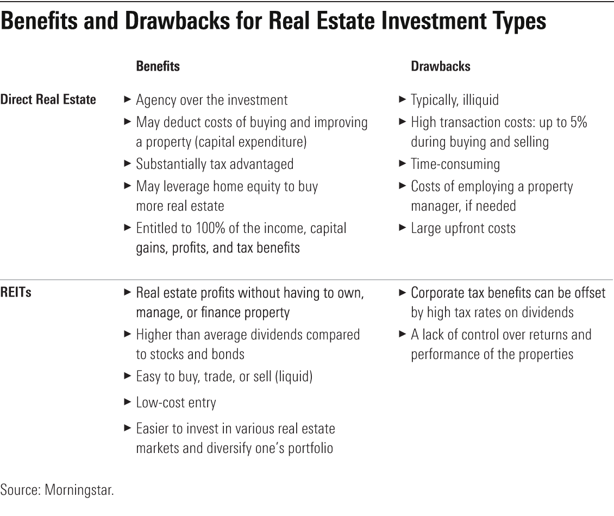

## Table of Contents

## What is a landlord?

A landlord is a person who owns a property and rents it out to others. This could be a house, an apartment, or even a room. The landlord is responsible for making sure the property is safe and in good condition. They also collect rent from the people who live there, called tenants.

Sometimes, landlords have rules that tenants need to follow. These rules are usually written in a lease agreement. The lease agreement is a contract that says how much rent the tenant has to pay and how long they can stay. If the tenant does not follow the rules or pay rent, the landlord can ask them to leave.

## What is a Real Estate Investment Trust (REIT)?

A Real Estate Investment Trust, or REIT, is a company that owns and often operates income-generating real estate. These properties can include shopping malls, apartments, offices, and hotels. People can buy shares of a REIT, which is like buying a small piece of the properties it owns. This allows individuals to invest in real estate without having to buy property themselves.

REITs make money by renting out their properties and collecting rent. They are required by law to pay out at least 90% of their taxable income as dividends to their shareholders. This means that if you own shares in a REIT, you can get regular payments, similar to receiving rent if you owned the property directly. REITs are a popular way for people to invest in real estate and earn income from it.

## How does one invest in properties as a landlord?

To invest in properties as a landlord, you first need to find a property to buy. You can look for properties that are for sale in areas where people want to live or work. You might need to get a loan from a bank to help pay for the property. Once you own the property, you can rent it out to tenants. You will need to set a rent price that covers your costs like the mortgage, taxes, and repairs, and also gives you some profit.

After you have tenants, you will need to take care of the property. This means fixing things when they break and making sure the property stays in good shape. You also need to collect rent from your tenants every month. If a tenant does not pay rent or breaks the rules, you might need to ask them to leave. Being a landlord takes time and effort, but it can be a good way to make money if you manage it well.

## How can someone invest in a REIT?

To invest in a Real Estate Investment Trust (REIT), you need to buy shares of the REIT. You can do this through a broker, just like you would buy shares of any other company. You can find brokers online or through a bank. When you buy shares, you become a part-owner of the properties the REIT owns. This means you can earn money from the rent the REIT collects, without having to manage the properties yourself.

Once you own shares in a REIT, you will get regular payments called dividends. These dividends come from the rent the REIT collects from its properties. By law, REITs have to pay out at least 90% of their income as dividends, so you can expect to receive payments regularly. Investing in a REIT is a good way to make money from real estate without the work of being a landlord.

## What are the initial costs associated with becoming a landlord?

When you decide to become a landlord, you will need to buy a property first. This is the biggest cost. You might need to get a loan from a bank to help pay for the property. This loan is called a mortgage, and you will need to pay it back over time. You will also need to pay for things like a home inspection to make sure the property is in good shape, and you might need to pay for some repairs or upgrades before you can rent it out.

There are also other costs to think about. You will need to pay for insurance to protect the property. You might also need to pay for advertising to find tenants. When you find tenants, you will need to make a lease agreement, which might cost some money if you use a lawyer. There are also ongoing costs like property taxes and maintenance that you need to be ready for. Becoming a landlord can be a good way to make money, but it starts with these initial costs.

## What are the initial costs of investing in a REIT?

Investing in a REIT is easier on your wallet at the start than becoming a landlord. To invest in a REIT, you just need to buy shares. You can do this through a broker, which you can find online or at a bank. The main cost here is the price of the shares you want to buy. This can be a small amount if you only want to buy a few shares, or more if you want to buy a lot.

There might be some small extra costs too. For example, your broker might charge you a fee for buying the shares. This fee is usually not very big. Once you own the shares, you don't have to worry about other big costs like fixing up a property or paying for insurance. Investing in a REIT is a simpler and less costly way to get started in real estate.

## What kind of ongoing management is required for rental properties?

When you own a rental property, you need to take care of it all the time. This means fixing things when they break, like a leaky faucet or a broken window. You also need to keep the property clean and safe for your tenants. Sometimes, you might need to paint the walls or fix the roof. These things can cost money and take time, but they are important to keep your tenants happy and the property in good shape.

You also have to deal with your tenants. This means collecting rent from them every month. If they don't pay, you need to talk to them about it and maybe even ask them to leave. You also need to make sure they are following the rules in the lease agreement. If they are not, you might need to remind them or take action. Being a landlord is a lot of work, but it can be rewarding if you do it well.

## How much management is involved in owning REIT shares?

Owning shares in a REIT is much easier than being a landlord. When you own REIT shares, you don't have to worry about fixing broken things or collecting rent from tenants. The REIT takes care of all the property management for you. Your main job is just to keep an eye on how the REIT is doing and how much money it is making.

You will get regular payments from the REIT, called dividends. These payments come from the rent the REIT collects from its properties. You don't have to do anything to get these payments; they just show up in your account. The only other thing you might need to do is decide when to buy or sell your shares, but even that can be done with the help of a broker.

## What are the tax implications for landlords?

Being a landlord means you have to deal with taxes. When you rent out your property, the money you get from rent is considered income. You need to report this income on your tax return every year. But, you can also take away some of the costs of being a landlord from your income. This includes things like repairs, insurance, and even the interest you pay on your mortgage. These costs are called deductions, and they can help lower the amount of tax you have to pay.

There's another tax called property tax that you have to pay every year. This is based on how much your property is worth. If you sell your rental property, you might have to pay capital gains tax. This tax is on the profit you make from selling the property. The profit is the difference between what you sell it for and what you paid for it, minus any improvements you made. It's a good idea to talk to a tax professional to make sure you are doing everything right and taking advantage of all the deductions you can.

## What are the tax benefits or drawbacks of investing in REITs?

When you invest in a REIT, you get some tax benefits. One big benefit is that you don't have to pay taxes on the dividends you get from the REIT right away. Instead, you can wait until you sell your shares to pay taxes on all the dividends you've received. This is called "return of capital," and it can help you keep more money in your pocket while you're invested. Also, if you hold onto your REIT shares for more than a year before selling them, you might pay a lower tax rate on any profit you make, which is called long-term capital gains tax.

But there are some tax drawbacks to think about too. The dividends you get from a REIT are usually taxed as regular income, which can be at a higher rate than other types of investment income. This means you might end up paying more in taxes each year than if you invested in something else. Also, if the REIT itself makes money from selling properties, you might have to pay taxes on your share of those profits, even if you didn't sell any of your shares. So, it's important to understand these tax rules before you decide to invest in a REIT.

## How do the potential returns from rental properties compare to REIT dividends?

When you own a rental property, the money you make comes from the rent your tenants pay you every month. This can be a good way to make money because you can set the rent price and keep all of it after you pay for things like repairs and taxes. If you manage your property well, you might make a lot of money. But, being a landlord takes a lot of work. You have to fix things when they break and make sure your tenants are happy. If you do a good job, your rental property can give you a steady income and maybe even go up in value over time.

On the other hand, when you invest in a REIT, you get money from dividends. These dividends come from the rent the REIT collects from all its properties. The nice thing about REITs is that you don't have to do any work. The REIT takes care of everything, and you just get the money. But, the amount of money you get from REIT dividends might not be as much as what you could make from a rental property. Also, REIT dividends can change depending on how well the REIT is doing. So, while investing in a REIT is easier, the returns might not be as high as what you could get from managing your own rental property.

## What are the risks associated with being a landlord versus investing in REITs?

Being a landlord comes with a lot of risks. One big risk is that you might have trouble finding good tenants. If you can't rent out your property, you won't make any money. Another risk is that your tenants might not pay their rent on time or at all. This can make it hard to pay your own bills like the mortgage and taxes. You also have to worry about things breaking in the property. Fixing these things can cost a lot of money. If the property goes down in value, you might lose money when you try to sell it. Being a landlord takes a lot of work and can be stressful because of all these risks.

Investing in REITs has different risks. One risk is that the value of your shares can go up and down. If the real estate market does badly, the value of your REIT shares might go down too. Another risk is that the REIT might not pay as much in dividends as you hoped. This can happen if the REIT's properties are not doing well. But, investing in a REIT is usually less risky than being a landlord because you don't have to worry about managing the properties yourself. The REIT handles all that, so you don't have to deal with the day-to-day problems that come with owning a rental property.

## References & Further Reading

[1]: Geltner, D., Miller, N. G., Clayton, J., & Eichholtz, P. (2007). ["Commercial Real Estate Analysis and Investments"](https://www.researchgate.net/publication/245702364_Commercial_Real_Estate_Analysis_and_Investments) (2nd ed.). South-Western Educational Publishing.

[2]: Chan, E. P. (2009). ["Quantitative Trading: How to Build Your Own Algorithmic Trading Business"](https://github.com/ftvision/quant_trading_echan_book). Wiley.

[3]: Jansen, S. (2020). ["Machine Learning for Algorithmic Trading: Predictive models to extract signals from market and alternative data for systematic trading strategies with Python, 2nd Edition"](https://www.amazon.com/Machine-Learning-Algorithmic-Trading-alternative/dp/1839217715). Packt Publishing.

[4]: Malkiel, B. G. (1999). ["A Random Walk Down Wall Street: The Time-Tested Strategy for Successful Investing"](https://yourknowledgedigest.org/wp-content/uploads/2020/04/a-random-walk-down-wall-street.pdf) (Revised Updated edition). W. W. Norton & Company.

[5]: Pietersz, G. (2019). ["REITs For Dummies"](https://www.wiley.com/en-us/REITs+For+Dummies-p-9781394185368). For Dummies.

[6]: De Prado, M. L. (2018). ["Advances in Financial Machine Learning"](https://www.amazon.com/Advances-Financial-Machine-Learning-Marcos/dp/1119482089). Wiley.