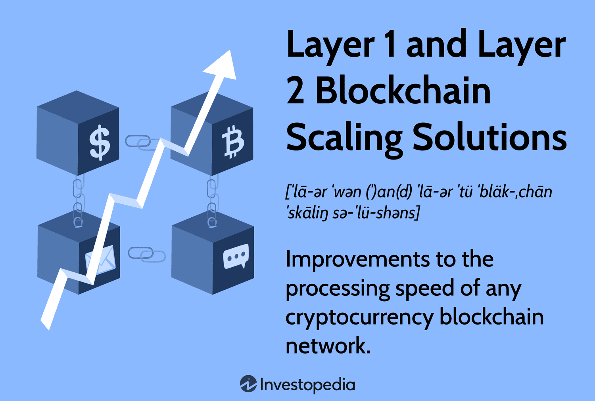

## Table of Contents

## What is a Layer 1 blockchain scaling solution?

A Layer 1 blockchain scaling solution refers to improvements made directly to the main blockchain, or "Layer 1," to increase its capacity and efficiency. This can involve changes to the core protocol, like increasing the block size or reducing the block time, to allow more transactions to be processed faster. The goal is to handle more users and transactions without compromising the security and decentralization of the network.

These solutions are important because they tackle scaling issues at the base level of the blockchain. By enhancing the fundamental structure, Layer 1 solutions can lead to significant improvements in speed and cost-effectiveness. Examples of Layer 1 scaling include Bitcoin's Lightning Network and Ethereum's transition to Ethereum 2.0, which aims to use sharding to process transactions in parallel, greatly increasing throughput.

## What is a Layer 2 blockchain scaling solution?

A Layer 2 blockchain scaling solution is like adding an extra layer on top of the main blockchain to handle more transactions faster and cheaper. Instead of making changes to the main blockchain itself, Layer 2 solutions use the main blockchain's security but process transactions off the main chain. This helps the main blockchain, or Layer 1, to not get too crowded and slow down.

Common examples of Layer 2 solutions include the Lightning Network for Bitcoin and Optimistic Rollups and ZK-Rollups for Ethereum. These solutions let users do many transactions quickly off the main chain and then settle them back on the main chain in one go. This way, the main blockchain stays secure and decentralized, while still allowing more people to use it without waiting too long or paying too much.

## How do Layer 1 and Layer 2 solutions differ in their approach to scaling?

Layer 1 solutions focus on making the main blockchain itself better at handling more transactions. They do this by changing things like how big each block can be or how fast new blocks are made. For example, if the blocks are bigger, they can hold more transactions. Or if new blocks come faster, transactions don't have to wait as long. The goal is to make the main blockchain faster and able to handle more users without losing its security or the way it's run by many people.

On the other hand, Layer 2 solutions work by taking some of the work off the main blockchain. They let people do lots of transactions quickly on a separate layer and then settle them all at once back on the main blockchain. This way, the main blockchain doesn't get too busy, and transactions can be faster and cheaper. For example, with the Lightning Network for Bitcoin, you can do many small payments off the main chain and only go back to it when you're done. This helps keep the main blockchain secure and decentralized while still letting more people use it easily.

## What are some common examples of Layer 1 scaling solutions?

Layer 1 scaling solutions are ways to make the main blockchain itself better at handling more transactions. One common example is increasing the block size. This means each block on the blockchain can hold more transactions, so more can be processed at once. Another example is reducing the block time, which is how long it takes to make a new block. If blocks are made faster, transactions don't have to wait as long to be included in the blockchain. These changes help the blockchain handle more users and transactions without getting slow or expensive.

Another example of a Layer 1 scaling solution is implementing sharding. Sharding is like splitting the blockchain into smaller parts, or "shards," that can process transactions at the same time. This way, the blockchain can handle a lot more transactions because different parts are working on them together. Ethereum's move to Ethereum 2.0 is trying to use sharding to make the network much faster. By making these kinds of changes to the main blockchain, Layer 1 solutions aim to make the whole system more efficient and able to grow.

## What are some common examples of Layer 2 scaling solutions?

Layer 2 scaling solutions help make transactions faster and cheaper by taking some of the work off the main blockchain. One common example is the Lightning Network for Bitcoin. It lets people do many small transactions off the main blockchain and only go back to it when they need to settle up. This way, the main blockchain doesn't get too busy, and people can send and receive payments quickly and for less money.

Another example of a Layer 2 solution is Optimistic Rollups, which is used with Ethereum. Optimistic Rollups let you do a bunch of transactions off the main blockchain and then put them all back on at once. They're called "optimistic" because they assume everything is okay unless someone says it's not. This makes things faster and cheaper because you're not using the main blockchain for every little thing.

ZK-Rollups are also used with Ethereum and are another Layer 2 solution. They use something called zero-knowledge proofs to make transactions off the main blockchain and then settle them back on. This keeps things private and secure while still making transactions faster and cheaper. Both Optimistic Rollups and ZK-Rollups help the main blockchain handle more users without getting slow or expensive.

## How do Layer 1 solutions impact the security of a blockchain?

Layer 1 solutions can affect the security of a blockchain in different ways. When you make changes to the main blockchain, like making blocks bigger or making them come faster, it can change how secure the network is. For example, if blocks are bigger, it might be harder for everyone to agree on what happened because there's more data to check. This could make the blockchain a bit less secure if not everyone can keep up with the bigger blocks.

On the other hand, some Layer 1 solutions, like sharding, try to keep the security high while making the blockchain faster. Sharding splits the blockchain into smaller parts that work together, but it's tricky to make sure all these parts stay secure. If done right, sharding can help the blockchain handle more transactions without making it less safe. But if there are mistakes, it could open up new ways for bad actors to cause trouble. So, it's important to think carefully about how to balance making the blockchain faster with keeping it secure.

## How do Layer 2 solutions impact the security of a blockchain?

Layer 2 solutions can impact the security of a blockchain in different ways. They work by moving some transactions off the main blockchain, which can make things faster and cheaper. But because these transactions happen away from the main blockchain, there's a chance that something could go wrong. For example, if someone tries to cheat on the Layer 2 part, it might be harder to stop them right away because it's not happening on the main blockchain where everyone can see and agree on what's happening.

However, Layer 2 solutions like the Lightning Network and Rollups have ways to keep things secure. They use the main blockchain's security as a backup. If something fishy happens on the Layer 2 part, it can be checked and fixed by going back to the main blockchain. This means that while there might be some new risks, the main blockchain's strong security is still there to help keep everything safe. So, it's all about finding a good balance between speed and security.

## What are the trade-offs between scalability and decentralization in Layer 1 solutions?

When trying to make a blockchain bigger and faster with Layer 1 solutions, there's a big trade-off between how scalable it can be and how decentralized it stays. If you make blocks bigger or make them come faster, the blockchain can handle more transactions. But this can make it harder for everyone to agree on what's happening because there's more data to check. If only a few people can keep up with the bigger or faster blocks, then the blockchain might become less decentralized. It starts to depend more on those few people, which goes against the idea of everyone having a say.

On the other hand, keeping a blockchain very decentralized means making sure lots of people can run it and check what's going on. But if you do that, the blockchain might not be able to grow as fast or handle as many transactions. It's a bit like trying to keep a party small so everyone can join in the fun, but then you can't invite as many people. So, when working on Layer 1 solutions, it's important to think about how to make the blockchain bigger without losing the special thing that makes it decentralized.

## What are the trade-offs between scalability and decentralization in Layer 2 solutions?

Layer 2 solutions help make blockchains bigger and faster by taking some work off the main blockchain. But this can sometimes make things a bit less decentralized. When transactions happen off the main blockchain, they might depend more on the people or groups running the Layer 2 part. If only a few people control the Layer 2 part, it could become more like a few big banks running things instead of everyone having a say. So, while Layer 2 solutions can make transactions faster and cheaper, they might also make the system a bit less open and shared.

On the other hand, Layer 2 solutions try to keep the main blockchain's strong security and decentralization as a backup. They use the main blockchain to check and fix any problems that come up on the Layer 2 part. This way, even if the Layer 2 part is run by fewer people, the main blockchain is still there to make sure everything stays fair and secure. So, the trade-off is about finding a good balance between making things faster and keeping the system open to everyone.

## How do the costs of transactions compare between Layer 1 and Layer 2 solutions?

When you use Layer 1 solutions, which make changes right to the main blockchain, the cost of transactions can be higher. This is because every transaction has to be checked and added to the main blockchain by lots of people. The more people checking, the more it costs, especially if the blockchain is busy. For example, if you want to send Bitcoin on the main blockchain, you might have to pay a bigger fee to get your transaction done quickly.

Layer 2 solutions, on the other hand, can make transactions a lot cheaper. They let you do many transactions off the main blockchain and only go back to it when you need to settle up. This means you're not paying the main blockchain's high fees for every little thing. For example, if you use the Lightning Network to send Bitcoin, your fees can be much smaller because you're not using the main blockchain as much. So, Layer 2 solutions help make sending and receiving money faster and cheaper.

## What are the future prospects for the development of Layer 1 scaling technologies?

The future of Layer 1 scaling technologies looks bright as more and more people are working on making blockchains faster and able to handle more users. One big idea is sharding, which is like splitting the blockchain into smaller parts that can work at the same time. This could make the blockchain much faster without losing its security. Another idea is making blocks bigger or making them come faster, which would let the blockchain handle more transactions. But it's important to do this carefully so the blockchain stays open and shared by everyone.

There are also new ideas like using different ways to agree on what's happening on the blockchain, which could make things even faster and more secure. For example, some blockchains are trying out new ways to check transactions that don't need as much power or time. This could help make the blockchain bigger and better for more people to use. As more people and companies work on these ideas, we might see big changes that make blockchains easier and cheaper to use, while still keeping them safe and open for everyone.

## What are the future prospects for the development of Layer 2 scaling technologies?

The future of Layer 2 scaling technologies looks really promising. More and more people are working on making these solutions better so that blockchains can handle lots of transactions quickly and cheaply. For example, things like the Lightning Network for Bitcoin and Rollups for Ethereum are getting better all the time. People are finding new ways to make these Layer 2 solutions work even faster and keep them safe. This means that soon, we might be able to do even more things with blockchains without waiting long or paying too much.

As more people use blockchains, the need for good Layer 2 solutions will keep growing. Companies and developers are trying out new ideas to make these solutions even better. They're working on making them easier to use and more secure. This could help make blockchains more popular because people will be able to do more things with them without worrying about high costs or slow speeds. So, the future of Layer 2 scaling technologies is all about making blockchains bigger and better for everyone to use.

## References & Further Reading

[1]: Buterin, V. (2014). ["A Next-Generation Smart Contract and Decentralized Application Platform."](https://ethereum.org/content/whitepaper/whitepaper-pdf/Ethereum_Whitepaper_-_Buterin_2014.pdf) Ethereum Whitepaper.

[2]: Poon, J., & Dryja, T. (2016). ["The Bitcoin Lightning Network: Scalable Off-Chain Instant Payments."](https://lightning.network/lightning-network-paper.pdf)

[3]: Narayanan, A., Bonneau, J., Felten, E., Miller, A., & Goldfeder, S. (2016). ["Bitcoin and Cryptocurrency Technologies: A Comprehensive Introduction."](https://press.princeton.edu/books/hardcover/9780691171692/bitcoin-and-cryptocurrency-technologies)

[4]: Zamfir, V. (2018). ["A (very brief) primer on Casper."](https://policyreview.info/open-abstracts/cryptoeconomics) Medium.

[5]: Gudgeon, L., Perez, D., Harz, D., Livshits, B., & Gervais, A. (2020). ["SoK: Layer-Two Blockchain Protocols."](https://arxiv.org/abs/2002.08099) arXiv preprint.

[6]: Buterin, V. (2018). ["Ethereum: A New Frontier in Scalable Blockchains?"](https://ethereum.org/en/whitepaper/)

[7]: Muneeb, A., Zhao, C., & Ayla, F. (2020). ["A Survey of Blockchain Scalability and its Solutions."](https://ieeexplore.ieee.org/abstract/document/8962150) arXiv preprint.