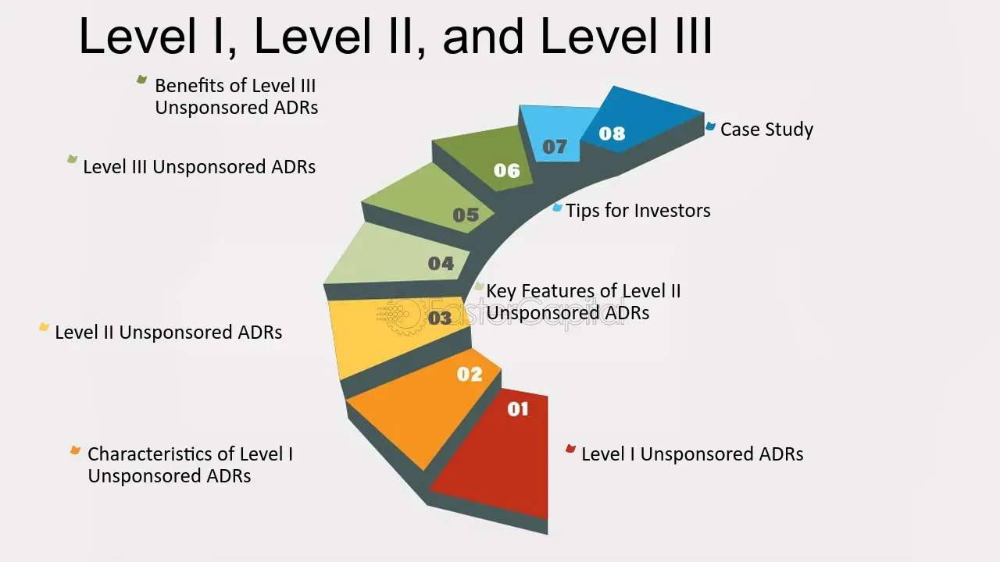

## Table of Contents

## What are ADRs and why are they important in software development?

ADRs, or Architectural Decision Records, are documents that help software developers keep track of important choices they make about how to build their software. These records explain why a certain decision was made, what other options were considered, and what the expected results of the decision are. By writing down these decisions, teams can make sure everyone understands the reasons behind the choices and can refer back to them later.

ADRs are important in software development because they help teams remember why they made certain choices, especially when new team members join or when the project evolves over time. They also help avoid repeating the same discussions and decisions, saving time and effort. By having a clear record of architectural decisions, teams can maintain consistency and make better future decisions based on past experiences.

## What is the difference between Level I, Level II, and Level III ADRs?

Level I, Level II, and Level III ADRs are different types of American Depositary Receipts, which are certificates issued by a U.S. bank that represent shares in a foreign company. These levels indicate how much the foreign company has to follow U.S. rules and how easy it is for U.S. investors to buy and sell the shares. Level I ADRs are the simplest and least regulated. They are traded over-the-counter and the foreign company doesn't have to meet strict U.S. reporting requirements. This makes it easier for smaller foreign companies to have their shares available in the U.S., but it can be harder for investors to buy and sell these shares.

Level II ADRs are a step up in terms of regulation and visibility. To have a Level II ADR, the foreign company must register with the U.S. Securities and Exchange Commission (SEC) and meet more reporting requirements. This allows the company's shares to be listed on a major U.S. stock exchange, like the New York Stock Exchange or Nasdaq. This makes it easier for U.S. investors to buy and sell the shares, and it gives the company more exposure in the U.S. market. Level III ADRs are the most regulated and complex. Not only does the company need to meet all the requirements of Level II, but it also has to do a public offering in the U.S. to raise new money. This gives the company even more visibility and access to U.S. capital, but it also means following the strictest U.S. rules.

## How are Level I ADRs typically used in a project?

Level I ADRs are often used in software projects to keep track of small, but important decisions. These decisions might be about choosing a specific tool or library, or deciding on a minor part of the system's design. Because Level I ADRs are simple and don't need a lot of detailed rules, teams can quickly write them down without spending too much time on paperwork. This helps everyone on the team understand why certain choices were made, especially when new team members join the project.

Using Level I ADRs in a project also helps keep things organized. When a team member needs to know why a certain decision was made, they can easily look it up in the Level I ADR. This saves time and prevents the team from having the same discussions over and over again. By keeping these records, the team can make sure that everyone is on the same page and can work together more effectively.

## What are the key features of Level II ADRs?

Level II ADRs are more regulated than Level I ADRs. To have a Level II ADR, a company needs to register with the U.S. Securities and Exchange Commission (SEC). This means the company has to follow more rules and report more information. This makes Level II ADRs more trustworthy for investors because they can see more details about the company.

Another key feature of Level II ADRs is that they can be listed on big U.S. stock exchanges like the New York Stock Exchange or Nasdaq. This makes it easier for U.S. investors to buy and sell these shares. Because the company is more visible on these exchanges, it can attract more investors and grow its business in the U.S. market.

## Can you explain the structure and components of a Level III ADR?

A Level III ADR is the most regulated type of American Depositary Receipt. To have a Level III ADR, a foreign company needs to follow all the rules of Level II ADRs, like registering with the U.S. Securities and Exchange Commission (SEC) and reporting a lot of information. But, there's an extra step for Level III: the company has to do a public offering in the U.S. to raise new money. This means they sell new shares to U.S. investors, which helps the company get more funds to grow their business.

The structure of a Level III ADR includes the same basic parts as other ADRs, but with more detailed reporting. It has the company's name, the number of shares each ADR represents, and information about the U.S. bank that issues the ADR. Because Level III ADRs need to follow strict rules, the company also has to provide regular financial reports and updates to the SEC. This makes sure that U.S. investors have all the information they need to make good decisions about buying and selling the shares.

## How do the documentation requirements differ among the three levels of ADRs?

The documentation requirements for Level I ADRs are the lightest. Companies only need to meet the minimum standards set by the U.S. Securities and Exchange Commission (SEC). This means they don't have to provide a lot of detailed financial reports or follow strict rules. Level I ADRs are usually traded over-the-counter, so the company just needs to make sure they have enough basic information available for investors.

Level II ADRs require more documentation. Companies have to register with the SEC and follow more rules. This includes providing regular financial reports and updates to the SEC. Because Level II ADRs can be listed on big U.S. stock exchanges like the New York Stock Exchange or Nasdaq, the company needs to give more detailed information to make sure investors trust them.

Level III ADRs have the strictest documentation requirements. In addition to all the rules for Level II ADRs, companies also have to do a public offering in the U.S. to raise new money. This means they need to provide even more detailed financial reports and updates to the SEC. The extra documentation helps make sure U.S. investors have all the information they need when they buy and sell the shares.

## What are the best practices for implementing Level I ADRs in a small team?

When implementing Level I ADRs in a small team, it's important to keep things simple and easy to understand. Start by deciding which decisions need to be recorded. These should be choices that are important but don't need a lot of detailed rules. Write down each decision in a short document that explains what the decision is, why it was made, what other options were considered, and what the expected results are. Make sure these documents are easy to find and read so everyone on the team can use them.

It's also helpful to set up regular meetings where the team can talk about the ADRs. This keeps everyone on the same page and makes sure the records stay useful. Encourage team members to ask questions and give feedback on the decisions. By keeping the process simple and involving everyone, Level I ADRs can help your small team work better together and make good choices.

## How can Level II ADRs help in managing larger projects with multiple stakeholders?

Level II ADRs can be really helpful for managing bigger projects with lots of different people involved. Because Level II ADRs need to follow more rules and provide more information, they help keep everyone on the same page. When a project has many stakeholders, it's important that everyone knows why certain decisions were made. Level II ADRs make this easier by giving a clear record of important choices, which can be shared with all the stakeholders. This helps avoid confusion and makes sure everyone understands the project's direction.

Using Level II ADRs also helps when the project changes over time or when new people join the team. Because these ADRs have to be registered with the SEC and include regular updates, they keep a detailed history of decisions. This means new team members can quickly learn about past choices and why they were made. It also helps keep the project organized and on track, even as it grows and changes. By having a strong system of documentation, Level II ADRs make it easier to manage big projects with many different people involved.

## What tools and templates are recommended for creating and maintaining Level III ADRs?

For creating and maintaining Level III ADRs, it's good to use tools that help with teamwork and keeping track of documents. One popular tool is a wiki, like Confluence, where you can write down all the decisions and everyone can see them. Another useful tool is version control systems like Git, which help you keep a record of changes to the ADRs over time. These tools make it easy to update and share the ADRs with everyone involved in the project.

Templates are also important for Level III ADRs because they help keep the information organized and complete. A good template should have sections for the decision title, the date it was made, the context of the decision, the options that were considered, the decision itself, and the expected results. Using a template like this makes sure that all the important details are included in each ADR. You can find many free templates online or create your own that fits your team's needs.

## How do the decision-making processes vary across the three levels of ADRs?

The decision-making process for Level I ADRs is simple and quick. These are used for small but important choices in a project. The team decides what to do, writes it down in a short document, and shares it with everyone. There aren't many rules to follow, so the team can focus on making good choices without spending too much time on paperwork. This helps keep things moving smoothly, especially in small teams where everyone needs to understand the decisions.

For Level II ADRs, the decision-making process is more detailed and involves more steps. Because these ADRs need to be registered with the SEC, the team has to follow more rules and provide more information. This means they need to think carefully about each decision and make sure it's well-documented. Level II ADRs are useful for bigger projects with many people involved because they help keep everyone informed and on the same page. The extra steps make sure the decisions are clear and well-explained.

Level III ADRs have the most complex decision-making process. Not only do they need to meet all the requirements of Level II ADRs, but the company also has to do a public offering in the U.S. to raise new money. This means the team needs to think about how their decisions will affect investors and the company's growth. They have to provide even more detailed reports and updates to the SEC, which takes more time and effort. Using Level III ADRs helps make sure that big decisions are well-thought-out and that everyone has all the information they need.

## What are some common challenges faced when transitioning from Level I to Level II ADRs?

Moving from Level I to Level II ADRs can be tough because it means following more rules. With Level I ADRs, teams can make decisions quickly and write them down without a lot of paperwork. But when they switch to Level II, they need to register with the SEC and provide more detailed information. This takes more time and effort, and the team needs to learn how to do it right. They might need to spend time figuring out the new rules and making sure their decisions are well-documented and clear.

Another challenge is making sure everyone on the team understands the new process. Level II ADRs are more complex, so it can be hard to get everyone on the same page. The team might need to have more meetings to talk about the decisions and make sure everyone knows what's going on. It's important to keep things organized and make sure the ADRs are easy to find and read. By taking the time to learn the new rules and work together, the team can handle the transition and keep making good choices.

## How can an organization assess the effectiveness of their ADR strategy across all three levels?

To assess the effectiveness of an ADR strategy across all three levels, an organization should start by looking at how well the ADRs help the team make decisions. For Level I ADRs, the focus should be on whether the records are easy to create and understand. The team should check if the ADRs help them remember why certain choices were made and if they save time by avoiding the same discussions over and over. For Level II and Level III ADRs, the organization needs to see if the extra rules and detailed reporting help make better decisions. They should also check if the ADRs are clear and helpful for everyone involved, especially in bigger projects with many stakeholders.

Another important part of assessing the ADR strategy is to see how well it helps the project grow and change over time. The organization should look at whether the ADRs make it easier for new team members to understand past decisions and why they were made. This is especially important for Level II and Level III ADRs, where the documentation is more detailed. The team should also check if the ADRs help them stay organized and on track as the project gets bigger. By regularly reviewing the ADRs and getting feedback from the team, the organization can make sure their ADR strategy is working well across all three levels.

## References & Further Reading

[1]: Bank of New York Mellon. ["ADR Basics: What is an American Depositary Receipt (ADR)?"](https://www.bnymellon.com/content/dam/bnymellon/documents/pdf/depositary-receipts-brochure.pdf)

[2]: Securities and Exchange Commission (SEC). ["Investor Bulletin: American Depositary Receipts."](https://www.sec.gov/files/adr-bulletin.pdf)

[3]: Giddy, I. H. (2002). ["The Use of American Depositary Receipts: An Empirical Investigation of the Determinants of Capital Flows in a Global Environment."](https://www.imdb.com/title/tt0307901/) SSRN Electronic Journal.

[4]: Krugman, P., & Obstfeld, M. (2005). ["International Economics: Theory and Policy."](https://books.google.com/books/about/International_Economics.html?id=NZnk5C2r8qEC) Pearson.

[5]: Myers, B. W., & Majluf, N. S. (1984). ["Corporate Financing and Investment Decisions When Firms Have Information That Investors Do Not Have."](https://www.sciencedirect.com/science/article/pii/0304405X84900230) Journal of Financial Economics, 13(2), 187-221.