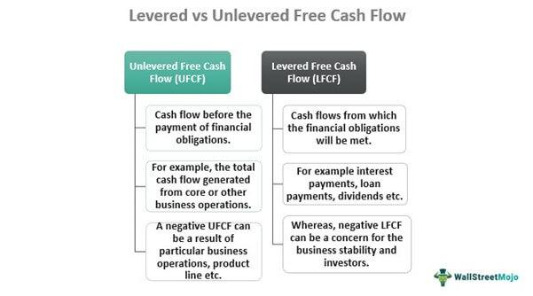

In today's evolving financial landscape, understanding cash flow metrics is crucial for investors, analysts, and businesses. Cash flow metrics, such as Levered Free Cash Flow (LFCF) and Unlevered Free Cash Flow (UFCF), play a significant role in assessing the financial health and performance of companies. These metrics provide insights into a company's cash generation capability, influencing investment decisions and valuations.

Levered Free Cash Flow (LFCF) measures the cash available to equity holders after servicing all financial obligations, including interest payments on debt. It reflects the amount of cash that a company can distribute to its shareholders or reinvest in growth opportunities once liabilities are settled. This metric serves as a key indicator of a company's ability to meet its financial commitments and generate shareholder value.



Unlevered Free Cash Flow (UFCF), conversely, evaluates a company's cash flow prior to accounting for interest payments. By excluding the financial impact of a company's capital structure, UFCF offers a purer assessment of a company's operational cash-generating efficiency. It is often utilized to understand a company's enterprise value, as it provides a clearer picture of its core financial performance free from the effects of debt leverage.

This article aims to compare these two cash flow measures to highlight their respective roles and significance. Additionally, we explore the integration of these metrics into algorithmic trading strategies. Algorithmic trading leverages financial metrics, including cash flow data, to enhance the precision and efficacy of trading decisions. By the end of this guide, you will gain a comprehensive understanding of how Levered and Unlevered Free Cash Flow are interrelated and impactful in financial decision-making. This article offers valuable insights into how these cash flow metrics can shape trading strategies, whether you are a financial professional or a curious learner.

## Table of Contents

## Understanding Levered Free Cash Flow

Levered Free Cash Flow (LFCF) is an important financial metric that reflects the cash a company generates after accounting for its financial obligations, notably interest payments on debt. This metric is key for understanding how much cash is truly available to the equity holders after all debt-related commitments are fulfilled. Essentially, it measures the cash flow that can be distributed among shareholders or reinvested into the company, providing valuable insights into the firm’s financial health and its capacity to meet financial obligations.

**Calculation of Levered Free Cash Flow**

The process of calculating the LFCF begins with the net income reported on the company’s financial statements. From here, adjustments are made to account for non-cash expenses, changes in working capital, and capital expenditures (CapEx). The formula can generally be represented as:

$$
\text{LFCF} = \text{Net Income} + \text{Depreciation and Amortization} - \Delta \text{Working Capital} - \text{Capital Expenditures} - \text{Interest Payments}
$$

- **Net Income**: The starting point of the calculation, this figure is derived from the company’s income statement.
- **Depreciation and Amortization**: Non-cash charges are added back because they do not involve an actual outflow of cash during the period.
- **Change in Working Capital ($\Delta$ Working Capital)**: Adjustments may be required for changes in current assets and liabilities, affecting available cash.
- **Capital Expenditures (CapEx)**: Investments in long-term assets reduce the cash available hence subtracted.
- **Interest Payments**: This is a crucial factor distinguishing LFCF from unlevered free cash flow, as these payments represent the cash cost of borrowing and must be considered in the calculation.

**Implications on Financial Stability and Valuation**

Assessing LFCF provides insights into a company's ability to manage its debts. A positive LFCF indicates that a company generates sufficient cash to cover its financial obligations and still has funds left for equity holders, which is a signal of financial stability. Conversely, a negative LFCF suggests potential [liquidity](/wiki/liquidity-risk-premium) issues or a need for additional financing to sustain operations.

In terms of valuation, LFCF is often employed in leveraged buyout (LBO) models and shareholder value analyses. The metric indicates the capacity of the company to generate shareholder returns and pay dividends, thus influencing investment decisions and corporate valuation. By factoring in the company’s debt profile, LFCF provides a nuanced understanding of financial performance beyond what traditional earnings metrics might suggest. 

Overall, Levered Free Cash Flow is a critical figure for stakeholders looking to evaluate a company's ability to honor its debt commitments while also maintaining adequate returns for its equity investors. This comprehension assists in making informed investment and financing decisions.

## Exploring Unlevered Free Cash Flow

Unlevered Free Cash Flow (UFCF) measures a company's cash flow before accounting for interest payments, thereby providing a comprehensive overview of financial performance without being influenced by the company's capital structure. This makes UFCF particularly valuable for analysts focused on evaluating a company's core operational efficiency.

**Calculation Methodology:**

The calculation of UFCF begins with Earnings Before Interest and Taxes (EBIT). Here’s the standard formula for determining UFCF:

$$
\text{UFCF} = \text{EBIT} \times (1 - \text{Tax Rate}) + \text{Depreciation and Amortization} - \text{Changes in Working Capital} - \text{Capital Expenditures}
$$

1. **EBIT (Earnings Before Interest and Taxes):** This metric serves as a reflection of a company's operating income without the impact of financial leverage.

2. **Tax Rate:** A necessary factor to account for the taxes affecting EBIT, thus providing a post-tax view.

3. **Depreciation and Amortization:** Non-cash charges added back to the cash flow as they are initial deductions made to account for asset value reductions.

4. **Changes in Working Capital:** A measure of operational liquidity changes; an increase in working capital is subtracted as it represents cash tied up in operations.

5. **Capital Expenditures:** Outflows for maintaining or acquiring fixed assets, deducted from UFCF because they are significant cash requirements.

**Importance in Enterprise Value:**

UFCF is instrumental in understanding a company's enterprise value (EV), which is the total value of a business, including equity and debt holders. Analysts use UFCF in Discounted Cash Flow (DCF) models to derive an intrinsic value by forecasting future UFCFs and discounting them back to present value. This is considered a thorough method for valuation as it includes the effect of ongoing operational efficiencies without the clutter of financing effects.

**Comparative Analysis of Companies with Different Debt Levels:**

UFCF simplifies comparisons between companies with varying capital structures by isolating the operational cash-generating ability from financing decisions. For instance, two firms with identical earnings before financing could have different levered cash flows due to debt variances. UFCF enables a level-ground comparison by focusing solely on operational performance, which can be critical in industries where leverage varies significantly among competitors.

In conclusion, Unlevered Free Cash Flow is a robust metric for evaluating a company's operational prowess and calculating enterprise value, offering a clear and unbiased potential comparison across different businesses.

## Comparative Analysis: Levered vs Unlevered Free Cash Flow

Levered Free Cash Flow (LFCF) and Unlevered Free Cash Flow (UFCF) are two significant cash flow metrics utilized widely in financial analysis. Each serves distinct purposes and presents unique insights, making them valuable tools for investors, analysts, and financial professionals.

### Differences Between LFCF and UFCF

The primary distinction between LFCF and UFCF lies in how each metric accounts for a company's debt obligations:

- **Levered Free Cash Flow (LFCF):** This metric calculates the cash flow remaining after the company has met its financial obligations, including interest payments on debt. It is given by:
$$
  \text{LFCF} = \text{Operating Cash Flow} - \text{Capital Expenditures} - \text{Debt Repayment}

$$
  LFCF is essential for shareholders and equity investors as it indicates the cash available to them after paying debt obligations. It reflects the company's ability to pay dividends, repurchase shares, or reinvest in the business.

- **Unlevered Free Cash Flow (UFCF):** Conversely, UFCF measures cash flow prior to settling interest payments, offering a view of the company's financial health irrespective of capital structure. The formula is:
$$
  \text{UFCF} = \text{EBIT} \times (1 - \text{Tax Rate}) + \text{Depreciation and Amortization} - \text{Capital Expenditures} - \Delta \text{Working Capital}

$$
  UFCF is preferred for evaluating a company’s operational efficiency and is frequently used in determining enterprise value, making it especially relevant for mergers and acquisitions (M&A) and other valuation contexts.

### Advantages and Limitations

**Advantages of LFCF:**
- **Reflects Debt Impact:** LFCF provides insights into how financial leverage affects the company's cash flow and potential returns to shareholders.
- **Equity Focused:** The metric is helpful for assessing the funds available for equity stakeholders after debt service.

**Limitations of LFCF:**
- **Influenced by Capital Structure:** The fluctuating levels of debt can lead to significant changes in LFCF, complicating cross-company comparisons in different fiscal environments.

**Advantages of UFCF:**
- **Capital Structure Agnostic:** UFCF offers a clear view of operating performance by excluding debt-related cash flows, making it an ideal metric to compare companies with varying leverage.
- **Valuation Relevance:** It serves as an unbiased basis for calculating enterprise value, thus aiding strategic decisions like investments or mergers.

**Limitations of UFCF:**
- **Ignores Debt Impacts:** By omitting interest payments, it may overlook risks associated with significant leverage, potentially obscuring the company's real financial situation.

### Complementary Use in Financial Evaluations

Levered and Unlevered Free Cash Flow can complement each other to provide a holistic understanding of a company's financial dynamics:

- **Investment Decisions:** LFCF might be more relevant for equity investors looking at dividend payouts, whereas UFCF is vital for valuators assessing acquisition targets.
- **Risk Evaluation:** While LFCF reveals the immediate cash implications of debt, UFCF helps evaluate the long-term operational capacities.

### Case Studies and Examples

Consider a scenario involving two firms, A and B, engaged in similar activities but with different capital structures. Firm A has substantial debt, resulting in lower LFCF but potentially higher growth from leveraged investments. Firm B, with little debt, displays strong UFCF, signaling stable operational efficiency and appealing as a conservative investment.

These metrics are crucial in selecting a strategy based on specific investment goals or risk appetites. For instance, an investor seeking dividends and share repurchase opportunities may focus on LFCF, while a private equity firm planning an acquisition might prioritize UFCF to understand operational cash flows independent of current capital structuring. By analyzing both LFCF and UFCF, one can discern between operational efficiencies and the financial impacts of leverage, guiding strategic, data-driven decision-making.

## The Role of Cash Flow in Algorithmic Trading

Algorithmic trading, which involves the use of computer algorithms to execute trading decisions, relies on diverse financial metrics to enhance strategy performance. Among these metrics, Levered Free Cash Flow (LFCF) and Unlevered Free Cash Flow (UFCF) serve as essential tools in algorithmic models due to their ability to convey crucial insights about a company's financial health and potential for future growth.

Integrating Levered and Unlevered Free Cash Flow into algorithmic models provides traders with a granular view of a company's financial sustainability. Levered Free Cash Flow, representing the cash available after servicing debt, can indicate the robustness of a company's operations relative to its financial obligations. For instance, a consistently positive LFCF suggests that a company efficiently manages its debt and has surplus cash for reinvestment or shareholder rewards. Thus, algorithms incorporating LFCF can prioritize investments in firms with strong cash management, potentially leading to more stable returns.

On the other hand, Unlevered Free Cash Flow offers a perspective on the cash generation capabilities of a business as if it were debt-free. This metric allows traders to assess a company’s core operational performance independent of its capital structure. Algorithms utilizing UFCF can identify companies with solid operational efficiencies and scalability potential, irrespective of their current leverage. Such metrics are particularly valuable in comparing businesses across industries where capital structures differ significantly.

The benefits of using cash flow metrics in automated trading include enhanced accuracy and efficiency. Algorithms leveraging these metrics can quickly process vast amounts of data, enabling high-frequency trading strategies that capitalize on short-term market inefficiencies. Additionally, these metrics can be pivotal in long-term trend analysis, where fundamental financial health is crucial.

However, the application of cash flow metrics in [algorithmic trading](/wiki/algorithmic-trading) is not without challenges. One significant risk involves the accuracy of financial data; companies may use accounting techniques that distort cash flow figures, potentially misleading algorithmic models. To address this, algorithms must incorporate checks against financial anomalies or rely on data from verified sources. 

Moreover, market [volatility](/wiki/volatility-trading-strategies) can impact the predictive reliability of cash flow-based algorithms. In turbulent markets, unforeseen events may significantly alter a company's cash position, potentially leading to misinformed trading decisions. Therefore, it's essential for algorithms to integrate risk management protocols, such as sensitivity analysis or scenario testing, to mitigate such risks.

In conclusion, incorporating Levered and Unlevered Free Cash Flow into algorithmic trading provides a quantitative approach to assessing a company's financial health, supporting more informed investment decisions. While challenges exist, particularly concerning data integrity and market volatility, careful adjustment of algorithmic models can overcome these hurdles, offering traders a competitive edge.

## Practical Applications and Case Studies

Practical applications of Levered Free Cash Flow (LFCF) and Unlevered Free Cash Flow (UFCF) are particularly significant in algorithmic trading, where precision and efficiency dictate success. These cash flow metrics are essential for constructing financial models that forecast a company's future profitability and assess its valuation, directly impacting trading decisions.

### Real-World Examples in Algorithmic Trading

1. **Backtesting Trading Algorithms:**
   Algorithmic traders utilize historical LFCF and UFCF data for [backtesting](/wiki/backtesting) their models. By simulating trades over past periods using these metrics, algorithms can predict how changes in a company's financial health might impact stock prices. For instance, applying UFCF data can assess pure operational performance free from debt influence.

   ```python
   def backtest_with_ufcf(stock_data, ufcf_data):
       """
       Backtests a trading strategy using unlevered free cash flow data.

       :param stock_data: Historical stock prices.
       :param ufcf_data: Historical unlevered free cash flow data.
       :return: Profit or loss from the strategy.
       """
       portfolio_returns = []
       for date, data in stock_data.items():
           if ufcf_data[date] > threshold:  # threshold is a pre-defined value
               portfolio_returns.append(data['price_change'])
       return sum(portfolio_returns)
   ```

2. **Predictive Modeling and Forecasting:**
   Predictive algorithms incorporate LFCF to predict future stock trends. LFCF is used here to reflect the company's readiness to pay dividends or repurchase shares, affecting investor sentiment and stock demand.

### Case Studies Showcasing Practical Outcomes

1. **Sector-Specific Strategies:**
   A notable case study in the technology sector involved an algorithm preferring UFCF over LFCF due to high capital expenditure variations. Through UFCF, the firm could better gauge operational efficiency without debt-related distortions, leading to improved stock selection and timing accuracy.

2. **Market Condition Variances:**
   In volatile markets, traders noted that algorithms leveraging UFCF could more effectively isolate operational performance fluctuations from financial engineering impacts, leading to more stable trading outcomes.

### Strategic Variations by Market Conditions

- **Bull Markets:**
  Algorithms using LFCF prosper as companies tend to leverage debt to fuel growth, and the algorithm capitalizes on increased cash flow to equity holders.

- **Recessions:**
  During economic downturns, UFCF-focused strategies often outperform due to their emphasis on core operational viability without capital structure influence.

Examining these examples illustrates how theoretical concepts like LFCF and UFCF can be effectively translated into actionable trading strategies. For further exploration, traders often simulate varied market scenarios using these metrics to refine their models continuously. Understanding these metrics' strategic applications allows for leveraging distinct insights, ultimately fostering more informed investment decisions.

## Conclusion

In summary, both Levered Free Cash Flow (LFCF) and Unlevered Free Cash Flow (UFCF) are vital metrics in the landscape of financial analysis and decision-making. LFCF provides insights into the cash available to equity holders after a company has met its debt obligations, while UFCF offers a view of a company's cash flow unclouded by its capital structure. Both metrics have their unique applications and benefits, and when effectively integrated into algorithmic trading strategies, they have the potential to substantially enhance trading decisions.

Utilizing LFCF and UFCF in algorithmic trading can improve the accuracy of trading models, as these metrics reflect crucial financial information about a company's operations and financial health. For instance, incorporating these cash flow figures can allow algorithms to better assess a company’s value and predict future stock performance, leading to more data-driven and efficient trading strategies.

Gaining a comprehensive understanding and application of LFCF and UFCF can lead to more informed decision-making, resulting in improved financial outcomes. Investors and financial professionals are encouraged to explore the potential applications of these metrics further, as they can be instrumental in formulating both personal and professional financial strategies. In doing so, one can harness the full power of cash flow analysis to inform investment decisions and optimize trading strategies.

## Further Reading and Resources

To enhance your understanding of cash flow analysis, financial modeling, and algorithmic trading, various educational resources can provide in-depth insights. Books such as "Financial Modeling" by Simon Benninga and "Investment Valuation" by Aswath Damodaran offer comprehensive guides on creating and understanding financial models, including the calculation of Levered and Unlevered Free Cash Flows.

Online courses like those available from Coursera or edX often cover financial modeling and algorithmic trading. Platforms like Khan Academy and Investopedia provide accessible resources on fundamental concepts in cash flows and valuation techniques. For those interested in the programming side of algorithmic trading, "Algorithmic Trading" by Ernest P. Chan investigates into practical strategies implemented using Python.

For academic perspectives, papers available through platforms like JSTOR or SSRN offer research articles on advanced cash flow analysis techniques. Websites such as Quantitative Finance offer forums and articles where financial professionals discuss recent trends and strategies in algorithmic trading.

Aspiring traders and financial analysts may benefit from Python libraries such as NumPy and pandas for data analysis and manipulation. Here's a simple Python snippet illustrating how to calculate Free Cash Flow from operating income, capital expenditures, and changes in working capital:

```python
import pandas as pd

# Sample data
df = pd.DataFrame({
    'Operating Income': [100000, 120000, 150000],
    'Capital Expenditures': [20000, 25000, 30000],
    'Changes in Working Capital': [-5000, 10000, 5000]
})

# Calculate Free Cash Flow
df['Free Cash Flow'] = df['Operating Income'] - df['Capital Expenditures'] - df['Changes in Working Capital']

print(df[['Free Cash Flow']])
```

Engaging with these resources will provide a solid foundation for understanding the metrics influencing financial decision-making and algorithmic trading strategy development. Beginners can start with introductory resources to grasp fundamental concepts, whereas advanced learners might focus on specialized literature and coding techniques for practical applications.

## References & Further Reading

[1]: Benninga, Simon. ["Financial Modeling"](https://mitpress.mit.edu/9780262046428/financial-modeling/). MIT Press.

[2]: Damodaran, Aswath. ["Investment Valuation: Tools and Techniques for Determining the Value of Any Asset"](https://www.amazon.com/Investment-Valuation-Tools-Techniques-Determining/dp/111801152X). Wiley Finance.

[3]: Chan, Ernest P. ["Algorithmic Trading: Winning Strategies and Their Rationale"](https://github.com/ftvision/quant_trading_echan_book). Wiley.

[4]: Jansen, Stefan. ["Machine Learning for Algorithmic Trading: Predictive models to extract signals from market and alternative data for systematic trading strategies with Python"](https://github.com/stefan-jansen/machine-learning-for-trading). Packt Publishing.

[5]: Lopez de Prado, Marcos. ["Advances in Financial Machine Learning"](https://www.amazon.com/Advances-Financial-Machine-Learning-Marcos/dp/1119482089). Wiley.

[6]: Aronson, David R. ["Evidence-Based Technical Analysis: Applying the Scientific Method and Statistical Inference to Trading Signals"](https://www.amazon.com/Evidence-Based-Technical-Analysis-Scientific-Statistical/dp/0470008741). Wiley.