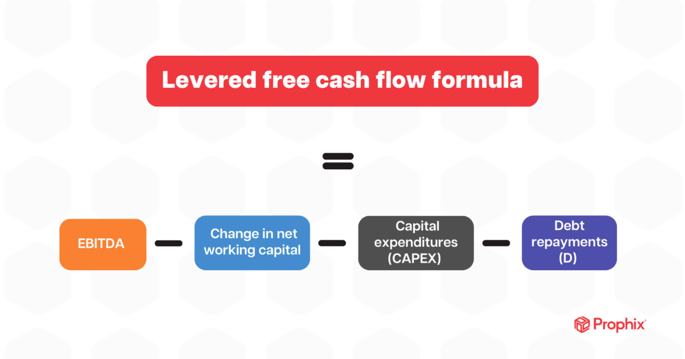

## Table of Contents

## What is levered free cash flow?

Levered free cash flow is the amount of money a company has left after it pays all its expenses, including interest on its debts. It's what's available for shareholders after the company has taken care of its bills and reinvested in the business. This type of cash flow is important because it shows how much cash a company can return to its investors, like through dividends or buying back its own stock.

Understanding levered free cash flow helps investors see if a company is generating enough cash to cover its debts and still have money left over. If a company has a high levered free cash flow, it might be in a good position to grow or pay dividends. On the other hand, if the levered free cash flow is low or negative, it could mean the company is struggling to manage its debt or isn't making enough money from its operations.

## What is unlevered free cash flow?

Unlevered free cash flow is the money a company makes before it pays interest on its debts. It shows how much cash a business can generate from its operations without considering how it's financed. This number is important because it tells investors how well the company's core business is doing, without the ups and downs of debt payments.

When you look at unlevered free cash flow, you get a clear picture of the company's ability to produce cash from its main activities. It's useful for comparing companies with different levels of debt because it focuses on operational performance, not on how the company is financed. This makes it easier to see which companies are truly generating strong cash flows from their business operations.

## How is levered free cash flow calculated?

Levered free cash flow is figured out by starting with the company's earnings before interest, taxes, depreciation, and amortization (EBITDA). From this, you take away taxes, changes in working capital, and capital expenditures. Then, you also subtract the interest payments the company has to make on its debts. What you're left with is the levered free cash flow, which is the money the company has after all these expenses.

This number is important because it shows how much cash the company has left for its shareholders after it has paid all its bills, including interest on loans. If a company has a high levered free cash flow, it means it's doing well and can give money back to shareholders through dividends or buying back its own stock. If the levered free cash flow is low or negative, it might mean the company is struggling to pay its debts or isn't making enough money from its operations.

## How is unlevered free cash flow calculated?

Unlevered free cash flow is the money a company makes from its business before it pays any interest on its debts. To find it, you start with the company's earnings before interest, taxes, depreciation, and amortization (EBITDA). Then, you subtract taxes, any changes in working capital, and the money the company spends on things like new equipment or buildings, which is called capital expenditures. What's left is the unlevered free cash flow, which shows how much cash the company's main business activities are generating.

This number is important because it tells investors how well the company is doing at making money from its core business, without worrying about how it's financed. It's useful for comparing different companies, even if they have different amounts of debt, because it focuses on the cash flow from operations. If a company has a high unlevered free cash flow, it means its main business is doing well at generating cash, which is a good sign for investors.

## What are the main differences between levered and unlevered free cash flow?

Levered free cash flow and unlevered free cash flow are two ways to measure how much money a company has left over after paying for its expenses. The main difference between them is that levered free cash flow takes into account the interest the company has to pay on its debts, while unlevered free cash flow doesn't. This means levered free cash flow shows the cash available to shareholders after all expenses, including interest, are paid. On the other hand, unlevered free cash flow shows the cash the company's core business generates before any interest payments are made.

Both types of cash flow start with the same basic number, which is the company's earnings before interest, taxes, depreciation, and amortization (EBITDA). From there, you subtract taxes, changes in working capital, and capital expenditures to find both levered and unlevered free cash flow. The key difference comes when you look at the interest payments: for levered free cash flow, you subtract the interest, but for unlevered free cash flow, you don't. This makes unlevered free cash flow useful for comparing companies with different levels of debt because it focuses on the performance of the business itself, not how it's financed.

## Why is it important to understand both levered and unlevered free cash flow?

Understanding both levered and unlevered free cash flow is important because they give different views of a company's financial health. Levered free cash flow tells you how much money a company has left after paying all its bills, including interest on its debts. This is the money that can go back to shareholders through things like dividends or buying back its own stock. If a company has a high levered free cash flow, it's a good sign that it's doing well and can reward its investors. But if it's low or negative, it might mean the company is struggling to pay its debts or isn't making enough money.

Unlevered free cash flow, on the other hand, shows how much cash a company's core business is making before it pays any interest on its debts. This helps investors see how well the company's main business is doing, without the ups and downs of how it's financed. It's really useful for comparing different companies, even if they have different amounts of debt. If a company has a high unlevered free cash flow, it means its main business is doing well at generating cash, which is a good sign for investors. By understanding both types of cash flow, investors can get a fuller picture of a company's financial situation and make better decisions about where to put their money.

## How do levered and unlevered free cash flow impact investment decisions?

Levered and unlevered free cash flow are important numbers that help investors decide where to put their money. Levered free cash flow shows how much money a company has left after paying all its bills, including interest on its debts. This is the cash that can go back to shareholders, like through dividends or buying back its own stock. If a company has a high levered free cash flow, it means it's doing well and can reward its investors. But if it's low or negative, it might mean the company is struggling to pay its debts or isn't making enough money. This information helps investors know if a company is a good investment or if it might be risky.

Unlevered free cash flow, on the other hand, shows how much cash a company's core business is making before it pays any interest on its debts. This helps investors see how well the company's main business is doing, without worrying about how it's financed. It's really useful for comparing different companies, even if they have different amounts of debt. If a company has a high unlevered free cash flow, it means its main business is doing well at generating cash, which is a good sign for investors. By looking at both types of cash flow, investors can get a complete picture of a company's financial health and make better decisions about where to invest their money.

## Can you provide an example of how levered and unlevered free cash flow might differ in a real company?

Let's say there's a company called TechCo that makes smartphones. TechCo has a lot of debt because it borrowed money to build new factories. In a year, TechCo makes $100 million in earnings before interest, taxes, depreciation, and amortization (EBITDA). After paying taxes, spending money on new equipment, and changes in working capital, TechCo has $50 million left. This $50 million is TechCo's unlevered free cash flow, which shows how much cash its core business is making before it pays any interest on its debts. If TechCo didn't have any debt, this is the cash it would have to give back to shareholders or reinvest in the business.

But TechCo does have debt, and it has to pay $10 million in interest every year. So, after paying this interest, TechCo's levered free cash flow is $40 million. This is the money that's left after all expenses, including interest, are paid. It's what TechCo can use to pay dividends or buy back its own stock. The difference between the unlevered free cash flow ($50 million) and the levered free cash flow ($40 million) is the $10 million in interest payments. This example shows how debt can affect the amount of cash a company has left for its shareholders.

## What are the implications of using levered versus unlevered free cash flow in valuation models?

When you use levered free cash flow in valuation models, you're looking at the cash a company has after it pays all its bills, including interest on its debts. This is important because it shows how much money the company can give back to its shareholders, like through dividends or buying back its own stock. If a company has a high levered free cash flow, it might be seen as a good investment because it can reward its investors. But if the levered free cash flow is low or negative, it could mean the company is struggling to pay its debts or isn't making enough money, which might make investors think twice about investing.

On the other hand, using unlevered free cash flow in valuation models focuses on the cash a company's core business makes before it pays any interest on its debts. This is useful for comparing different companies, even if they have different amounts of debt, because it shows how well the company's main business is doing. If a company has a high unlevered free cash flow, it means its core business is doing well at generating cash, which is a good sign for investors. By looking at unlevered free cash flow, investors can get a clearer picture of a company's operational performance without the ups and downs of how it's financed.

## How do changes in capital structure affect levered and unlevered free cash flow?

Changes in a company's capital structure, like taking on more debt or paying off debt, can affect its levered free cash flow a lot. Levered free cash flow is the money left after a company pays all its bills, including interest on its debts. If a company borrows more money, it has to pay more interest, which means less money is left over for shareholders. So, if a company's debt goes up, its levered free cash flow goes down. On the other hand, if a company pays off some of its debt, it has less interest to pay, which means more money is left for shareholders, and its levered free cash flow goes up.

Unlevered free cash flow, on the other hand, doesn't change when a company's capital structure changes. This is because unlevered free cash flow is the money a company makes from its core business before it pays any interest on its debts. So, whether a company takes on more debt or pays off debt, the amount of unlevered free cash flow stays the same. This makes unlevered free cash flow a good way to look at how well a company's main business is doing, without worrying about how it's financed.

## What are the limitations of using levered and unlevered free cash flow for financial analysis?

Using levered and unlevered free cash flow for financial analysis can have some limitations. One big issue is that these numbers can change a lot from year to year. A company might have a high free cash flow one year because it didn't spend much on new equipment or buildings, but the next year it might be low because it did spend a lot. This can make it hard to know if the company is really doing well or if it's just having a good year. Also, these numbers don't tell you everything about a company. They don't show things like how much money the company owes or how much it's worth, which are also important for understanding its financial health.

Another limitation is that levered free cash flow can be affected by how a company decides to finance itself. If a company takes on a lot of debt, its levered free cash flow might be low because it has to pay a lot of interest. But this doesn't mean the company's main business is doing badly; it just means it has a lot of debt. This can make it hard to compare different companies, especially if they have different amounts of debt. Unlevered free cash flow helps with this because it doesn't include interest payments, but it still doesn't tell you everything about a company's financial situation. So, while levered and unlevered free cash flow are useful, they should be used along with other financial numbers to get a full picture of a company's health.

## How can advanced financial analysts adjust levered and unlevered free cash flow for more accurate forecasting?

Advanced financial analysts can make levered and unlevered free cash flow more accurate for forecasting by adjusting for things that change a lot from year to year, like working capital and capital expenditures. For example, if a company spends a lot of money on new equipment one year, it might make the free cash flow look low. But if the analyst knows this spending will be less in the future, they can adjust the numbers to show what the free cash flow might look like in normal years. They can also look at how the company's working capital, like inventory and accounts receivable, changes over time and make adjustments to smooth out these changes.

Another way analysts can improve their forecasts is by considering the company's financing decisions. If a company is planning to take on more debt or pay off some of its debt, this will affect its levered free cash flow. Analysts can adjust the interest payments in their forecasts to see how these changes might affect the company's cash flow. For unlevered free cash flow, which doesn't include interest payments, analysts can still make adjustments for things like taxes and other expenses that might change in the future. By making these adjustments, analysts can get a better idea of what the company's cash flow might look like in the future, helping them make more accurate predictions.

## What is Levered Free Cash Flow and how can it be understood?

Levered Free Cash Flow (LFCF) is an important financial metric that reflects the cash a company generates after accounting for its financial obligations, notably interest payments on debt. This metric is key for understanding how much cash is truly available to the equity holders after all debt-related commitments are fulfilled. Essentially, it measures the cash flow that can be distributed among shareholders or reinvested into the company, providing valuable insights into the firm’s financial health and its capacity to meet financial obligations.

**Calculation of Levered Free Cash Flow**

The process of calculating the LFCF begins with the net income reported on the company’s financial statements. From here, adjustments are made to account for non-cash expenses, changes in working capital, and capital expenditures (CapEx). The formula can generally be represented as:

$$
\text{LFCF} = \text{Net Income} + \text{Depreciation and Amortization} - \Delta \text{Working Capital} - \text{Capital Expenditures} - \text{Interest Payments}
$$

- **Net Income**: The starting point of the calculation, this figure is derived from the company’s income statement.
- **Depreciation and Amortization**: Non-cash charges are added back because they do not involve an actual outflow of cash during the period.
- **Change in Working Capital ($\Delta$ Working Capital)**: Adjustments may be required for changes in current assets and liabilities, affecting available cash.
- **Capital Expenditures (CapEx)**: Investments in long-term assets reduce the cash available hence subtracted.
- **Interest Payments**: This is a crucial factor distinguishing LFCF from unlevered free cash flow, as these payments represent the cash cost of borrowing and must be considered in the calculation.

**Implications on Financial Stability and Valuation**

Assessing LFCF provides insights into a company's ability to manage its debts. A positive LFCF indicates that a company generates sufficient cash to cover its financial obligations and still has funds left for equity holders, which is a signal of financial stability. Conversely, a negative LFCF suggests potential [liquidity](/wiki/liquidity-risk-premium) issues or a need for additional financing to sustain operations.

In terms of valuation, LFCF is often employed in leveraged buyout (LBO) models and shareholder value analyses. The metric indicates the capacity of the company to generate shareholder returns and pay dividends, thus influencing investment decisions and corporate valuation. By factoring in the company’s debt profile, LFCF provides a nuanced understanding of financial performance beyond what traditional earnings metrics might suggest. 

Overall, Levered Free Cash Flow is a critical figure for stakeholders looking to evaluate a company's ability to honor its debt commitments while also maintaining adequate returns for its equity investors. This comprehension assists in making informed investment and financing decisions.

## What is Exploring Unlevered Free Cash Flow?

Unlevered Free Cash Flow (UFCF) measures a company's cash flow before accounting for interest payments, thereby providing a comprehensive overview of financial performance without being influenced by the company's capital structure. This makes UFCF particularly valuable for analysts focused on evaluating a company's core operational efficiency.

**Calculation Methodology:**

The calculation of UFCF begins with Earnings Before Interest and Taxes (EBIT). Here’s the standard formula for determining UFCF:

$$
\text{UFCF} = \text{EBIT} \times (1 - \text{Tax Rate}) + \text{Depreciation and Amortization} - \text{Changes in Working Capital} - \text{Capital Expenditures}
$$

1. **EBIT (Earnings Before Interest and Taxes):** This metric serves as a reflection of a company's operating income without the impact of financial leverage.

2. **Tax Rate:** A necessary factor to account for the taxes affecting EBIT, thus providing a post-tax view.

3. **Depreciation and Amortization:** Non-cash charges added back to the cash flow as they are initial deductions made to account for asset value reductions.

4. **Changes in Working Capital:** A measure of operational liquidity changes; an increase in working capital is subtracted as it represents cash tied up in operations.

5. **Capital Expenditures:** Outflows for maintaining or acquiring fixed assets, deducted from UFCF because they are significant cash requirements.

**Importance in Enterprise Value:**

UFCF is instrumental in understanding a company's enterprise value (EV), which is the total value of a business, including equity and debt holders. Analysts use UFCF in Discounted Cash Flow (DCF) models to derive an intrinsic value by forecasting future UFCFs and discounting them back to present value. This is considered a thorough method for valuation as it includes the effect of ongoing operational efficiencies without the clutter of financing effects.

**Comparative Analysis of Companies with Different Debt Levels:**

UFCF simplifies comparisons between companies with varying capital structures by isolating the operational cash-generating ability from financing decisions. For instance, two firms with identical earnings before financing could have different levered cash flows due to debt variances. UFCF enables a level-ground comparison by focusing solely on operational performance, which can be critical in industries where leverage varies significantly among competitors.

In conclusion, Unlevered Free Cash Flow is a robust metric for evaluating a company's operational prowess and calculating enterprise value, offering a clear and unbiased potential comparison across different businesses.

## What is the Comparative Analysis of Levered vs Unlevered Free Cash Flow?

Levered Free Cash Flow (LFCF) and Unlevered Free Cash Flow (UFCF) are two significant cash flow metrics utilized widely in financial analysis. Each serves distinct purposes and presents unique insights, making them valuable tools for investors, analysts, and financial professionals.

### Differences Between LFCF and UFCF

The primary distinction between LFCF and UFCF lies in how each metric accounts for a company's debt obligations:

- **Levered Free Cash Flow (LFCF):** This metric calculates the cash flow remaining after the company has met its financial obligations, including interest payments on debt. It is given by:
$$
  \text{LFCF} = \text{Operating Cash Flow} - \text{Capital Expenditures} - \text{Debt Repayment}

$$
  LFCF is essential for shareholders and equity investors as it indicates the cash available to them after paying debt obligations. It reflects the company's ability to pay dividends, repurchase shares, or reinvest in the business.

- **Unlevered Free Cash Flow (UFCF):** Conversely, UFCF measures cash flow prior to settling interest payments, offering a view of the company's financial health irrespective of capital structure. The formula is:
$$
  \text{UFCF} = \text{EBIT} \times (1 - \text{Tax Rate}) + \text{Depreciation and Amortization} - \text{Capital Expenditures} - \Delta \text{Working Capital}

$$
  UFCF is preferred for evaluating a company’s operational efficiency and is frequently used in determining enterprise value, making it especially relevant for mergers and acquisitions (M&A) and other valuation contexts.

### Advantages and Limitations

**Advantages of LFCF:**
- **Reflects Debt Impact:** LFCF provides insights into how financial leverage affects the company's cash flow and potential returns to shareholders.
- **Equity Focused:** The metric is helpful for assessing the funds available for equity stakeholders after debt service.

**Limitations of LFCF:**
- **Influenced by Capital Structure:** The fluctuating levels of debt can lead to significant changes in LFCF, complicating cross-company comparisons in different fiscal environments.

**Advantages of UFCF:**
- **Capital Structure Agnostic:** UFCF offers a clear view of operating performance by excluding debt-related cash flows, making it an ideal metric to compare companies with varying leverage.
- **Valuation Relevance:** It serves as an unbiased basis for calculating enterprise value, thus aiding strategic decisions like investments or mergers.

**Limitations of UFCF:**
- **Ignores Debt Impacts:** By omitting interest payments, it may overlook risks associated with significant leverage, potentially obscuring the company's real financial situation.

### Complementary Use in Financial Evaluations

Levered and Unlevered Free Cash Flow can complement each other to provide a holistic understanding of a company's financial dynamics:

- **Investment Decisions:** LFCF might be more relevant for equity investors looking at dividend payouts, whereas UFCF is vital for valuators assessing acquisition targets.
- **Risk Evaluation:** While LFCF reveals the immediate cash implications of debt, UFCF helps evaluate the long-term operational capacities.

### Case Studies and Examples

Consider a scenario involving two firms, A and B, engaged in similar activities but with different capital structures. Firm A has substantial debt, resulting in lower LFCF but potentially higher growth from leveraged investments. Firm B, with little debt, displays strong UFCF, signaling stable operational efficiency and appealing as a conservative investment.

These metrics are crucial in selecting a strategy based on specific investment goals or risk appetites. For instance, an investor seeking dividends and share repurchase opportunities may focus on LFCF, while a private equity firm planning an acquisition might prioritize UFCF to understand operational cash flows independent of current capital structuring. By analyzing both LFCF and UFCF, one can discern between operational efficiencies and the financial impacts of leverage, guiding strategic, data-driven decision-making.

## References & Further Reading

[1]: Benninga, Simon. ["Financial Modeling"](https://mitpress.mit.edu/9780262046428/financial-modeling/). MIT Press.

[2]: Damodaran, Aswath. ["Investment Valuation: Tools and Techniques for Determining the Value of Any Asset"](https://www.amazon.com/Investment-Valuation-Tools-Techniques-Determining/dp/111801152X). Wiley Finance.

[3]: Chan, Ernest P. ["Algorithmic Trading: Winning Strategies and Their Rationale"](https://github.com/ftvision/quant_trading_echan_book). Wiley.

[4]: Jansen, Stefan. ["Machine Learning for Algorithmic Trading: Predictive models to extract signals from market and alternative data for systematic trading strategies with Python"](https://github.com/stefan-jansen/machine-learning-for-trading). Packt Publishing.

[5]: Lopez de Prado, Marcos. ["Advances in Financial Machine Learning"](https://www.amazon.com/Advances-Financial-Machine-Learning-Marcos/dp/1119482089). Wiley.

[6]: Aronson, David R. ["Evidence-Based Technical Analysis: Applying the Scientific Method and Statistical Inference to Trading Signals"](https://www.amazon.com/Evidence-Based-Technical-Analysis-Scientific-Statistical/dp/0470008741). Wiley.