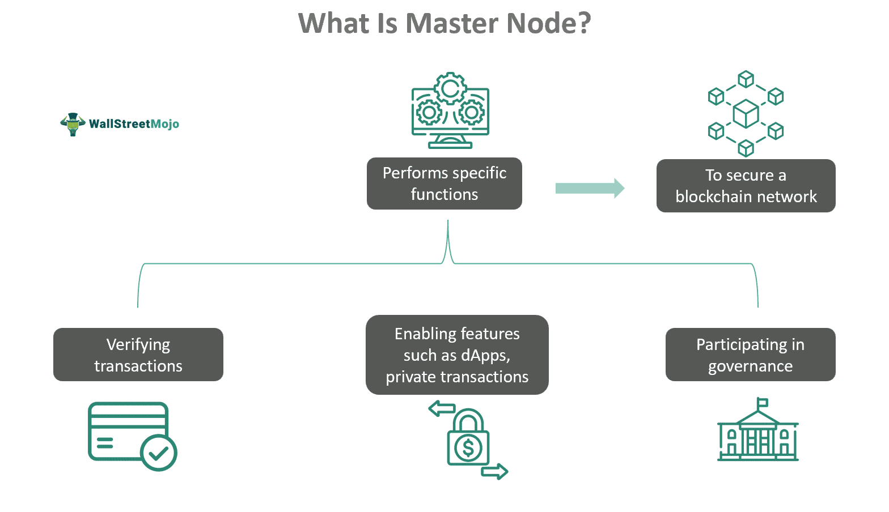

In the field of blockchain and cryptocurrency, nodes are fundamental components that ensure the network's integrity and functionality. A node, in this context, is a device that participates in a blockchain network, contributing to its transaction validation, data storage, and overall security. Understanding the distinctions among light nodes, full nodes, master nodes, and blockchain nodes is crucial for grasping how these networks operate efficiently.

Nodes perform various roles depending on their type, from maintaining complete copies of the blockchain to ensuring the seamless execution of transactions. This variety allows blockchain networks to remain decentralized, secure, and scalable. For instance, light nodes are designed to operate with limited resources, making them suitable for mobile platforms. Full nodes, on the other hand, are the network's backbone, independently verifying every transaction to uphold the network's rules. Master nodes add a layer of functionality, often dealing with governance and providing additional services in specific blockchain systems.

Moreover, the role of nodes extends to their impact on algorithmic trading, commonly referred to as 'algo trading.' In the cryptocurrency markets, algo trading involves using sophisticated algorithms to execute trades rapidly and according to predefined criteria, enabling higher efficiency and potentially maximizing returns. Reliable node performance is vital here to ensure the timely processing and execution of transactions, crucial when high-speed trading strategies are deployed.

By the conclusion of this article, readers will have a comprehensive understanding of the types of nodes, their respective roles, and their significance within the blockchain ecosystem. Furthermore, the interplay between these nodes and the growing domain of algo trading will be explored, emphasizing their collective impact on advancing the robustness and scalability of blockchain technologies.

## Table of Contents

## Understanding Blockchain Nodes

A blockchain node is a fundamental element in a blockchain network, defined as any device that connects to the network to fulfill essential functions. These nodes play a vital role in maintaining the network's integrity by storing a copy of the blockchain ledger and participating actively in various operations. One of the key functions of nodes is to validate and relay transactions. This process ensures that each transaction adheres to the network's rules and is duly recorded on the blockchain.

Nodes also function as decentralized points, forming the backbone of a distributed network structure. This decentralization eliminates the need for a central authority, thereby enhancing the blockchain's security and resilience against failures and attacks. The interactions between different nodes facilitate the seamless operation of the blockchain system, as each node communicates with others to exchange data, propagate transactions, and update blockchain states.

Different types of nodes exist within a blockchain network, each serving specific roles and responsibilities. Understanding these distinctions is crucial for appreciating the complexity and efficiency of blockchain technology. For instance, light nodes and full nodes differ primarily in their data storage and processing capacity. Light nodes are designed to store minimal data, relying on full nodes for comprehensive transaction information, thus making them suitable for devices with limited computational resources. Conversely, full nodes maintain a complete copy of the blockchain, independently verifying and relaying every transaction and block. This capability makes full nodes integral to ensuring that the network strictly follows its agreed-upon rules and protocols, thereby upholding the blockchain's security and trustless nature.

## Light Nodes

Light nodes, also known as lightweight or SPV (Simplified Payment Verification) nodes, are a type of blockchain node that operate without maintaining the entire blockchain ledger. Unlike full nodes, which store the complete blockchain and independently validate every transaction, light nodes depend on full nodes to access and verify necessary information. This dependency is primarily due to the limited data storage and processing capabilities of light nodes.

In a blockchain network, light nodes are beneficial because they consume significantly less computing power and disk space compared to their full node counterparts. This efficiency allows light nodes to run efficiently on devices with constrained resources, such as smartphones and other mobile devices. Consequently, they are widely used in [cryptocurrency](/wiki/cryptocurrency) wallets and mobile applications where maintaining a complete blockchain copy would be impractical.

The operation of light nodes focuses on enabling users to confirm transactions without downloading the entire blockchain. They achieve this by utilizing a component called the Merkle tree, a data structure that provides a compact and secure way of proving the presence or absence of a transaction within a block. Through this, light nodes request proof from full nodes concerning transaction details, effectively verifying transactions by checking only the block headers.

Despite their efficiency, relying on full nodes introduces potential security vulnerabilities for light nodes. Since they depend on full nodes for accurate transaction data, any failure or malicious activity on the part of full nodes can impact the reliability and security of light nodes. Enhancements such as SPV validation involve checking multiple full nodes to mitigate these risks, albeit without completely eliminating vulnerabilities.

In summary, light nodes play an essential role in broadening the accessibility of blockchain technologies, particularly for devices with limited resources. While they sacrifice some security in exchange for efficiency, the continued evolution of blockchain networks works toward addressing these limitations by optimizing the interaction between light nodes and their full node counterparts.

## Full Nodes

Full nodes represent a critical component of blockchain networks by maintaining a complete, up-to-date copy of the entire blockchain. Their role is pivotal as they validate and relay transactions, contributing significantly to the security and integrity of the network. Each full node independently verifies every transaction and block, ensuring adherence to all consensus rules established by the protocol. This independent verification is vital because it prevents false transactions and double-spending, thus maintaining the trustless nature of the blockchain.

Running a full node involves substantial storage capacity and computational power. As the blockchain grows, the storage requirement for a full node increases, further intensifying the need for robust hardware. For instance, Bitcoin's blockchain size is continuously growing, reaching over 400GB as of 2023. This means that running a full node is generally less feasible for casual users due to these resource demands. A full node requires a consistent internet connection with sufficient bandwidth to handle the data transfer required by the network.

Despite these challenges, the operation of full nodes is crucial for network security and decentralization. Full nodes help ensure that copies of the blockchain are not only ubiquitous but also immutable and verified. They act as a distributed ledger that prevents any single entity from gaining control over the blockchain. This decentralization is core to the resilience and antifragility of blockchain networks, allowing them to withstand attempts at manipulation or censorship.

In terms of their operation, full nodes receive data from other nodes while simultaneously broadcasting their own verified transactions and blocks. This decentralized web of nodes constantly checks and rebroadcasts data, forming a self-reinforcing network. The outcome is a system where multiple nodes concurrently confirm the state of the blockchain, making it exceedingly reliable.

The economic and technical barriers to running a full node might limit their number; however, they form the backbone upon which all other types of nodes, such as light nodes, depend for information and network services. Consequently, full nodes play an essential role in maintaining the decentralized and secure nature of blockchain technology.

## Master Nodes

Master nodes are a pivotal component in several blockchain networks, offering functionalities that extend beyond those of standard nodes. These nodes are specifically designed to perform advanced tasks, such as facilitating private transactions, which help ensure the anonymity and confidentiality of transactions on the network. This added layer of privacy is beneficial in environments where transaction confidentiality is a priority.

A critical feature of master nodes is their role in governance within certain blockchain ecosystems. They participate in the decision-making processes, such as voting on protocol changes or budget allocations, thereby contributing to the decentralized governance model. This function underscores their importance in maintaining the stability and adaptability of the blockchain network.

To establish a master node, operators are typically required to provide collateral in the form of cryptocurrency. This requirement ensures that node operators have a financial stake in the network’s security and performance, aligning their incentives with the overall health and success of the blockchain. The collateral acts as a bond, deterring malicious activities and encouraging a vested interest in the network’s integrity.

Incentivization is a key [factor](/wiki/factor-investing) in the proliferation of master nodes. Operators receive rewards, often in the form of cryptocurrency, for their services. This remuneration system not only compensates them for the resources and efforts involved in running a master node but also motivates the continuous upkeep and performance of these nodes.

Master nodes are integral to certain blockchain architectures, such as Dash, which pioneered their use. In Dash, master nodes provide enhanced privacy options through features like PrivateSend, and contribute to the network’s unique consensus mechanism, which operates on a dual-tier structure. This framework differentiates master nodes from regular nodes and highlights their additional contributions to the network, such as performing instant transactions and fulfilling roles in Dash’s governance.

The significance of master nodes lies in their ability to provide scalability, security, and enhanced functionality within blockchain networks. Their specialized roles ensure that the blockchain can offer additional services and maintain its decentralized nature, all while incentivizing operators to sustain and support the network's infrastructure.

## The Role of Nodes in Algo Trading

Algorithmic trading, commonly known as algo trading, leverages computer algorithms to execute trades at high speed and frequency based on pre-set criteria. In the rapidly evolving cryptocurrency markets, the efficient performance of nodes—light nodes, full nodes, and master nodes—is critical to ensure the fast and accurate execution of these trades. Reliable node performance underpins data integrity and the timely relay of trading information across the blockchain network.

Nodes perform essential functions by validating, relaying, and recording transactions, which are pivotal for the seamless functioning of the blockchain. Light nodes, which store a minimal amount of data, depend on full nodes to provide crucial transaction information. This reliance can introduce potential latency in data retrieval, directly impacting the speed of trade execution in algo trading algorithms. Nonetheless, their lightweight nature makes them feasible for use in resource-constrained environments such as mobile trading applications.

Full nodes maintain a complete and independent copy of the blockchain, thus ensuring the integrity and validation of every transaction and block they process. Their comprehensive data handling capabilities make them integral to reducing the risk of executing invalid or fraudulent trades in algo trading environments. Despite requiring substantial computational resources, full nodes provide a trustless platform crucial for automated trading systems that demand high levels of accuracy and reliability.

Master nodes, aside from their basic operational roles, often oversee additional functionalities such as facilitating private transactions and governance decision-making within a blockchain. By requiring operators to hold collateral, master nodes increase the trust and stability in networks that employ them. This implicit trust is beneficial for algorithms that may leverage these nodes for executing trades involving privacy-oriented cryptocurrencies or networks requiring rapid governance changes.

Overall, the efficiency and reliability of node performance are vital in determining the effectiveness of [algorithmic trading](/wiki/algorithmic-trading) strategies in cryptocurrency markets. Any delays or inaccuracies in data delivery due to suboptimal node performance can lead to adverse trading outcomes. Thus, understanding and optimizing node functionality provides a strategic advantage in executing time-sensitive trades efficiently while maintaining data integrity across the network.

## Conclusion

Understanding the various types of nodes within the blockchain ecosystem is essential for appreciating their pivotal roles in maintaining network integrity, security, and functionality. Light nodes, full nodes, and master nodes, each serve distinct purposes that collectively sustain the blockchain's robustness and decentralization. Light nodes, with their simplified structures, are ideal for users with limited resources, enabling easy access and portability. Full nodes, on the other hand, provide the critical function of validating and securing the entire blockchain, ensuring trustless and transparent interactions. Master nodes go a step further by offering advanced services, such as privacy enhancements and governance roles, which are fundamental in specific blockchain architectures.

The rise of algorithmic trading in cryptocurrency markets highlights the necessity for efficient and reliable node performance. Nodes are instrumental in ensuring data integrity and expedite the relay of vital trading information, which, in turn, enhances the effectiveness of algorithmic trading strategies. As the adoption of cryptocurrencies expands, the significance of these nodes grows in facilitating transactions that are both seamless and secure.

This understanding of node types not only empowers investors, developers, and users by providing them with insights into the blockchain's foundational mechanisms but also contributes to a more robust and capable blockchain landscape. The collaboration of various node types ensures that the network remains functional, secure, and resilient, ultimately fostering greater trust and widespread adoption across the cryptocurrency sector.

## References & Further Reading

[1]: Antonopoulos, A. M. (2017). ["Mastering Bitcoin: Unlocking Digital Cryptocurrencies."](https://books.google.com/books/about/Mastering_Bitcoin.html?id=IXmrBQAAQBAJ) O'Reilly Media.

[2]: Narayanan, A., Bonneau, J., Felten, E., Miller, A., & Goldfeder, S. (2016). ["Bitcoin and Cryptocurrency Technologies: A Comprehensive Introduction."](https://press.princeton.edu/books/hardcover/9780691171692/bitcoin-and-cryptocurrency-technologies) Princeton University Press.

[3]: Dash Core Group. ["Dash Economics 101: How Masternodes Work."](https://docs.dash.org/projects/core/en/develop/docs/guide/dash-features-masternode-payment.html)

[4]: Croman, K., Decker, C., Eyal, I., Gencer, A. E., Juels, A., Kosba, A., ... & Song, D. (2016). ["On Scaling Decentralized Blockchains (A Position Paper)."](https://link.springer.com/chapter/10.1007/978-3-662-53357-4_8) International Financial Cryptography Association.

[5]: Sapozhnikov, A., & Eskandari, S. (2019). ["SPV Mining and its Security Implications."](https://www.researchgate.net/scientific-contributions/A-N-Sapozhnikov-19598820) arXiv preprint arXiv:1906.07696.