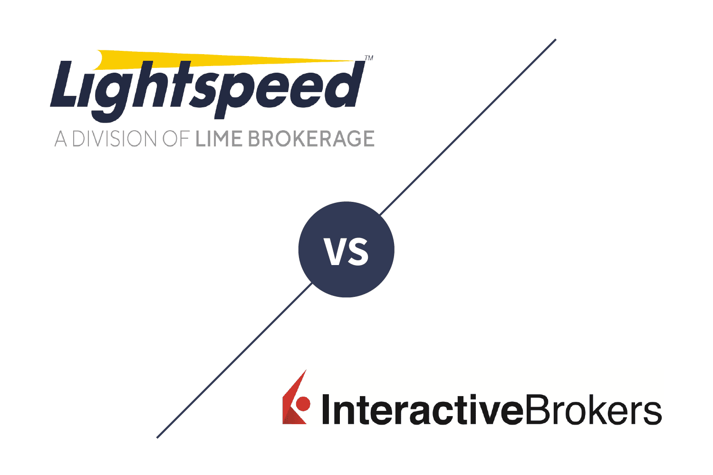

As technology continues to evolve, the financial industry witnesses a transformation in the way trading is conducted. Online trading platforms such as Interactive Brokers and Lightspeed have emerged as crucial tools for traders across the globe. Renowned for their advanced features and competitive pricing, both platforms cater primarily to active and professional traders who seek efficiency and precision in their trading operations.

This article aims to provide a thorough comparison between Lightspeed and Interactive Brokers, examining their respective strengths, weaknesses, and unique nuances. Traders often face the challenge of choosing the right platform that aligns with their individual trading strategies, especially when engaging in algorithmic trading or maintaining active market participation. By understanding the specific attributes of each platform, traders can make informed decisions that support their objectives and enhance their trading experience.



The analysis covers several key areas that are vital for traders, such as usability, trade experience, range of product offerings, and pricing structures, among others. Each of these aspects is critical in determining which platform will best suit a trader's needs, considering factors like speed, cost, and the breadth of market access.

## Table of Contents

## Background and Company Overview

Interactive Brokers, established in 1978, has grown into a global powerhouse within the online trading industry. The company is publicly traded on the NASDAQ under the ticker symbol 'IBKR' and has a substantial international presence, offering access to over 150 markets across the globe. Known for its comprehensive and innovative trading solutions, Interactive Brokers caters to both retail and institutional traders, providing a wide array of financial products including stocks, options, futures, [forex](/wiki/forex-system), bonds, and funds. The platform is especially recognized for its robust infrastructure and advanced tools that facilitate sophisticated trading strategies, including algorithmic trading capabilities.

In contrast, Lightspeed Trading was founded in 2006 and has carved out a niche for itself by focusing on fast execution tailored specifically for active traders and institutions. The platform thrives on providing high-speed and low-latency trading solutions, catering to traders who require quick order execution and reliable performance. Lightspeed's reputation revolves around its ability to serve professional traders who engage heavily in equities and options trading. Although it lacks the extensive market reach of Interactive Brokers, Lightspeed compensates with its emphasis on trading speed and precision, attributes that are particularly appealing to day traders and high-frequency traders.

Both Interactive Brokers and Lightspeed have developed platforms that support sophisticated trading operations, utilizing advanced tools and robust infrastructures to meet the demands of their respective user bases. Interactive Brokers excels in providing a one-stop-shop experience with seamless multi-currency trading and diverse market access, whereas Lightspeed specializes in offering minimal latency and high execution speeds, essential for traders prioritizing swift market interactions.

## Usability and Platform Experience

[Interactive Brokers](/wiki/interactive-brokers-api) (IBKR) and Lightspeed present distinct experiences concerning usability and platform operation. Both cater predominantly to active and professional traders, yet their approaches differ significantly. 

Interactive Brokers stands out with its comprehensive and integrated trading platform. Known for its robust infrastructure, IBKR enables seamless access to global markets, offering multi-currency trading across 150 markets. This integration allows traders to manage all their trading activities without resorting to third-party tools or interfaces. Features like the Trader Workstation (TWS) provide a centralized hub where traders can execute complex trades and analyze market trends using advanced charting tools, nuanced order types, and real-time data feeds.

In contrast, Lightspeed Trader is designed with a focus on speed and precision, tailored specifically for professional-grade trading. It emphasizes rapid execution times and provides a customizable interface that traders can adjust to suit their strategic needs. This specialization means that platform resources are optimized to enhance the efficiency of high-frequency trading activities.

However, while Lightspeed excels in providing fast and customizable trading solutions, it may require users to operate across multiple platforms to access all necessary features. Traders interested in accessing the complete functionality and a broader array of trading tools might find this segmentation less convenient compared to the single-platform approach of Interactive Brokers.

Traders choosing between these platforms should weigh the integrated multi-market access and comprehensive trading tools of IBKR against the fast execution and customization that Lightspeed offers. Whether the preference lies in the all-in-one capabilities of Interactive Brokers or the speed-centric design of Lightspeed Trader depends largely on individual trading strategies and priorities.

## Trade Experience and Order Types

Interactive Brokers offers a remarkable trade experience, marked by their support for over 90 different order types and sophisticated [algorithmic trading](/wiki/algorithmic-trading) capabilities. This extensive suite is designed to cater to the needs of high-frequency traders and professional investors who require advanced strategies to maximize their trading efficiency. The platform's algorithmic trading features allow users to automate trades based on pre-defined parameters, utilizing complex conditional orders like "One Cancels All" (OCA) or "One Triggers Another" (OTA).

For instance, IBKR's advanced order types effectively help traders manage risk and enter or [exit](/wiki/exit-strategy) positions with precision. Users can design complex strategies that encompass variables such as order execution time, price sensitivity, and [volume](/wiki/volume-trading-strategy) constraints. Below is an example of how Python can be utilized to implement an algorithmic trading strategy:

```python
from ib_insync import *

ib = IB()
ib.connect('127.0.0.1', 7497, clientId=1)

stock = Stock('AAPL', 'SMART', 'USD')
ib.qualifyContracts(stock)

order = LimitOrder('BUY', 100, 150)
trade = ib.placeOrder(stock, order)
ib.disconnect()
```

Lightspeed, on the other hand, also offers a robust selection of order types but gates its comprehensive features behind higher account minimums. This approach ensures that more serious traders, who maintain substantial account balances, access all the advanced tools needed for sophisticated trading tactics. However, this stratification might limit novice or small-scale traders who seek to explore advanced trading without committing large sums upfront.

These distinctions highlight IBKR's emphasis on providing extensive flexibility and automation in trading strategies. The ability to articulate complex conditional and staged orders provides a competitive edge for traders who thrive on precision and efficiency. Meanwhile, Lightspeed's approach aligns with its commitment to high-speed trading, emphasizing rapid execution over an exhaustive variety of order types. Thus, traders must consider their priorities—whether complexity and automation with Interactive Brokers or speed and simplicity with Lightspeed meet their strategic needs.

## Costs and Pricing Structures

When evaluating the costs and pricing structures of Interactive Brokers and Lightspeed, both platforms present distinct advantages depending on the trader's priorities and trading style.

Lightspeed's pricing primarily caters to high-volume traders with a straightforward model that becomes increasingly advantageous as trading volume increases. The platform is known for offering volume discounts, which means that as traders execute more trades, the per-trade cost decreases. This cost-effective approach is particularly appealing to active traders who engage in frequent buying and selling. For instance, commission per share decreases with higher transaction volumes, making Lightspeed an attractive option for professional traders looking to minimize transaction costs over time.

In contrast, Interactive Brokers provides a more complex pricing structure, with options tailored to different types of clients through its IBKR Lite and IBKR Pro accounts. The IBKR Lite account offers commission-free trading on U.S. exchange-listed stocks and ETFs, appealing to retail investors seeking low-cost entry into trading. On the other hand, the IBKR Pro account targets more active traders and institutions with a tiered commission structure that adjusts based on monthly trade volume. This tiered system encourages high-volume trading by reducing per-trade costs as the volume increases, similar to Lightspeed, but it adds a global element by considering different rates across various financial markets.

Interactive Brokers stands out with its comprehensive fee transparency, detailing various costs associated with trading across multiple global markets. This global pricing flexibility is particularly beneficial for traders who engage in international markets, providing a clear understanding of potential fees involved in different geographies.

Overall, both Interactive Brokers and Lightspeed provide competitive pricing structures tailored to meet the needs of different trading strategies. Lightspeed's model benefits high-frequency traders through volume discounts, while Interactive Brokers offers diverse account options and global pricing transparency, making it suitable for both retail and institutional investors. The choice between these platforms should consider the trader’s volume, the markets they intend to engage with, and their preference for simplicity versus a broad global reach.

## Range of Offerings

Interactive Brokers (IBKR) presents an expansive selection of tradable securities, which is one of its key strengths. By offering a wide array of investment options, the platform allows traders to build diversified portfolios. The availability of fractional shares is particularly advantageous as it enables investors to purchase segments of shares, thereby facilitating precise portfolio adjustments and access to high-value stocks beyond their complete share price. This feature is especially useful for retail investors who seek to optimize their capital allocation across various assets without substantial financial outlay.

In contrast, Lightspeed primarily caters to high-speed trading and positions itself as an optimal choice for professional traders engaged in stocks, options, and futures. While this focus supports efficient trades in these asset classes, Lightspeed does not offer fractional trading. This absence could be a limiting [factor](/wiki/factor-investing) for traders interested in incremental share purchasing.

A notable strength of Interactive Brokers is its integrated account structure which seamlessly supports global trading. This feature enables users to access a diverse range of products across international markets without needing separate accounts for different regions. The cross-border capabilities of IBKR greatly appeal to traders who prioritize geographic diversification and want the flexibility to invest in international securities. 

Overall, IBKR's comprehensive range of offerings, including the ability to trade fractional shares and its global market reach, positions it as a versatile platform suited for a variety of trading strategies. Lightspeed, with its emphasis on rapid execution, still remains a strong option for those focused on speed and specific asset classes, although it may not provide the same breadth in terms of diversified product access as IBKR.

## Education and Resources

Interactive Brokers offers a robust educational framework through its IBKR Campus, which serves as a comprehensive resource for both novice and seasoned traders. The platform covers a wide array of subjects, including investment strategies, market analysis, and detailed platform tutorials. IBKR Campus provides a variety of mediums such as in-depth articles, videos, webinars, and interactive courses designed to enhance the user's trading knowledge and skills. These resources are further complemented by tools that allow users to simulate trading scenarios, facilitating a hands-on learning experience.

On the other hand, Lightspeed Trading's educational resources, while valuable, are relatively limited compared to the extensive offerings at Interactive Brokers. Lightspeed provides access to educational tools such as webinars and tutorials, focusing primarily on the use of their trading platforms and execution strategies. These resources are well-suited for traders who need specific guidance on using Lightspeed’s software but may not cater to a broader educational pursuit in trading and investment.

For those traders who prioritize extensive educational content that encompasses both practical and theoretical aspects of trading, Interactive Brokers stands out as a more inclusive educational environment. The breadth of resources available through IBKR Campus offers a significant advantage for those looking to deepen their understanding of markets and enhance their trading acumen. In contrast, Lightspeed’s educational content is more streamlined, ideal for traders whose primary concern is mastering platform-specific operations.

## Verdict and Recommendations

Interactive Brokers generally stands out in most categories when compared to Lightspeed. This distinction is largely due to Interactive Brokers' expansive global reach, wide range of offerings, and comprehensive suite of educational resources. These factors make it an ideal choice for traders seeking diversified exposure across international markets and those who prioritize a robust learning environment.

On the other hand, Lightspeed is tailored for traders who prioritize rapid execution and minimal latency in their trading activities. Its infrastructure is optimized for speed, making it suitable for traders who engage in high-frequency trading or require real-time data processing. However, Lightspeed's focus on speed comes with limitations in broader market access and available educational tools.

Ultimately, choosing between Interactive Brokers and Lightspeed should be guided by the trader's specific needs. Traders who are more concerned with execution speed might prefer Lightspeed, while those looking for diversified market access, a broader array of financial products, and comprehensive educational support may find Interactive Brokers more aligned with their objectives. Factors such as cost structures, which can vary significantly between platforms, should also play a critical role in the decision-making process.

By aligning their choice with their individual investment strategies and goals, traders can maximize the benefits offered by these platforms. Understanding these differences can significantly impact trading efficiency and investment success.

## Conclusion

Both Interactive Brokers and Lightspeed offer valuable resources for active traders and possess distinct strengths that align with different trading priorities. Interactive Brokers is celebrated for its vast global reach, wide assortment of tradable securities, and robust educational resources, which make it a compelling choice for traders interested in diversified portfolios and comprehensive market access. It supports sophisticated trading strategies through features like algorithmic trading and complex order types, catering to those who prioritize extensive capabilities and market reach.

On the other hand, Lightspeed is highly regarded for its exceptional speed and efficient execution, making it a favored platform for traders focused on rapid execution and minimizing latency. With competitive pricing and a structure tailored for high-frequency trading, Lightspeed addresses the needs of traders who value low-latency environments and straightforward pricing schemes.

Ultimately, traders must reflect on their specific investment priorities and strategies to choose the platform that best aligns with their objectives. Whether the priority is speed and execution with Lightspeed, or broad market access and educational support with Interactive Brokers, understanding the unique advantages of each broker will enable traders to make informed decisions, aligning their platform choice with their personal investment goals.

## References & Further Reading

[1]: ["Interactive Brokers Review 2024"](https://www.nerdwallet.com/reviews/investing/brokers/interactive-brokers), Investopedia

[2]: ["Lightspeed Review 2024: Pros, Cons, and How It Compares"](https://retailingsummit.org/articles/lightspeed-pos-review), NerdWallet

[3]: ["Algorithmic Trading: A Practitioner's Guide"](https://www.amazon.com/Algorithmic-Trading-Practitioners-Jeffrey-Bacidore/dp/0578715236) by Jeffrey Bacidore

[4]: ["Machine Learning for Algorithmic Trading: Predictive models to extract signals from market and alternative data for systematic trading strategies with Python"](https://github.com/stefan-jansen/machine-learning-for-trading) by Stefan Jansen

[5]: ["The Man Who Solved the Market: How Jim Simons Launched the Quant Revolution"](https://www.amazon.com/Man-Who-Solved-Market-Revolution/dp/073521798X) by Gregory Zuckerman