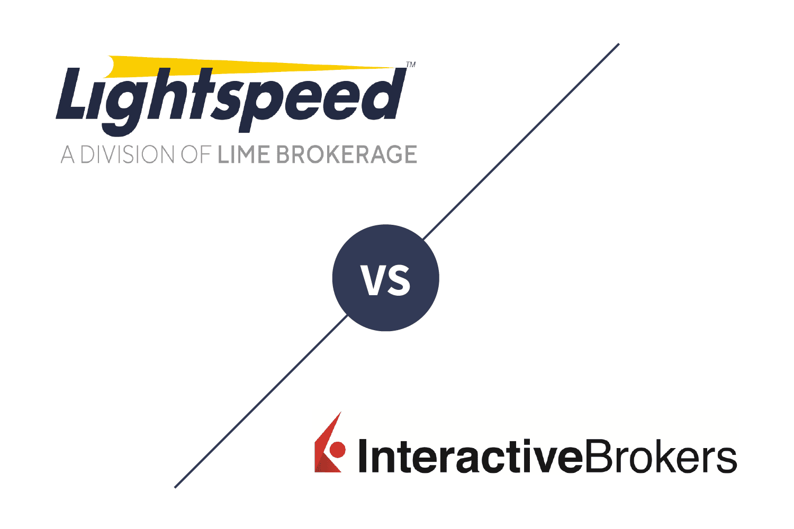

## Table of Contents

## What are Lightspeed and Interactive Brokers?

Lightspeed is a trading platform that helps people buy and sell stocks and other financial products. It is known for being fast and reliable, which is important for traders who need to make quick decisions. Lightspeed offers different tools and features that can help traders analyze the market and manage their investments better. It is popular among active traders who trade a lot and need a platform that can keep up with their pace.

Interactive Brokers is also a trading platform, but it offers a wider range of financial products to trade, including stocks, options, futures, and forex. It is known for its low costs and advanced trading tools, which can be useful for both beginners and experienced traders. Interactive Brokers has a global reach, allowing users to trade in many different markets around the world. This makes it a good choice for people who want to diversify their investments across different countries and asset types.

## How do the account minimums compare between Lightspeed and Interactive Brokers?

Lightspeed has different account minimums depending on which trading platform you choose. For their main platform, you need at least $10,000 to open an account. If you want to use their more advanced platform called Lightspeed Trader, the minimum goes up to $25,000. This is because Lightspeed is designed for active traders who trade a lot, so they set higher minimums to make sure their clients are serious about trading.

Interactive Brokers, on the other hand, has a much lower account minimum. You can open an account with them for just $0 if you sign up for their IBKR Lite plan. This plan is good for people who don't trade very often. If you want to use their more advanced plan called IBKR Pro, you still only need $0 to start, but you will pay more in fees when you trade. This makes Interactive Brokers a good choice for both new traders and those who want to trade more often without a big upfront cost.

## What are the fee structures for trading with Lightspeed versus Interactive Brokers?

Lightspeed charges different fees depending on how much you trade and what kind of account you have. If you use their main platform, you'll pay $0.0045 per share for stocks, with a $1 minimum per trade. If you trade a lot, you can get a lower rate of $0.0010 per share, but you need to trade at least 250,000 shares a month. For options, the fee is $0.60 per contract. Lightspeed also charges different fees for other services like data feeds and platform usage, so it's good to check all the details before you start trading.

Interactive Brokers has two main plans with different fee structures. The IBKR Lite plan is for people who don't trade a lot. It has no commission fees for US stocks and ETFs, but you might pay small fees for other types of trades. The IBKR Pro plan is for more active traders. It charges $0.005 per share for stocks with a $1 minimum per order, and $0.65 per contract for options. Like Lightspeed, Interactive Brokers also has fees for other services, so it's important to look at all the costs before you choose a plan.

## How do the trading platforms of Lightspeed and Interactive Brokers differ in terms of user experience?

Lightspeed's trading platform is designed for people who trade a lot and need things to happen fast. It has a simple look that makes it easy to see important information quickly. You can change how the platform looks to fit what you like, which is good for traders who have their own way of doing things. Lightspeed also has tools like charts and real-time data that help you make smart choices when trading. But, because it's made for people who trade a lot, it might be a bit hard to use if you're new to trading.

Interactive Brokers' trading platform, called Trader Workstation (TWS), is very powerful and has a lot of features. It might look a bit busy at first, but it has everything you need to trade in many different markets around the world. You can use TWS on your computer or on your phone, so you can trade from anywhere. It's good for both new traders and people who trade a lot because it has tools that can help everyone. But, because there are so many features, it might take some time to learn how to use it all.

## What types of securities can be traded on Lightspeed and Interactive Brokers?

Lightspeed lets you trade stocks and options. It's good for people who want to buy and sell these types of investments quickly. Lightspeed focuses on these two types of securities because they are popular with active traders who trade a lot.

Interactive Brokers offers a lot more types of securities to trade. You can trade stocks, options, futures, forex, and even bonds. This makes Interactive Brokers a good choice for people who want to invest in many different things and in different countries. It's like a big store where you can find almost anything you want to trade.

## How do the margin rates compare between Lightspeed and Interactive Brokers?

Lightspeed has different margin rates depending on how much money you have in your account. If you have less than $100,000, the margin rate is around 8.5%. If you have more money, the rate can go down. For example, if you have between $100,000 and $499,999, the rate might be about 7.5%. The more money you have, the lower the rate can go, which is good for people who trade a lot and need to borrow money to buy more stocks.

Interactive Brokers also has different margin rates, but they can be lower than Lightspeed's rates. If you have less than $100,000, the margin rate is around 5.83%. If you have more money, the rate can go down even more. For example, if you have between $100,000 and $999,999, the rate might be about 5.33%. Interactive Brokers tries to keep their rates low so that people can borrow money to trade without paying too much in interest.

## What kind of customer support do Lightspeed and Interactive Brokers offer?

Lightspeed offers customer support through phone, email, and live chat. They have a team that works during the trading day to help with any questions or problems you might have. If you need help outside of trading hours, you can still reach them by email or leave a message. Lightspeed also has a lot of guides and videos on their website to help you learn how to use their platform. This is good for people who like to figure things out on their own.

Interactive Brokers also provides customer support through phone, email, and live chat. Their support team is available 24 hours a day, which is great if you trade in different time zones or have questions at odd hours. They have a lot of information on their website, including a big help center with articles and tutorials. This makes it easy to find answers to common questions without having to call or email. Interactive Brokers is good for people who need help at any time and like having a lot of resources to learn from.

## How do the research and analysis tools provided by Lightspeed compare to those of Interactive Brokers?

Lightspeed has good research and analysis tools that help traders make smart choices. They give you real-time data, which means you see what's happening in the market right away. You can also use their charts to see how stocks have been doing over time. Lightspeed has tools like scanners that help you find good trading chances quickly. But, these tools might be a bit hard to use if you're new to trading because they are made for people who trade a lot.

Interactive Brokers has a lot of research and analysis tools too, and they are very detailed. They give you real-time data and charts, just like Lightspeed, but they also let you trade in many different markets around the world. This means you can look at and compare stocks from different countries. Interactive Brokers has a tool called the Trader's Dashboard that shows you a lot of information at once, which can be helpful. Their tools might take some time to learn because there are so many of them, but they can help both new and experienced traders.

## What are the advanced trading features available on Lightspeed and Interactive Brokers?

Lightspeed has some cool advanced trading features that help people who trade a lot. One big feature is their direct market access, which means you can send your trade orders straight to the stock exchange without going through a middle person. This can make your trades happen faster. Lightspeed also has a tool called Level II quotes, which shows you a lot of information about what people are buying and selling. This can help you decide when to make your trades. Another neat feature is their hot keys, which let you do things on the platform really quickly by just pressing a few buttons. These features are good for people who need to make fast decisions and trade a lot.

Interactive Brokers also has some advanced trading features that can help both new and experienced traders. They have something called algorithmic trading, which lets you use computer programs to make trades for you based on rules you set. This can be helpful if you want to trade without watching the market all the time. Interactive Brokers also offers options trading strategies, which can help you make money in different ways by buying and selling options. They have a tool called the Risk Navigator, which helps you see how risky your trades are and manage them better. These features make Interactive Brokers a good choice for people who want to use more advanced ways to trade.

## How do the mobile trading apps of Lightspeed and Interactive Brokers stack up against each other?

Lightspeed's mobile app is made for people who trade a lot and need to do it fast. The app lets you see real-time data and charts, so you can make quick decisions about buying and selling stocks. It's easy to use and looks simple, which is good if you know what you're doing. But, if you're new to trading, the app might be a bit hard to understand because it doesn't have a lot of extra help or guides. You can still do things like set up alerts and use hot keys, which are shortcuts to make trading faster.

Interactive Brokers' mobile app is good for both new and experienced traders. It has a lot of features that let you trade in many different markets around the world. You can see real-time data and charts, just like with Lightspeed, but you also get tools to help you trade options and futures. The app might look a bit busy because there's so much you can do, but it has guides and help sections to make things easier to learn. If you like to trade from anywhere and need a lot of tools, Interactive Brokers' app is a good choice.

## What are the international trading capabilities of Lightspeed and Interactive Brokers?

Lightspeed focuses mostly on trading in the United States. It lets you buy and sell stocks and options, but it doesn't have a lot of options for trading in other countries. If you want to trade outside of the U.S., Lightspeed might not be the best choice for you. It's good for people who just want to trade in the American market and need things to happen fast.

Interactive Brokers is really good for trading all over the world. You can trade stocks, options, futures, forex, and bonds in many different countries. This makes it easy to buy and sell things from places like Europe, Asia, and more. If you want to spread your investments around the world, Interactive Brokers is a great choice because it gives you a lot of options.

## How do the API and automation options for algorithmic trading differ between Lightspeed and Interactive Brokers?

Lightspeed has a good API that lets you use computer programs to trade for you. This is called algorithmic trading. Their API is fast and works well, which is important if you want your trades to happen quickly. But, Lightspeed's API is mostly for trading in the U.S., so if you want to trade in other countries, it might not be the best choice. Also, you need to know how to code to use the API, so it's better for people who already know how to do that.

Interactive Brokers also has a strong API for algorithmic trading. Their API lets you trade in many different markets around the world, not just in the U.S. This is good if you want to buy and sell things from places like Europe or Asia. Like Lightspeed, you need to know how to code to use Interactive Brokers' API. But, they have a lot of tools and guides to help you learn, so it can be easier to get started if you're new to coding.

## References & Further Reading

[1]: ["Interactive Brokers Review 2024"](https://www.nerdwallet.com/reviews/investing/brokers/interactive-brokers), Investopedia

[2]: ["Lightspeed Review 2024: Pros, Cons, and How It Compares"](https://retailingsummit.org/articles/lightspeed-pos-review), NerdWallet

[3]: ["Algorithmic Trading: A Practitioner's Guide"](https://www.amazon.com/Algorithmic-Trading-Practitioners-Jeffrey-Bacidore/dp/0578715236) by Jeffrey Bacidore

[4]: ["Machine Learning for Algorithmic Trading: Predictive models to extract signals from market and alternative data for systematic trading strategies with Python"](https://github.com/stefan-jansen/machine-learning-for-trading) by Stefan Jansen

[5]: ["The Man Who Solved the Market: How Jim Simons Launched the Quant Revolution"](https://www.amazon.com/Man-Who-Solved-Market-Revolution/dp/073521798X) by Gregory Zuckerman