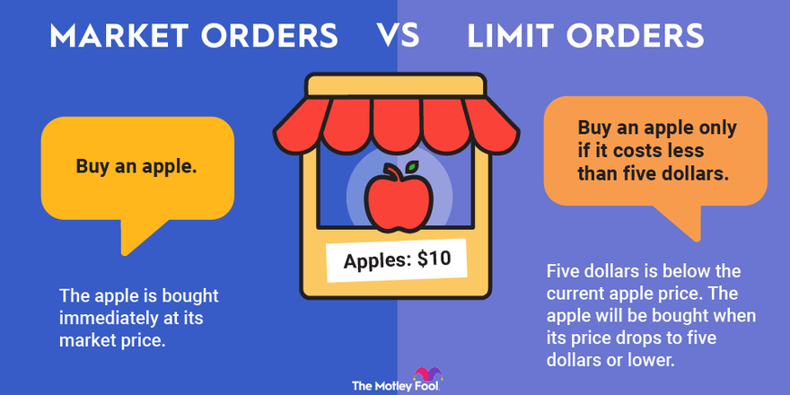

## Table of Contents

## What is a limit order?

A limit order is a type of order you can place with your broker to buy or sell a stock at a specific price or better. For example, if you want to buy a stock but only if it drops to $50 or lower, you can set a limit order at $50. This means your order will only be executed if the stock reaches or falls below that price.

Limit orders give you more control over the price at which you buy or sell a stock. They can help you avoid buying a stock at a higher price than you want or selling it for less than you think it's worth. However, there's a downside: if the stock never reaches your limit price, your order might not be filled at all. So, while limit orders can help you get a better price, they don't guarantee that your trade will happen.

## What is a market order?

A market order is a type of order where you tell your broker to buy or sell a stock right away at the current market price. It's the simplest way to trade because you don't have to worry about setting a specific price. When you place a market order, your trade will usually happen very quickly, often within seconds.

The main advantage of a market order is that it's almost guaranteed to be filled, meaning your trade will go through. This is good if you want to buy or sell a stock fast. But there's a catch: you might not get the exact price you see on your screen. The price can change in the time it takes for your order to be processed, especially if you're trading a stock that doesn't trade very often. So, while market orders are quick and reliable, the final price you get might be a bit different from what you expected.

## How do limit orders and market orders differ?

Limit orders and market orders are two different ways to buy or sell stocks. A limit order lets you set a specific price at which you want to buy or sell. For example, if you want to buy a stock but only if it's $50 or less, you can set a limit order at $50. This means your order will only happen if the stock reaches or goes below that price. The good thing about limit orders is that you can control the price you pay or sell at, but there's a chance your order won't happen if the stock never reaches your price.

On the other hand, a market order tells your broker to buy or sell the stock right away at the current market price. This is the quickest way to trade because you don't have to set a specific price. When you place a market order, your trade usually happens very fast, often in seconds. The advantage of market orders is that they are almost sure to go through, but the price you get might be a little different from what you saw on your screen because the price can change quickly.

In simple terms, limit orders give you control over the price but no guarantee that the trade will happen, while market orders guarantee that the trade will happen but not the exact price you'll get.

## What are the costs associated with placing a limit order?

When you place a limit order, you might have to pay a fee to your broker. This fee is called a commission, and it's what the broker charges for handling your order. The amount can vary depending on which broker you use. Some brokers might charge a flat fee for each trade, while others might have different fees based on the size of your order or the type of account you have. It's a good idea to check with your broker to find out exactly what fees you'll have to pay.

Another cost to think about with limit orders is the possibility that your order won't get filled. If the stock never reaches the price you set, you won't buy or sell the stock, and you might miss out on other chances to trade. This isn't a direct cost like a commission, but it can affect how much money you make or lose. So, when you're deciding whether to use a limit order, you need to think about both the broker's fees and the risk that your order won't go through.

## What are the costs associated with placing a market order?

When you place a market order, you might have to pay a fee to your broker. This fee is called a commission, and it's what the broker charges for handling your order. The amount can be different depending on which broker you use. Some brokers might charge a flat fee for each trade, while others might have different fees based on how much you're trading or the type of account you have. It's a good idea to check with your broker to find out exactly what fees you'll have to pay.

Another cost to think about with market orders is the possibility that the price you get might be different from what you expected. Since market orders are filled right away at the current market price, the price can change quickly between the time you place your order and when it's actually filled. This is called slippage, and it can mean you end up paying a bit more or getting a bit less than you thought. So, when you're deciding whether to use a market order, you need to think about both the broker's fees and the risk of slippage.

## Can you explain the concept of slippage in market orders?

Slippage is what happens when the price you get for a stock isn't exactly what you expected when you placed your market order. When you use a market order, you're telling your broker to buy or sell the stock right away at the current market price. But because the stock market moves fast, the price can change in the short time it takes for your order to go through. So, you might end up buying the stock for a little more or selling it for a little less than you thought.

For example, let's say you see a stock priced at $100 and you place a market order to buy it. But by the time your order gets filled, the price might have gone up to $100.10. That extra 10 cents is slippage. Slippage can happen more often with stocks that don't trade a lot because there might not be enough buyers or sellers at the exact moment you place your order. So, while market orders are quick and usually get filled, you need to be ready for a small difference in the price you end up with.

## How does the timing of order execution affect costs for limit and market orders?

The timing of order execution can affect the costs of limit orders in a big way. When you set a limit order, you're saying you only want to buy or sell a stock at a certain price or better. If the stock reaches your price quickly, your order will get filled, and you'll pay the commission fee your broker charges. But if the stock takes a long time to reach your price or never reaches it at all, you might miss out on other chances to trade. This can be a hidden cost because you could lose out on making money or avoiding a loss if the stock's price moves a lot while you're waiting.

For market orders, timing can also make a difference in costs, especially because of something called slippage. When you place a market order, it gets filled right away at the current market price. But because the stock market moves fast, the price can change in the short time it takes for your order to go through. If the price goes up a bit before your order is filled, you'll pay a little more than you expected. This extra amount is the cost of slippage. So, even though market orders are quick and usually get filled, you need to be ready for the price to be a bit different from what you saw when you placed your order.

## What role does market volatility play in the costs of limit and market orders?

Market [volatility](/wiki/volatility-trading-strategies) can really affect the costs of using limit orders. When the market is volatile, stock prices can swing up and down a lot. If you set a limit order at a certain price, it might be harder for that price to be reached because the stock could jump around a lot. This means your order might not get filled at all, and you could miss out on buying or selling the stock at a good time. Also, if your limit order does get filled during a volatile period, it might be at a price that's very different from what you expected, which can affect how much money you make or lose.

For market orders, market volatility can lead to bigger costs because of slippage. When you place a market order, it gets filled right away at the current market price. But in a volatile market, that price can change a lot in just a few seconds. This means you might end up buying the stock for more or selling it for less than you thought. The bigger the swings in the stock price, the more slippage you might have to deal with. So, in a volatile market, you need to be ready for the price you get to be different from what you saw when you placed your order.

## How can the size of an order influence the costs of limit and market orders?

The size of an order can affect the costs of limit orders because bigger orders might be harder to fill at the price you set. When you want to buy or sell a lot of a stock, there might not be enough people on the other side of the trade willing to take your whole order at your limit price. This means your order might only get filled partially or not at all, which could lead to missed opportunities. Also, if your big order does get filled, it might move the market price, causing you to buy at a higher price or sell at a lower price than you planned.

For market orders, the size of your order can lead to bigger costs because of slippage. When you place a big market order, it can be harder for your broker to find enough buyers or sellers to fill it right away at the current market price. This means the price might change a lot before your whole order is filled, and you might end up paying more or getting less than you expected. The bigger your order, the more likely it is that the price will move a lot, which can make the cost of slippage higher.

## What are the potential hidden costs of using limit orders?

When you use a limit order, you set a specific price at which you want to buy or sell a stock. If the stock doesn't reach your price, your order might not get filled at all. This can be a hidden cost because you might miss out on other chances to trade. For example, if the stock price keeps going up and never comes down to your limit price, you could lose out on making money if you had bought it earlier.

Another hidden cost of limit orders is the time it takes for your order to be filled. If the market is moving fast, waiting for your limit price to be reached could mean you miss out on other opportunities. Also, if your order does get filled, it might be at a time when the stock price is about to change a lot, which can affect how much money you make or lose. So, even though limit orders help you control the price, the time spent waiting can have hidden costs.

## How do different trading platforms affect the costs of limit and market orders?

Different trading platforms can change the costs of using limit and market orders in a few ways. For example, some platforms might charge different fees for the same type of order. One platform might have a lower commission fee than another, so it's cheaper to use limit or market orders on that platform. Also, some platforms might be faster at filling orders. If a platform is quick, your market order might have less slippage because the price won't change as much before your order goes through. But if a platform is slow, you might end up paying more or getting less than you expected.

Another way trading platforms affect costs is through their features and tools. Some platforms offer better tools for setting limit orders, like more detailed options for setting prices or alerts that tell you when your order is filled. This can help you manage your orders better and maybe save money by getting a better price. On the other hand, some platforms might not have these tools, making it harder to use limit orders effectively. So, the costs of using limit and market orders can be different depending on which platform you use and what features it offers.

## What strategies can traders use to minimize costs when choosing between limit and market orders?

Traders can use a few simple strategies to minimize costs when choosing between limit and market orders. One good strategy is to understand the fees that your broker charges for each type of order. Some brokers have lower fees for limit orders than for market orders, so knowing this can help you save money. Another strategy is to think about how much the stock price moves around. If the stock is very volatile, using a limit order might be better because it helps you control the price you pay or sell at, even if it takes longer for your order to be filled. But if the stock price doesn't change much, a market order might be quicker and still give you a good price.

Another important strategy is to consider the size of your order. If you're trading a big amount of stock, a limit order might be safer because it can help you avoid big price changes when your order gets filled. But for smaller orders, a market order might work well because it's fast and usually gets filled right away. Also, it's a good idea to use the right trading platform. Some platforms are faster and have lower fees, which can help you save money on both limit and market orders. By choosing the right type of order and the best platform for your needs, you can keep your trading costs as low as possible.

## References & Further Reading

[1]: Harris, L. (2003). ["Trading & Exchanges: Market Microstructure for Practitioners."](https://www.amazon.com/Trading-Exchanges-Market-Microstructure-Practitioners/dp/0195144708) Oxford University Press.

[2]: Biais, B., Glosten, L., & Spatt, C. (2005). ["Market Microstructure: A Survey of Microfoundations, Empirical Results, and Policy Implications."](https://www.sciencedirect.com/science/article/abs/pii/S1386418104000382) Journal of Financial Markets, 8(2), 217-264.

[3]: Aldridge, I. (2013). ["High-Frequency Trading: A Practical Guide to Algorithmic Strategies and Trading Systems."](https://www.wiley.com/en-us/High-Frequency+Trading%3A+A+Practical+Guide+to+Algorithmic+Strategies+and+Trading+Systems%2C+2nd+Edition-p-9781118343500) Wiley.

[4]: Hasbrouck, J. (2007). ["Empirical Market Microstructure: The Institutions, Economics, and Econometrics of Securities Trading."](https://academic.oup.com/book/52241) Oxford University Press.

[5]: Kissell, R. (2014). ["The Science of Algorithmic Trading and Portfolio Management."](https://www.sciencedirect.com/book/9780124016897/the-science-of-algorithmic-trading-and-portfolio-management) Academic Press.