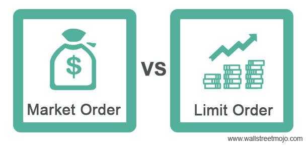

Trading in financial markets involves various types of orders, each with its own advantages and drawbacks. A fundamental understanding of these orders is vital for investors aiming to navigate the ever-evolving landscape of financial markets effectively. Market orders and limit orders are among the most commonly used order types by investors and traders. Each serves distinct purposes and comes with specific cost implications, affecting overall trading strategy and outcomes.

Market orders are designed to be executed immediately at the best available price. They are straightforward, emphasizing speed and execution certainty, making them a popular choice when it is critical to enter or exit a position promptly. However, the emphasis on speed can come with trade-offs, particularly in volatile markets where prices can fluctuate rapidly, leading to potential differences between expected and actual transaction prices.



Limit orders, on the other hand, allow traders to define the maximum or minimum price at which they are willing to buy or sell a security. This order type offers greater control over trade pricing but may result in non-execution if market prices fail to reach the designated levels. The complexity of these orders often entails higher fees compared to market orders, as they require more nuanced execution and monitoring by brokers.

Beyond these traditional order types, the rise of algorithmic trading has introduced automated strategies aimed at optimizing trade execution. These algorithms can enhance cost efficiency by dynamically responding to market conditions and adjusting order execution tactics accordingly. The integration of algorithmic trading signifies a shift towards more sophisticated trading methodologies, aiming to maximize market opportunities and minimize trading costs.

Understanding the differences between market and limit orders, along with their associated costs, is crucial for investors to make informed decisions. This article will examine these distinctions in detail and explore how algorithmic trading can further refine trading strategies, ensuring that investors are well-equipped to manage their portfolios effectively.

## Table of Contents

## Understanding Market Orders

Market orders are a fundamental component of trading in financial markets, offering a mechanism for executing trades swiftly at the prevailing market prices. The primary characteristic of a market order is its immediacy. Traders submitting market orders are seeking to buy or sell a security as quickly as possible, without specifying the price at which the transaction should occur. This focus on speed rather than price precision ensures that market orders are filled promptly, making them highly useful in fast-moving market conditions.

One advantage of market orders is their simplicity, often translating into lower transaction fees compared to more complex order types. Brokers favor market orders because they involve less administrative effort and lower risk of delayed execution. The straightforward execution of market orders requires minimal decision-making from the trading party, thus reducing brokerage costs.

Despite their simplicity, market orders come with a noteworthy caveat: the price of execution is not guaranteed. In volatile markets, where prices can fluctuate rapidly, the price at which a market order is completed might differ from the last quoted price. This discrepancy, known as slippage, represents the risk associated with market orders. Slippage can be especially pronounced for large orders or in markets with low [liquidity](/wiki/liquidity-risk-premium), where the demand and supply imbalance leads to significant price variations during the trade execution process.

To illustrate, consider a trader who places a market order to purchase shares of a stock quoted at $50. In a stable market, the trade may execute near this price. However, in a turbulent market, the execution price could be $50.10 or $49.90, depending on market activity at the time of order placement.

The mechanism behind market orders is designed to match buyers with sellers instantaneously, enabling trades to occur at the best available price dictated by current market conditions. This immediacy makes market orders a preferred choice for traders needing to quickly enter or [exit](/wiki/exit-strategy) positions, especially in situations where executing the trade takes precedence over the exact price achieved.

Overall, market orders are a valuable tool for traders prioritizing speed and execution certainty over price specificity, although they must remain cognizant of the potential for price slippage, particularly in volatile and illiquid markets.

## Delving into Limit Orders

Limit orders are a fundamental component of trading strategies utilized by investors who seek greater control over the pricing of their trades. Unlike market orders, which are executed immediately at the prevailing market price, limit orders allow traders to specify a price limit at which they are willing to buy or sell a security. This emphasis on price control is beneficial for investors who are willing to wait for the market to reach their target price, offering the potential advantage of improved trade execution outcomes.

Limit orders, however, come with the inherent risk of non-execution. This occurs when the market price does not reach the specified limit before the order's expiration or cancellation. For instance, a buy limit order will only be executed if the market price drops to or below the preset limit. Conversely, a sell limit order will be fulfilled if the market price rises to or above the limit set by the trader. This characteristic makes limit orders particularly appealing to traders during periods of market [volatility](/wiki/volatility-trading-strategies) or when trading illiquid securities, where price swings can be substantial.

The complexity of limit orders contributes to higher fees in comparison to market orders. The brokerage must monitor these orders continuously, and the precision required to execute them when the market reaches the specific price point involves more sophisticated and resource-intensive processes. Brokerages may charge higher commissions for handling limit orders due to these additional operational demands.

The execution mechanics of limit orders can be further understood with reference to an [order book](/wiki/order-book-trading-strategies), where buying and selling interests are recorded. Limit orders populate this order book, queued according to their price levels and the time they were placed. Higher-priced buy limit orders and lower-priced sell limit orders take priority as the market moves, but execution is contingent upon another trader taking the opposite side of the order at the desired price level.

In code, this scenario can be represented by monitoring market data and executing a trade when conditions meet the specified criteria. Here is a simple Python pseudocode example to illustrate placing a limit order using a loop to check market conditions:

```python
def place_limit_order(market_price, order_price, order_type, quantity):
    executed = False
    while not executed:
        current_price = get_market_price()  # Function to fetch the current market price
        if order_type == "buy" and current_price <= order_price:
            execute_buy_order(quantity)
            executed = True
        elif order_type == "sell" and current_price >= order_price:
            execute_sell_order(quantity)
            executed = True

def get_market_price():
    # Placeholder for actual market price retrieval
    pass

def execute_buy_order(quantity):
    print(f"Executed buy order for {quantity} units.")

def execute_sell_order(quantity):
    print(f"Executed sell order for {quantity} units.")
```

This script outlines a basic approach to implementing limit order execution logic, encapsulating the decision process of waiting until the market meets the predefined criteria set by the trader. By setting a limit price and frequently checking against the current market price, this code is illustrative of the operational mechanics that underpin limit order trading in financial markets.

## Comparing Trading Costs

Trading costs are an essential consideration for investors, particularly when comparing market and limit orders. The primary differences in costs associated with these order types stem from their inherent complexity and level of uncertainty in execution.

Market orders are designed to be executed immediately at the best available price. This priority on speed and certainty typically results in lower fees. Brokers often charge less for market orders due to their straightforward nature, which involves minimal interaction and no requirement for monitoring specific price points. The execution of market orders is guaranteed, which allows brokers to simplify the process and pass on these savings to the investor in the form of reduced fees.

On the other hand, limit orders enable traders to specify the price at which they are willing to buy or sell a security. While this provides more control over the transaction, it introduces additional complexity that can lead to higher fees. Limit orders require brokers to actively monitor market conditions to execute the trade only when the specified price is met, if at all. This added requirement for precision and vigilance translates into increased operational costs for the broker, which are often reflected in the form of higher transaction fees for the investor.

To illustrate this distinction more clearly, consider the potential fee structure in a hypothetical trading scenario. Suppose a brokerage charges a flat rate fee for market orders, such as $1 per trade, due to their simplicity, while imposing a percentage-based fee for limit orders, reflecting the additional resources and monitoring required. If a trader places a limit order with a 0.5% fee on a $10,000 trade, the cost would be $50, which is significantly higher than the $1 cost of a market order at the same trade value.

Investors need to weigh the cost implications of market and limit orders against their trading objectives. Market orders may be ideal for those prioritizing quick transaction execution and minimizing costs, while limit orders are suited for investors focusing on achieving specific price points, notwithstanding the higher associated fees. Understanding these cost structures allows investors to strategically choose the order type that aligns best with their financial goals and risk tolerance.

## Algorithmic Trading and Order Types

Algorithmic trading has revolutionized the financial markets by employing automated systems to execute market and limit orders. These systems use complex mathematical models and strategies to manage and place trades at optimal times. One of the core benefits of [algorithmic trading](/wiki/algorithmic-trading) is its ability to react to market conditions instantaneously, which can significantly reduce trading costs and improve price execution.

### Adapting Trading Tactics

Algos, or algorithms, are designed to adjust trading strategies based on predefined parameters and real-time data. This adaptability allows them to handle large volumes of data and execute trades at speeds unattainable by human traders. By doing so, they can effectively minimize market impact, reduce transaction costs, and improve the precision of trade execution. For instance, in volatile markets, algorithms can quickly recalibrate their strategies to respond to rapid price changes, ensuring trades are executed under the most favorable conditions available.

### Optimization of Trade Execution

One of the primary objectives of using advanced algorithms in trading is to optimize the execution process, thereby securing better fill prices even in challenging market environments characterized by wider spreads. Algorithms like the Volume Weighted Average Price (VWAP) and the Time Weighted Average Price (TWAP) are designed to achieve execution prices that are more favorable than average market prices over a given time frame. These algorithms break down large orders into smaller parts and execute them incrementally to minimize the impact on market prices, thus achieving a more advantageous overall price for the traded security.

In addition to execution algorithms, some traders employ market-making algorithms that aim to profit from bid-ask spreads. These algorithms continuously quote buy and sell prices and execute trades when market conditions align with their predefined profit targets.

### Example of Algorithmic Trading in Python

Here is a simplified Python example demonstrating how an algorithm might decide between executing a market or limit order based on market conditions:

```python
import random

def decide_order_type(current_price, target_price, volatility):
    """
    Simplified decision-making for order type based on market conditions.

    :param current_price: Current market price of the security
    :param target_price: Desired price for a limit order
    :param volatility: Current market volatility (0 to 1 scale)
    :return: Order type as a string
    """
    if volatility > 0.5:
        return "market order"
    elif current_price < target_price:
        return "limit order"
    else:
        return "market order"

# Example usage
current_price = 100
target_price = 105
volatility = random.uniform(0, 1)

order_type = decide_order_type(current_price, target_price, volatility)
print(f"Selected: {order_type}")
```

In conclusion, algorithmic trading leverages advanced algorithms to enhance the execution of market and limit orders, striving for cost efficiency and optimal price fills. By dynamically adjusting to market conditions, these automated systems play a pivotal role in the modern trading infrastructure, offering strategic advantages that manual trading cannot match.

## When to Use Market Orders vs. Limit Orders

Market orders and limit orders serve distinct purposes in trading, and their utility largely depends on the investor's objectives and market conditions. 

Market orders are designed for instant execution and are ideal for traders who prioritize speed over precision in pricing. When an investor places a market order, they accept the best available price at the time of execution, which means there's a higher likelihood of their order being filled promptly. This is particularly advantageous in rapidly moving markets where the immediacy of execution is crucial. For instance, if an investor is acting on breaking news that is expected to move the market swiftly, using a market order might ensure they can enter or exit a position before significant price changes occur. However, the trade-off is the potential for slippage, especially in volatile markets where prices can change rapidly between the time the order is placed and when it is executed.

On the other hand, limit orders provide greater control over the price at which a trade is executed. Traders can specify the exact price at which they are willing to buy or sell a security. This is advantageous for those who are concerned with price levels and are not in a rush to execute the trade. For example, an investor who believes a stock is overvalued might set a limit order to buy it at a lower price point they determine as fair value. However, it's important to recognize that limit orders do not guarantee execution. If the market does not reach the specified price, the order may not be filled, potentially resulting in the opportunity being missed.

The choice between market and limit orders should align with an investor's trading strategy and risk tolerance. Market orders are appropriate for those who value certainty of execution and are less sensitive to exact pricing. Conversely, limit orders suit individuals who have specific price targets and are prepared for the possibility of non-execution if the market does not align with their expectations. By understanding these nuances, investors can better plan their trades to align with their financial goals and market outlook.

## Conclusion

In financial markets, market and limit orders serve critical roles based on their inherent characteristics. Market orders offer speed and certainty of execution, making them optimal for trades where immediate transaction is crucial. However, they lack price precision, creating potential for unfavorable fill prices, especially in volatile markets. Conversely, limit orders provide greater control over the execution price, allowing traders to set specific targets for buying or selling. This precision comes at the cost of execution certainty, as orders may remain unfulfilled if the market does not meet the desired price thresholds.

Cost considerations are pivotal when evaluating these order types. Market orders generally incur lower fees, owing to their straightforward nature and guaranteed execution. In contrast, limit orders often come with higher costs due to the need for additional broker resources to manage execution precision. This distinction underscores the importance of aligning order choice with trading objectives and cost management strategies.

Algorithmic trading emerges as a sophisticated solution to maximize the utility of both market and limit orders. By using advanced algorithms, traders can automate order execution based on real-time data and market conditions, enhancing the likelihood of achieving favorable prices while potentially minimizing costs. The algorithms can dynamically adjust the timing and parameters of orders, making them particularly effective in markets with wide spreads or high volatility.

In conclusion, the strategic use of market and limit orders, coupled with algorithmic trading, can substantially improve trade efficiency and cost-effectiveness. Traders are encouraged to understand the distinct features and implications of each order type to optimize their trading strategies effectively. The integration of algorithmic trading systems provides an additional layer of adaptability and precision, thereby amplifying the potential benefits of carefully selected order strategies.

## References & Further Reading

[1]: Harris, L. (2003). ["Trading & Exchanges: Market Microstructure for Practitioners."](https://www.amazon.com/Trading-Exchanges-Market-Microstructure-Practitioners/dp/0195144708) Oxford University Press.

[2]: Biais, B., Glosten, L., & Spatt, C. (2005). ["Market Microstructure: A Survey of Microfoundations, Empirical Results, and Policy Implications."](https://www.sciencedirect.com/science/article/abs/pii/S1386418104000382) Journal of Financial Markets, 8(2), 217-264.

[3]: Aldridge, I. (2013). ["High-Frequency Trading: A Practical Guide to Algorithmic Strategies and Trading Systems."](https://www.wiley.com/en-us/High-Frequency+Trading%3A+A+Practical+Guide+to+Algorithmic+Strategies+and+Trading+Systems%2C+2nd+Edition-p-9781118343500) Wiley.

[4]: Hasbrouck, J. (2007). ["Empirical Market Microstructure: The Institutions, Economics, and Econometrics of Securities Trading."](https://academic.oup.com/book/52241) Oxford University Press.

[5]: Kissell, R. (2014). ["The Science of Algorithmic Trading and Portfolio Management."](https://www.sciencedirect.com/book/9780124016897/the-science-of-algorithmic-trading-and-portfolio-management) Academic Press.