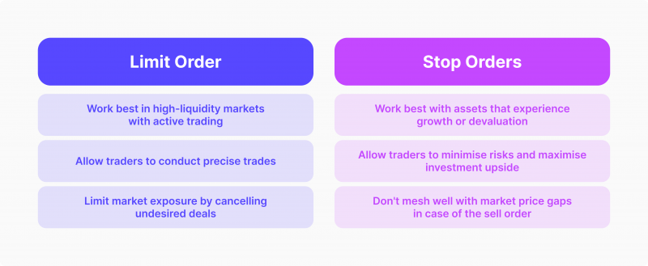

## Table of Contents

## What is a limit order?

A limit order is a type of order you can place with your broker to buy or sell a stock at a specific price or better. For example, if you want to buy a stock but only if the price drops to $50 or lower, you can set a limit order at $50. This way, your order will only be executed if the stock reaches or falls below that price.

Limit orders give you more control over the price at which you buy or sell a stock, which can be useful in managing your investment costs. However, there's a risk that your order might not be filled if the stock never reaches your specified price. This can be frustrating if the stock price gets very close to your limit but doesn't quite reach it, and then starts moving away again.

## What is a stop order?

A stop order, also known as a stop-loss order, is a type of order you can place with your broker to buy or sell a stock once it reaches a certain price, called the stop price. This is useful if you want to limit your loss or protect a profit on a stock you own. For example, if you own a stock currently trading at $100 and you want to sell it if it drops to $90, you can set a stop order at $90. Once the stock hits $90 or below, your stop order turns into a market order and gets executed at the next available price.

However, there's a risk with stop orders. The price at which your order gets filled might be different from your stop price, especially if the stock is moving quickly or if there's a big gap in trading prices. This is called slippage. So, if the stock suddenly drops from $95 to $85, your stop order at $90 might get filled at $85 or even lower. It's important to understand this risk when using stop orders.

## How does a limit order work?

A limit order is a way to tell your broker to buy or sell a stock at a specific price or better. For example, if you want to buy a stock but only if the price is $50 or less, you can set a limit order at $50. Your order will only happen if the stock price reaches $50 or goes lower. This helps you control the price you pay for the stock.

However, there's a chance your limit order might not happen at all. If the stock never gets to your price, your order won't be filled. This can be annoying if the stock price gets very close to your limit but doesn't quite reach it, and then starts moving away again. Limit orders are good for managing your costs, but you need to be okay with the possibility that your order might not go through.

## How does a stop order work?

A stop order is a way to tell your broker to buy or sell a stock when it reaches a certain price, called the stop price. For example, if you own a stock that's trading at $100 and you want to sell it if it drops to $90, you can set a stop order at $90. When the stock hits $90 or goes lower, your stop order turns into a market order and gets sold at the next available price. This helps you limit your loss or protect a profit on a stock you own.

But there's a risk with stop orders. The price you get when your order is filled might be different from your stop price. This can happen if the stock is moving quickly or if there's a big gap in trading prices. This is called slippage. For example, if the stock suddenly drops from $95 to $85, your stop order at $90 might get filled at $85 or even lower. So, it's good to know this risk when you use stop orders.

## What are the main differences between limit and stop orders?

Limit and stop orders are two different ways to buy or sell stocks, and they work in different ways. A limit order lets you set a specific price at which you want to buy or sell a stock. For example, if you want to buy a stock but only if it's $50 or less, you set a limit order at $50. Your order will only happen if the stock reaches that price or goes lower. This helps you control the price you pay, but there's a chance your order might not happen if the stock never gets to your price.

A stop order, on the other hand, is used to buy or sell a stock once it reaches a certain price, called the stop price. For example, if you own a stock at $100 and want to sell it if it drops to $90, you set a stop order at $90. When the stock hits $90 or goes lower, your stop order turns into a market order and gets sold at the next available price. This is useful for limiting losses or protecting profits, but there's a risk called slippage, where the price you get might be different from your stop price if the stock moves quickly.

The main difference is that a limit order gives you control over the exact price you want to trade at, while a stop order is more about protecting your investment by triggering a sale or purchase at a certain price point. Both are useful tools, but they serve different purposes and come with different risks.

## When should a beginner use a limit order?

A beginner should use a limit order when they want to buy or sell a stock at a specific price. For example, if you see a stock you like but it's too expensive right now, you can set a limit order to buy it if the price drops to a level you're comfortable with. This way, you don't have to watch the stock all the time. Your order will only happen if the stock reaches your price or goes lower, helping you control how much you spend.

Another good time for a beginner to use a limit order is when they want to sell a stock but only if it reaches a certain price. For instance, if you own a stock and it's going up, you might want to sell it if it hits a certain high price. By setting a limit order to sell at that price, you can make sure you get the price you want. Just remember, there's a chance your order might not happen if the stock never gets to your price. Limit orders are helpful for managing your costs, but you need to be okay with the possibility that your order might not go through.

## When should a beginner use a stop order?

A beginner should use a stop order when they want to limit their losses on a stock they own. For example, if you bought a stock at $100 and you don't want to lose more than $10, you can set a stop order at $90. This way, if the stock price drops to $90 or lower, your stop order will turn into a market order and sell the stock at the next available price. This helps you avoid losing too much money if the stock keeps going down.

Another good time to use a stop order is when you want to protect your profits. If you own a stock that's gone up to $120 from $100 and you want to keep some of those gains, you can set a stop order at $110. If the stock price falls to $110 or lower, your stop order will sell the stock, helping you lock in some profit. Just remember, there's a risk called slippage where the price you get might be different from your stop price if the stock moves quickly.

## Can you explain the potential risks associated with limit orders?

When you use a limit order, one big risk is that your order might not happen at all. If you set a limit order to buy a stock at $50, and the stock never gets to $50, your order won't go through. This can be frustrating if the stock price gets very close to your limit but doesn't quite reach it, and then starts moving away again. You might miss out on buying or selling the stock if it never hits your price.

Another risk is that you might miss out on a good opportunity. For example, if you want to buy a stock and set a limit order at $50, but the stock quickly drops to $50 and then goes back up to $55 before your order can be filled, you might miss the chance to buy at a lower price. You have to be okay with the possibility that your order might not happen, and that could mean missing out on a good deal or not selling when you wanted to.

## Can you explain the potential risks associated with stop orders?

One big risk with stop orders is called slippage. This happens when the price you get for your stock is different from the stop price you set. For example, if you set a stop order to sell at $90 but the stock suddenly drops from $95 to $85, your order might get filled at $85 or even lower. This can be a problem if you were trying to limit your losses or protect your profits, because you might end up selling at a worse price than you wanted.

Another risk is that your stop order might get triggered by a short-term drop in the stock price, and then the price might go back up. If you set a stop order at $90 and the stock briefly drops to $90 but then quickly goes back up to $100, you might sell your stock too soon and miss out on future gains. You have to be okay with the possibility that your stop order might happen at a bad time, and you could end up selling when you didn't really want to.

## How do market conditions affect the effectiveness of limit and stop orders?

Market conditions can really change how well limit and stop orders work. For limit orders, if the market is moving fast or there's a lot of trading, your order might get filled quickly if the stock hits your price. But if the market is slow or the stock doesn't move much, your limit order might not happen at all. Also, if there's a big gap in the stock price, like if it jumps from $50 to $60 without hitting $55, your limit order at $55 won't happen. So, the market's speed and how the stock moves can make a big difference in whether your limit order works out.

For stop orders, market conditions can affect them in a different way. If the market is calm and the stock price moves slowly, your stop order might work well because it can get filled at a price close to your stop price. But if the market is wild or the stock price changes a lot, you might face slippage. This means your stop order might get filled at a price way different from what you set. For example, if the market suddenly drops, your stop order at $90 might get filled at $85 or lower. So, the market's ups and downs can really change how well your stop order works and how much you might lose or gain.

## What advanced strategies involve using both limit and stop orders together?

One advanced strategy that uses both limit and stop orders together is called a "bracket order." This is when you set up three orders at once: a main order to buy or sell a stock at the current market price, a limit order to sell the stock at a higher price to lock in profit, and a stop order to sell the stock at a lower price to limit your loss. For example, if you buy a stock at $100, you might set a limit order to sell at $110 to make a profit, and a stop order to sell at $90 to cut your losses. This way, you can manage both your potential gains and losses automatically.

Another strategy is called "trailing stop." This involves using a stop order that moves with the stock price. You set a stop order at a certain percentage or dollar amount below the stock's highest price. As the stock price goes up, the stop order moves up too, but if the stock price drops, the stop order stays where it is. This can help you lock in profits as the stock price rises while still protecting against big losses. For example, if you set a trailing stop of 10% on a stock that's at $100, your stop order will move up to $110 if the stock reaches $120, but if the stock then drops to $108, your stop order will still be at $99, helping you keep some of the gains.

## How do professional traders optimize the use of limit and stop orders in volatile markets?

Professional traders use limit and stop orders smartly in volatile markets to manage their risks and make the most of price swings. In a volatile market, prices can change a lot and very quickly. So, traders might set their limit orders a bit further away from the current price to make sure they get filled. For example, if they want to buy a stock at $50 but it's moving a lot, they might set their limit order at $51 to catch the stock if it dips. They also keep an eye on the [order book](/wiki/order-book-trading-strategies) to see where other traders are placing their orders, which can help them decide the best price to set.

Stop orders are also important in volatile markets, but traders have to be careful about slippage. To avoid selling at a much worse price than they want, professional traders might use a trailing stop order. This kind of stop order moves up as the stock price goes up, but stays put if the price drops. This way, they can lock in profits as the stock rises but still protect against big losses if the market suddenly drops. They might also set their stop orders a bit wider to give the stock more room to move without getting triggered too soon. By using these strategies, professional traders can better handle the ups and downs of a volatile market.

## References & Further Reading

[1]: Bergstra, J., Bardenet, R., Bengio, Y., & Kégl, B. (2011). ["Algorithms for Hyper-Parameter Optimization."](https://dl.acm.org/doi/10.5555/2986459.2986743) Advances in Neural Information Processing Systems 24.

[2]: ["Advances in Financial Machine Learning"](https://www.amazon.com/Advances-Financial-Machine-Learning-Marcos/dp/1119482089) by Marcos Lopez de Prado

[3]: ["Evidence-Based Technical Analysis: Applying the Scientific Method and Statistical Inference to Trading Signals"](https://www.amazon.com/Evidence-Based-Technical-Analysis-Scientific-Statistical/dp/0470008741) by David Aronson

[4]: ["Machine Learning for Algorithmic Trading"](https://github.com/PacktPublishing/Machine-Learning-for-Algorithmic-Trading-Second-Edition) by Stefan Jansen

[5]: ["Quantitative Trading: How to Build Your Own Algorithmic Trading Business"](https://books.google.com/books/about/Quantitative_Trading.html?id=j70yEAAAQBAJ) by Ernest P. Chan