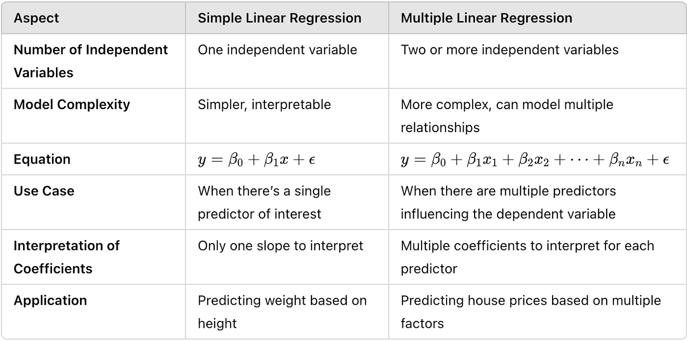

## Table of Contents

## What is linear regression?

Linear regression is a way to find the relationship between two things by drawing a straight line through a bunch of data points. Imagine you have a bunch of dots on a piece of paper, and you want to draw a line that comes as close as possible to all of them. This line helps you predict one thing based on another. For example, you could use it to guess how much a house might cost based on its size.

To do linear regression, you need to find the best line that minimizes the distance from the line to all the points. This is usually done with math and computers, which can quickly figure out the best line. Once you have this line, you can use it to make predictions. If you know the size of a new house, you can use the line to estimate its price. Linear regression is simple but very useful in many fields like economics, medicine, and social sciences.

## What is multiple regression?

Multiple regression is like linear regression but fancier. Instead of just using one thing to predict another, multiple regression lets you use several things at once. Imagine you want to guess the price of a house. With linear regression, you might just use the size of the house. But with multiple regression, you can use the size, the number of bedrooms, and even the age of the house all at the same time to make a better guess.

To do multiple regression, you still draw a line, but now it's in a space with more dimensions. If you're using two things to predict, it's like drawing a plane instead of a line. If you're using three things, it's like drawing a hyperplane. Computers do the hard work of figuring out where to put this line or plane so it's as close as possible to all the data points. This way, multiple regression can give you a more accurate prediction because it takes into account more information.

## How does linear regression differ from multiple regression?

Linear regression and multiple regression are both ways to predict things using data, but they use different approaches. Linear regression is simpler and uses just one thing to predict another. For example, if you want to guess how much a house costs, linear regression might look only at the size of the house. It draws a straight line through a bunch of data points to find the best way to make that guess. This line helps you predict the house price based on its size.

Multiple regression, on the other hand, is more complex because it uses more than one thing to make predictions. Using the house price example again, multiple regression could look at the size of the house, the number of bedrooms, and even how old the house is all at once. Instead of drawing a line, multiple regression might draw a plane or a hyperplane in a space with more dimensions. This allows for more accurate predictions because it takes into account more information about the house.

In short, linear regression is like using one piece of a puzzle to guess the whole picture, while multiple regression is like using several pieces to get a clearer view. Both methods help you make predictions, but multiple regression can give you a better guess by considering more factors.

## What are the basic assumptions of linear regression?

Linear regression makes some guesses about the data to work well. One big guess is that the relationship between the things you're looking at is a straight line. This means if you draw a line through your data points, the line should fit pretty well. Another guess is that the mistakes you make when you guess one thing based on another are spread out evenly. Imagine you're trying to guess the price of a house based on its size. The difference between your guess and the real price should be random and not follow any pattern.

Another important guess is that the things you're using to predict should not be too closely related to each other. If they are, it can mess up your guesses. Also, the data you're using should be a good sample of what you're trying to predict. If you're guessing house prices, your data should include a good mix of different types of houses. Finally, linear regression assumes that the mistakes you make are normally spread out, like a bell curve. This helps make sure your guesses are as good as they can be.

## What additional assumptions are required for multiple regression?

Multiple regression builds on the assumptions of linear regression but adds a few more because it uses more than one thing to predict something. Like linear regression, multiple regression assumes that the relationship between the things you're looking at and what you're trying to predict is linear. This means if you were to draw a line, or a plane in more dimensions, through your data points, it should fit pretty well. It also assumes that the mistakes you make when guessing are spread out evenly and randomly, and that these mistakes follow a normal bell-shaped curve.

One big new assumption for multiple regression is that the things you're using to predict, called predictors, should not be too closely related to each other. If they are, it can mess up your predictions. This is called multicollinearity, and it's a bit like trying to guess something using two pieces of information that basically say the same thing. Another assumption is that the predictors should not be perfectly predictable from each other. If they are, it can make your model less reliable.

In summary, multiple regression needs all the basic assumptions of linear regression, like a linear relationship, evenly spread errors, and normally distributed errors. On top of that, it adds the need for the predictors to be independent of each other, avoiding multicollinearity, to make sure your predictions are as accurate as possible.

## How do you interpret the coefficients in a linear regression model?

In a linear regression model, the coefficients tell you how much the thing you're trying to predict changes when one of the things you're using to predict changes. Imagine you're trying to guess the price of a house based on its size. The coefficient for size would tell you how much the price goes up for every extra square foot. If the coefficient is 100, it means the price goes up by $100 for each additional square foot. This helps you understand how important each thing you're using to predict is in affecting the thing you're trying to guess.

The intercept in the model is also a coefficient, but it's a bit different. It's the starting point, or what you'd guess if all the things you're using to predict were zero. Using the house price example again, the intercept would be the price you'd guess for a house with zero square feet, which doesn't make much sense in real life but is important for the math. Together, the intercept and the other coefficients help you draw the best line through your data points to make your predictions as accurate as possible.

## How do you interpret the coefficients in a multiple regression model?

In a multiple regression model, the coefficients tell you how much the thing you're trying to predict changes when one of the things you're using to predict changes, while keeping all the other things the same. For example, if you're trying to guess the price of a house based on its size, the number of bedrooms, and its age, the coefficient for size would tell you how much the price goes up for every extra square foot, assuming the number of bedrooms and the age stay the same. If the coefficient for size is 100, it means the price goes up by $100 for each additional square foot, no matter what the other factors are doing.

The coefficients in a multiple regression model also help you understand how important each thing you're using to predict is compared to the others. If the coefficient for the number of bedrooms is 5000, it means the price goes up by $5000 for each extra bedroom, again assuming size and age stay the same. This lets you see which factors have a bigger impact on the price. The intercept in the model is the starting point, or what you'd guess if all the things you're using to predict were zero. While this might not make sense in real life, like guessing the price of a house with zero square feet, zero bedrooms, and zero age, it's important for the math to work out the best way to make your predictions.

## What are the common methods for assessing the fit of a linear regression model?

One common way to check how well a linear regression model fits the data is by looking at the R-squared value. R-squared tells you how much of the change in the thing you're trying to predict can be explained by the thing you're using to predict it. Imagine you're trying to guess the price of a house based on its size. If the R-squared is close to 1, it means the size of the house explains a lot of the price changes. If it's close to 0, it means the size doesn't explain much, and other things might be more important. R-squared is a simple way to see if your model is doing a good job.

Another way to assess the fit of a linear regression model is by looking at the residuals, which are the differences between the actual values and the values your model predicts. If your model fits well, these residuals should be spread out evenly and randomly, not following any pattern. If you see a pattern, like the residuals getting bigger as the thing you're predicting gets bigger, it means your model might not be the best fit. You can also use other tests, like the F-test, to see if your model as a whole is a good fit for the data. These methods help you make sure your model is as accurate as possible.

## What are the advanced techniques for evaluating multiple regression models?

One advanced way to check how well a multiple regression model fits the data is by using cross-validation. Imagine you're trying to guess the price of a house based on its size, number of bedrooms, and age. Cross-validation works by splitting your data into different parts, using some parts to build the model and the rest to test it. You do this many times, switching which parts you use for building and testing. This helps you see if your model works well not just on the data you used to build it, but also on new data. It's like making sure your guess about house prices works for different neighborhoods, not just the one you started with.

Another technique is looking at the Variance Inflation Factor (VIF) to check for multicollinearity. Multicollinearity happens when the things you're using to predict, like size and number of bedrooms, are too closely related to each other. This can mess up your model. VIF helps you see if this is a problem. If the VIF for a predictor is high, it means that predictor is too similar to the others, and you might need to change your model. Also, you can use advanced tests like the Breusch-Pagan test to check if the mistakes your model makes are spread out evenly. If they're not, you might need to adjust your model to make it more accurate.

## How can multicollinearity affect multiple regression results?

Multicollinearity in multiple regression happens when the things you're using to predict, called predictors, are too similar to each other. Imagine you're trying to guess the price of a house based on its size and the number of bedrooms. If bigger houses usually have more bedrooms, these two things are closely related. When this happens, it can make it hard for the model to figure out which one is really affecting the price. The model might give you strange results, like saying the size of the house doesn't matter much, even though it does. This can make your guesses about house prices less accurate.

To fix multicollinearity, you might need to change your model. One way is to remove one of the predictors that are too similar. In the house price example, you could just use the size of the house and not the number of bedrooms. Another way is to combine the similar predictors into one new predictor. For example, you could create a new thing called "house space" that includes both size and number of bedrooms. By doing this, you can make your model work better and give you more accurate guesses about house prices.

## What are some strategies for dealing with multicollinearity in multiple regression?

Multicollinearity happens when the things you use to predict something are too similar to each other. Imagine you're trying to guess the price of a house using its size and the number of bedrooms. If bigger houses usually have more bedrooms, these two things are closely related. When this happens, it can mess up your model. It might make it hard to figure out which thing really affects the price, leading to strange results like saying the size of the house doesn't matter much, even though it does. This can make your guesses about house prices less accurate.

To deal with multicollinearity, you can try a few things. One way is to remove one of the predictors that are too similar. In the house price example, you could just use the size of the house and not the number of bedrooms. Another way is to combine the similar predictors into one new predictor. For example, you could create a new thing called "house space" that includes both size and number of bedrooms. By doing this, you can make your model work better and give you more accurate guesses about house prices.

## How do you choose between linear and multiple regression for a given dataset?

When you need to decide between linear and multiple regression, think about how many things you want to use to predict something. Linear regression is simpler and uses just one thing to make a guess. For example, if you're trying to guess the price of a house, linear regression might look only at the size of the house. It's good when you think one thing is the main reason for what you're trying to predict. If you have a small amount of data or if you want a simple model that's easy to understand, linear regression might be the best choice.

On the other hand, multiple regression is more complex because it uses more than one thing to make predictions. Using the house price example again, multiple regression could look at the size of the house, the number of bedrooms, and even how old the house is all at once. This can give you a more accurate guess because it takes into account more information. If you have a lot of data and you think several things together affect what you're trying to predict, multiple regression is a better fit. It's like using several pieces of a puzzle to get a clearer picture, but it can be harder to understand and explain.

## What is Exploring Multiple Regression?

Multiple regression analysis is an extension of linear regression that incorporates multiple independent variables to predict the value of a single dependent variable. This statistical technique is beneficial in the financial sector, where assets' prices and performances are influenced by numerous, variable factors. For instance, a stock's performance might be simultaneously affected by its price-to-earnings (P/E) ratio, dividend yield, and broader economic indicators like inflation rates. 

The multiple regression model is generally expressed in the form:

$$
Y = \beta_0 + \beta_1X_1 + \beta_2X_2 + \ldots + \beta_nX_n + \epsilon
$$

Where:
- $Y$ is the dependent variable (e.g., stock price).
- $X_1, X_2, \ldots, X_n$ are the independent variables (e.g., P/E ratio, dividends, inflation).
- $\beta_0$ is the intercept.
- $\beta_1, \beta_2, \ldots, \beta_n$ are the coefficients that represent the contribution of each independent variable to the dependent variable.
- $\epsilon$ is the error term, representing the model's deviation from actual values.

In [algorithmic trading](/wiki/algorithmic-trading), multiple regression is instrumental in constructing intricate models that account for the simultaneous impacts of several market conditions. These models guide traders in making more nuanced and informed trading decisions. By leveraging multiple regression, trading algorithms can continuously adjust and predict asset prices based on real-time data streams from various financial indicators, enabling strategies that are adaptable and responsive to market changes.

For practical implementation, Python offers robust libraries such as `statsmodels` and `scikit-learn` that facilitate multiple regression analysis. Here's a brief example using Python and `statsmodels` to perform a multiple regression:

```python
import statsmodels.api as sm
import pandas as pd

# Sample data
data = {
    'P/E Ratio': [15, 18, 21, 20, 25],
    'Dividends': [2, 2.5, 3, 3.5, 4],
    'Inflation': [1.5, 2, 2.5, 3, 3.5],
    'Stock Price': [100, 110, 115, 120, 130]
}

df = pd.DataFrame(data)

# Define independent variables and add constant for intercept
X = df[['P/E Ratio', 'Dividends', 'Inflation']]
X = sm.add_constant(X)

# Define the dependent variable
Y = df['Stock Price']

# Fit the multiple regression model
model = sm.OLS(Y, X).fit()

# Print model summary
print(model.summary())
```

This code snippet demonstrates how to use multiple regression to evaluate the contributions of various financial metrics to a stock's price, potentially refining trading strategies. By continuously integrating new data and adjusting weighted coefficients, multiple regression models in algorithmic trading provide a dynamic approach to forecasting market movements, thus maximizing trading efficacy.

## How can we build a trading system using regression, as explored in a case study?

Consider a scenario where a trader aims to develop a trading system to predict and trade a specific stock's price based on historical price and [volume](/wiki/volume-trading-strategy) data. The initial step involves utilizing simple linear regression to model the relationship between past trading volume and future price movements. This approach allows the trader to forecast prices by fitting a line to the historical data, where price is the dependent variable $y$, and volume is the independent variable $x$. The regression equation can be expressed as:

$$
y = mx + c
$$

Where $m$ is the slope coefficient that denotes the change in price per unit change in volume, and $c$ is the y-intercept representing the stock price when the volume is zero.

To implement this model, the trader first needs to collect a significant amount of historical price and volume data. Python, with libraries like Pandas for data manipulation and Scikit-learn for regression analysis, can efficiently handle this task. Below is a sample implementation in Python:

```python
import pandas as pd
from sklearn.linear_model import LinearRegression
import matplotlib.pyplot as plt

# Load historical data into a DataFrame
data = pd.read_csv('historical_stock_data.csv')

# Select features and target variable
X = data[['Volume']].values  # Independent variable
y = data['ClosePrice'].values  # Dependent variable

# Initialize and fit the linear regression model
model = LinearRegression()
model.fit(X, y)

# Predict future prices
predicted_prices = model.predict(X)

# Plot the results
plt.scatter(X, y, color='blue', label='Actual Prices')
plt.plot(X, predicted_prices, color='red', label='Predicted Prices')
plt.xlabel('Volume')
plt.ylabel('Price')
plt.title('Price Prediction using Linear Regression')
plt.legend()
plt.show()
```

If there are multiple variables influencing the stock price, such as economic indicators or sector performance, multiple regression can enhance the model's predictive accuracy. This approach involves extending the simple linear regression model to include multiple independent variables:

$$
y = b_0 + b_1x_1 + b_2x_2 + \ldots + b_nx_n
$$

Where $b_0$ is the y-intercept, and $b_1, b_2, \ldots, b_n$ are the coefficients indicating the effect of each independent variable $x_1, x_2, \ldots, x_n$ on the stock price $y$.

The trader then proceeds to construct a comprehensive regression-based trading system by iterating through several steps. This includes refining the model through adequate feature selection to avoid overfitting, which can be achieved using techniques like cross-validation. After model creation, rigorous back-testing on historical data is crucial to evaluate the model's performance and predictive power. This process involves simulating the trading strategy on past data and adjusting parameters to optimize results.

Finally, the system is monitored in a live trading environment, where continuous model updates are necessary to adapt to market changes. This dynamic approach ensures the trading system remains robust and responsive, aligning with the ever-changing financial landscape and ultimately aiding the trader in making informed and strategic decisions.

## References & Further Reading

[1]: ["Regression Analysis for the Financial Markets"](https://www.investopedia.com/articles/financial-theory/09/regression-analysis-basics-business.asp) by Martin Clements. IPE.

[2]: ["Advances in Financial Machine Learning"](https://www.amazon.com/Advances-Financial-Machine-Learning-Marcos/dp/1119482089) by Marcos Lopez de Prado.

[3]: ["Machine Learning for Algorithmic Trading"](https://github.com/PacktPublishing/Machine-Learning-for-Algorithmic-Trading-Second-Edition) by Stefan Jansen.

[4]: ["Python for Finance: Mastering Data-Driven Finance"](https://books.google.com/books/about/Python_for_Finance.html?id=2qd9DwAAQBAJ) by Yves Hilpisch.

[5]: ["Quantitative Trading: How to Build Your Own Algorithmic Trading Business"](https://books.google.com/books/about/Quantitative_Trading.html?id=j70yEAAAQBAJ) by Ernest P. Chan.

[6]: ["Practical Numerical Methods for Financial Markets"](https://link.springer.com/book/10.1007/978-1-84628-737-4) by Rüdiger U. Seydel.