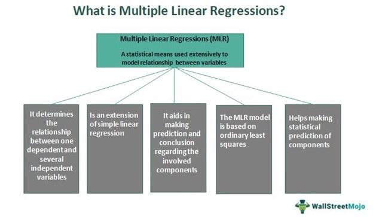

In the ever-evolving world of finance and trading, statistical methods such as multiple regression and linear regression have become integral in facilitating data-driven decisions. These methodologies provide valuable insights into the relationships between various financial indicators and significantly enhance the strategies used in algorithmic trading. 

Algorithmic trading, commonly known as algo trading, relies extensively on statistical models to forecast market movements and execute trades automatically. By utilizing regression techniques, traders can craft robust trading systems that harness data more effectively. This allows for improved strategy development, minimizing of human biases, and the potential for increased returns. 



In this article, we focus on the application of linear and multiple regression in the context of algorithmic trading. We will outline the fundamentals of these regression models, discuss the differences between them, and examine how they can be utilized to strengthen trading systems. 

Understanding these statistical methods can offer a significant advantage for both seasoned traders and newcomers to financial markets. By integrating these techniques into their investment approach, traders can refine their decision-making processes and enhance their ability to capitalize on market opportunities. Whether through the simplicity of linear regression or the complexity of multiple regression, these methods serve as a powerful foundation for developing effective automated trading systems.

## Table of Contents

## Understanding Linear Regression

Linear regression, commonly referred to as simple regression, is a fundamental statistical method for modeling the relationship between two variables. It works by fitting a linear equation to observed data, allowing us to interpret how changes in one variable are associated with changes in another. This technique is particularly valuable in finance, where analysts aim to understand the impact of different factors on an asset's price or other financial metrics. For example, exploring the relationship between a stock's price and its trading volume provides insights into market dynamics and helps inform trading decisions.

The core of linear regression is its equation, represented as $y = mx + c$, where $y$ is the dependent variable or the response, $x$ is the independent variable or the predictor, $m$ represents the slope of the line, indicating the rate of change of the dependent variable with respect to the independent variable, and $c$ is the y-intercept, representing the value of $y$ when $x = 0$.

To implement linear regression in financial trading, one can use historical data to identify trends and produce forecasts of future price movements. This approach provides a structured and quantitative basis for predicting market trends, offering traders a simple yet powerful tool for developing and refining trading strategies. In practice, applying linear regression to trading involves collecting relevant financial data, applying the regression model, and using the resulting predictions to guide investment actions.

A basic Python implementation of linear regression for financial data might look like this:

```python
import numpy as np
import pandas as pd
from sklearn.linear_model import LinearRegression
import matplotlib.pyplot as plt

# Example data: Load stock prices and volumes
data = pd.read_csv('historical_stock_data.csv')
stock_prices = data['price'].values.reshape(-1, 1)  # Reshape for sklearn
trading_volumes = data['volume'].values

# Create and fit the model
model = LinearRegression()
model.fit(trading_volumes.reshape(-1, 1), stock_prices)

# Predict stock prices based on trading volumes
predictions = model.predict(trading_volumes.reshape(-1, 1))

# Plot the results
plt.scatter(trading_volumes, stock_prices, color='blue', label='Actual Prices')
plt.plot(trading_volumes, predictions, color='red', label='Predicted Prices')
plt.xlabel('Trading Volume')
plt.ylabel('Stock Price')
plt.title('Linear Regression on Stock Prices')
plt.legend()
plt.show()
```

In this example, stock prices and trading volumes are loaded from a CSV file, and linear regression is applied to model the relationship between these two variables. The resulting model can then be used to predict future stock prices based on new trading [volume](/wiki/volume-trading-strategy) data.

By harnessing linear regression techniques, traders can develop systematic trading strategies that leverage historical data to make informed predictions about market movements, thereby enhancing their decision-making capabilities and potentially improving their trading performance.

## Exploring Multiple Regression

Multiple regression analysis is an extension of linear regression that incorporates multiple independent variables to predict the value of a single dependent variable. This statistical technique is beneficial in the financial sector, where assets' prices and performances are influenced by numerous, variable factors. For instance, a stock's performance might be simultaneously affected by its price-to-earnings (P/E) ratio, dividend yield, and broader economic indicators like inflation rates. 

The multiple regression model is generally expressed in the form:

$$
Y = \beta_0 + \beta_1X_1 + \beta_2X_2 + \ldots + \beta_nX_n + \epsilon
$$

Where:
- $Y$ is the dependent variable (e.g., stock price).
- $X_1, X_2, \ldots, X_n$ are the independent variables (e.g., P/E ratio, dividends, inflation).
- $\beta_0$ is the intercept.
- $\beta_1, \beta_2, \ldots, \beta_n$ are the coefficients that represent the contribution of each independent variable to the dependent variable.
- $\epsilon$ is the error term, representing the model's deviation from actual values.

In [algorithmic trading](/wiki/algorithmic-trading), multiple regression is instrumental in constructing intricate models that account for the simultaneous impacts of several market conditions. These models guide traders in making more nuanced and informed trading decisions. By leveraging multiple regression, trading algorithms can continuously adjust and predict asset prices based on real-time data streams from various financial indicators, enabling strategies that are adaptable and responsive to market changes.

For practical implementation, Python offers robust libraries such as `statsmodels` and `scikit-learn` that facilitate multiple regression analysis. Here's a brief example using Python and `statsmodels` to perform a multiple regression:

```python
import statsmodels.api as sm
import pandas as pd

# Sample data
data = {
    'P/E Ratio': [15, 18, 21, 20, 25],
    'Dividends': [2, 2.5, 3, 3.5, 4],
    'Inflation': [1.5, 2, 2.5, 3, 3.5],
    'Stock Price': [100, 110, 115, 120, 130]
}

df = pd.DataFrame(data)

# Define independent variables and add constant for intercept
X = df[['P/E Ratio', 'Dividends', 'Inflation']]
X = sm.add_constant(X)

# Define the dependent variable
Y = df['Stock Price']

# Fit the multiple regression model
model = sm.OLS(Y, X).fit()

# Print model summary
print(model.summary())
```

This code snippet demonstrates how to use multiple regression to evaluate the contributions of various financial metrics to a stock's price, potentially refining trading strategies. By continuously integrating new data and adjusting weighted coefficients, multiple regression models in algorithmic trading provide a dynamic approach to forecasting market movements, thus maximizing trading efficacy.

## Application of Regression in Algorithmic Trading

Algorithmic trading, commonly referred to as algo trading, significantly relies on statistical models to automate trade execution based on predefined criteria. At the core of these strategies lies regression analysis, which facilitates the prediction of price movements and optimization of trade decisions.

A powerful aspect of using regression in algorithmic trading is the ability to design systems that can predict price changes accurately and efficiently manage trade entries and exits. One technique employed is rolling regression, which continually updates regression models with the latest market data to adjust predicted price targets dynamically. This approach ensures that trading algorithms remain responsive to the ever-changing market conditions, enabling traders to make timely decisions.

Regression models not only provide the framework for prediction but also play a critical role in minimizing emotional biases that can influence human traders. By automating decision-making processes, these models ensure a level of consistency and efficiency that is often unattainable through manual trading. For instance, by setting specific regression-based rules, a trader can remove subjective judgments and adhere strictly to data-driven predictions.

Moreover, incorporating real-time data into regression models significantly enhances the adaptability of trading algorithms. This capacity for swift adjustment to market fluctuations provides algo traders with a competitive edge over traditional methods, which may not respond as quickly to new information. By integrating techniques such as multivariate regression, traders can account for various factors simultaneously, creating more comprehensive models that capture the complexities of financial markets.

In a Python-based trading environment, such adaptability can be implemented using libraries like `pandas` for data manipulation, and `statsmodels` or `scikit-learn` for building and updating regression models. For example, a simple rolling regression might be implemented as follows:

```python
import pandas as pd
import statsmodels.api as sm

# Assuming 'df' is a DataFrame containing 'price' and 'volume' columns with historical data
window_size = 60  # Size of the rolling window

# Function to perform rolling regression
def rolling_regression(df, window_size):
    results = []
    for start in range(len(df) - window_size + 1):
        window = df.iloc[start:start + window_size]
        y = window['price']
        X = sm.add_constant(window['volume'])
        model = sm.OLS(y, X).fit()
        results.append(model.params['volume'])
    return results

df['regression_coefficient'] = pd.Series(rolling_regression(df, window_size), index=df.index[window_size - 1:])
```

In this example, a rolling window approach recalibrates a simple linear regression model to predict price changes based on trading volume. By continuously updating the regression coefficients, traders can maintain a model that reflects the latest market dynamics, thereby optimizing trade execution across varying conditions.

In conclusion, regression analysis stands as a fundamental element in the development of algorithmic trading systems. By leveraging sophisticated models and real-time data, traders can enhance their decision-making processes, reduce emotional biases, and gain a significant advantage in financial markets.

## Case Study: Building a Trading System with Regression

Consider a scenario where a trader aims to develop a trading system to predict and trade a specific stock's price based on historical price and volume data. The initial step involves utilizing simple linear regression to model the relationship between past trading volume and future price movements. This approach allows the trader to forecast prices by fitting a line to the historical data, where price is the dependent variable $y$, and volume is the independent variable $x$. The regression equation can be expressed as:

$$
y = mx + c
$$

Where $m$ is the slope coefficient that denotes the change in price per unit change in volume, and $c$ is the y-intercept representing the stock price when the volume is zero.

To implement this model, the trader first needs to collect a significant amount of historical price and volume data. Python, with libraries like Pandas for data manipulation and Scikit-learn for regression analysis, can efficiently handle this task. Below is a sample implementation in Python:

```python
import pandas as pd
from sklearn.linear_model import LinearRegression
import matplotlib.pyplot as plt

# Load historical data into a DataFrame
data = pd.read_csv('historical_stock_data.csv')

# Select features and target variable
X = data[['Volume']].values  # Independent variable
y = data['ClosePrice'].values  # Dependent variable

# Initialize and fit the linear regression model
model = LinearRegression()
model.fit(X, y)

# Predict future prices
predicted_prices = model.predict(X)

# Plot the results
plt.scatter(X, y, color='blue', label='Actual Prices')
plt.plot(X, predicted_prices, color='red', label='Predicted Prices')
plt.xlabel('Volume')
plt.ylabel('Price')
plt.title('Price Prediction using Linear Regression')
plt.legend()
plt.show()
```

If there are multiple variables influencing the stock price, such as economic indicators or sector performance, multiple regression can enhance the model's predictive accuracy. This approach involves extending the simple linear regression model to include multiple independent variables:

$$
y = b_0 + b_1x_1 + b_2x_2 + \ldots + b_nx_n
$$

Where $b_0$ is the y-intercept, and $b_1, b_2, \ldots, b_n$ are the coefficients indicating the effect of each independent variable $x_1, x_2, \ldots, x_n$ on the stock price $y$.

The trader then proceeds to construct a comprehensive regression-based trading system by iterating through several steps. This includes refining the model through adequate feature selection to avoid overfitting, which can be achieved using techniques like cross-validation. After model creation, rigorous back-testing on historical data is crucial to evaluate the model's performance and predictive power. This process involves simulating the trading strategy on past data and adjusting parameters to optimize results.

Finally, the system is monitored in a live trading environment, where continuous model updates are necessary to adapt to market changes. This dynamic approach ensures the trading system remains robust and responsive, aligning with the ever-changing financial landscape and ultimately aiding the trader in making informed and strategic decisions.

## Challenges and Considerations

Regression analysis, while powerful, presents several challenges that traders must consider to ensure effective application in algorithmic trading. One primary concern is the quality of data. Financial markets are influenced by a myriad of factors and capturing accurate, clean, and relevant data is crucial. Inadequate data quality can lead to unreliable models and poor trading decisions.

Overfitting is another critical issue where models become excessively complex, fitting the noise in historical data rather than the actual signal. This occurs when the model has too many parameters or variables relative to the amount of data available, leading to high variance and low bias. While the model may perform exceptionally well on historical datasets, it often fails to generalize to new, unseen data. To mitigate overfitting, techniques such as cross-validation, regularization (like LASSO or Ridge), and feature selection can be employed.

Back-testing and validation are vital steps in ensuring that regression models are robust and capable of predicting future market movements. Back-testing involves applying the model to historical data to assess its performance, while validation refers to testing the model on a separate dataset to evaluate its generalization ability. The aim is to confirm that the model's predictions are not merely a result of fitting past data but can be relied upon for future decision-making.

Here's a simple example in Python to illustrate the back-testing process using linear regression:

```python
import pandas as pd
from sklearn.model_selection import train_test_split
from sklearn.linear_model import LinearRegression
from sklearn.metrics import mean_squared_error

# Assume 'data' is a pandas DataFrame containing historical financial data
data = pd.read_csv('historical_data.csv')  # Load your historical data file

# Split data into features (X) and target (y)
X = data[['feature1', 'feature2', 'feature3']]  # Substitute with actual feature names
y = data['target']  # Substitute with the actual target variable name

# Split data into training and validation sets
X_train, X_valid, y_train, y_valid = train_test_split(X, y, test_size=0.2, random_state=42)

# Initialize and fit the linear regression model
model = LinearRegression()
model.fit(X_train, y_train)

# Predict and evaluate on the validation set
predictions = model.predict(X_valid)
mse = mean_squared_error(y_valid, predictions)
print(f"Validation Mean Squared Error: {mse}")

```

Continuous monitoring and updating of regression models are essential as financial markets are dynamic and ever-changing. This requires not only frequent retraining of models with new data but also an openness to reassessing model assumptions and structures in response to shifts in market conditions. Regular updates help maintain the relevance and accuracy of the trading strategy, allowing traders to adapt to evolving market landscapes effectively.

In summary, while regression models offer significant advantages in algorithmic trading, careful consideration of data quality, model complexity, and ongoing validation processes are necessary to leverage their full potential. By addressing these challenges, traders can enhance model reliability and trading performance.

## Conclusion

Linear and multiple regression methodologies are invaluable tools for algorithmic traders, offering a statistical foundation essential for developing robust trading strategies. By leveraging these techniques, traders are empowered to make data-driven decisions, resulting in enhanced market insights and the development of more effective automated trading systems. These regression models facilitate the understanding of complex market dynamics by quantifying the relationship between various financial variables, thus enabling traders to predict market movements with greater accuracy.

Despite the significant advantages, deploying regression models demands careful consideration of several challenges. One primary concern is the risk of overfitting, where models may fit historical data too closely and fail to generalize to future market conditions. Ensuring the reliability of these models necessitates rigorous back-testing and validation, allowing traders to verify predictive capabilities before implementing them live. This process helps to mitigate potential financial losses that can result from overreliance on inadequately tested models.

To maintain trading efficacy, it is critical that traders continuously monitor and update their models, accommodating ever-changing market conditions. This adaptability ensures that trading strategies remain relevant and competitive in the fast-paced financial landscape. Ongoing advancements in statistical methodologies, such as improvements in computational algorithms and data processing, provide traders with new tools and techniques to refine their models further.

As financial markets evolve with technological advancements and data proliferation, staying informed about new developments in statistical analysis becomes increasingly crucial. Traders who remain knowledgeable about these advances can harness them to gain a competitive edge, continually improving their ability to forecast market trends and execute successful trades. By mastering the intricacies of linear and multiple regression techniques, traders can fortify their strategies and optimize their trading outcomes in the complex world of finance.

## References & Further Reading

[1]: ["Regression Analysis for the Financial Markets"](https://www.investopedia.com/articles/financial-theory/09/regression-analysis-basics-business.asp) by Martin Clements. IPE.

[2]: ["Advances in Financial Machine Learning"](https://www.amazon.com/Advances-Financial-Machine-Learning-Marcos/dp/1119482089) by Marcos Lopez de Prado.

[3]: ["Machine Learning for Algorithmic Trading"](https://github.com/PacktPublishing/Machine-Learning-for-Algorithmic-Trading-Second-Edition) by Stefan Jansen.

[4]: ["Python for Finance: Mastering Data-Driven Finance"](https://books.google.com/books/about/Python_for_Finance.html?id=2qd9DwAAQBAJ) by Yves Hilpisch.

[5]: ["Quantitative Trading: How to Build Your Own Algorithmic Trading Business"](https://books.google.com/books/about/Quantitative_Trading.html?id=j70yEAAAQBAJ) by Ernest P. Chan.

[6]: ["Practical Numerical Methods for Financial Markets"](https://link.springer.com/book/10.1007/978-1-84628-737-4) by Rüdiger U. Seydel.