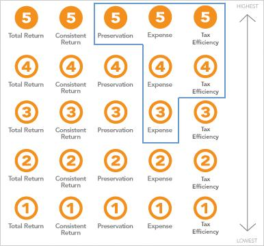

## Table of Contents

## What are Lipper Ratings?

Lipper Ratings are a way to measure how well a mutual fund or an investment fund is doing compared to other similar funds. They give a score from 1 to 5, with 5 being the best. The ratings are based on how much return the fund has given to investors over a certain time, usually three, five, or ten years. This helps investors see if a fund is doing better or worse than others in its group.

These ratings are useful because they make it easier for people to choose where to invest their money. By looking at the Lipper Rating, someone can quickly tell if a fund has been performing well over time. However, it's important to remember that past performance doesn't guarantee future results. So, while Lipper Ratings are a helpful tool, they should be used along with other information when making investment decisions.

## What are Morningstar Ratings?

Morningstar Ratings are a way to see how well a mutual fund or ETF is doing compared to other similar funds. They give stars from 1 to 5, with 5 stars being the best. The ratings look at how much money the fund made for investors over the last 3, 5, and 10 years. This helps people decide if a fund is good or not by seeing how it did in the past.

These ratings are helpful because they make it easier for people to pick where to put their money. By checking the Morningstar Rating, someone can quickly tell if a fund has been doing well over time. But remember, just because a fund did well in the past doesn't mean it will do well in the future. So, it's good to use Morningstar Ratings along with other information when choosing where to invest.

## How are Lipper Ratings calculated?

Lipper Ratings are calculated by looking at how well a fund has done compared to other funds in the same group. They use a special score called the Lipper Leader score. This score checks the fund's performance over three, five, and ten years. The fund gets a score from 1 to 5, with 5 being the best. To get a high score, a fund needs to do better than most other funds in its group.

The ratings are based on something called the Total Return metric. This means they look at all the money the fund made or lost, including any fees. They also think about how risky the fund is. A fund that makes a lot of money but is very risky might not get as high a score as a fund that makes a bit less money but is safer. This way, Lipper Ratings help investors see which funds have done well and are not too risky.

## How are Morningstar Ratings calculated?

Morningstar Ratings are calculated by looking at how well a fund has done compared to other similar funds. They use something called the risk-adjusted return to figure this out. This means they look at how much money the fund made and how risky it was to make that money. The rating is based on the fund's performance over the last three, five, and ten years. They give a score from 1 to 5 stars, with 5 stars being the best.

To get the rating, Morningstar first puts funds into groups with other funds that are similar. Then, they compare the fund's returns to the group's average returns. If a fund did better than most others in its group, it gets more stars. The ratings also consider how steady the fund's performance was over time. This way, Morningstar Ratings help people see which funds did well and were not too risky.

## What is the scale used for Lipper Ratings?

Lipper Ratings use a scale from 1 to 5. A score of 1 is the lowest, and a score of 5 is the highest. This scale helps people see how well a fund has done compared to other similar funds.

The rating is based on how much money the fund made for investors over three, five, and ten years. If a fund did better than most other funds in its group, it gets a higher score. This way, the scale makes it easy for people to pick good funds.

## What is the scale used for Morningstar Ratings?

Morningstar Ratings use a scale from 1 to 5 stars. A fund can get 1 star if it did not do well compared to other similar funds. On the other hand, a fund can get 5 stars if it did much better than most other funds in its group. This scale helps people quickly see how a fund has been doing.

The rating looks at how much money the fund made over the last three, five, and ten years. It also thinks about how risky the fund was. If a fund made good money and was not too risky, it gets more stars. This way, the Morningstar Rating helps people pick funds that have done well in the past.

## How often are Lipper Ratings updated?

Lipper Ratings are updated every month. This means that every month, they look at how the funds have been doing and change the ratings if needed. This helps keep the ratings fresh and useful for people who want to know how funds are doing right now.

By updating the ratings monthly, investors can see the latest performance of funds. This is important because fund performance can change over time. So, checking the ratings every month helps people make better choices about where to put their money.

## How often are Morningstar Ratings updated?

Morningstar Ratings are updated once a month. This means that every month, they look at how the funds have been doing over the last three, five, and ten years and change the ratings if needed. This helps keep the ratings up to date so people can see the latest performance of funds.

By updating the ratings monthly, investors can get a fresh look at how funds are doing. It's important because the performance of a fund can change over time. So, checking the ratings every month helps people make better choices about where to invest their money.

## What types of funds are covered by Lipper Ratings?

Lipper Ratings cover many different kinds of funds. They include mutual funds, exchange-traded funds (ETFs), and even some closed-end funds. These ratings help people see how well these funds are doing compared to other similar funds. This way, investors can pick funds that fit what they want to do with their money.

The ratings look at funds from all over the world. They cover funds that invest in stocks, bonds, and other things like real estate or commodities. No matter where the fund is from or what it invests in, Lipper Ratings give a score to help people decide if a fund is good or not.

## What types of funds are covered by Morningstar Ratings?

Morningstar Ratings cover many different kinds of funds. They include mutual funds, exchange-traded funds (ETFs), and some closed-end funds. These ratings help people see how well these funds are doing compared to other similar funds. This way, investors can pick funds that match what they want to do with their money.

The ratings look at funds from all over the world. They cover funds that invest in stocks, bonds, and other things like real estate or commodities. No matter where the fund is from or what it invests in, Morningstar Ratings give a score to help people decide if a fund is good or not.

## How do Lipper Ratings and Morningstar Ratings differ in their methodologies?

Lipper Ratings and Morningstar Ratings both help people see how well funds are doing, but they use different ways to figure out their scores. Lipper Ratings use something called the Total Return metric, which looks at all the money a fund made or lost, including any fees. They compare this to other similar funds over three, five, and ten years. Lipper also thinks about how risky the fund is. A fund that makes a lot of money but is very risky might not get a high score, even if it made a lot of money.

Morningstar Ratings, on the other hand, use a thing called risk-adjusted return. This means they look at how much money the fund made and how risky it was to make that money. They compare the fund's returns to other similar funds over three, five, and ten years. Morningstar also cares about how steady the fund's performance was over time. Both ratings give scores from 1 to 5, but they use different ways to decide if a fund is good or not.

## Which rating system is more predictive of future fund performance, Lipper or Morningstar?

Neither Lipper Ratings nor Morningstar Ratings can perfectly predict how a fund will do in the future. Both ratings look at how funds did in the past, over three, five, and ten years. They use different ways to figure out their scores, but past performance doesn't always tell us what will happen next. A fund that did well in the past might not do well in the future, and a fund that did badly might get better.

Some people think Morningstar Ratings might be a bit better at predicting the future because they look at how risky the fund was to make its money. This means they try to see if the fund's good performance was because it took big risks. But even with this, it's hard to say for sure which rating system is better at predicting the future. The best thing to do is to use both ratings, along with other information, to make smart choices about where to invest your money.

## References & Further Reading

[1]: Bergstra, J., Bardenet, R., Bengio, Y., & Kégl, B. (2011). ["Algorithms for Hyper-Parameter Optimization."](https://dl.acm.org/doi/10.5555/2986459.2986743) Advances in Neural Information Processing Systems 24.

[2]: ["Advances in Financial Machine Learning"](https://www.amazon.com/Advances-Financial-Machine-Learning-Marcos/dp/1119482089) by Marcos Lopez de Prado

[3]: ["Evidence-Based Technical Analysis: Applying the Scientific Method and Statistical Inference to Trading Signals"](https://www.amazon.com/Evidence-Based-Technical-Analysis-Scientific-Statistical/dp/0470008741) by David Aronson

[4]: ["Machine Learning for Algorithmic Trading"](https://github.com/stefan-jansen/machine-learning-for-trading) by Stefan Jansen

[5]: ["Quantitative Trading: How to Build Your Own Algorithmic Trading Business"](https://www.amazon.com/Quantitative-Trading-Build-Algorithmic-Business/dp/1119800064) by Ernest P. Chan