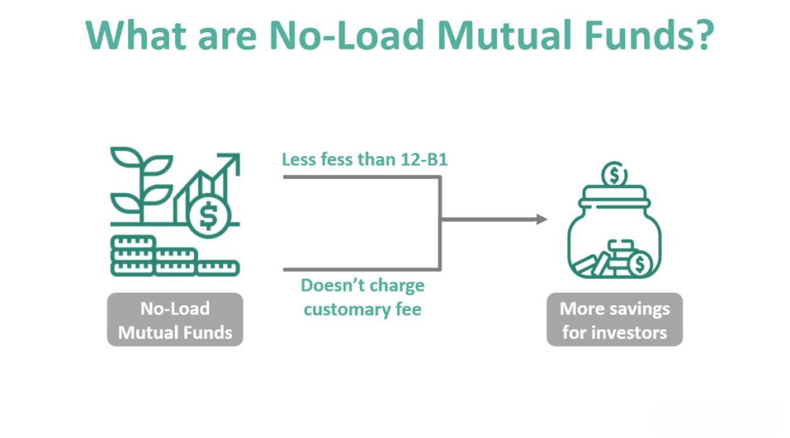

Mutual funds serve as a cornerstone for many individual investors' portfolios, owing to their diversification benefits and professional management. These collective investment vehicles pool money from various investors to purchase a diversified portfolio of stocks, bonds, or other securities. This approach allows individual investors to partake in a diverse range of assets without directly purchasing each one.

A key aspect of mutual funds is the structure of sales charges, which divides them into two primary categories: load funds and no-load funds. Load funds involve a commission or sales charge, typically used to remunerate financial advisors or brokers for their services. This can impact the initial or ongoing investment value. On the other hand, no-load funds do not levy such fees, enabling every dollar invested to contribute directly to the fund’s performance. Hence, understanding these differences is crucial for investors aiming to maximize their returns while managing costs.



As technology progresses, the influence of algorithmic trading on financial markets, including mutual funds, is becoming increasingly significant. Algorithmic trading utilizes computer programs to execute trades based on pre-defined parameters, often resulting in quicker and more efficient trade execution than human traders. This automation can reduce costs and mitigate human biases, offering potential advantages for mutual fund performance.

This article examines these critical elements—load and no-load funds, the associated fees, and the impact of algorithmic trading—providing investors with a comprehensive understanding to refine their investment strategies. By unpacking these topics, investors can enhance their decision-making processes, aiming for optimal financial growth.

## Table of Contents

## Understanding Load Funds

Load funds are a type of mutual fund that impose a commission or sales fee, commonly referred to as a "load," which compensates financial intermediaries such as brokers, financial planners, or advisors for their services. This fee structure is distinct from no-load funds, which do not charge any such commissions at the point of sale or redemption.

There are several types of load fees:

1. **Front-End Loads**: This fee is paid by the investor when they initially purchase shares of the mutual fund. It is typically taken out of the initial investment amount, which means a smaller portion of the investor's funds is actually put to work in the market. For example, if you invest $1,000 in a fund with a 5% front-end load, $50 is deducted as the fee, and $950 is invested in the fund.

2. **Back-End Loads**: Also known as contingent deferred sales charges (CDSC), these are fees paid at the time of selling the mutual fund shares. The charge usually decreases the longer the investor holds the fund, ultimately disappearing after a specific period.

3. **Level Loads**: Instead of charging a significant fee upfront or at redemption, level loads apply smaller annual fees over the life of the investment, often termed as 12b-1 fees. These recurring fees cover the cost of marketing and distribution.

While load fees compensate financial advisors and provide investors with access to professional investment advice, these charges can significantly erode net investment capital and reduce overall returns over time. The immediate reduction in invested capital due to front-end loads or the impact of back-end loads upon redemption can lessen the compound growth potential of the investment. 

Here is a simple Python code example to demonstrate the impact of a front-end load on an initial investment:

```python
def calculate_investment_after_front_end_load(initial_investment, front_end_load_percentage):
    load_amount = initial_investment * (front_end_load_percentage / 100)
    net_investment = initial_investment - load_amount
    return net_investment

initial_investment = 1000  # Example initial investment
front_end_load_percentage = 5  # Example front-end load percentage

net_investment = calculate_investment_after_front_end_load(initial_investment, front_end_load_percentage)
print(f"Net investment after {front_end_load_percentage}% front-end load: ${net_investment}")
```

This code illustrates that a front-end load reduces the principal amount that actually gets invested. In this example, a 5% load reduces the $1,000 investment to $950. Investors should carefully consider whether the benefits provided by professional advisory services justify the costs imposed by these load fees. Ultimately, the decision to invest in load funds should align with individual preferences regarding professional guidance and cost-effectiveness.

## Exploring No-Load Funds

No-load funds, as their name suggests, are mutual funds that do not charge any commission or sales fee when investors buy or sell fund shares. This structure ensures that the entire investment amount is allocated towards purchasing the fund's securities, which can enhance potential returns for the investor. The primary advantage of no-load funds lies in their ability to maximize an investor's capital allocation from the onset of the investment.

These funds are generally marketed directly by investment companies, bypassing the need for intermediaries such as brokers or financial advisors who would typically require a commission. This direct-to-consumer approach can be more cost-effective for investors, as it eliminates commission-based charges that can erode investment returns over time.

Despite the absence of a sales fee, investors in no-load funds are not exempt from other expenses. These funds still incur management and operational expenses, which are typically captured in the expense ratio. The expense ratio is a critical measure for investors to consider, as it represents the annual fee expressed as a percentage of the fund’s average assets under management. This ratio encompasses management fees, administrative costs, and other operational expenses incurred by the fund. A higher expense ratio can diminish overall returns, so it is essential for investors to monitor and compare these ratios among different no-load funds to make informed investment choices.

For instance, if a no-load fund has an expense ratio of 0.5%, it implies that for every $1,000 invested, $5 will be deducted annually to cover the fund's management and operational expenses. Investors should aim to identify no-load funds with lower expense ratios to optimize their investment returns over the long term.

In summary, while no-load funds provide a cost-efficient entry point into mutual fund investing by eliminating sales commissions, they do [carry](/wiki/carry-trading) ongoing expenses that require careful attention. By understanding and scrutinizing the expense ratio, investors can ensure that they are fully aware of the actual costs associated with their investments and align their choices with their financial goals.

## Comparing Load and No-Load Funds

Load funds and no-load funds represent two distinct approaches within mutual fund investments, each offering unique benefits tailored to different investor preferences and needs. 

Load funds typically include sales charges or commissions, justified by the provision of personalized investment advice and comprehensive strategies. Financial advisors or brokers often assist in selecting and managing these funds, offering expertise that can be particularly beneficial to investors who may not have the time, knowledge, or confidence to manage their own investments. The guidance from professionals can provide a sense of security and potentially enhance returns through informed decision-making. However, it is crucial to weigh these benefits against the fees associated with load funds, as these charges can diminish the net investment and ultimately impact overall yields.

Conversely, no-load funds cater to cost-conscious investors who are comfortable managing their own investment portfolios. These funds do not incur sales commissions, allowing the total investment amount to contribute directly to the growth potential of the fund. No-load funds are often marketed directly by investment companies, thus eliminating the need for intermediaries and the associated fees. While this option reduces immediate costs, investors should be diligent in assessing the expense ratio, which includes management and operational fees that can still influence the net return on investment.

Choosing between load and no-load funds requires careful consideration of an individual investor's financial literacy, objectives, and desire—or lack thereof—for professional guidance. Investors equipped with substantial market knowledge and a clear investment strategy may find no-load funds advantageous due to the potential savings on commission fees. In contrast, those who prioritize expert advice and a structured investment approach may lean towards load funds, despite the additional costs.

Both load and no-load funds impose management fees, which can vary widely and affect the net performance and cost efficiency of the fund. It is essential for investors to scrutinize these fees when evaluating a fund's viability. Such comparisons can involve reviewing metrics such as the expense ratio, which is typically calculated as:

$$
\text{Expense Ratio} = \frac{\text{Total Fund Expenses}}{\text{Total Fund Assets}}
$$

A lower expense ratio generally indicates a more cost-efficient fund, potentially enhancing the investor's net returns.

In summary, the decision between load and no-load mutual funds hinges on the investor's individual circumstances, including their level of investment knowledge, comfort with self-managing their portfolio, and need for professional guidance. Both fund types have inherent costs and benefits that must be thoroughly evaluated to align with the investor's financial goals and risk tolerance.

## Impact of Algorithmic Trading on Mutual Funds

Algorithmic trading has significantly transformed mutual fund management by utilizing complex algorithms to execute investment strategies. These systems operate at speeds and frequencies that far surpass human capabilities, allowing for the execution of trades in fractions of a second. The deployment of [algorithmic trading](/wiki/algorithmic-trading) within mutual funds offers multiple advantages, including cost reduction, enhanced execution speed, and the mitigation of human biases.

One of the primary benefits of algorithmic trading is its ability to reduce costs. By minimizing human intervention and harnessing technology, these automated systems can cut down on operational expenses. The reduced need for human traders and the ability to execute thousands of trades simultaneously contribute to lower trading costs, which can directly benefit mutual fund investors by increasing net returns.

Algorithmic trading also vastly improves the speed at which trades are executed. With the aid of sophisticated algorithms, trades are conducted at speeds that are impossible for human traders to achieve. This high-frequency trading capability ensures that mutual funds can capitalize on even the smallest market inefficiencies and fluctuations, optimizing portfolio returns.

Another significant advantage involves the mitigation of human biases in investment decision-making. Human traders may be influenced by emotions or cognitive biases that affect their judgment. In contrast, algorithms operate on predefined criteria and data, ensuring that decisions are based on objective quantitative analysis, thereby enhancing the consistency and reliability of trades executed by mutual funds.

Traditionally, algorithmic trading was primarily associated with equities. However, its application in mutual fund management is becoming more prevalent as fund managers seek to leverage its benefits for improved returns. The integration of algorithmic trading into mutual fund strategies has the potential to unlock higher performance levels by optimizing asset allocation, rebalancing portfolios, and executing tactical trades based on real-time data analysis.

In conclusion, the impact of algorithmic trading on mutual funds is profound, bringing about a paradigm shift in investment management. Through cost reduction, improved trade execution speed, and the elimination of human biases, algorithmic trading enhances the efficiency and effectiveness of mutual fund operations, aiming for superior returns for investors.

## Conclusion: Making Informed Investment Decisions

When deciding between load and no-load mutual funds, investors must consider several factors to align their choices with their personal financial objectives and risk tolerance levels. Load funds, with their associated fees, may offer value through professional advisory services, which can be advantageous for individuals seeking structured financial guidance. However, these fees reduce the net amount invested, and therefore, the potential returns over time. On the other hand, no-load funds provide a straightforward approach to investing, with no commission fees, allowing the entire investment to be utilized. This option may be more appealing to cost-sensitive investors who prefer a hands-on approach to managing their investments.

A paramount aspect of investing in mutual funds, whether load or no-load, is understanding the fee structure of each. Fees, including management and operational expenses, play a significant role in determining the overall return on investment. A common metric used to gauge the cost-effectiveness of mutual funds is the expense ratio, which represents the fund’s operating expenses expressed as a percentage of average net assets. Investors should aim to minimize these costs where possible to enhance their net returns.

The advent of algorithmic trading in mutual fund management offers a new dimension to investment strategies. Algorithms can process vast amounts of data at speeds unattainable by human traders, thereby enhancing decision-making and potentially improving returns. These systems can optimize the timing and execution of trades, reduce transaction costs, and eliminate human biases. Yet, investors must remain cognizant of the challenges posed by these technologies, such as the risk of over-reliance on automated systems and the potential for increased market [volatility](/wiki/volatility-trading-strategies).

In conclusion, making informed investment decisions involves a comprehensive evaluation of one's investment goals, risk tolerance, and the necessity for professional guidance. Both load and no-load funds offer distinct advantages and challenges that should be carefully weighed. As financial markets continue to evolve with technological advancements like algorithmic trading, staying informed about these changes is crucial. By considering these factors, investors can make well-rounded decisions that maximize their potential for financial growth and security.

## References & Further Reading

[1]: ["Morningstar Guide to Mutual Funds: Five-Star Strategies for Success"](https://www.amazon.com/Morningstar-Guide-Mutual-Funds-Strategies/dp/0470137533) by Christine Benz

[2]: ["Bogle on Mutual Funds: New Perspectives for the Intelligent Investor"](https://www.amazon.com/Bogle-Mutual-Funds-Perspectives-Intelligent/dp/111908833X) by John C. Bogle

[3]: ["All About Asset Allocation"](https://www.amazon.com/About-Asset-Allocation-Richard-Ferri/dp/0071429581) by Richard A. Ferri

[4]: ["Algorithmic Trading: Winning Strategies and Their Rationale"](https://www.wiley.com/en-us/Algorithmic+Trading%3A+Winning+Strategies+and+Their+Rationale-p-9781118460146) by Ernie Chan

[5]: Khandani, A. E., & Lo, A. W. (2007). ["What Happened To The Quants In August 2007?"](https://web.mit.edu/Alo/www/Papers/august07.pdf) Journal of Investment Management. 

[6]: Chordia, T., Roll, R., & Subrahmanyam, A. (2011). ["Recent trends in trading activity: Implications for volatility and liquidity."](https://papers.ssrn.com/sol3/papers.cfm?abstract_id=1700191) Journal of Financial Economics.