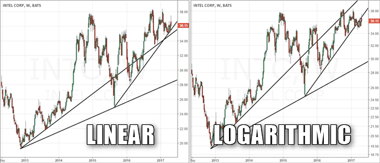

## Table of Contents

## What is a logarithmic price scale?

A logarithmic price scale is a way to show prices on a chart where the space between numbers gets smaller as the numbers get bigger. This means that a move from 10 to 100 looks the same as a move from 100 to 1000. It's useful for looking at things that grow very quickly, like stock prices or the value of money over time, because it makes big changes easier to see.

Using a logarithmic scale helps people understand how much something has grown or shrunk over time. For example, if a stock goes from $1 to $10, it's a big jump, but on a regular chart, it might not look that big. On a logarithmic chart, this jump would be very clear. This type of scale is great for showing percentage changes, which are more important than actual dollar amounts when you're looking at growth over time.

## What is a linear price scale?

A linear price scale is a way to show prices on a chart where the space between numbers stays the same, no matter how big the numbers get. So, a move from 10 to 20 looks the same as a move from 100 to 110. This type of scale is easy to understand because it's like counting on a number line.

Linear scales are good for looking at things that don't change a lot or change in a steady way. For example, if you're tracking the price of a product that goes up or down by a few dollars, a linear scale will show these changes clearly. But, if something grows very quickly, like stock prices, a linear scale might make big changes look smaller than they really are.

## How do logarithmic and linear price scales differ visually?

On a logarithmic price scale, the space between numbers gets smaller as the numbers get bigger. This means that a jump from 10 to 100 looks the same as a jump from 100 to 1000. It's like squeezing more numbers into the same space the higher you go. This makes it easier to see big changes, especially when things grow very fast, like stock prices. If you look at a chart with a logarithmic scale, you'll see that the lines or bars get closer together as the values increase.

On a linear price scale, the space between numbers stays the same no matter how big the numbers get. A move from 10 to 20 looks the same as a move from 100 to 110. It's like counting on a regular number line where each step is the same size. This makes it easy to see small changes or steady growth. If you look at a chart with a linear scale, you'll see that the lines or bars are evenly spaced, no matter how high the values go.

## In what types of charts are logarithmic scales most commonly used?

Logarithmic scales are most commonly used in financial charts, like stock market charts. They help show how much a stock's price has gone up or down over time. Because stock prices can change a lot, a logarithmic scale makes it easier to see these big changes. For example, if a stock goes from $10 to $100, it's a big jump, but on a regular chart, it might not look that big. On a logarithmic chart, this jump would be very clear.

They are also used in charts that show things growing over a long time, like population growth or the spread of diseases. These things can grow very fast, and a logarithmic scale helps show this growth better. It makes it easier to see how fast something is growing, even if the numbers get very big. This way, people can understand the changes better and make better decisions.

## Why might someone choose to use a logarithmic scale over a linear scale?

Someone might choose to use a logarithmic scale over a linear scale because it's better at showing big changes, especially when things grow very fast. For example, if you're looking at stock prices or how a disease spreads, these things can jump from small numbers to big numbers quickly. A logarithmic scale makes these jumps easier to see because it squeezes more numbers into the same space the higher you go. This way, you can understand how fast something is growing, even if the numbers get very big.

On the other hand, a linear scale can make big changes look smaller than they really are. If you use a linear scale to look at stock prices that go from $10 to $100, the jump might not look that big. But on a logarithmic scale, this jump would be very clear. So, if you want to see percentage changes or understand growth over time, a logarithmic scale is a better choice. It helps you see the real impact of these changes more easily.

## How does the use of logarithmic scales affect the interpretation of price movements?

Using a logarithmic scale changes how we see price movements by making big changes easier to spot. When prices go up a lot, like from $10 to $100, a logarithmic scale shows this jump clearly. It does this by squeezing more numbers into the same space the higher you go. This means that a move from 10 to 100 looks the same as a move from 100 to 1000. So, if you're looking at how fast something is growing, like stock prices or the spread of a disease, a logarithmic scale helps you understand these big changes better.

On the other hand, a linear scale might make big changes look smaller than they really are. If you use a linear scale, the space between numbers stays the same, no matter how big the numbers get. So, a move from 10 to 20 looks the same as a move from 100 to 110. This can make it hard to see how fast something is growing, especially when the numbers get very big. By using a logarithmic scale, you can see the real impact of these changes more easily, which is important for understanding growth over time.

## What are the advantages of using a linear scale in financial analysis?

Using a linear scale in financial analysis can be helpful when you want to see small changes clearly. If you're looking at something that doesn't change a lot, like the price of a product that goes up or down by a few dollars, a linear scale shows these changes well. It's easy to understand because it's like counting on a number line, where each step is the same size. This makes it simple to see how much something has gone up or down in actual numbers.

Another advantage of a linear scale is that it's good for showing steady growth. If you're tracking something that grows slowly over time, like the price of a stable stock, a linear scale can make these small changes easy to see. It helps you focus on the actual dollar amounts rather than percentage changes. This can be important when you're trying to understand small, steady movements in prices or other financial data.

## Can logarithmic scales distort the perception of price changes? If so, how?

Logarithmic scales can sometimes make it hard to see small changes in prices. Because a logarithmic scale squeezes more numbers into the same space as the numbers get bigger, small jumps in price might look even smaller. For example, if a stock price goes from $100 to $110, this change might not look very big on a logarithmic chart. This can make it tricky to notice small but important changes in price.

On the other hand, logarithmic scales can also make big changes look less dramatic than they really are. If a stock price goes from $1 to $10, it's a huge jump, but on a logarithmic scale, it might not look as big as it feels. This is because the scale is set up to show percentage changes, not actual dollar amounts. So, while logarithmic scales are great for showing growth over time, they can sometimes hide the full impact of big price jumps.

## How do logarithmic and linear scales impact the analysis of long-term trends?

Logarithmic scales are really helpful for looking at long-term trends, especially when things grow a lot over time. If you're looking at how a stock price has changed over many years, a logarithmic scale makes big jumps in price easy to see. It shows you how fast the price has grown, even if the numbers get very big. This way, you can understand the growth better and see if the trend is speeding up or slowing down. It's like looking at a road map where the scale changes to show you more detail the farther you go.

Linear scales can be good for looking at long-term trends too, but they work best when things don't change a lot. If you're tracking something that grows slowly and steadily, like the price of a stable stock, a linear scale can show you these small changes clearly. It helps you see the actual dollar amounts going up or down over time. But if the numbers get very big, a linear scale might make big jumps look smaller than they really are. So, it's important to choose the right scale depending on what you're looking at.

## What are some common misconceptions about logarithmic and linear scales?

One common misconception about logarithmic scales is that they always make things look bigger. Actually, logarithmic scales can make small changes look even smaller because they squeeze more numbers into the same space as the numbers get bigger. Another misconception is that logarithmic scales are hard to understand. While they can take some getting used to, they're really just a different way of showing numbers that helps us see big changes better.

On the other hand, people often think that linear scales are the only way to show numbers because they're easy to understand. But linear scales can make big changes look smaller than they really are, especially when numbers get very big. Also, some people believe that linear scales are always better for financial analysis, but that's not true. Linear scales are good for showing small, steady changes, but logarithmic scales are better for showing how fast something is growing over time.

## How can traders and analysts switch between logarithmic and linear scales in popular charting software?

In popular charting software like TradingView or MetaTrader, switching between logarithmic and linear scales is easy. You just need to find the settings or chart properties. Usually, there's a button or a menu where you can choose between "log" for logarithmic and "linear" for linear scales. Once you click on it, the chart will change to show the prices in the new way. This helps you see the price movements differently, depending on what you're looking for.

For example, in TradingView, you can switch scales by clicking on the "Settings" icon on the chart, then going to the "Scale" tab, and choosing between "Logarithmic" and "Linear". In MetaTrader, you can do this by right-clicking on the chart, selecting "Properties", and then choosing the scale type in the "Common" tab. Both ways are quick and simple, so you can easily switch back and forth to see which scale helps you understand the price changes better.

## What advanced techniques can be applied when using logarithmic scales for predictive modeling in finance?

When using logarithmic scales for predictive modeling in finance, one advanced technique is to look at the rate of change over time. Because logarithmic scales show percentage changes better than actual dollar amounts, you can use them to see how fast a stock's price is growing. This helps you predict if the price will keep going up or if it might slow down. By looking at the slope of the line on a logarithmic chart, you can tell if the growth is speeding up or slowing down, which can help you make better guesses about future prices.

Another technique is to use logarithmic scales to compare different stocks or assets. Since logarithmic scales make it easier to see big changes, you can put different stocks on the same chart and see how their growth rates compare. This can help you decide which stock might be a better investment. For example, if one stock's price is growing faster than another's, you might want to invest more in the faster-growing stock. Using logarithmic scales this way can give you a clearer picture of which investments might do better in the future.

## What is the Price Comparison on Linear and Logarithmic Scales?

Price comparisons vary significantly depending on the choice between linear and logarithmic scales, affecting how price data is interpreted. A linear scale, often used in financial charts, presents equal spacing for equal absolute price changes. While this approach may be useful for short-term analysis, it can exaggerate movements in high-priced securities, rendering significant yet proportionally smaller percentage changes less visible over extended periods.

Consider a stock that rises from $10 to $20 over a year, and another that climbs from $100 to $110 in the same timeframe. On a linear scale, the increase in absolute value will appear visually similar, even though the percentage change for the first stock is 100%, compared to just 10% for the second. This can mislead traders when evaluating the magnitude of price movements, especially in volatile markets.

Conversely, a logarithmic scale, also known as a log scale, displays equal spacing for identical percentage changes. This method emphasizes proportional growth, making it well-suited for observing long-term trends and movements across securities with varying price ranges. When plotted on a logarithmic scale, a doubling in price is represented consistently, regardless of the initial value, therefore providing a clearer perspective on performance over time.

The mathematical representation of a logarithmic scale can be described as follows: if $P_t$ represents the price at time $t$, and $P_0$ is the initial price, the logarithmic price change is expressed as:

$$
\log(P_t) - \log(P_0) = \log\left(\frac{P_t}{P_0}\right)
$$

This formula reflects percentage change, offering a uniform view of growth and decline, crucial for long-term investment analysis. For investors and [algorithmic trading](/wiki/algorithmic-trading) systems, such visibility makes log scales superior when the objective is to detect enduring trends amidst market fluctuations.

In conclusion, the selection of a linear or logarithmic scale substantially affects the portrayal of price data, influencing trend analysis. Linear scales may distort percentage changes, complicating long-term assessments, whereas logarithmic scales provide consistent visibility of such changes, enhancing the evaluation of historical price movements and aiding strategic investment decisions.

## References & Further Reading

[1]: Bergstra, J., Bardenet, R., Bengio, Y., & Kégl, B. (2011). ["Algorithms for Hyper-Parameter Optimization."](https://papers.nips.cc/paper/4443-algorithms-for-hyper-parameter-optimization) Advances in Neural Information Processing Systems 24.

[2]: ["Advances in Financial Machine Learning"](https://www.amazon.com/Advances-Financial-Machine-Learning-Marcos/dp/1119482089) by Marcos Lopez de Prado

[3]: ["Evidence-Based Technical Analysis: Applying the Scientific Method and Statistical Inference to Trading Signals"](https://www.amazon.com/Evidence-Based-Technical-Analysis-Scientific-Statistical/dp/0470008741) by David Aronson

[4]: ["Machine Learning for Algorithmic Trading"](https://github.com/PacktPublishing/Machine-Learning-for-Algorithmic-Trading-Second-Edition) by Stefan Jansen

[5]: ["Quantitative Trading: How to Build Your Own Algorithmic Trading Business"](https://www.amazon.com/Quantitative-Trading-Build-Algorithmic-Business/dp/1119800064) by Ernest P. Chan