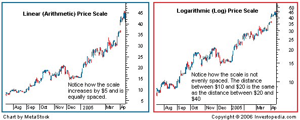

In the world of finance and technical analysis, scales are fundamental tools for interpreting and representing price data. The two most common methods used in charts are linear and logarithmic scales. Linear scales depict equal distances on the chart for equal price changes, while logarithmic scales use equal distances to show equal percentage changes. This distinction is critical for traders, especially those employing algorithmic methods to make informed trading decisions.

This article explores the differences between linear and logarithmic scales, focusing on their importance in price comparisons and algorithmic trading. Understanding these scales is not merely a theoretical exercise but a practical necessity. The scale choice impacts how data is visualized, and how price movements are interpreted, and influences trading strategies, providing unique insights depending on market conditions and the specific security being analyzed.



Algorithmic trading, which relies heavily on historical data patterns, is particularly sensitive to the choice of scale. A logarithmic scale might be preferred for its ability to clearly display percentage changes and long-term trends, but the suitability of a scale depends on the specific goals and strategies of the trader. Moreover, recognizing how each scale affects visualization aids in mitigating the risk of misinterpretation of price data.

Ultimately, this article highlights how the choice between linear and logarithmic scales extends beyond simple data representation; it also has profound implications for trading strategies. As technology evolves, an enhanced understanding of these scales and their impact on data interpretation will be crucial for traders looking to optimize their strategies in increasingly complex financial markets.

## Table of Contents

## Understanding Linear and Logarithmic Scales

A linear scale is a straightforward method of charting price data where equal distances across the chart correspond to equal changes in price. For example, a $5 increase from $20 to $25 is plotted the same distance apart as a $5 increase from $100 to $105. This approach is intuitive, particularly for understanding absolute price changes, but it can sometimes exaggerate price movements for higher-priced stocks. Due to this characteristic, high absolute prices might visually misrepresent the magnitude of price changes compared to their real-world impact.

In contrast, a logarithmic scale (or log scale) measures price changes in terms of percentage growth. In this approach, an exponential increase is represented as a linear movement on the chart. For instance, both a 100% increase from $10 to $20 and a 100% increase from $50 to $100 are depicted the same on a logarithmic chart. This scale is particularly useful for analyzing long-term data where the proportional change in price is more relevant than the absolute change. As a result, it offers a more nuanced view of data, especially when assessing longer-term trends or substantial price fluctuations.

Both scales provide unique perspectives and have specific applications contingent upon market conditions and the nature of the analysis being conducted. While linear scales are more suited for short-term, absolute price evaluations, logarithmic scales better illustrate relative changes, making them optimal for understanding growth rates and trends over extended periods. Therefore, choosing the appropriate scale depends on the specific requirements of the analysis and the nature of the price data being evaluated.

## Price Comparison on Linear and Logarithmic Scales

Price comparisons vary significantly depending on the choice between linear and logarithmic scales, affecting how price data is interpreted. A linear scale, often used in financial charts, presents equal spacing for equal absolute price changes. While this approach may be useful for short-term analysis, it can exaggerate movements in high-priced securities, rendering significant yet proportionally smaller percentage changes less visible over extended periods.

Consider a stock that rises from $10 to $20 over a year, and another that climbs from $100 to $110 in the same timeframe. On a linear scale, the increase in absolute value will appear visually similar, even though the percentage change for the first stock is 100%, compared to just 10% for the second. This can mislead traders when evaluating the magnitude of price movements, especially in volatile markets.

Conversely, a logarithmic scale, also known as a log scale, displays equal spacing for identical percentage changes. This method emphasizes proportional growth, making it well-suited for observing long-term trends and movements across securities with varying price ranges. When plotted on a logarithmic scale, a doubling in price is represented consistently, regardless of the initial value, therefore providing a clearer perspective on performance over time.

The mathematical representation of a logarithmic scale can be described as follows: if $P_t$ represents the price at time $t$, and $P_0$ is the initial price, the logarithmic price change is expressed as:

$$
\log(P_t) - \log(P_0) = \log\left(\frac{P_t}{P_0}\right)
$$

This formula reflects percentage change, offering a uniform view of growth and decline, crucial for long-term investment analysis. For investors and [algorithmic trading](/wiki/algorithmic-trading) systems, such visibility makes log scales superior when the objective is to detect enduring trends amidst market fluctuations.

In conclusion, the selection of a linear or logarithmic scale substantially affects the portrayal of price data, influencing trend analysis. Linear scales may distort percentage changes, complicating long-term assessments, whereas logarithmic scales provide consistent visibility of such changes, enhancing the evaluation of historical price movements and aiding strategic investment decisions.

## Algorithmic Trading and Scale Impact

Algorithmic trading systems leverage complex algorithms and historical data patterns to make rapid trading decisions. The choice between linear and logarithmic scales can substantially impact the generation of trade signals and the effectiveness of trading strategies. This is primarily because these scales differently represent price movements, affecting how patterns are recognized and interpreted by algorithms.

A logarithmic scale, which depicts percentage changes consistently, is particularly advantageous in algorithmic trading. It allows systems to be more sensitive to relative changes in price, which is crucial for identifying long-term trends and patterns often missed or misrepresented on a linear scale. For instance, a price movement from $10 to $20 is a 100% increase, which occupies the same visual space on a log scale as a move from $100 to $200, thus enabling algorithms to recognize equivalent percentage changes, irrespective of the stock's price level.

For algorithmic traders, selecting the appropriate scale for data analysis depends on several factors, including market conditions, the trading strategy at hand, and the specific objectives of the trading system. Consideration of these elements is essential for optimizing decision-making processes. For example, short-term traders focusing on minute price changes might prefer linear scales due to their emphasis on absolute price differences. Conversely, long-term investors focusing on percentage growth over time might find logarithmic charts more insightful.

The choice of scale can also influence the calibration of algorithmic models. In Python, for instance, traders might preprocess price data using libraries such as NumPy or pandas. Consider the following code snippet:

```python
import numpy as np
import pandas as pd

# Example of converting prices to log scale
prices = pd.Series([10, 20, 40, 80])
log_prices = np.log(prices)

# Use of log_prices in further calculations
log_returns = log_prices.diff()
```

This code illustrates how prices are transformed to a logarithmic scale, enabling the computation of log returns, which are crucial for strategies reliant on percentage changes.

Ultimately, the scale selection is a crucial aspect of algorithmic strategy development. Awareness and understanding of how each scale impacts data representation enhance the prospects of optimizing trade outcomes. As technology and analytical tools evolve, the ability to switch between and experiment with different scales allows traders to tailor their strategies more precisely, leveraging the strengths of both linear and logarithmic representations to meet the specific demands of varying market conditions and trading objectives.

## Practical Implications for Traders

Traders should carefully assess their trading goals, timelines, and the characteristics of the securities they trade when deciding between linear and logarithmic scales. Each scale provides distinct perspectives on price data, influencing how traders interpret and act upon market movements. By understanding the implications of these scales, traders can make more informed decisions and reduce the risk of misinterpreting price data.

Linear scales offer a straightforward representation where equal distances correspond to equal price changes. This can be useful for short-term trading, where absolute price movements are more relevant. For instance, a trader focusing on short-term gains might prioritize absolute price levels, making a linear scale more suitable.

In contrast, logarithmic scales emphasize percentage changes, which are crucial for analyzing long-term trends. Here, price movements are represented such that equal distances correspond to equal percentage changes, making it easier to visualize the significance of changes over time. This scale is particularly beneficial for assets that have experienced exponential growth, where a logarithmic view can reveal growth patterns that are less apparent on a linear scale.

Tools and platforms used for trading often provide the ability to switch between these scales, allowing traders to adapt their analysis to fit their strategy. By experimenting with both scales, traders can determine which offers better insights for their particular analysis or strategy execution. For example, a trader focused on identifying long-term growth opportunities might favor a logarithmic scale, whereas someone interested in intraday price fluctuations might lean towards a linear scale.

Ultimately, the choice of scale can have significant implications for trading outcomes. Traders should integrate this understanding into their strategy to maximize efficiency and profitability. By aligning their choice of scale with their strategic objectives, traders can enhance their ability to interpret market data accurately, thus optimizing their trading performance.

## Conclusion

Both linear and logarithmic scales play significant roles in trading and analysis, each offering distinct benefits suited to specific contexts. Linear scales are straightforward, providing an equal distance for equal price changes. They are particularly valuable for short-term analysis, where absolute price movements need to be interpreted clearly. In contrast, logarithmic scales are designed to represent equal distances for equal percentage changes, which aids in analyzing long-term trends and the exponential growth of financial assets.

In algorithmic trading, the choice between these scales can significantly influence the analysis and outcomes of strategies. Algorithms often process historical data to generate trading signals, and the way this data is visualized—linear versus logarithmic—can impact these signals. For example, logarithmic scales can offer a more nuanced view of long-term growth patterns, making them beneficial for strategies focused on percentage returns and risk management over extended periods. Conversely, linear scales might be preferred for strategies that emphasize incremental price shifts, benefiting short-term trades or assets with small price variations.

As technology advances, understanding how these scales represent data is increasingly crucial for traders. The ability to switch between linear and logarithmic views can offer deeper insights, allowing for strategic adjustments based on market conditions and personal trading goals. This flexibility can enhance the precision of algorithms and the overall effectiveness of trading strategies. Therefore, a comprehensive grasp of both scales enhances traders' ability to successfully navigate and capitalize on market movements.

Whether utilizing linear scales for clarity in immediate price changes or logarithmic scales for understanding the compounding effects over time, the informed use of these tools can markedly improve trading outcomes.

## References & Further Reading

[1]: Bergstra, J., Bardenet, R., Bengio, Y., & Kégl, B. (2011). ["Algorithms for Hyper-Parameter Optimization."](https://papers.nips.cc/paper/4443-algorithms-for-hyper-parameter-optimization) Advances in Neural Information Processing Systems 24.

[2]: ["Advances in Financial Machine Learning"](https://www.amazon.com/Advances-Financial-Machine-Learning-Marcos/dp/1119482089) by Marcos Lopez de Prado

[3]: ["Evidence-Based Technical Analysis: Applying the Scientific Method and Statistical Inference to Trading Signals"](https://www.amazon.com/Evidence-Based-Technical-Analysis-Scientific-Statistical/dp/0470008741) by David Aronson

[4]: ["Machine Learning for Algorithmic Trading"](https://github.com/PacktPublishing/Machine-Learning-for-Algorithmic-Trading-Second-Edition) by Stefan Jansen

[5]: ["Quantitative Trading: How to Build Your Own Algorithmic Trading Business"](https://www.amazon.com/Quantitative-Trading-Build-Algorithmic-Business/dp/1119800064) by Ernest P. Chan