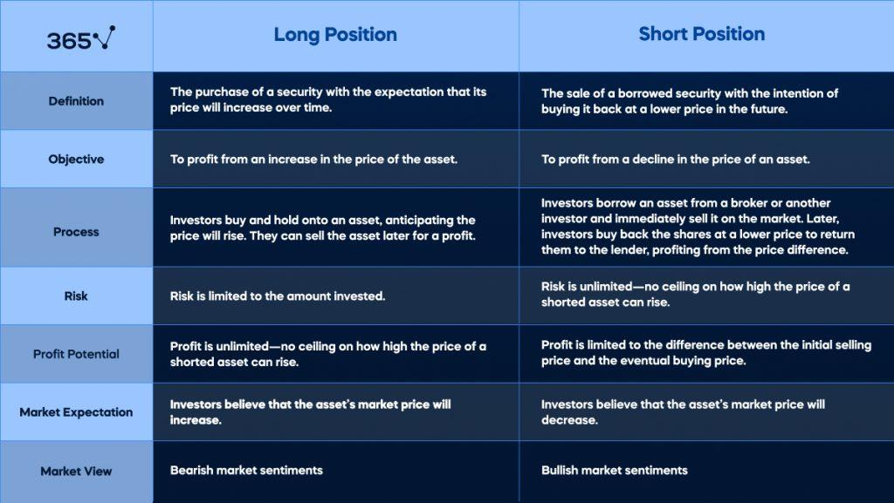

## Table of Contents

## What is a long position in trading?

A long position in trading means that you buy a stock, hoping its price will go up. When you think a company is going to do well, you buy its stock. If the price goes up, you can sell it later for more money than you paid. This is a common strategy for people who want to make money over time by investing in companies they believe in.

For example, if you buy a share of a company for $10 and later sell it for $15, you make a profit of $5 per share. The risk with a long position is that if the stock price goes down instead of up, you could lose money. That's why it's important to research and understand the companies you invest in.

## What is a short position in trading?

A short position in trading is when you borrow a stock and sell it, hoping its price will go down. You do this because you think a company's stock is going to lose value. After borrowing the stock, you sell it at the current price. If the price does drop later, you can buy it back cheaper and return it to the person you borrowed it from, keeping the difference as profit.

For example, if you borrow a stock and sell it for $20, and then the price drops to $15, you can buy it back at $15, return the stock, and make a $5 profit per share. The risk with a short position is that if the stock price goes up instead of down, you could lose money. You would have to buy it back at a higher price to return it, which means you lose money. That's why short selling can be riskier than buying stocks, and it's important to understand the market well before trying it.

## How do you initiate a long position?

To start a long position, you first need to decide which stock you want to buy. This means you should do some research on different companies to find one you think will do well in the future. You can look at things like the company's earnings, news about the company, and what other people think about it. Once you've chosen a stock, you need to figure out how many shares you want to buy and how much money you're willing to spend.

After you've made your decision, you can buy the stock through a brokerage account. This is like an online platform where you can trade stocks. You log into your account, search for the stock you want, and place an order to buy it. You can choose to buy the stock at the current market price or set a specific price you're willing to pay. Once your order is filled, you own the stock and have started your long position. Now, you just wait and hope the stock price goes up so you can sell it later for a profit.

## How do you initiate a short position?

To start a short position, you first need to find a stock you think will go down in price. You need to do some research to figure out which stock you want to short. Once you've picked a stock, you need to find a broker who allows short selling. Not all brokers let you do this, so you might need to look around. When you have a broker that lets you short, you can place an order to short the stock.

After you place the order, the broker will lend you the stock you want to short. You then sell this borrowed stock at the current market price. For example, if you short 100 shares at $50 each, you get $5,000 from selling them. Now, you wait for the stock price to go down. If it does, you can buy the shares back at the lower price, return them to the broker, and keep the difference as profit. If the stock price goes up instead, you'll lose money because you have to buy it back at a higher price to return it.

## What are the potential risks of holding a long position?

Holding a long position means you own a stock and hope its price will go up. One big risk is that the stock price might go down instead. If it does, you could lose money if you sell it for less than what you paid. This can happen for many reasons, like the company not doing well, bad news affecting the stock, or changes in the economy. It's important to keep an eye on the company and the market to try and avoid big losses.

Another risk is that the stock might not go up as fast as you hope. Sometimes, you might have to wait a long time for the price to rise. During this time, you could miss out on other good investment opportunities. Also, if you need money quickly, you might have to sell the stock at a bad time and lose money. So, it's good to think about how long you're willing to wait and if you can handle the stock not moving as quickly as you want.

## What are the potential risks of holding a short position?

Holding a short position means you borrow a stock and sell it, hoping the price will go down. The biggest risk is that the stock price might go up instead. If it does, you'll lose money because you have to buy the stock back at a higher price to return it to the person you borrowed it from. This can happen quickly, and losses can be big. It's called a short squeeze when the price goes up fast, and it can be really bad for people holding short positions.

Another risk is that there might not be enough stocks to borrow. If a lot of people want to short the same stock, it can be hard to find shares to borrow. This can make it tough to start or keep a short position. Also, you have to pay fees to borrow the stock, and these fees can add up over time. So, holding a short position can be more expensive and riskier than holding a long position.

## How do market conditions affect the profitability of long positions?

Market conditions can really change how well a long position does. When the market is doing well and going up, it's easier for your long position to make money. If lots of people are buying stocks and the economy is strong, the price of the stock you own might go up too. This means you can sell it later for more than you paid, making a profit. But if the market is not doing well, like during a recession or when people are scared about the future, stock prices can go down. If this happens, the stock you own might lose value, and you could lose money if you sell it.

Sometimes, other things can affect your long position too. For example, if the company you invested in does something great, like making more money or coming out with a new product, its stock price might go up. But if the company has bad news, like losing money or getting in trouble, its stock price could go down. Also, big events like changes in interest rates or new laws can shake up the market and affect stock prices. So, it's important to keep an eye on what's happening in the market and with the company to understand how your long position might do.

## How do market conditions affect the profitability of short positions?

Market conditions can make a big difference in how well a short position does. When the market is going down, it's good for short positions. If lots of people are selling stocks and the economy is not doing well, the price of the stock you shorted might go down too. This means you can buy it back cheaper and make a profit. But if the market is going up, it's bad for short positions. If everyone is buying stocks and the economy is strong, the stock price might go up instead of down. If this happens, you could lose money because you have to buy the stock back at a higher price.

Other things can affect your short position too. If the company you shorted does something bad, like losing money or getting bad news, its stock price might go down. This is good for your short position because you can buy the stock back cheaper. But if the company does well, like making more money or coming out with a new product, its stock price could go up. This is bad for your short position because you might lose money. Big events like changes in interest rates or new laws can also shake up the market and affect stock prices. So, it's important to watch what's happening in the market and with the company to know how your short position might do.

## What are some strategies for managing a long position?

One way to manage a long position is to keep an eye on the company you invested in. Look at their news and earnings reports to see if they are doing well. If the company is doing great, you might want to keep your stock and wait for the price to go up more. But if the company starts to do badly, you might want to sell your stock before it loses too much value. It's also good to set a price at which you will sell the stock to make sure you don't lose too much money if the price goes down.

Another strategy is to use stop-loss orders. This means you tell your broker to sell your stock if it drops to a certain price. This can help you avoid big losses if the stock price goes down a lot. You can also use a take-profit order, which tells your broker to sell the stock when it reaches a certain high price. This helps you lock in profits if the stock does well. Both of these orders can help you manage your long position without having to watch the stock all the time.

It's also important to think about the bigger picture. Look at what's happening in the whole market and the economy. If the market is going down, it might be a good idea to sell some of your stocks to protect your money. But if the market is going up, you might want to keep your stocks and maybe even buy more. By paying attention to the company, using orders, and watching the market, you can better manage your long position and hopefully make more money.

## What are some strategies for managing a short position?

One way to manage a short position is to keep a close eye on the company you shorted. If the company starts doing badly, like losing money or getting bad news, the stock price might go down, which is good for your short position. But if the company does well, you might want to buy back the stock and close your position before the price goes up too much. It's also smart to set a price at which you will buy back the stock to make sure you don't lose too much money if the price goes up.

Another strategy is to use stop-loss orders. This means you tell your broker to buy back the stock if it goes up to a certain price. This can help you avoid big losses if the stock price rises a lot. You can also use a take-profit order, which tells your broker to buy back the stock when it reaches a certain low price. This helps you lock in profits if the stock does as badly as you thought. By watching the company, using orders, and being ready to act, you can better manage your short position and hopefully make money.

## How can advanced traders use long and short positions in combination?

Advanced traders can use long and short positions together to try and make money no matter which way the market goes. This is called a long-short strategy. For example, if a trader thinks one company will do better than another, they might buy the stock of the first company (long position) and borrow and sell the stock of the second company (short position). If the first company's stock goes up more than the second company's stock goes down, the trader can make money from both positions. This way, the trader is not just betting on the market going up or down, but on how different stocks will do compared to each other.

Another way to use long and short positions together is to hedge. This means using one position to protect against losses from the other. For example, a trader might have a long position in a stock but think the whole market might go down. To protect their long position, they could short a stock or an index that they think will go down. If the market does go down, the profit from the short position can help cover any losses from the long position. This can make the trader's overall position safer, but it also means they might not make as much money if the market goes up a lot.

## What are the tax implications of long versus short positions?

When you make money from a long position, you have to pay taxes on your profits. If you hold the stock for more than a year before selling it, you get a special tax rate called the long-term capital gains rate. This rate is usually lower than the tax rate for regular income, so it can save you money. But if you sell the stock within a year, you pay taxes at the short-term capital gains rate, which is the same as your regular income tax rate. So, holding a stock for over a year can help you keep more of your profits.

For short positions, the tax rules are a bit different. When you make money from a short position, it's always considered a short-term capital gain, no matter how long you hold it. This means you pay taxes at your regular income tax rate, which can be higher than the long-term capital gains rate. Also, if you lose money on a short position, you can use those losses to reduce your taxes. You can subtract those losses from any gains you made, and if you still have losses left over, you can use them to lower your taxable income up to a certain limit each year.

## References & Further Reading

[1]: Bergstra, J., Bardenet, R., Bengio, Y., & Kégl, B. (2011). ["Algorithms for Hyper-Parameter Optimization."](https://papers.nips.cc/paper/4443-algorithms-for-hyper-parameter-optimization) Advances in Neural Information Processing Systems 24.

[2]: ["Advances in Financial Machine Learning"](https://www.amazon.com/Advances-Financial-Machine-Learning-Marcos/dp/1119482089) by Marcos Lopez de Prado

[3]: ["Evidence-Based Technical Analysis: Applying the Scientific Method and Statistical Inference to Trading Signals"](https://www.amazon.com/Evidence-Based-Technical-Analysis-Scientific-Statistical/dp/0470008741) by David Aronson

[4]: ["Machine Learning for Algorithmic Trading"](https://github.com/PacktPublishing/Machine-Learning-for-Algorithmic-Trading-Second-Edition) by Stefan Jansen

[5]: ["Quantitative Trading: How to Build Your Own Algorithmic Trading Business"](https://www.amazon.com/Quantitative-Trading-Build-Algorithmic-Business/dp/0470284889) by Ernest P. Chan