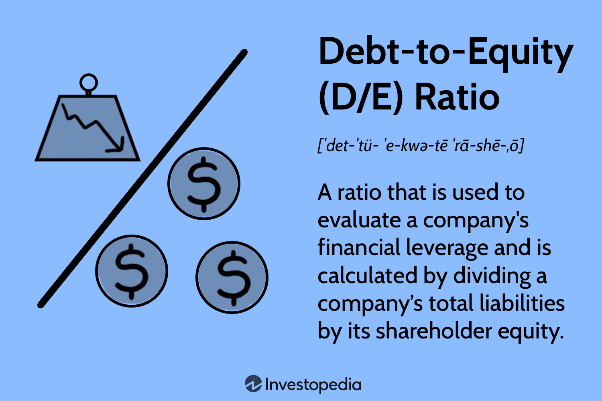

In today's dynamic financial landscape, companies aiming to fund their operations and growth encounter the pivotal choice between long-term debt and equity financing. Each financing method comes with its own set of benefits and challenges, directly impacting corporate finance decisions. The choice between these options can influence a company's approach to growth, governance, and risk management, ultimately affecting its bottom line and shareholder value.

Long-term debt financing involves borrowing funds that must be repaid over an extended period, typically exceeding one year. This approach provides businesses with immediate capital necessary for expansion or ongoing operational needs while avoiding equity dilution. However, the requirement for regular debt repayments, along with interest, necessitates careful cash flow management. Companies that can maintain predictable and stable income streams might find long-term debt a strategic choice, preserving ownership and control in the process.

Conversely, equity financing offers a framework for raising capital by issuing shares, making investors part owners of the company. It is particularly attractive to startups or ventures experiencing rapid growth, as it eliminates the obligation of periodic repayments and default risks. Nonetheless, it does come with the consideration of ownership dilution, as well as the need to align with investor interests.

A crucial aspect to consider is the influence of algorithmic trading on financing strategies. Algorithmic trading utilizes advanced computerized systems to execute trades automatically, based on pre-established criteria. This technology can impact market liquidity, stock prices, and overall investor sentiment, playing a role in how companies strategically time and structure their financing activities.

Understanding the complexities of long-term debt and equity financing options, alongside the interplay with algorithmic trading, is vital for companies aiming to optimize their financial outcomes. By carefully selecting a blend of financing mechanisms, businesses can ensure sustainable growth and stability, capitalizing on opportunities while mitigating financial risks. With a comprehensive approach towards financing, companies can better align their strategies with long-term objectives and navigate the complexities of today's financial markets.

## Table of Contents

## Understanding Long-Term Debt Financing

Long-term debt financing is a strategy whereby a company borrows funds with the agreement to repay them over an extended period, typically beyond one year. This approach is integral to securing capital needed for substantial business endeavors, such as expansion or significant operational ventures. Companies often utilize financial instruments like bonds, loans, and leases to access long-term debt financing.

Here’s a breakdown of these instruments:

1. **Bonds**: These are essentially loans made by investors to a corporation. In return, the company agrees to pay interest until the maturity date, when the principal amount is repaid. Bonds can have varying terms, interest rates, and conditions attached to them, allowing companies to tailor their debt needs according to their financial projections.

2. **Loans**: Banks or financial institutions provide loans based on the creditworthiness of the company. These loans typically have fixed or variable interest rates and specific repayment schedules. The terms of a loan can be customized to meet the company's cash flow situation, ensuring manageable repayment phases.

3. **Leases**: While not borrowing in the traditional sense, leases allow companies to use assets without buying them outright. This method helps in preserving cash flow while maintaining the necessary operational supports.

A key characteristic of long-term debt is the obligation to follow a set repayment schedule, which includes interest payments that must be managed alongside other operational expenses. This requirement can significantly impact a company's cash flow management. Effective planning is essential to ensure that debt servicing does not hinder the company's ability to fund day-to-day activities.

Nevertheless, there are advantages to opting for long-term debt financing. One of the primary benefits is maintaining full ownership and control of the company. Unlike equity financing, which involves selling a portion of the company's ownership, debt financing allows the original owners to retain control. The trade-off here is the fixed financial commitment to repay the borrowed funds, regardless of the company’s financial performance.

In conclusion, long-term debt financing is a valuable tool for companies looking to acquire immediate capital without diluting ownership. It enables businesses to fund growth initiatives while providing the structure needed for repayment over time. However, careful cash flow management is essential to ensure the company can meet its debt obligations without adversely affecting its operations.

## Analyzing the Impact of Equity Financing

Equity financing involves raising capital through the sale of company shares, offering investors the opportunity to become part-owners. This approach is often attractive to startups and high-growth enterprises due to the lack of immediate repayment obligations. Startups, in particular, might favor equity financing as it allows them to allocate funds toward business development without the burden of regular debt repayments. 

One key implication of issuing equity is the dilution of ownership. While this may reduce the control existing owners have over the company, it simultaneously opens up opportunities for forming strategic partnerships. Investors can bring invaluable industry experience, networks, and additional resources that can significantly enhance the company's growth prospects. Additionally, equity financing eliminates the risk of default that debt financing carries, making it particularly appealing to companies with irregular or unstable cash flows. 

However, securing equity investors can be a complex and lengthy process. Companies must often go through rigorous due diligence and align their operational and strategic goals with those of potential investors. This alignment is crucial in fostering a successful investor-company relationship where both parties' interests are met.

In summary, while equity financing provides growth opportunities and reduces financial risks associated with debt, it challenges companies to balance ownership dilution with the benefits of investor expertise and support. The time-consuming nature of equity fundraising necessitates careful planning and a clear presentation of the company's value proposition.

## Comparing Long-Term Debt and Equity Financing

Choosing between long-term debt and equity financing requires a careful assessment of various factors, including the company's stage of development, appetite for risk, and long-term growth objectives. Both financing methods have distinct advantages and challenges that must be carefully weighed to optimize the company’s financial strategy.

Long-term debt financing is generally more suitable for established companies with stable and predictable revenue streams. These companies are often willing and able to assume the repayment obligations that come with this type of financing. Long-term debt offers the benefit of retaining full ownership and control over the company, as the borrowed funds do not dilute existing equity. However, it necessitates a commitment to regular interest and principal repayments, which can strain cash flows, especially during economic downturns or periods of reduced revenue.

Equity financing, on the other hand, appeals to startups and high-growth businesses that may not have the steady cash flows required to service debt. By issuing shares, a company can raise capital without the immediate burden of repayment. This can be particularly advantageous for businesses in industries that demand rapid growth and innovation. Equity financing also opens the door to strategic partnerships with investors who can offer additional expertise and networking opportunities. However, this approach involves a trade-off in terms of ownership and decision-making power. New shareholders gain a say in company governance, which can lead to changes in strategic direction or potential conflicts of interest.

When comparing these financing methods, it is crucial to consider their impact on the company's capital structure. The choice between debt and equity affects the overall cost of capital, as debt typically involves lower immediate costs due to tax-deductible interest payments, while equity does not incur an obligatory return. However, equity can potentially offer a higher cost in terms of expected returns demanded by shareholders.

In terms of strategic direction, the optimal mix of debt and equity influences a company's agility in responding to market opportunities and challenges. A heavily leveraged company might face constraints on pursuing new ventures due to debt repayment obligations, whereas a company with significant equity may have more latitude but potentially slower decision-making processes due to increased oversight by a larger group of stakeholders.

Ultimately, the decision between long-term debt and equity financing is a strategic one, guided by the company’s specific financial circumstances and long-term goals. A well-balanced capital structure helps businesses not only enhance financial stability but also position themselves for sustainable growth and competitive advantage in their respective markets.

## The Role of Algorithmic Trading in Finance

Algorithmic trading, often referred to as algo trading, employs sophisticated computerized systems to execute trades at speeds and frequencies that are impossible for human traders. This technique relies on predefined criteria and mathematical models to determine the timing, price, and [volume](/wiki/volume-trading-strategy) of trade orders. The impact of [algorithmic trading](/wiki/algorithmic-trading) on financial markets is profound, influencing key aspects such as market [liquidity](/wiki/liquidity-risk-premium) and stock [volatility](/wiki/volatility-trading-strategies).

One of the primary effects of algorithmic trading is on market liquidity. By executing a large volume of trades simultaneously or in rapid succession, algo trading can enhance liquidity, making it easier for other market participants to buy and sell securities. Increased liquidity generally reduces bid-ask spreads and improves market efficiency. However, in specific scenarios, such as during periods of market stress, algorithmic trading can also exacerbate price swings, potentially leading to flash crashes or heightened volatility.

Algorithmic trading also has a significant effect on stock prices and, by extension, the dynamics of equity financing. Rapid and algorithm-driven trading activities can increase volatility and affect the pricing of stocks. This, in turn, influences investor sentiment and perceptions of a company’s value. For businesses planning to raise capital through equity financing, understanding these dynamics is crucial. A company’s share price at the time of equity issuance can determine the amount of capital it can command from the market.

The efficiency brought by algorithmic trading is another reason for its growing prominence. The use of algorithms reduces human errors associated with trading decisions and facilitates the execution of complex strategies that require processing vast amounts of market data. This efficiency can enhance a company’s market presence, as a consistent and effective trading strategy reflects positively in trading performance metrics and stock price stability.

For companies contemplating capital-raising activities in public markets, awareness of the influence of algorithmic trading is vital. Changes in share prices, driven by algo trading, can affect investor sentiment both positively and negatively. A company might decide to delay or advance an equity issuance based on current and projected market conditions influenced by algo trading patterns.

Strategically, companies can leverage the insights gained from algorithmic trading trends to optimize the timing of their financing activities. By analyzing trading patterns and predicted market movements, businesses can make informed decisions on when to enter or [exit](/wiki/exit-strategy) markets, maximizing capital raised and minimizing costs.

In summary, algorithmic trading plays a critical role in shaping modern financial markets. Its influence on liquidity, stock price volatility, and market efficiency can significantly affect a company’s financing strategies and outcomes. Companies that adeptly navigate these dynamics using relevant data-driven insights can achieve advantageous financial conditions, ultimately supporting their growth and expansion goals.

## Case Study: Strategic Use of Financing Options

Consider TechInnovate, a hypothetical startup aiming to expand both its product offerings and its presence in the marketplace. To achieve these goals, TechInnovate opts for a blended approach to financing, leveraging both equity and long-term debt. 

By tapping into equity financing, TechInnovate raises capital through the sale of shares. This method not only provides essential funds without the immediate burden of repayment but also facilitates strategic alliances with investors. These partnerships can be instrumental in accessing industry expertise and networks that foster innovation, allowing TechInnovate to navigate complex market dynamics and enhance its competitive edge.

On the other hand, the company strategically utilizes long-term debt to finance the acquisition of new technology and infrastructure. This allows them to expand operational capacity while preserving equity ownership. Long-term debt instruments, such as bonds or term loans, offer the advantage of predictable repayment schedules, enabling TechInnovate to manage cash flows effectively and focus on long-term growth.

This strategic mix of equity and debt financing helps TechInnovate align its financial resources with its aggressive growth objectives. The approach ensures that the startup maintains a balanced capital structure, leveraging both the funding and expertise of equity investors while capitalizing on debt to support substantial investments in technological upgrades. 

Such a dual financing strategy allows TechInnovate to achieve an optimal financial position, reduce the overall cost of capital, and sustain its expansion ambitions without undermining the control of existing stakeholders.

## Conclusion

Both long-term debt and equity financing are crucial strategies, each with distinct advantages and challenges. Long-term debt allows companies to access substantial capital without relinquishing ownership, but it necessitates regular interest and principal repayments, affecting cash flow and potentially imposing financial strain. Conversely, equity financing invites investors to share ownership and decision-making, often resulting in a more flexible approach to capital acquisition but with potential dilution of ownership.

Understanding these financing options is essential for their impact on capital structure, cost of capital, and corporate control. A balanced capital structure, often quantified by the debt-to-equity ratio, is vital for optimizing a company's risk-return profile. Managing capital markets effectively requires aligning the company's strategic goals with appropriate financing methods. For instance, a high-growth company may prioritize equity to support expansive initiatives without immediate cash obligations, while a stable firm might favor debt to benefit from tax shields.

Incorporating algorithmic trading into this landscape adds complexity. Algorithmic trading, which executes trades based on pre-set rules, affects the liquidity and volatility of financial markets. These changes, in turn, influence the timing and conditions of equity and debt issuances. For example, a company might leverage periods of high liquidity driven by algorithmic activity to issue stocks at favorable prices.

To successfully navigate financial decisions, companies must integrate comprehensive analyses of market conditions, financing costs, and strategic objectives. A well-informed approach allows businesses to exploit market opportunities, mitigate risks, and maintain financial stability. By proactively managing their financing strategies, companies can ensure long-term growth and achieve strategic ambitions, positioning themselves competitively in the market.

## References & Further Reading

[1]: ["Debt and Equity: Which Are Best for Funding Your Business?"](https://www.nerdwallet.com/article/small-business/equity-debt-financing) - Investopedia

[2]: Modigliani, F., & Miller, M. H. (1958). ["The Cost of Capital, Corporation Finance and the Theory of Investment"](https://www.aeaweb.org/aer/top20/48.3.261-297.pdf). The American Economic Review, 48(3), 261-297.

[3]: Ross, S. A., Westerfield, R. W., & Jaffe, J. F. (2010). ["Corporate Finance"](https://www.amazon.com/Corporate-Finance-Stephen-Ross/dp/1260772381) (10th ed.). McGraw-Hill Education.

[4]: ["Algo Trading: Winning Strategies and Their Rationale"](https://www.wiley.com/en-us/Algorithmic+Trading%3A+Winning+Strategies+and+Their+Rationale-p-9781118460146) by Ernie Chan

[5]: Frino, A., & Mollica, V. (2003). ["The Impact of Algorithmic Trading on Liquidity: Evidence from Australian Equity Markets."](https://www.semanticscholar.org/paper/The-effect-of-algorithmic-trading-on-market-around-Frino-Mollica/0f7b15f3fda80c281540572c09d98163a4d3742d) International Review of Financial Analysis, 12(3), 457-473.