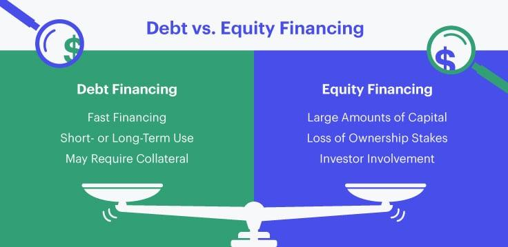

## Table of Contents

## What is long-term debt financing?

Long-term debt financing is when a company borrows money that it will pay back over a long period, usually more than one year. This type of financing is often used to buy big things like buildings or machines that the company needs to grow. The money can come from banks, through loans, or from investors, through bonds. When a company uses long-term debt, it agrees to make regular payments, which include both the interest on the loan and part of the money borrowed.

Using long-term debt can help a company because it allows them to spread out the cost of big purchases over time. This can make it easier for the company to manage its money and keep growing. However, there are risks too. If the company can't make the payments, it might have to sell assets or even go bankrupt. So, it's important for a company to carefully think about how much debt it can handle before taking on long-term debt financing.

## What is equity financing?

Equity financing is when a company raises money by selling shares of its business to investors. Instead of borrowing money that needs to be paid back, the company gives part of its ownership to the people who buy the shares. These investors become part-owners of the company and can benefit if the company does well and its value goes up. They might also get a share of the company's profits, called dividends.

This type of financing can be good for a company because it doesn't have to worry about paying back loans or interest. It can use the money to grow without the pressure of regular debt payments. However, giving up ownership means the original owners have less control over the company. They have to share decision-making with the new shareholders, who might have different ideas about how the company should be run.

## How does long-term debt affect a company's balance sheet?

When a company takes on long-term debt, it shows up on the balance sheet as a liability. This means the company owes money and has to pay it back over time. The debt is listed under long-term liabilities, which are debts that won't be paid off within the next year. This can make the company's total liabilities go up, which might make it look riskier to investors and lenders.

The other side of the balance sheet, the assets, might also change because of long-term debt. If the company uses the borrowed money to buy things like new buildings or machines, these will be added to the assets. So, while the liabilities go up, the assets might go up too. This can help the company grow, but it also means the company needs to make sure it can pay back the debt over time. If it can't, it might face financial problems.

## What are the typical sources of equity financing?

Equity financing comes from different places. One main source is selling shares to the public through a stock market. When a company does this, it's called an Initial Public Offering (IPO). People and big investors can buy these shares and become part-owners of the company. Another way is through private investors, like venture capitalists or angel investors. These are people or companies that give money to businesses they think will grow a lot. They usually get a big part of the company in return.

Another source is through crowdfunding. This is when a lot of people each give a little bit of money to help a company start or grow. They might get small shares or rewards for their help. Some companies also get equity financing from their founders or existing owners. They might put in more of their own money or convince family and friends to invest. Each of these sources has its own pros and cons, but they all help a company get the money it needs without taking on debt.

## What are the advantages of using long-term debt over equity financing?

One big advantage of using long-term debt over equity financing is that the company keeps all of its ownership. When a company borrows money, it doesn't have to give away any part of the business to the lender. This means the original owners stay in control and don't have to share decision-making with new shareholders. This can be really important for people who started the company and want to keep running it their way.

Another advantage is that the interest payments on long-term debt can be tax-deductible. This means the company can save money on taxes because the interest it pays on the loan can be subtracted from its taxable income. This can make long-term debt a cheaper way to get money compared to equity financing, where there's no tax break on the money given to shareholders. Plus, if the company does well, all the profits after paying the debt go to the original owners, not split with new investors.

## What are the disadvantages of long-term debt compared to equity financing?

One big problem with long-term debt is that the company has to pay it back, no matter what. If the company can't make the payments, it might get into big trouble. It could have to sell things it owns or even go bankrupt. With equity financing, the company doesn't have to pay the money back. If the business does badly, the shareholders just lose their investment, but the company doesn't owe them anything.

Another issue is that long-term debt can make the company look riskier to others. When a company has a lot of debt, it might be harder to get more loans or attract investors. Lenders and investors might worry that the company won't be able to pay back what it owes. With equity financing, the company doesn't have this problem. It can raise money without worrying about adding to its debt and scaring off future investors or lenders.

## How does equity financing impact ownership and control of a company?

When a company uses equity financing, it means they are selling parts of the company, called shares, to get money. This changes who owns the company. The people or groups that buy the shares become part-owners. The more shares they buy, the more of the company they own. This can mean the original owners, like the people who started the company, don't own as much of it anymore. If they sell a lot of shares, they might not even be the biggest owners anymore.

This change in ownership can also affect who gets to make decisions for the company. When new people own part of the company, they usually get a say in how it's run. They might vote on big choices, like who should be on the board of directors or if the company should do something new. If the new shareholders have different ideas about what the company should do, it can be hard for the original owners to keep control. They have to work with the new owners and might not always get to do things their way.

## What are the tax implications of choosing debt versus equity financing?

When a company chooses debt financing, it can get a tax break. The interest they pay on the debt can be taken off their taxable income. This means they pay less in taxes because the interest payments lower the amount of money they are taxed on. For example, if a company owes $100,000 in interest, they can subtract that from their income before figuring out their taxes. This can make debt financing cheaper because of the tax savings.

On the other hand, equity financing doesn't give a company the same kind of tax break. When a company gets money from selling shares, it doesn't get to subtract anything from its taxable income. The money from shareholders is not a cost that can be written off like interest payments. So, the company might end up paying more in taxes if it uses equity financing instead of debt. This is something companies think about when deciding how to raise money.

## How do interest rates influence the decision between debt and equity financing?

When interest rates are low, companies often choose debt financing because it's cheaper to borrow money. If the rates are low, the company pays less interest on the loans they take. This makes debt a good choice because it costs less, and the company can save money on taxes too. Low interest rates can make it easier for a company to handle the payments and still have money left to grow the business.

But if interest rates are high, debt financing can be more expensive. High rates mean the company has to pay more interest on the money they borrow. This can make it harder for the company to make the payments and could put them in a tight spot financially. When rates are high, companies might look at equity financing instead. With equity, they don't have to worry about high interest payments, even though they have to share ownership and control with new investors.

## What role does the company's growth stage play in choosing between debt and equity?

When a company is just starting out or in its early stages, it might choose equity financing more often. At this point, the company might not have a lot of money coming in yet, so it can be hard to make regular payments on a loan. By selling shares, the company can get the money it needs without worrying about paying it back right away. This can help the company grow and try new things without the pressure of debt. However, the founders will have to share ownership and maybe some control with the new investors.

As the company grows and becomes more stable, it might start to use more debt financing. By this time, the company might have a steady flow of money coming in, so it can handle the regular payments on a loan. Debt can be a good choice because it lets the company keep all its ownership and control. Plus, the interest payments on the debt can be taken off the company's taxes, which can save money. But the company needs to be careful not to take on too much debt, because if it can't make the payments, it could get into trouble.

## How do covenants in debt agreements affect a company's financial strategy?

Covenants in debt agreements are rules that a company has to follow when it borrows money. These rules are put in place by the lender to make sure the company doesn't do anything too risky with the borrowed money. For example, a covenant might say the company can't take on more debt or has to keep a certain amount of money in the bank. If the company breaks these rules, the lender can ask for their money back right away, which could be a big problem for the company.

Because of these covenants, a company has to be careful about how it manages its money. It might have to plan its financial strategy around these rules, making sure it can meet them while still growing the business. This can mean the company has to be more conservative with its spending and investments. It might also affect the company's decisions about taking on more debt or selling shares, as it tries to balance the need for money with the need to stay within the rules set by the lender.

## What are the long-term implications of a high debt-to-equity ratio?

A high debt-to-equity ratio means a company has a lot of debt compared to the money it got from selling shares. This can be risky for the company. If the company can't pay back the debt, it might have to sell things it owns or even go bankrupt. Lenders and investors might also see the company as riskier, which can make it harder to get more loans or attract new investors. They might charge higher interest rates or want a bigger part of the company in return for their money.

On the other hand, if the company can handle the debt well, it might be able to grow faster. The money from the debt can help the company buy new things or expand, which can make more money in the future. But it's a balance. The company needs to make sure it can pay back the debt and still make a profit. If it doesn't, the high debt could cause big problems down the road.

## References & Further Reading

[1]: ["Debt and Equity: Which Are Best for Funding Your Business?"](https://www.nerdwallet.com/article/small-business/equity-debt-financing) - Investopedia

[2]: Modigliani, F., & Miller, M. H. (1958). ["The Cost of Capital, Corporation Finance and the Theory of Investment"](https://www.aeaweb.org/aer/top20/48.3.261-297.pdf). The American Economic Review, 48(3), 261-297.

[3]: Ross, S. A., Westerfield, R. W., & Jaffe, J. F. (2010). ["Corporate Finance"](https://www.amazon.com/Corporate-Finance-Stephen-Ross/dp/1260772381) (10th ed.). McGraw-Hill Education.

[4]: ["Algo Trading: Winning Strategies and Their Rationale"](https://www.wiley.com/en-us/Algorithmic+Trading%3A+Winning+Strategies+and+Their+Rationale-p-9781118460146) by Ernie Chan

[5]: Frino, A., & Mollica, V. (2003). ["The Impact of Algorithmic Trading on Liquidity: Evidence from Australian Equity Markets."](https://www.semanticscholar.org/paper/The-effect-of-algorithmic-trading-on-market-around-Frino-Mollica/0f7b15f3fda80c281540572c09d98163a4d3742d) International Review of Financial Analysis, 12(3), 457-473.