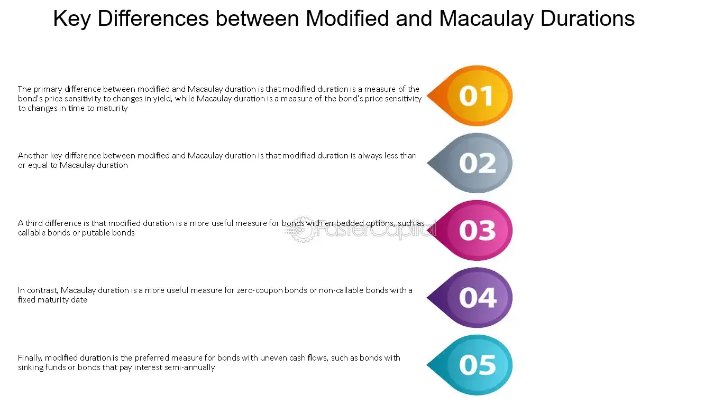

## Table of Contents

## What is duration in the context of bond valuation?

Duration in bond valuation is a measure of how long it takes for an investor to get back the bond's price through its cash flows. It's like figuring out the average time you have to wait to get your money back from the bond's interest payments and the final payment when the bond matures. The longer the duration, the more sensitive the bond's price is to changes in interest rates.

Think of duration as a way to understand how much risk you're taking with a bond. If interest rates go up, the price of a bond with a longer duration will drop more than one with a shorter duration. This is because you're locked into the bond's lower interest rate for a longer time. So, when looking at bonds, duration helps you see how much the bond's value might change if interest rates move.

## What is Macaulay duration and how is it calculated?

Macaulay duration is a way to measure how long it takes for an investor to get back the price they paid for a bond through its cash flows. It's like figuring out the average time you have to wait to get your money back from the bond's interest payments and the final payment when the bond matures. The key thing about Macaulay duration is that it gives you a single number that represents the weighted average time until you get all your money back.

To calculate Macaulay duration, you need to look at each cash flow the bond will give you, like the interest payments and the final payment at maturity. You then figure out how long you have to wait for each of these payments, and you give more importance (or weight) to the payments that are bigger or further away in time. You add up all these weighted times and divide by the bond's current price. This gives you the Macaulay duration, which tells you the average time until you get your investment back.

## What is Modified duration and how does it differ from Macaulay duration?

Modified duration is another way to measure how sensitive a bond's price is to changes in interest rates. It's closely related to Macaulay duration but is more directly useful for figuring out how much a bond's price might change if interest rates go up or down. To get the modified duration, you take the Macaulay duration and divide it by one plus the bond's yield to maturity (YTM) divided by the number of compounding periods per year. This adjustment makes the modified duration a more immediate measure of [interest rate](/wiki/interest-rate-trading-strategies) risk.

The main difference between Macaulay duration and modified duration is what they tell you. Macaulay duration tells you the average time it takes to get your money back from the bond's cash flows, like a weighted average of the time until each payment. Modified duration, on the other hand, tells you how much the bond's price will change for a small change in interest rates. It's a more practical tool for investors who want to know how much a bond's value might go up or down with changes in the interest rate environment.

## Why is duration important for bond investors?

Duration is important for bond investors because it helps them understand how sensitive their bond's price is to changes in interest rates. If interest rates go up, the price of a bond with a longer duration will drop more than one with a shorter duration. This is because a bond with a longer duration means you're locked into its interest rate for a longer time, so if rates rise, you miss out on better rates for longer. Knowing the duration helps investors pick bonds that fit their risk comfort level and how long they want to keep their money tied up.

Also, duration helps investors compare different bonds easily. It gives them a single number that shows how long it takes to get their money back on average. This makes it easier to see which bonds might be more or less risky based on how long the money is tied up and how much the bond's price might change with interest rate movements. By understanding duration, investors can make smarter choices about which bonds to buy or sell, depending on what they think interest rates will do in the future.

## How do Macaulay and Modified duration help in assessing interest rate risk?

Macaulay duration tells you the average time it takes to get your money back from a bond's cash flows. It's like figuring out how long you have to wait to get all your payments back, considering the size and timing of each payment. By knowing the Macaulay duration, you can see how long your money is tied up in the bond. This helps you understand the risk of interest rate changes because if rates go up, you're stuck with the bond's lower rate for a longer time if the duration is long. So, a bond with a longer Macaulay duration is more sensitive to interest rate changes.

Modified duration takes the Macaulay duration and makes it easier to see how much a bond's price might change if interest rates move. You calculate it by dividing the Macaulay duration by one plus the bond's yield to maturity divided by the number of compounding periods per year. This gives you a direct measure of how sensitive the bond's price is to interest rate changes. If the modified duration is high, a small change in interest rates can cause a big change in the bond's price. This makes modified duration a handy tool for bond investors to quickly assess how much risk they're taking with interest rate changes.

## Can you provide a simple example to illustrate the calculation of Macaulay and Modified duration?

Let's say you have a bond that costs $1,000 and pays $50 in interest every year for 3 years. At the end of the 3 years, you also get your $1,000 back. The bond's yield to maturity is 5%. To find the Macaulay duration, you need to figure out the present value of each payment and then find the weighted average time until you get your money back. The present value of the first $50 payment is about $47.62, the second $50 payment is about $45.35, and the third $50 payment is about $43.19. The present value of the $1,000 at the end is about $863.84. Now, you multiply each present value by the time until you get it: $47.62 * 1 year = $47.62, $45.35 * 2 years = $90.70, $43.19 * 3 years = $129.57, and $863.84 * 3 years = $2,591.52. Add these up and you get $2,859.41. Divide this by the bond's price of $1,000, and you get a Macaulay duration of about 2.86 years.

To find the Modified duration, you take the Macaulay duration and divide it by one plus the yield to maturity divided by the number of compounding periods per year. In this case, the yield to maturity is 5%, and since the bond pays annually, you divide 5% by 1, which is still 5%. So, you divide the Macaulay duration of 2.86 years by 1 + 0.05 = 1.05. This gives you a Modified duration of about 2.72 years. This means if interest rates go up by 1%, the bond's price will go down by about 2.72%. If interest rates go down by 1%, the bond's price will go up by about 2.72%. This helps you see how sensitive the bond's price is to changes in interest rates.

## How does the yield to maturity affect Macaulay and Modified duration?

The yield to maturity (YTM) affects both Macaulay and Modified duration because it changes how much each future cash flow is worth right now. When the YTM goes up, the present value of the bond's future payments goes down. This means the bond's price drops, and the Macaulay duration, which is a weighted average of the time until you get your money back, will change. If the YTM is higher, the cash flows further in the future are worth less now, so the weights on those later payments go down, making the Macaulay duration shorter.

For Modified duration, the effect of YTM is even clearer. Modified duration is calculated by dividing the Macaulay duration by one plus the YTM divided by the number of compounding periods per year. So, when the YTM goes up, the denominator in this formula gets bigger, making the Modified duration smaller. This means the bond's price becomes less sensitive to changes in interest rates when the YTM is higher. In simple terms, a higher YTM makes both the Macaulay and Modified duration shorter, showing that the bond's price will be less affected by interest rate changes.

## What are the limitations of using Macaulay and Modified duration for bond analysis?

Using Macaulay and Modified duration for bond analysis has some limitations. One big problem is that both measures assume interest rates change by the same amount across all time periods. But in real life, interest rates can change differently for short-term and long-term bonds. This means Macaulay and Modified duration might not show the full picture of how a bond's price could change if interest rates move in complicated ways. Also, these measures don't take into account other risks like the chance that the bond issuer might not be able to pay back the bond, which can affect the bond's value a lot.

Another limitation is that Macaulay and Modified duration work best for small changes in interest rates. If interest rates change a lot, these measures can be less accurate because they don't capture how bond prices can change in a non-linear way. For example, if interest rates go up a lot, the bond's price might drop more than what the Modified duration predicts. So, while these measures are useful for understanding how sensitive a bond's price is to interest rate changes, they might not be perfect for big or complicated changes in the interest rate environment.

## How do convexity and duration interact in bond portfolio management?

Duration and convexity are two important measures that help bond investors manage their portfolios. Duration, like Macaulay or Modified duration, tells you how sensitive a bond's price is to changes in interest rates. It's a good first guess at how much a bond's price might change if interest rates go up or down. But duration alone isn't perfect because it assumes interest rates change in a straight line, which isn't always true. That's where convexity comes in. Convexity measures how the bond's price changes in a more curved way when interest rates move a lot. It's like adding a fine-tuning knob to your understanding of how bond prices react to interest rate changes.

In bond portfolio management, using both duration and convexity together gives a better picture of risk. If you only use duration, you might think a bond's price will change in a certain way, but if interest rates move a lot, the actual change might be bigger or smaller than expected. Convexity helps fix this by showing the curve in the bond's price reaction. So, by looking at both duration and convexity, bond investors can make smarter choices about which bonds to buy or sell. This helps them manage their portfolios better, especially when they expect big swings in interest rates.

## In what scenarios would Modified duration be a more appropriate measure than Macaulay duration?

Modified duration is a better choice than Macaulay duration when you want to know how much a bond's price will change if interest rates go up or down. It's a quick way to see how sensitive the bond is to interest rate changes. For example, if you're thinking about buying a bond and you want to know what will happen to its price if the interest rates change a little bit, Modified duration gives you a clear answer. It's like a direct tool that tells you, "If interest rates go up by 1%, the bond's price will go down by this much."

On the other hand, Macaulay duration tells you how long it takes to get your money back from a bond, but it doesn't directly tell you about the bond's price sensitivity to interest rate changes. So, if your main concern is figuring out how much risk you're taking with interest rate changes, Modified duration is more useful. It's especially handy when you're comparing different bonds and want to see which one will be less affected by interest rate movements. In short, if you want to focus on interest rate risk, Modified duration is the way to go.

## How can investors use Macaulay and Modified duration to construct a bond ladder?

Investors can use Macaulay and Modified duration to build a bond ladder, which is a way of spreading out their investments in bonds so they mature at different times. By looking at the Macaulay duration of each bond, an investor can see how long it takes to get their money back on average. They can pick bonds with different Macaulay durations to create a ladder where some bonds mature soon and others mature later. This helps them plan when they'll get their money back and how long their money will be tied up in each bond. For example, if an investor wants to have money coming in every year, they might choose bonds with Macaulay durations of 1, 2, 3, and 4 years.

Modified duration helps investors understand how much the price of each bond in their ladder might change if interest rates go up or down. This is important because if interest rates change, the value of the bonds in the ladder could go up or down. By knowing the Modified duration, investors can see which bonds are more sensitive to interest rate changes and balance their ladder to manage this risk. For instance, if an investor expects interest rates to rise, they might choose bonds with shorter Modified durations at the beginning of the ladder to minimize the impact of falling bond prices. This way, they can keep their bond ladder stable and get their money back in a way that fits their financial plans.

## What advanced techniques involve the use of Macaulay and Modified duration in hedging strategies?

Investors use Macaulay and Modified duration to create hedging strategies that protect their bond portfolios from interest rate changes. One way to do this is by using interest rate swaps or futures contracts. If an investor thinks interest rates will go up, they might want to hedge their bond portfolio to reduce the risk of their bond prices falling. They can use Modified duration to figure out how much the bond prices might change and then use an interest rate swap or futures contract to offset that change. For example, if a bond has a Modified duration of 5 years, a 1% increase in interest rates would make the bond's price drop by about 5%. The investor can then use a swap or futures contract to make money if interest rates go up, which would help balance out the loss from the bond's price drop.

Another advanced technique is immunization, which involves matching the duration of assets and liabilities to protect against interest rate risk. An investor might have a future cash need, like paying for a child's college tuition, and they want to make sure they have enough money at that time. They can use Macaulay duration to pick bonds that will give them the money back at the right time. At the same time, they use Modified duration to hedge against interest rate changes. By balancing the Macaulay duration of their bonds with their cash needs and using Modified duration to manage interest rate risk, they can create a strategy that helps ensure they have the money they need when they need it, no matter what happens with interest rates.

## What is Macaulay Duration and How is Weighted Time Calculated?

Macaulay Duration represents the weighted average time until a bondholder receives the bond’s cash flows, effectively measuring a bond's time to maturity in terms of present value. It serves as a critical tool for investors seeking to understand how the timing of cash flows impacts a bond's price behavior relative to changing interest rates. Macaulay Duration is particularly useful for straightforward bonds that lack complex features such as embedded options, which can complicate cash flow projections and, hence, the duration calculation.

The importance of Macaulay Duration in portfolio management cannot be overstated. It assists investors in synchronizing their investment horizons with liability structures, ensuring that assets meet obligations when they come due. For example, pension funds often use Macaulay Duration to align bond investments with future liabilities, minimizing the risk of cash shortfalls.

Calculating Macaulay Duration involves understanding the present value of each cash flow, which is discounted back to its present value at the bond’s yield. Each cash flow's timing is crucial in this calculation, affecting its weight in determining overall duration. The formula for Macaulay Duration $D$ is expressed as:

$$
D = \frac{\sum_{t=1}^{n} \left( \frac{t \times C_t}{(1+r)^t} \right)}{\sum_{t=1}^{n} \left( \frac{C_t}{(1+r)^t} \right)}
$$

Where:
- $t$ is the time period in which the cash flow is received,
- $C_t$ is the cash flow at time $t$,
- $r$ is the yield to maturity of the bond,
- $n$ is the total number of periods.

By using the aforementioned formula, investors can obtain a quantitative measure that facilitates the evaluation of potential price [volatility](/wiki/volatility-trading-strategies) due to interest rate changes over the bond’s life. This calculation underpins more sophisticated financial strategies such as immunization, where firms match the duration of assets and liabilities to mitigate interest rate risk. Understanding Macaulay Duration thus allows investors and portfolio managers to strategically manage bond portfolios with a keen eye on future cash flow alignment and risk mitigation.

## What is Modified Duration and how does it relate to price sensitivity to interest rate changes?

Modified Duration is a critical financial metric that extends upon the concept of Macaulay Duration, serving as an essential tool for estimating how a bond's price is expected to change with fluctuations in interest rates. While Macaulay Duration helps in understanding the weighted average time until a bondholder receives the bond's cash flows, Modified Duration adapts this to reflect how sensitive the bond's price is to a change in interest rate, providing a direct measure of this price sensitivity.

Calculated by adjusting the Macaulay Duration for the bond's yield to maturity, Modified Duration is expressed mathematically as:

$$
\text{Modified Duration} = \frac{\text{Macaulay Duration}}{1 + \frac{YTM}{n}}
$$

Where $YTM$ is the yield to maturity of the bond and $n$ is the number of compounding periods per year. This adjustment translates the time-based measure of risk into a percentage-based measure, indicating the percentage change in the bond's price for each 1% change in interest rates.

Modified Duration is crucial when assessing the impact of potential interest rate changes on a bond's price. A higher Modified Duration suggests greater price volatility in response to interest rate movements, signaling higher risk. Conversely, bonds with lower Modified Durations are less sensitive to rate changes. This sensitivity makes Modified Duration particularly valuable for bonds with embedded options or other complex features, as these features often lead to more complicated cash flow patterns.

In active trading strategies, Modified Duration enables traders and portfolio managers to better predict bond price movements and adjust their positions accordingly. By understanding how a bond's price responds to interest rate adjustments, portfolio managers can fine-tune their strategies to mitigate risk and optimize returns. For instance, if interest rates are expected to rise, a manager might shift the portfolio towards bonds with shorter Modified Duration to reduce potential losses.

For [algorithmic trading](/wiki/algorithmic-trading), the integration of Modified Duration allows algorithms to make swift, informed decisions based on real-time interest rate shifts. This helps maintain portfolio balance and enhance risk-adjusted returns, making Modified Duration indispensable in modern fixed-income trading and investment strategies.

## What are the key differences between Macaulay and Modified Durations?

While Macaulay Duration and Modified Duration are closely related, they serve different purposes and offer distinct insights into bond investment analysis.

Macaulay Duration provides an indication of when, on average, a bondholder can expect to receive the bond’s cash flows, expressed in years. This aspect is crucial for matching the duration of assets and liabilities, a strategy often referred to as duration matching or immunization. The Macaulay Duration is calculated as:

$$

\text{Macaulay Duration} = \sum \left( \frac{t \times C_t}{(1+y)^t} \right) / \text{Current Bond Price} 
$$

where $t$ is the time period, $C_t$ is the cash flow in time period $t$, and $y$ is the yield to maturity.

In contrast, Modified Duration is a derivation of Macaulay Duration and measures a bond's price sensitivity to interest rate changes rather than average cash flow timing. By providing a direct measure of price change, it is especially useful for active trading and managing interest rate risk. Modified Duration is represented as:

$$

\text{Modified Duration} = \frac{\text{Macaulay Duration}}{1+y} 
$$

where $y$ reflects the bond’s yield to maturity. This adjustment for yield allows Modified Duration to reflect real-time interest rate movements more accurately. Consequently, in a fluctuating interest rate environment, it gives portfolio managers a more responsive tool for predicting and mitigating potential price volatility.

While Macaulay Duration is essential for long-term strategic planning, especially in establishing immunization strategies, Modified Duration serves as a critical tool for tactical adjustments, offering a more precise gauge for assessing immediate price impacts due to changes in yields. This dynamic adaptability makes Modified Duration integral for more complex bond portfolios and in executing active trading strategies.

## What is the relationship between Algorithmic Trading and Bond Duration?

Algorithmic trading has fundamentally transformed bond trading strategies, making them more efficient by leveraging complex algorithms that incorporate key financial metrics such as bond durations. Bond duration, especially Macaulay and Modified durations, plays a critical role in algorithmic trading methodologies due to their ability to quantify interest rate risk, which is essential for developing dynamic trading strategies.

The precise calculation of Macaulay and Modified durations enables algorithms to fine-tune trading strategies based on a bond's sensitivity to interest rate changes. Macaulay Duration provides a weighted average measure of the time until cash flows are received, and is essential for understanding the overall time frame required to recover the bond's cost. However, when it comes to practical trading applications, Modified Duration, which adjusts this measure based on the yield, is used for assessing how bond prices might fluctuate given a change in interest rates.

The formula for Macaulay Duration $D_M$ is:

$$
D_M = \frac{\sum \left(\frac{C_t}{(1+y)^t} \cdot t \right)}{P}
$$

where $C_t$ represents the cash flow at time $t$, $y$ is the yield, and $P$ is the bond's current price. Modified Duration $D_{MOD}$ adjusts this to account for yield's influence:

$$
D_{MOD} = \frac{D_M}{1+y}
$$

These calculations allow algorithms to make precise predictions about a bond's price movement in response to interest rate shifts, facilitating immediate trade adjustments. For example, in a rising interest rate environment, algorithms using Modified Duration can identify bonds likely to experience higher price sensitivity and adjust positions accordingly to minimize potential losses.

In addition, algorithms excel in rapidly processing vast amounts of market data to detect slight variances in interest rates and respond in real-time. This ability to maintain portfolio balance and optimize risk through swift execution is a hallmark of effective algorithmic trading systems. By continuously recalibrating bond exposures based on real-time interest rate data, algorithmic trading ensures that the risk-reward profile is constantly optimized.

Python, with libraries such as NumPy and pandas, is widely used to implement these algorithms due to its capacity for handling numerical data and performing complex calculations efficiently. For instance, a simple Python code snippet to calculate Modified Duration might look like this:

```python
import numpy as np

def calculate_modified_duration(cash_flows, years, yield_rate):
    macaulay_duration = np.sum((cash_flows / (1 + yield_rate) ** years) * years) / np.sum(cash_flows / (1 + yield_rate) ** years)
    modified_duration = macaulay_duration / (1 + yield_rate)
    return modified_duration

# Example usage
cash_flows = np.array([50, 50, 1050])  # Cash flows of the bond
years = np.array([1, 2, 3])  # Corresponding years
yield_rate = 0.05  # 5% yield

mod_duration = calculate_modified_duration(cash_flows, years, yield_rate)
print(mod_duration)
```

Such implementations allow traders to systematically quantify and manage interest rate risk efficiently, highlighting the significant role bond duration plays within algorithmic trading frameworks.

## References & Further Reading

[1]: Fabozzi, F. J. (2012). ["Bond Markets, Analysis, and Strategies"](https://books.google.com/books/about/Bond_Markets_Analysis_and_Strategies_ten.html?id=bQpNEAAAQBAJ). Prentice Hall.

[2]: Hull, J. C. (2018). ["Options, Futures, and Other Derivatives"](https://www.semanticscholar.org/paper/Options%2C-Futures%2C-and-Other-Derivatives-Hull/89bdee500c8623864fc9eb7a471546aa713acc44). Pearson.

[3]: Martellini, L., Priaulet, P., & Priaulet, S. (2003). ["Fixed-Income Securities: Valuation, Risk Management and Portfolio Strategies"](https://www.amazon.com/Fixed-Income-Securities-Valuation-Management-Strategies/dp/0470852771). Wiley.

[4]: Duarte, J., Longstaff, F. A., & Yu, F. (2007). ["Risk and Return in Fixed-Income Arbitrage: Nickels in Front of a Steamroller?"](https://academic.oup.com/rfs/article-abstract/20/3/769/1563940). Review of Financial Studies, 20(5), 769-811.

[5]: Kolb, R. W., & Overdahl, J. A. (2006). ["Understanding Futures Markets"](https://www.amazon.com/Understanding-Futures-Markets-Robert-Kolb/dp/1405134038). Wiley.