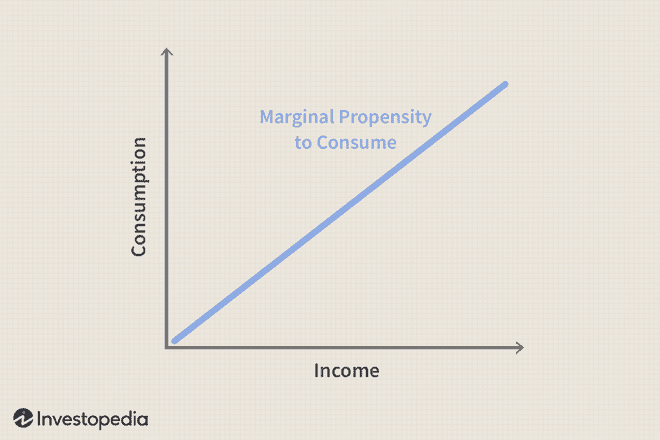

In today's complex economic landscape, understanding consumer behavior and its impact on the economy is crucial. The Marginal Propensity to Consume (MPC) and the Marginal Propensity to Save (MPS) are pivotal concepts that offer insights into how individuals allocate their income between consumption and savings. These metrics are essential for analyzing consumer spending patterns, which have far-reaching implications for economic stability and policy-making. 

MPC represents the proportion of additional income that a consumer is likely to spend rather than save, highlighting the direct relationship between income fluctuations and consumption behaviors. Conversely, MPS measures the fraction of extra income that a consumer will save rather than spend. Together, these indicators are fundamental to economic theories and models, particularly in understanding how changes in income levels can propagate through an economy, influencing growth and stability.



Moreover, the relevance of MPC and MPS extends beyond traditional economic settings into the rapidly evolving world of algorithmic trading and financial markets. Algorithmic trading strategies can benefit from incorporating these economic indicators to better predict market movements, especially in sectors driven by consumer activities. Understanding consumer spending and saving behaviors can enhance the development of predictive models and improve risk management practices. 

By examining MPC and MPS, we can obtain a comprehensive understanding of consumer behavior's impact on both individual financial health and broader economic dynamics. This exploration also underscores the potential for these concepts to inform investor strategies and economic policy decisions, offering a nuanced perspective on the interplay between consumer actions and economic trends.

## Table of Contents

## Understanding Marginal Propensity to Consume (MPC)

Marginal Propensity to Consume (MPC) is a fundamental economic concept that quantifies the proportion of additional income that a household dedicates to consumption. It is a crucial measure in understanding how changes in income influence consumer spending, thereby impacting overall economic activity. The MPC is typically represented as a fraction, where any increase in income leads to a corresponding increase in consumption.

To elucidate the concept, consider a household that receives an additional $1,000. If the household spends $800 of this additional income on goods and services, the MPC would be 0.8 ($800 ÷ $1,000). This indicates that 80% of the extra income is consumed, while the remaining 20% is saved.

Mathematically, MPC can be expressed as:

$$
\text{MPC} = \frac{\Delta C}{\Delta Y}
$$

where $\Delta C$ is the change in consumption, and $\Delta Y$ is the change in income. This formula provides a straightforward method for calculating MPC when changes in income and consumption are known.

Empirical studies suggest that MPC values can vary significantly depending on the economic situation and demographic characteristics. Typically, lower-income households demonstrate a higher MPC because a larger portion of additional income is needed to cover essential expenses. Conversely, wealthier households tend to save more, leading to a lower MPC.

The significance of MPC extends beyond individual financial behavior; it plays a pivotal role in broader economic dynamics. A high MPC within an economy suggests robust consumer demand, which can spur economic growth by fostering increased production and investment. In contrast, a low MPC might indicate a preference for saving, which can limit immediate economic expansion but contribute to higher capital accumulation in the long term.

Consider the economic implications of varying MPC levels in different contexts. For example, during an economic downturn, policies that increase disposable income—such as tax cuts or direct financial transfers—can be particularly effective if the targeted groups exhibit a high MPC. Increased consumer spending can then stimulate demand, accelerating economic recovery.

To better illustrate these dynamics, let's examine a hypothetical example using Python:

```python
# Example of calculating and illustrating MPC
def calculate_mpc(change_in_income, change_in_consumption):
    return change_in_consumption / change_in_income

income_changes = [500, 1000, 1500]
consumption_changes = [400, 800, 1100]

mpc_values = [calculate_mpc(y, c) for y, c in zip(income_changes, consumption_changes)]

for i, mpc in enumerate(mpc_values):
    print(f"For an income change of ${income_changes[i]}, the MPC is {mpc:.2f}")
```

This code calculates the MPC for different levels of income change and illustrates how consumers might respond to income variations. Understanding MPC allows economists and policymakers to predict spending behaviors and craft policies that effectively target economic growth and stability. The interplay between income changes and consumer expenditure is a foundational aspect of economic planning and policy-making, underpinning decisions at both microeconomic and macroeconomic levels.

## Understanding Marginal Propensity to Save (MPS)

The Marginal Propensity to Save (MPS) is a crucial economic metric that quantifies the proportion of an incremental increase in household income that is directed towards savings rather than consumption. Representing the opposite behavior to the Marginal Propensity to Consume (MPC), MPS is integral to understanding consumer decisions between spending and saving income. Mathematically, the MPS is expressed as:

$$
\text{MPS} = \frac{\Delta S}{\Delta Y}
$$

where $\Delta S$ represents the change in savings and $\Delta Y$ represents the change in income.

A higher MPS indicates a stronger preference for saving additional income rather than spending it. This inclination can have significant macroeconomic implications. If widespread within an economy, a high MPS can dampen economic growth because fewer resources are funneled back into the economy via consumption, reducing the overall demand for goods and services. Consequently, businesses may experience slower revenue growth, potentially affecting employment rates and wage growth.

For policymakers, understanding the MPS is imperative in crafting effective fiscal policies, particularly during economic downturns or periods of sluggish growth. By recognizing which segments of the economy have a higher tendency to save—often influenced by factors such as income levels, cultural attitudes towards saving, and economic uncertainty—policies can be better tailored. For instance, targeted tax reductions or stimulus payments to low-income or consumption-oriented households with a high MPC can stimulate demand more efficiently than blanket measures.

The implications of MPS extend into personal financial planning as well. Individuals with a high propensity to save often focus on long-term financial goals, such as retirement planning, emergency funds, or investments in assets that provide future income. While saving is generally a prudent financial strategy, overemphasis on saving, especially in low-interest environments, might lead to suboptimal returns compared to diversified investment strategies that balance risk and growth.

Ultimately, the dynamics of MPS provide valuable insights into the aggregate behavior of consumers and the broader economic landscape. Policymakers and financial advisors can leverage this understanding to foster both macroeconomic stability and individual financial health.

## The Economic Implications of MPC and MPS

The concepts of Marginal Propensity to Consume (MPC) and Marginal Propensity to Save (MPS) are pivotal in shaping economic modeling and policy-making. These indicators provide crucial insights that allow economists and policymakers to craft responsive fiscal policies. The significance of MPC and MPS is emphasized in Keynesian economic theory, which posits that these metrics are fundamental in understanding the impact of fiscal policies on economic output.

**Keynesian Theory and Fiscal Policy**

In Keynesian economics, the MPC and MPS are used to evaluate the aggregate impact of fiscal initiatives on economic activity. The Keynesian multiplier effect is one of the most critical mechanisms illustrating this relationship. The formula for the Keynesian multiplier (k) is expressed as:

$$
k = \frac{1}{1 - MPC} = \frac{1}{MPS}
$$

This formula demonstrates how a higher MPC leads to a larger multiplier effect. Essentially, an increase in government spending results in a more substantial overall increment in national income as households with a high MPC will spend a significant portion of this new income, thereby propelling further economic activities. Consequently, a low MPS, closely linked to higher consumption, also enhances the multiplier effect, underscoring the relationship between these indicators and potential economic expansion.

**Taxation and Government Spending**

MPC and MPS are also instrumental in taxation policies. A relatively high MPC suggests that tax cuts will likely translate into increased consumer spending, providing a much-needed demand boost during economic downturns. Policy decisions regarding government spending and taxation rates often rely on understanding the prevailing MPC in the economy to effectively stimulate growth or cool down inflationary pressures.

**Real-World Case Studies**

Numerous real-world examples have showcased the significant influence of MPC and MPS on economic outcomes:

1. **The 2008 Financial Crisis**: During and after the crisis, several governments worldwide implemented stimulus packages designed to rejuvenate consumer confidence and spending. The effectiveness of these measures was closely linked to the calculated MPC, with higher consumer spending acting as a crucial driver of recovery.

2. **Japan's Lost Decade**: In Japan during the 1990s, despite various efforts to stimulate the economy, low consumer spending and high savings rates (high MPS) curtailed the multiplier effect, complicating recovery efforts. These economic conditions highlighted the importance of understanding consumer behavior to devise effective fiscal interventions.

3. **The COVID-19 Pandemic**: In the wake of the COVID-19 pandemic, governments across the globe scrambled to implement fiscal measures to counteract the economic fallout. By analyzing MPC and tailoring stimulus checks, some governments aimed to kickstart consumer spending at a critical time, providing a lifeline to stagnating economies.

These examples underscore how changes in MPC and MPS can significantly alter the trajectory of economic outcomes, proving vital for both short-term fiscal strategies and long-term economic health. Understanding these concepts enables policymakers to tailor initiatives effectively, ensuring that government interventions support economic stability and growth adequately.

## Connection to Algorithmic Trading

Algorithmic trading, characterized by its reliance on quantitative analysis, is increasingly utilizing economic indicators like the Marginal Propensity to Consume (MPC) and Marginal Propensity to Save (MPS) to inform and enhance trading strategies. These economic metrics provide nuanced insights into consumer behavior, enabling traders to anticipate market movements, particularly in sectors driven by consumer activities.

The MPC, which measures the fraction of additional income consumers spend rather than save, can be a valuable indicator for predicting shifts in market demand. A high MPC implies increased consumer spending, which typically translates into heightened demand for goods and services. This surge in demand can lead to higher stock prices in consumer staples and discretionary sectors, which are closely monitored by traders employing algorithmic strategies.

Conversely, the MPS reflects the tendency for households to save rather than spend additional income. A high MPS may indicate a more cautious consumer base, potentially leading to a slowdown in market activity as less income is circulated in the economy. Understanding these tendencies is crucial for algorithmic traders aiming to optimize their risk management strategies by anticipating potential market volatilities induced by changes in consumer saving behaviors.

Algorithmic trading models can integrate MPC and MPS data to develop predictive models. By analyzing historical data, these models can identify patterns and correlations between consumer propensity metrics and market performance. For instance, during economic downturns, if the MPS increases significantly, algorithms can adjust trading positions to more defensive assets, thereby managing risk more effectively.

Python, a widely-used programming language in [algorithmic trading](/wiki/algorithmic-trading), can be employed to incorporate these indicators into trading models. Below is a basic example illustrating how Python can be used to integrate MPC and MPS data into a trading strategy:

```python
import pandas as pd

def calculate_MPC(income_data, consumption_data):
    mpc = (consumption_data.diff() / income_data.diff()).fillna(0)
    return mpc

def calculate_MPS(income_data, saving_data):
    mps = (saving_data.diff() / income_data.diff()).fillna(0)
    return mps

# Sample historical income, consumption, and saving data
income_data = pd.Series([1000, 1200, 1500, 1800, 2000])
consumption_data = pd.Series([800, 960, 1200, 1440, 1600])
saving_data = pd.Series([200, 240, 300, 360, 400])

mpc = calculate_MPC(income_data, consumption_data)
mps = calculate_MPS(income_data, saving_data)

# Analysis based on calculated MPC and MPS
if mpc.iloc[-1] > 0.7:
    print("High consumer spending propensity detected. Consider upbeat market sectors.")
elif mps.iloc[-1] > 0.3:
    print("Increase in savings detected. Consider adjusting to defensive market positions.")
```

By continuously refining these algorithmic models with up-to-date MPC and MPS data, traders can improve their market predictions and performance. This approach allows for a dynamic adjustment to economic changes, maximizing the efficiency of trading strategies while minimizing potential risks associated with consumer behavior shifts. As financial markets and technology evolve, the integration of these economic indicators into algorithmic trading models is anticipated to become increasingly sophisticated and integral to market success.

## Conclusion

The Marginal Propensity to Consume (MPC) and the Marginal Propensity to Save (MPS) are fundamental measures that provide key insights into economic behavior and the intricate workings of financial markets. These metrics help decode consumer tendencies, such as the likelihood to spend or save additional income, thereby offering a clear picture of economic stability and the potential for growth or contraction.

For investors, understanding MPC and MPS can reveal shifts in consumer sentiment and spending patterns, influencing investment strategies. Policymakers can leverage these metrics to craft effective fiscal policies that stimulate economic activity or stabilize the economy during turbulent times. By analyzing changes in MPC and MPS, policymakers can predict the impact of economic stimuli, such as tax cuts or direct payments, on overall economic output.

Incorporating MPC and MPS into algorithmic trading offers an additional dimension to market predictions. Traders utilizing these economic indicators can better anticipate market trends, especially in sectors heavily reliant on consumer activity. By integrating MPC and MPS into predictive trading models, algorithmic strategies can refine risk management and enhance portfolio performance, potentially gaining an edge in volatile markets.

Future research stands poised to further illuminate the applications of MPC and MPS within economics and finance. As data analytics and [machine learning](/wiki/machine-learning) technologies advance, these concepts will likely be translated into even more sophisticated models, allowing for real-time analysis and application. This progression will aid both economic strategy and financial market operations, reinforcing the role of MPC and MPS as crucial tools in understanding and predicting economic dynamics.

## References & Further Reading

[1]: Keynes, J. M. (1936). ["The General Theory of Employment, Interest, and Money."](http://files.ethz.ch/isn/125515/1366_KeynesTheoryofEmployment.pdf) Palgrave Macmillan.

[2]: Friedman, M. (1957). ["A Theory of the Consumption Function."](https://www.nber.org/books-and-chapters/theory-consumption-function) Princeton University Press.

[3]: Dynan, K. E., Skinner, J., & Zeldes, S. P. (2004). ["Do the Rich Save More?"](https://www.journals.uchicago.edu/doi/abs/10.1086/381475) The Quarterly Journal of Economics, 119(2), 399-444.

[4]: Mankiw, N. G. (2019). ["Macroeconomics, Ninth Edition."](https://www.amazon.com/Macroeconomics-N-Gregory-Mankiw/dp/1464182892) Worth Publishers.

[5]: Carroll, C. D. (1997). ["Buffer-Stock Saving and the Life Cycle/Permanent Income Hypothesis."](https://academic.oup.com/qje/article-abstract/112/1/1/1870884) The Quarterly Journal of Economics, 112(1), 1-55.

[6]: Thaler, R. H. (1990). ["Anomalies: Saving, Fungibility, and Mental Accounts."](https://pubs.aeaweb.org/doi/pdfplus/10.1257/jep.4.1.193) Journal of Economic Perspectives, 4(1), 193-205.

[7]: Lo, A. W. (2016). ["Adaptive Markets: Financial Evolution at the Speed of Thought."](https://books.google.com/books/about/Adaptive_Markets.html?id=Q4d7DwAAQBAJ) Princeton University Press.