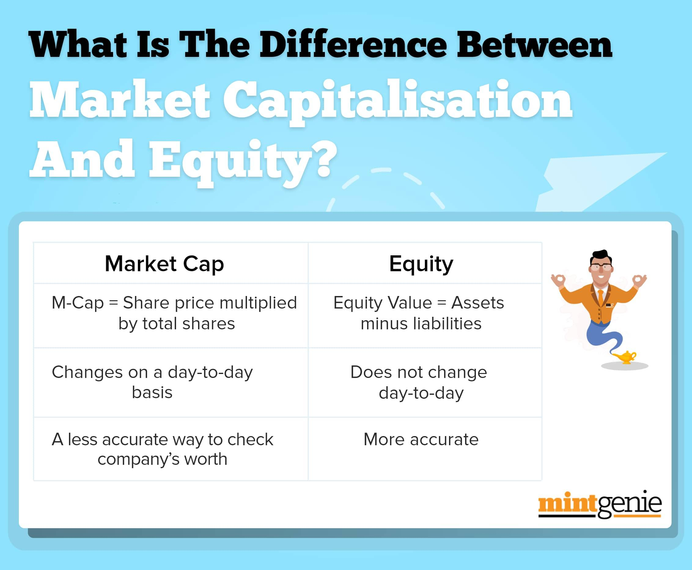

## Table of Contents

## What is market capitalization?

Market capitalization, often called market cap, is the total value of all the shares of a company. It is calculated by multiplying the current stock price by the total number of shares outstanding. This number gives investors an idea of the size of a company and its value in the market. For example, if a company has 1 million shares and each share is worth $50, the market cap would be $50 million.

Market cap is important because it helps investors compare companies of different sizes. It is used to classify companies into different categories like small-cap, mid-cap, and large-cap. Small-cap companies usually have a market cap of less than $2 billion, mid-cap companies range from $2 billion to $10 billion, and large-cap companies are above $10 billion. By knowing a company's market cap, investors can make better decisions about where to invest their money.

## What is equity?

Equity is the value that would be returned to a company's shareholders if all of the company's assets were sold and all of its debts were paid off. It represents the ownership interest in a company. When people talk about equity, they are usually referring to the shareholders' equity, which is the total amount of money that would be returned to shareholders after all debts are settled.

In simple terms, if you own shares in a company, you own a piece of that company's equity. Equity can also refer to the value of an asset after subtracting any debts secured against it. For example, if you own a house worth $200,000 and you owe $150,000 on your mortgage, your equity in the house is $50,000. This concept is important for understanding both personal finance and business valuation.

## How is market capitalization calculated?

Market capitalization, or market cap, is figured out by taking the price of one share of a company's stock and multiplying it by the total number of shares that are out there. For example, if a company's stock price is $10 and there are 1 million shares, the market cap would be $10 million. This number tells you how much the whole company is worth based on what people are willing to pay for its stock.

This calculation is important because it helps people see how big a company is and compare it with other companies. If you want to know if a company is small, medium, or large, looking at its market cap can give you a good idea. It's a simple way to understand a company's size and value in the stock market.

## How is equity determined in a company?

Equity in a company is figured out by looking at what the company owns and what it owes. First, you add up everything the company has, like buildings, equipment, and cash. These are called assets. Then, you subtract everything the company owes, like loans and bills. These are called liabilities. What's left after subtracting the liabilities from the assets is the company's equity. It's like figuring out how much of the company is really owned by the people who have shares in it.

This number is important because it shows the real value of the company that belongs to the shareholders. If the company sold everything it owns and paid off all its debts, the equity is what would be left to give back to the shareholders. It's a way to see how healthy a company is financially. If the equity is high, it means the company is doing well and has a lot of value for its owners. If it's low or negative, it might mean the company is struggling with debts.

## Why are market capitalization and equity important for investors?

Market capitalization and equity are important for investors because they help them understand the size and value of a company. Market cap shows how much the whole company is worth based on what people are willing to pay for its stock. This helps investors see if a company is big or small, which can affect how risky it is to invest in it. If a company has a big market cap, it might be more stable but might not grow as fast. A small market cap might mean more risk but also more chance for the company to grow quickly.

Equity tells investors how much of the company's value really belongs to the shareholders after all the bills are paid. It's like figuring out what's left if the company sold everything and paid off all its debts. This number helps investors see if the company is financially healthy. If equity is high, it means the company has a lot of value for its owners, which is good. If it's low or negative, it might mean the company is struggling, which could be a warning sign for investors.

Both market cap and equity give investors important information they need to make smart choices about where to put their money. By looking at these numbers, investors can decide if a company is a good fit for their investment goals, whether they want to grow their money quickly or keep it safe and steady.

## What are the key differences between market capitalization and equity?

Market capitalization and equity are both ways to measure a company's value, but they look at it from different angles. Market capitalization, or market cap, is all about what the stock market thinks a company is worth. It's calculated by taking the current price of one share and multiplying it by the total number of shares out there. So, market cap shows the total value of a company based on what people are willing to pay for its stock at that moment. It's like a snapshot of how the market sees the company's worth.

Equity, on the other hand, looks at what's left for shareholders if the company sold everything it owns and paid off all its debts. It's found by subtracting the company's liabilities from its assets. Equity tells you the real value of the company that belongs to the shareholders. It's a more internal measure of the company's financial health and shows how much the company is worth after all the bills are paid. While market cap can change every day with stock prices, equity is more about the company's long-term financial position.

Both market cap and equity are important for investors, but they give different kinds of information. Market cap helps investors see how big a company is and how it's valued by the market, which can affect investment decisions based on risk and growth potential. Equity, meanwhile, gives a clearer picture of the company's financial stability and how much value is really there for shareholders. Understanding both can help investors make smarter choices about where to put their money.

## How do market capitalization and equity affect a company's valuation?

Market capitalization and equity both play big roles in figuring out how much a company is worth, but they do it in different ways. Market capitalization, or market cap, is all about what the stock market thinks a company is worth right now. It's found by taking the price of one share and multiplying it by the total number of shares. So, if people are willing to pay a lot for the company's stock, the market cap will be high. This number helps investors see if a company is big or small and can affect how they decide to invest their money. A high market cap might mean the company is stable but might not grow as fast, while a low market cap might mean more risk but also more chance for growth.

Equity, on the other hand, looks at what's left for shareholders if the company sold everything it owns and paid off all its debts. It's calculated by subtracting the company's liabilities from its assets. So, equity shows the real value of the company that belongs to the shareholders. If a company has a lot of equity, it means it's financially healthy and has a lot of value for its owners. If equity is low or negative, it might mean the company is struggling with debts. Investors look at equity to understand the company's long-term financial health and to see how much value is really there for them.

Both market cap and equity are important for figuring out a company's valuation. Market cap gives a quick snapshot of how the market sees the company's worth, which can change every day with stock prices. Equity gives a deeper look into the company's financial stability and shows what's left for shareholders after all the bills are paid. By understanding both, investors can get a full picture of a company's value and make better decisions about where to invest their money.

## Can market capitalization be higher than a company's equity? Why?

Yes, market capitalization can be higher than a company's equity. This happens because market cap is based on what people are willing to pay for the company's stock at that moment. If people think the company will do well in the future, they might pay more for the stock, making the market cap go up. Equity, on the other hand, is about what's left after the company pays off all its debts. So, if the company has a lot of debts, its equity might be lower than what the market thinks it's worth.

For example, imagine a company has a lot of valuable assets but also a lot of debt. The market might still think the company is worth a lot because of its potential to grow or make money in the future. So, the stock price stays high, and the market cap is big. But when you look at the equity, after subtracting all those debts from the assets, the number might be smaller. This shows that market cap is more about what people think the company could be worth, while equity is more about what it's actually worth right now after paying off all the bills.

## How do changes in market capitalization and equity impact stock prices?

Changes in market capitalization can directly affect stock prices because market cap is just the total value of all the company's stock. If the market cap goes up, it means people are willing to pay more for the stock, so the stock price goes up too. If the market cap goes down, it means people are not as willing to pay as much, so the stock price goes down. Things like good news about the company, better profits, or new products can make people think the company is worth more, pushing up the market cap and stock price. Bad news, lower profits, or problems can make the market cap and stock price go down.

Changes in equity can also affect stock prices, but in a more indirect way. If a company's equity goes up, it means the company is doing better financially, with more assets or fewer debts. This can make investors feel more confident about the company, which might make them want to buy more stock, pushing up the stock price. If equity goes down, it might mean the company is struggling, which could make investors sell their stock, causing the stock price to drop. So, while market cap changes directly change stock prices, equity changes can influence how investors feel about the company, which then affects the stock price.

## What role do market capitalization and equity play in financial analysis?

Market capitalization and equity are key numbers that people who study money, called financial analysts, use to understand how a company is doing. Market capitalization, or market cap, tells analysts how big a company is and how much it's worth in the eyes of people who buy and sell its stock. It's found by multiplying the price of one share by the total number of shares. This number helps analysts see if a company is growing, if it's a good investment, and how it compares to other companies. A big market cap might mean the company is stable but might not grow as fast, while a smaller market cap could mean more risk but also more chance for growth.

Equity, on the other hand, tells analysts how much of a company's value really belongs to the people who own its stock. It's figured out by subtracting what the company owes, called liabilities, from what it owns, called assets. If a company has a lot of equity, it means it's financially healthy and has a lot of value for its owners. If equity is low or negative, it might mean the company is struggling with debts. Analysts use equity to understand the company's long-term financial health and to see how much value is really there for shareholders. Both market cap and equity give analysts important pieces of the puzzle to help them understand a company's value and make smart investment choices.

## How do different industries view the importance of market capitalization versus equity?

Different industries might care more about market capitalization or equity depending on what they do and how they work. For example, tech companies often focus more on market cap because their value comes a lot from what people think they can do in the future. If people believe a tech company will grow a lot, they might be willing to pay more for its stock, making the market cap go up. So, tech companies might use market cap to show how much they could be worth if they keep growing and coming up with new ideas.

On the other hand, industries like banking and manufacturing might pay more attention to equity. These businesses often have a lot of physical stuff like buildings and machines, and they might have big debts too. So, equity is important for them because it shows how healthy they are financially after paying off all their bills. If a bank or a factory has a lot of equity, it means they're doing well and have a lot of value for their owners. This can be more important for them than what the stock market thinks they're worth at the moment.

In some cases, industries like retail might care about both market cap and equity. Retail companies need to keep an eye on what people think they're worth because they depend a lot on how customers feel about their brand. But they also need to make sure they're financially stable, so equity matters too. By looking at both numbers, retail companies can get a full picture of their value and health, helping them make better decisions about how to grow and manage their business.

## What advanced metrics combine market capitalization and equity for deeper financial insights?

One advanced metric that combines market capitalization and equity is the Price to Book (P/B) ratio. This ratio is found by taking the market cap and dividing it by the company's total equity. It shows how much people are willing to pay for the company's stock compared to its actual book value. If the P/B ratio is high, it means people think the company is worth a lot more than what's on its books, which could mean they expect it to grow a lot. If the P/B ratio is low, it might mean the company is not seen as a good investment, or it could be a sign that the stock is undervalued and could be a good buy.

Another useful metric is the Enterprise Value (EV) to EBITDA ratio. Enterprise Value takes the market cap and adds in the company's debt, then subtracts any cash it has. EBITDA stands for Earnings Before Interest, Taxes, Depreciation, and Amortization, which is a way to look at the company's profits without some costs. The EV/EBITDA ratio helps investors see how much they're paying for the company's earnings power, including its debt. A lower EV/EBITDA ratio might mean the company is a good deal, while a higher ratio might mean it's expensive or expected to grow a lot. Both of these metrics give investors a deeper look into a company's value and health by combining market cap and equity in different ways.

## What are the key aspects of understanding financial metrics?

Financial metrics play a crucial role in evaluating a company's performance and its potential on the stock market. Investors rely on these metrics to make informed decisions, assess risks, and forecast potential returns. Among the primary metrics are market capitalization, equity, the price-to-earnings ratio (P/E), and return on equity (ROE).

Market capitalization is a measure of a company's size and overall market value. It is computed by multiplying the current share price by the total number of outstanding shares:

$$
\text{Market Capitalization} = \text{Share Price} \times \text{Outstanding Shares}
$$

This metric provides a snapshot of a company's market position and is useful for classifying companies into large-cap, mid-cap, or small-cap categories, each with distinct investment profiles and risk levels.

Equity, often referred to as shareholders' equity, reflects a company's net worth and is calculated by subtracting total liabilities from total assets:

$$
\text{Equity} = \text{Total Assets} - \text{Total Liabilities}
$$

Unlike market capitalization, equity does not fluctuate with daily stock price movements, offering a stable indicator of a company's financial health and long-term sustainability.

The price-to-earnings ratio (P/E) is another significant metric, measuring a company’s current share price relative to its per-share earnings. It helps investors assess if a stock is overvalued or undervalued compared to others:

$$
\text{P/E Ratio} = \frac{\text{Market Value per Share}}{\text{Earnings per Share}}
$$

A high P/E ratio could indicate that a stock’s price is high relative to earnings and possibly overvalued, while a low P/E might suggest the opposite.

Return on equity (ROE) evaluates a company’s profitability by measuring how much profit is generated with the money from shareholders. It is calculated as:

$$
\text{ROE} = \frac{\text{Net Income}}{\text{Shareholder's Equity}}
$$

ROE is a key metric for comparing the efficiency of profit generation across different firms.

These financial metrics are indispensable for investors aiming to gauge investment risk and potential returns. They enable effective engagement in the stock market by providing a comprehensive understanding of a company's value and performance potential.

## What is Market Capitalization: A Measure of Company Size?

Market capitalization, often referred to as market cap, provides a straightforward metric for classifying companies based on their overall size. Calculated by multiplying a company’s current share price by its total number of outstanding shares, market capitalization offers a snapshot of what the public perceives a company to be worth. 

$$
\text{Market Capitalization} = \text{Share Price} \times \text{Shares Outstanding}
$$

Within financial markets, companies are broadly categorized as large-cap, mid-cap, or small-cap based on the magnitude of their market capitalization. Large-cap companies, generally recognized as those having a market cap exceeding $10 billion, are often perceived as stable investment choices. These entities typically have a robust track record of performance and may provide dividends to their shareholders, which can add to their allure as lower-risk options.

Mid-cap companies, with market capitalizations ranging from $2 billion to $10 billion, present a mix of growth potential and stability. They tend to show higher growth rates than large-cap companies but offer less stability. As such, they can be attractive to investors seeking a balance between safety and growth.

Small-cap stocks, often identified by market capitalizations of less than $2 billion, offer significant growth potential, albeit with increased risk. These companies may be in their earlier stages of development or expanding into new markets, making them appealing for investors willing to accept higher [volatility](/wiki/volatility-trading-strategies) with the aim of achieving substantial long-term gains.

Investors utilize market capitalization to assess a company's market presence and potential for growth. By segmenting investments across different cap categories, investors can diversify their portfolio, mitigating risk while capitalizing on potential growth opportunities across various segments of the market.

## Does Equity Reflect a Company's True Value?

Equity is a fundamental financial metric that serves as a crucial indicator of a company's net worth. Essentially, equity represents the portion of a company's assets that shareholders own outright. This is calculated by subtracting the company's total liabilities from its total assets. The formula for equity is given by:

$$
\text{Equity} = \text{Total Assets} - \text{Total Liabilities}
$$

This calculation provides a clear picture of what would be left for shareholders if all liabilities were paid off using the assets. Unlike market capitalization, which can fluctuate with daily stock market activity, equity is a more stable measure that highlights the genuine financial health of a company. It offers insights into long-term sustainability, reflecting the underlying assets and obligations without being directly affected by short-term market volatility.

Investors regard equity as a key measure of financial soundness and a company's inherent value. Consideration of both market capitalization and equity can provide a comprehensive view of a company's overall financial status. While market capitalization indicates the market's perception of a company's value based on prevailing stock prices, equity offers a grounded assessment based on tangible financial data. Consequently, assessing both metrics together enables investors to make more informed and balanced investment decisions, as it reconciles market-driven valuations with accounting-based figures, laying a solid foundation for evaluating potential returns and investment risks.

## What is the conclusion?

Market capitalization, equity, and algorithmic trading are integral components essential for both understanding and navigating today's stock market and investment strategies. A firm grasp of these concepts enables investors to make more informed decisions, thereby improving their ability to adapt to fluctuations and changes within the financial environment.

Market capitalization and equity provide foundational insights into a company's financial stature. Market capitalization serves as a useful gauge of a company's market size, determined by the formula:

$$
\text{Market Capitalization} = \text{Share Price} \times \text{Outstanding Shares}
$$

On the other hand, equity gives a more detailed view of a company's net worth, calculated as the difference between total assets and total liabilities:

$$
\text{Equity} = \text{Total Assets} - \text{Total Liabilities}
$$

Algorithmic trading, characterized by its use of sophisticated algorithms to execute trades with speed and precision, brings a modern edge to investment strategies. This technology facilitates high-frequency trading, employs complex strategies such as statistical arbitrage, and significantly reduces the risk of human error. By integrating algorithmic trading with traditional financial analysis, investors can optimize their portfolios by enhancing liquidity and precision in their market transactions.

The successful integration of these financial metrics with algorithmic trading strategies allows investors to optimize returns while effectively managing risk. This holistic approach equips both novice and experienced investors to make strategic decisions in a complex financial setting. As the market landscape continues to evolve, the relevance of understanding and applying these tools and strategies remains vital, underscoring their importance in achieving financial success.

## References & Further Reading

Further exploration of the topics covered can be found in various financial analysis publications and trading strategy [books](/wiki/algo-trading-books) which offer comprehensive insights into understanding and implementing key financial metrics and trading technologies.

- **Investopedia**: An invaluable resource, Investopedia provides detailed entries on essential concepts such as market capitalization, equity, and various trading strategies. It includes definitions, practical examples, and current market applications that aid investors and traders in enhancing their financial literacy and decision-making capabilities.

- **Algorithmic Trading Platforms and Communities**: Platforms like QuantConnect, MetaTrader, and communities on forums such as Stack Exchange and GitHub host discussions and tools for algorithmic trading. These resources offer users the opportunity to access open source codes, backtesting environments, and collaborative discussions for refining trading strategies and implementing algorithmic solutions effectively in real-world scenarios.

- **Books on Financial Metrics and Algorithmic Trading**: Publications such as "Algorithmic Trading: Winning Strategies and Their Rationale" by Ernest P. Chan, and "The Intelligent Investor" by Benjamin Graham provide in-depth insights into the use of quantitative models and traditional investing methodologies. These books equip investors with the principles needed to optimize their investment strategies, incorporating both fundamental financial analysis and advanced trading technologies.

Utilizing these resources helps investors build robust knowledge bases, enabling them to navigate the complexities of modern financial markets with confidence.

