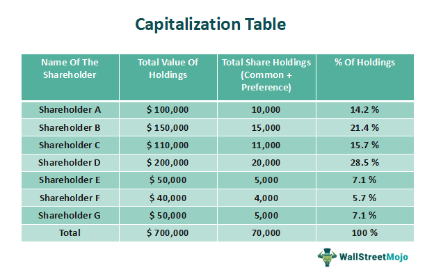

In the modern financial landscape, comprehending key financial metrics and trading technologies is essential for investors and traders aiming to navigate the complexities of the market effectively. This article highlights the importance of understanding market capitalization, equity, and algorithmic trading, emphasizing their collective impact on shaping investment strategies.

Market capitalization and equity serve as fundamental metrics for evaluating a company's financial health. Market capitalization, calculated as the product of a company's share price and its total number of outstanding shares, provides insights into the company's size and market presence. Equity, on the other hand, represents the net value of a company, calculated as the difference between its total assets and liabilities, offering a more accurate reflection of the company’s net worth. Together, these metrics enable investors to assess risk, potential returns, and the overall viability of their investment decisions.

Algorithmic trading has transformed trading practices by facilitating rapid and precise executions of trades based on pre-set criteria, utilizing computer algorithms to analyze large volumes of data in real time. This innovation minimizes human error, reduces transaction costs, and captures fleeting market opportunities, thus revolutionizing traditional trading methods.

The integration of these elements—market capitalization, equity, and algorithmic trading—forms the basis for informed and strategic investment decision-making in today's dynamic market. Investors who harness the power of these tools are better equipped to respond to market fluctuations and capitalize on emerging opportunities.

## Table of Contents

## Understanding Financial Metrics

Financial metrics play a crucial role in evaluating a company's performance and its potential on the stock market. Investors rely on these metrics to make informed decisions, assess risks, and forecast potential returns. Among the primary metrics are market capitalization, equity, the price-to-earnings ratio (P/E), and return on equity (ROE).

Market capitalization is a measure of a company's size and overall market value. It is computed by multiplying the current share price by the total number of outstanding shares:

$$
\text{Market Capitalization} = \text{Share Price} \times \text{Outstanding Shares}
$$

This metric provides a snapshot of a company's market position and is useful for classifying companies into large-cap, mid-cap, or small-cap categories, each with distinct investment profiles and risk levels.

Equity, often referred to as shareholders' equity, reflects a company's net worth and is calculated by subtracting total liabilities from total assets:

$$
\text{Equity} = \text{Total Assets} - \text{Total Liabilities}
$$

Unlike market capitalization, equity does not fluctuate with daily stock price movements, offering a stable indicator of a company's financial health and long-term sustainability.

The price-to-earnings ratio (P/E) is another significant metric, measuring a company’s current share price relative to its per-share earnings. It helps investors assess if a stock is overvalued or undervalued compared to others:

$$
\text{P/E Ratio} = \frac{\text{Market Value per Share}}{\text{Earnings per Share}}
$$

A high P/E ratio could indicate that a stock’s price is high relative to earnings and possibly overvalued, while a low P/E might suggest the opposite.

Return on equity (ROE) evaluates a company’s profitability by measuring how much profit is generated with the money from shareholders. It is calculated as:

$$
\text{ROE} = \frac{\text{Net Income}}{\text{Shareholder's Equity}}
$$

ROE is a key metric for comparing the efficiency of profit generation across different firms.

These financial metrics are indispensable for investors aiming to gauge investment risk and potential returns. They enable effective engagement in the stock market by providing a comprehensive understanding of a company's value and performance potential.

## Market Capitalization: A Measure of Company Size

Market capitalization, often referred to as market cap, provides a straightforward metric for classifying companies based on their overall size. Calculated by multiplying a company’s current share price by its total number of outstanding shares, market capitalization offers a snapshot of what the public perceives a company to be worth. 

$$
\text{Market Capitalization} = \text{Share Price} \times \text{Shares Outstanding}
$$

Within financial markets, companies are broadly categorized as large-cap, mid-cap, or small-cap based on the magnitude of their market capitalization. Large-cap companies, generally recognized as those having a market cap exceeding $10 billion, are often perceived as stable investment choices. These entities typically have a robust track record of performance and may provide dividends to their shareholders, which can add to their allure as lower-risk options.

Mid-cap companies, with market capitalizations ranging from $2 billion to $10 billion, present a mix of growth potential and stability. They tend to show higher growth rates than large-cap companies but offer less stability. As such, they can be attractive to investors seeking a balance between safety and growth.

Small-cap stocks, often identified by market capitalizations of less than $2 billion, offer significant growth potential, albeit with increased risk. These companies may be in their earlier stages of development or expanding into new markets, making them appealing for investors willing to accept higher [volatility](/wiki/volatility-trading-strategies) with the aim of achieving substantial long-term gains.

Investors utilize market capitalization to assess a company's market presence and potential for growth. By segmenting investments across different cap categories, investors can diversify their portfolio, mitigating risk while capitalizing on potential growth opportunities across various segments of the market.

## Equity: Reflecting a Company's True Value

Equity is a fundamental financial metric that serves as a crucial indicator of a company's net worth. Essentially, equity represents the portion of a company's assets that shareholders own outright. This is calculated by subtracting the company's total liabilities from its total assets. The formula for equity is given by:

$$
\text{Equity} = \text{Total Assets} - \text{Total Liabilities}
$$

This calculation provides a clear picture of what would be left for shareholders if all liabilities were paid off using the assets. Unlike market capitalization, which can fluctuate with daily stock market activity, equity is a more stable measure that highlights the genuine financial health of a company. It offers insights into long-term sustainability, reflecting the underlying assets and obligations without being directly affected by short-term market volatility.

Investors regard equity as a key measure of financial soundness and a company's inherent value. Consideration of both market capitalization and equity can provide a comprehensive view of a company's overall financial status. While market capitalization indicates the market's perception of a company's value based on prevailing stock prices, equity offers a grounded assessment based on tangible financial data. Consequently, assessing both metrics together enables investors to make more informed and balanced investment decisions, as it reconciles market-driven valuations with accounting-based figures, laying a solid foundation for evaluating potential returns and investment risks.

## Algorithmic Trading: Revolutionizing Market Transactions

Algorithmic trading employs computer algorithms to execute trades efficiently based on pre-determined criteria. By processing large volumes of data in real-time, it captures fleeting market opportunities, offering significant advantages over traditional trading methods. The automation in [algorithmic trading](/wiki/algorithmic-trading) minimizes human error and reduces transaction costs, enabling traders to achieve better execution prices and more consistent returns.

One of the primary strategies in algorithmic trading is high-frequency trading ([HFT](/wiki/high-frequency-trading-strategies)), which involves executing orders at extremely high speeds, often within milliseconds, to take advantage of small price movements. Another strategy is statistical [arbitrage](/wiki/arbitrage), which relies on complex mathematical models to exploit price differentials of related financial instruments. Systematic trading, on the other hand, involves following a set of predefined rules to make trading decisions, often based on quantitative analysis or technical indicators.

However, algorithmic trading is not without its risks. It can contribute to increased market volatility, as large volumes of trades are executed in a short period. Additionally, errors in algorithms can lead to significant financial losses, as seen in several historical market events. For instance, the Flash Crash of 2010 highlighted how algorithmic trades could rapidly exacerbate market movements.

Despite these risks, algorithmic trading remains a powerful tool in modern finance. By integrating sophisticated algorithms into trading strategies, investors can enhance [liquidity](/wiki/liquidity-risk-premium) and precision in their market transactions, optimizing their investment portfolios based on their risk tolerance and investment goals. As technology continues to advance, the development of more robust and adaptive algorithms will further revolutionize market transactions.

## Integrating Financial Metrics and Algorithmic Trading

Integrating financial metrics with algorithmic trading provides investors with a comprehensive approach to making informed decisions in the stock market. By leveraging market capitalization and equity data, algorithmic strategies can be fine-tuned to manage risks effectively, enhancing portfolio management significantly. 

Market capitalization, an indicator of company size, and equity, a measure of net worth, are pivotal in shaping algorithmic trading models. Algorithms consider these metrics to assess stock potential and make real-time decisions, thus balancing growth opportunities with risk mitigation. For example, an algorithm may prioritize trades involving large-cap companies during volatile market conditions to ensure stability, while targeting small-cap companies when aiming for growth during more stable periods.

Algorithmic trading enhances liquidity and precision in market transactions by processing vast datasets instantaneously to identify transient market opportunities. The use of high-frequency trading and [statistical arbitrage](/wiki/statistical-arbitrage) allows traders to capitalize on market inefficiencies, reducing transaction costs and increasing profitability. However, to capitalize on these benefits, the selection of an appropriate trading strategy is crucial, and must align with the investor's risk tolerance and investment objectives. 

When choosing a trading strategy, investors should evaluate their risk tolerance levels and investment goals while also considering the capabilities of available technologies. For instance, risk-averse investors might prefer systematic trading strategies that rely on historical data patterns, whereas risk-tolerant investors may opt for high-frequency trading to exploit short-term market movements.

Utilizing platforms that support both algorithmic trading and comprehensive financial analysis further aids investors in optimizing their portfolios. These platforms offer various tools for [backtesting](/wiki/backtesting) trading strategies, analyzing financial metrics, and deploying customized algorithms across different markets. By integrating these resources, investors can construct a diversified portfolio capable of responding dynamically to market fluctuations.

In conclusion, the integration of financial metrics and algorithmic trading equips investors with a robust framework for decision-making, aiming to enhance returns and manage risks in a complex market environment. This hybrid strategy underscores the need for continuous evaluation and adaptation to maintain an edge in modern financial trading.

## Conclusion

Market capitalization, equity, and algorithmic trading are integral components essential for both understanding and navigating today's stock market and investment strategies. A firm grasp of these concepts enables investors to make more informed decisions, thereby improving their ability to adapt to fluctuations and changes within the financial environment.

Market capitalization and equity provide foundational insights into a company's financial stature. Market capitalization serves as a useful gauge of a company's market size, determined by the formula:

$$
\text{Market Capitalization} = \text{Share Price} \times \text{Outstanding Shares}
$$

On the other hand, equity gives a more detailed view of a company's net worth, calculated as the difference between total assets and total liabilities:

$$
\text{Equity} = \text{Total Assets} - \text{Total Liabilities}
$$

Algorithmic trading, characterized by its use of sophisticated algorithms to execute trades with speed and precision, brings a modern edge to investment strategies. This technology facilitates high-frequency trading, employs complex strategies such as statistical arbitrage, and significantly reduces the risk of human error. By integrating algorithmic trading with traditional financial analysis, investors can optimize their portfolios by enhancing liquidity and precision in their market transactions.

The successful integration of these financial metrics with algorithmic trading strategies allows investors to optimize returns while effectively managing risk. This holistic approach equips both novice and experienced investors to make strategic decisions in a complex financial setting. As the market landscape continues to evolve, the relevance of understanding and applying these tools and strategies remains vital, underscoring their importance in achieving financial success.

## References & Further Reading

Further exploration of the topics covered can be found in various financial analysis publications and trading strategy [books](/wiki/algo-trading-books) which offer comprehensive insights into understanding and implementing key financial metrics and trading technologies.

- **Investopedia**: An invaluable resource, Investopedia provides detailed entries on essential concepts such as market capitalization, equity, and various trading strategies. It includes definitions, practical examples, and current market applications that aid investors and traders in enhancing their financial literacy and decision-making capabilities.

- **Algorithmic Trading Platforms and Communities**: Platforms like QuantConnect, MetaTrader, and communities on forums such as Stack Exchange and GitHub host discussions and tools for algorithmic trading. These resources offer users the opportunity to access open source codes, backtesting environments, and collaborative discussions for refining trading strategies and implementing algorithmic solutions effectively in real-world scenarios.

- **Books on Financial Metrics and Algorithmic Trading**: Publications such as "Algorithmic Trading: Winning Strategies and Their Rationale" by Ernest P. Chan, and "The Intelligent Investor" by Benjamin Graham provide in-depth insights into the use of quantitative models and traditional investing methodologies. These books equip investors with the principles needed to optimize their investment strategies, incorporating both fundamental financial analysis and advanced trading technologies.

Utilizing these resources helps investors build robust knowledge bases, enabling them to navigate the complexities of modern financial markets with confidence.