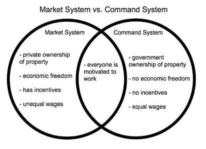

## Table of Contents

## What is a market economy?

A market economy is a type of economic system where the prices of goods and services are decided by the people who buy and sell them. In this system, businesses and individuals make their own choices about what to produce, how much to produce, and what to buy. The government has a limited role and mainly focuses on making sure that businesses follow certain rules and that everyone can compete fairly.

In a market economy, the idea of supply and demand is very important. If many people want a certain product, the price goes up. If not many people want it, the price goes down. This helps businesses decide what to make more of and what to make less of. Overall, a market economy can lead to a lot of innovation and growth because businesses are always trying to meet the needs and wants of consumers.

## What is a command economy?

A command economy is a type of economic system where the government makes all the big decisions about what to produce, how much to produce, and how to distribute goods and services. Instead of businesses and people deciding what they want to buy and sell, the government plans everything. This means that the government sets the prices and decides who gets what.

In a command economy, the idea is that the government can make sure everyone gets what they need. But, it can also mean that people don't have as much freedom to choose what they want. Sometimes, there might not be enough of certain things because the government didn't plan well. This type of economy is often found in countries with strong central governments, like in some communist countries.

## How do market and command economies differ in terms of resource allocation?

In a market economy, resources are allocated based on supply and demand. This means that if a lot of people want something, businesses will make more of it, and the price might go up. If not many people want something, businesses will make less of it, and the price might go down. People and businesses decide what to produce and buy, so the economy can change quickly based on what everyone wants. This system can lead to a lot of new ideas and growth because businesses are always trying to meet people's needs and wants.

In a command economy, the government decides how to allocate resources. They make a big plan for what to produce, how much to produce, and how to share it with everyone. The government sets the prices and decides who gets what, so people don't have as much choice. The idea is that the government can make sure everyone gets what they need, but sometimes there might not be enough of certain things if the government's plan doesn't work well. This type of economy can be slower to change because the government has to make all the decisions.

## What role does the government play in a market economy versus a command economy?

In a market economy, the government has a smaller role compared to a command economy. The main job of the government in a market economy is to make sure businesses follow rules and that everyone can compete fairly. This includes things like making sure businesses don't cheat or harm people, and that they pay taxes. The government also helps by building things like roads and schools, which everyone can use. But, it doesn't decide what businesses should make or what people should buy. People and businesses make those choices themselves.

In a command economy, the government has a much bigger role. It makes all the big decisions about what to produce, how much to produce, and how to share it with everyone. The government sets the prices and decides who gets what. The idea is that the government can make sure everyone gets what they need. But, this also means that people don't have as much freedom to choose what they want. The government plans everything, so if the plan doesn't work well, there might not be enough of certain things for everyone.

## How do consumer choices impact market and command economies differently?

In a market economy, consumer choices have a big impact. When people choose what to buy, they tell businesses what they want. If a lot of people want something, businesses will make more of it, and the price might go up. If not many people want something, businesses will make less of it, and the price might go down. This helps the economy change quickly to meet what people need and want. It also makes businesses try to come up with new ideas to keep people happy.

In a command economy, consumer choices don't have as much impact. The government decides what to make and how much to make, so what people want to buy doesn't change things as much. The government has a big plan, and they decide who gets what. People might not always get what they want because the government is in charge. This means the economy might not change as quickly as in a market economy, and new ideas might not come as often because businesses don't need to listen to what people want.

## What are the main advantages of a market economy?

A market economy has many good things about it. One big advantage is that it can grow a lot and come up with new ideas. When businesses can decide what to make and how much to make, they try to make things that people want. If people like something, businesses will make more of it. This makes the economy grow because everyone is working to meet people's needs and wants. It also means that new ideas keep coming because businesses want to stay ahead and make people happy.

Another advantage is that people have a lot of freedom to choose. In a market economy, people can decide what they want to buy and what they want to sell. This means that people can try new things and find what works best for them. It also means that businesses have to listen to what people want, or they won't sell anything. This freedom can make life better for everyone because people can choose what they think is best for them.

## What are the main advantages of a command economy?

One big advantage of a command economy is that the government can make sure everyone gets what they need. The government decides what to make and how much to make, so they can plan to give everyone food, homes, and other important things. This means that even if someone doesn't have a lot of money, they can still get what they need. The idea is to make sure no one goes without the basics.

Another advantage is that a command economy can focus on big projects that help everyone. The government can plan to build things like schools, hospitals, and roads that everyone can use. Because the government is in charge, they can make sure these projects happen even if they cost a lot of money. This can make life better for everyone because they can use these important things that the government builds.

## How do market and command economies handle economic inefficiencies?

In a market economy, economic inefficiencies are often dealt with by the forces of supply and demand. If a business is not making what people want or is charging too much, people will buy from other businesses instead. This pushes businesses to work better and make things that people really want. If a business is not doing well, it might go out of business, and a new one might start up that does things better. This way, the market keeps fixing itself, though it can take time and some people might lose their jobs when businesses fail.

In a command economy, the government tries to fix economic inefficiencies by making big plans. If something is not working well, the government can change its plan to make things better. For example, if there's not enough food, the government can tell farms to grow more. But, sometimes the government's plans don't work out, and it can take a long time to fix things because the government has to make all the decisions. This can mean that people have to wait for things to get better.

## Can you provide historical examples of successful market economies?

One good example of a successful market economy is the United States. After World War II, the U.S. economy grew a lot because businesses could decide what to make and how much to make. People had a lot of freedom to choose what they wanted to buy. This made the economy grow fast and brought a lot of new ideas and inventions. Companies like Apple and Microsoft started in the U.S. and made things that people all over the world wanted to buy.

Another example is Singapore. After becoming independent in 1965, Singapore turned into a market economy. The government made rules to help businesses grow, but they let businesses decide what to make. This helped Singapore become very rich and successful. It is now known for having a strong economy and a high standard of living. People in Singapore have a lot of choices and can enjoy a good life because of the market economy.

## Can you provide historical examples of successful command economies?

One example of a successful command economy was the Soviet Union during the 1950s and 1960s. The government made big plans to build things like factories, schools, and hospitals. They made sure everyone had what they needed, like food and homes. The Soviet Union grew a lot during this time because the government could focus on big projects that helped everyone. But, later on, it became hard for the government to keep up with what people wanted, and the economy started to have problems.

Another example is China before it started to open up its economy in the late 1970s. The Chinese government decided what to make and how much to make. They made sure everyone had the basics, like food and homes. This helped China grow and become more stable. But, like the Soviet Union, China found it hard to keep up with what people wanted as time went on. That's why they started to let businesses have more freedom and mix in some market economy ideas.

## How do market and command economies respond to technological changes?

In a market economy, businesses quickly use new technology to make things better or cheaper. If a business finds a new way to make something, they can start using it right away. This can make their products better or cost less, so people will buy from them instead of other businesses. This makes the whole economy grow because everyone is always trying to use the newest ideas. But, if a business doesn't keep up with new technology, it might go out of business, and people might lose their jobs.

In a command economy, the government decides when and how to use new technology. If the government thinks a new technology is good, they will make a plan to use it. This can help everyone get better things, like new medicines or faster trains. But, it can take a long time for the government to make these plans, so new technology might not be used as quickly as in a market economy. Sometimes, the government might not want to use new technology if it doesn't fit their big plan, so the economy might not grow as fast.

## What are the long-term sustainability challenges faced by market and command economies?

In a market economy, one big challenge for long-term sustainability is making sure the economy grows in a way that doesn't hurt the environment. Businesses want to make more money, so they might use a lot of natural resources or pollute the air and water. If the government doesn't make rules to stop this, the environment can get worse over time. Another challenge is making sure everyone can have a good life. If some people get very rich and others stay poor, it can cause problems in society. The government needs to help make sure everyone has a fair chance to do well.

In a command economy, the main challenge is making sure the government's plans work well over a long time. If the government makes bad plans, it can be hard to fix them because they control everything. This can make the economy grow slowly and make it hard for people to get what they need. Another challenge is keeping up with new ideas and technology. If the government doesn't want to use new technology, the economy might not grow as fast as it could. This can make life harder for people because they don't get to use new things that could make their lives better.

## References & Further Reading

[1]: Bergstra, J., Bardenet, R., Bengio, Y., & Kégl, B. (2011). ["Algorithms for Hyper-Parameter Optimization."](https://papers.nips.cc/paper/4443-algorithms-for-hyper-parameter-optimization) Advances in Neural Information Processing Systems 24.

[2]: ["Advances in Financial Machine Learning"](https://www.amazon.com/Advances-Financial-Machine-Learning-Marcos/dp/1119482089) by Marcos Lopez de Prado

[3]: ["Evidence-Based Technical Analysis: Applying the Scientific Method and Statistical Inference to Trading Signals"](https://www.wiley.com/en-us/Evidence+Based+Technical+Analysis%3A+Applying+the+Scientific+Method+and+Statistical+Inference+to+Trading+Signals-p-9780470008744) by David Aronson

[4]: ["Machine Learning for Algorithmic Trading"](https://github.com/stefan-jansen/machine-learning-for-trading) by Stefan Jansen

[5]: ["Quantitative Trading: How to Build Your Own Algorithmic Trading Business"](https://books.google.com/books/about/Quantitative_Trading.html?id=j70yEAAAQBAJ) by Ernest P. Chan