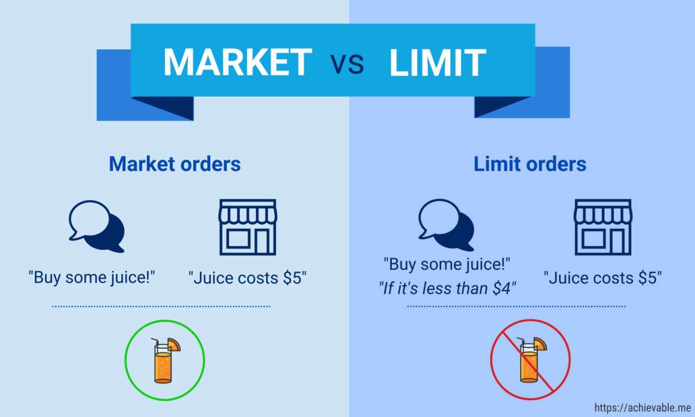

## Table of Contents

## What is a market order?

A market order is a type of order used in trading where you tell your broker to buy or sell a stock right away at the current market price. When you place a market order, you are saying that you want the trade to happen quickly, and you are willing to accept whatever price the market is offering at that moment.

Market orders are useful because they are simple and fast. They are good for when you want to make sure your trade happens without delay. However, the price you get might be a bit different from what you see when you place the order, especially in fast-moving or less liquid markets. This is something to keep in mind when deciding to use a market order.

## What is a limit order?

A limit order is a type of order you can use when you want to buy or sell a stock at a specific price or better. When you place a limit order, you tell your broker the exact price at which you want the trade to happen. For example, if you want to buy a stock, you can set a limit order to buy it only if the price drops to your set limit or lower. If you want to sell, you can set a limit order to sell only if the price goes up to your set limit or higher.

Limit orders give you more control over the price at which your trade happens, but they are not guaranteed to be filled. If the stock never reaches your limit price, your order will not be executed. This can be good if you have a target price in mind and are willing to wait, but it can also mean missing out on a trade if the market moves quickly past your limit price without hitting it.

## How does a market order work?

A market order is a way to buy or sell a stock quickly. When you place a market order, you tell your broker to make the trade happen right away at the current market price. This means you want to get the stock as soon as possible, and you're okay with whatever price it's trading at that moment.

Market orders are simple and fast, which is why people use them when they want to make sure their trade happens without waiting. But, the price you end up with might be a little different from what you saw when you placed the order. This can happen because the market can change quickly, especially in stocks that don't trade a lot or when the market is moving fast.

## How does a limit order work?

A limit order lets you buy or sell a stock at a specific price you choose. When you place a limit order, you tell your broker that you only want to buy the stock if its price drops to your limit or lower. If you want to sell, you can set a limit order to sell only if the price goes up to your limit or higher. This gives you more control over the price at which your trade happens.

However, there's no guarantee that your limit order will be filled. If the stock never reaches your limit price, your order won't be executed. This can be good if you have a target price in mind and are willing to wait, but it can also mean missing out on a trade if the market moves quickly past your limit price without hitting it.

## What are the advantages of using a market order?

Market orders are great because they are fast and simple. When you want to buy or sell a stock quickly, a market order gets the job done right away. You don't have to worry about setting a specific price; you just tell your broker to make the trade at the current market price. This is helpful if you need to make a trade fast and don't want to miss out on a good opportunity.

Another advantage is that market orders are almost always filled. Since you're willing to take whatever price the market is offering at that moment, your order is very likely to go through. This can give you peace of mind if you're more concerned about making sure the trade happens than about getting a certain price.

## What are the advantages of using a limit order?

Limit orders let you set a specific price for buying or selling a stock. This means you have more control over what price you get. If you think a stock is worth a certain amount, you can set a limit order to buy it only if it drops to that price or lower. Or if you want to sell, you can set a limit to sell only if the price goes up to what you want. This can help you get a better price than if you used a market order, where you take whatever price the market gives you at that moment.

Another advantage is that limit orders can protect you from sudden price changes. If the market moves quickly, a market order might get filled at a price you didn't expect. But with a limit order, you won't buy or sell unless the stock reaches your price. This can be really helpful if you're trying to stick to a budget or if you have a target price in mind. Just remember, there's no guarantee your limit order will be filled if the stock never reaches your price.

## What are the potential risks associated with market orders?

Using a market order can be risky because you might not get the price you expect. When you place a market order, you're telling your broker to buy or sell the stock right away at whatever price it's trading at that moment. But the price can change quickly, especially if the stock doesn't trade a lot or if the market is moving fast. This means you could end up buying the stock for more than you wanted or selling it for less than you hoped.

Another risk is that you might not know exactly what price you'll get until after the trade happens. This can be a problem if the stock price jumps a lot between the time you place your order and when it gets filled. For example, if there's breaking news about the company, the stock price could change a lot in a short time, and your market order might get filled at a price that's very different from what you saw when you placed the order.

## What are the potential risks associated with limit orders?

Using a limit order can be risky because there's no guarantee your order will be filled. If you set a limit to buy a stock at a certain price, but the stock never drops to that price, you won't get the stock. The same goes for selling; if you set a limit to sell at a certain price, but the stock never goes up to that price, your order won't go through. This means you could miss out on a good chance to buy or sell if the market moves quickly past your limit without hitting it.

Another risk is that you might miss out on a trade because you're waiting for a specific price. If the market moves fast, your limit order might not get filled even if the stock price gets very close to your limit. For example, if you want to buy a stock at $50, but it only drops to $50.01 before going back up, your order won't be filled. This can be frustrating if you're trying to make a trade and the stock price just misses your limit.

## In what scenarios would a market order be more appropriate than a limit order?

A market order is more appropriate than a limit order when you want to buy or sell a stock quickly and don't mind what price you get. For example, if you hear big news about a company and want to buy its stock right away before the price goes up, a market order is the best choice. It makes sure your trade happens fast, even if the price ends up being a bit different from what you expected.

Another scenario where a market order is better is when you are trading stocks that don't have a lot of buyers and sellers. These stocks can have big gaps between the prices people are willing to buy and sell at. A market order will fill your trade right away, even if the stock isn't very popular. This can be important if you need to make sure your trade happens, no matter what the price is at that moment.

## In what scenarios would a limit order be more appropriate than a market order?

A limit order is more appropriate than a market order when you have a specific price in mind and you're willing to wait for it. If you think a stock is worth a certain amount and you don't want to pay more than that, you can set a limit order to buy it only if it drops to your price or lower. The same goes for selling; if you want to sell a stock but only if it goes up to a certain price or higher, a limit order helps you stick to your goal.

Another scenario where a limit order is better is when you want to protect yourself from sudden price changes. If the market is moving fast and you're worried about buying or selling at a price you didn't expect, a limit order can help. It won't fill your trade unless the stock reaches your set price, which can keep you from making a trade at a bad time. Just remember, there's a chance your order won't be filled if the stock never hits your limit price.

## How do market conditions affect the choice between market and limit orders?

Market conditions can really change how you decide between using a market order or a limit order. If the market is calm and not moving much, you might be okay with using a market order because the prices aren't changing a lot. This means you can buy or sell quickly without worrying too much about getting a bad price. But if the market is moving fast, like during big news or events, a market order might get you a price you didn't expect. In these times, it's safer to use a limit order so you can set the price you want and wait for it, even if it means your order might not happen right away.

In markets where stocks don't trade a lot, using a market order can be risky because there might be big gaps between the prices people want to buy and sell at. If you need to make a trade fast and don't care too much about the exact price, a market order can still work. But if you want to make sure you get a good price, a limit order is better. It lets you set a price and wait for it, which can be important in markets where prices can jump a lot between trades.

## What advanced strategies can traders use involving both market and limit orders?

Traders can use a strategy called "order bracketing" that combines market and limit orders to manage their trades better. When a trader wants to buy a stock, they might use a market order to get into the trade quickly. At the same time, they can set a limit order to sell the stock if it goes up to a certain price, which is called a take-profit order. They can also set another limit order to sell if the stock goes down to a certain price, which is called a stop-loss order. This way, the trader can set up their trade to automatically close at a profit or cut their losses if things don't go as planned.

Another strategy is called "scaling in and out," where traders use a mix of market and limit orders to slowly build up or reduce their position in a stock. For example, a trader might use a market order to buy a small amount of a stock right away. Then, they can set limit orders to buy more of the stock if it drops to lower prices. When it's time to sell, they might use a market order to sell some of their shares quickly and then use limit orders to sell the rest at higher prices. This can help them get a better average price for their trades and manage their risk more carefully.

## References & Further Reading

[1]: ["The Basics of Algorithmic Trading"](https://www.investopedia.com/articles/active-trading/101014/basics-algorithmic-trading-concepts-and-examples.asp) from Investopedia

[2]: Harris, L. (2003). ["Trading and Exchanges: Market Microstructure for Practitioners."](https://academic.oup.com/book/52292) Princeton University Press.

[3]: Hasbrouck, J. (2007). ["Empirical Market Microstructure: The Institutions, Economics, and Econometrics of Securities Trading."](https://academic.oup.com/book/52241) Oxford University Press.

[4]: Kissell, R. (2013). ["The Science of Algorithmic Trading and Portfolio Management."](https://www.sciencedirect.com/book/9780124016897/the-science-of-algorithmic-trading-and-portfolio-management) Academic Press.

[5]: Aldridge, I. (2013). ["High-Frequency Trading: A Practical Guide to Algorithmic Strategies and Trading Systems."](https://www.ahmetbeyefendi.com/wp-content/uploads/2020/07/High-Frequency-Trading-Irene-Aldridge.pdf) Wiley.

[6]: Chan, E. (2009). ["Quantitative Trading: How to Build Your Own Algorithmic Trading Business."](https://github.com/ftvision/quant_trading_echan_book) Wiley Trading Series.