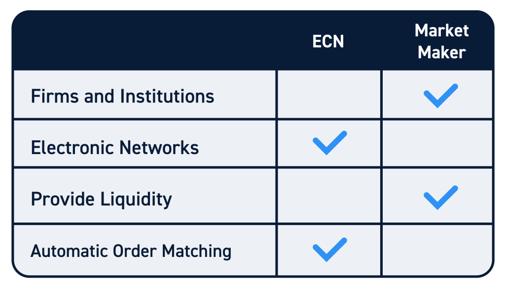

## Table of Contents

## What is a market maker?

A market maker is a company or person that helps people buy and sell things in a market. They do this by always being ready to buy or sell a certain product, like stocks or currencies. This makes it easier for other people to trade because they know they can always find someone to trade with.

Market makers make money by buying things at a lower price and selling them at a higher price. The difference between these two prices is called the "spread." By keeping the market active and making it easier for people to trade, market makers help keep the market running smoothly.

## What is an Electronic Communications Network (ECN)?

An Electronic Communications Network (ECN) is a type of computer system that helps people buy and sell things like stocks or currencies without needing a middleman like a market maker. It matches buyers and sellers directly, making trading faster and often cheaper. People can use an ECN to trade at any time, even when the main stock markets are closed.

ECNs are popular because they show the best prices available from different places, helping traders get the best deals. They also keep everything transparent, so traders can see all the orders and prices. This makes trading fairer and more efficient.

## How do market makers and ECNs facilitate trading?

Market makers help people buy and sell things by always being ready to trade. They keep a list of prices where they will buy or sell, and they make money from the difference between these prices. This makes it easier for others to trade because they know they can always find someone to trade with. Market makers are important because they help keep the market active and running smoothly. Without them, it would be harder for people to trade, and the market might not work as well.

ECNs help people trade by connecting buyers and sellers directly through a computer system. They show the best prices from different places, so traders can find the best deals. ECNs let people trade at any time, even when the main markets are closed. This makes trading faster and often cheaper because there's no middleman like a market maker. ECNs make trading fair and efficient by showing all the orders and prices clearly.

## What are the primary differences between market makers and ECNs?

Market makers and ECNs both help people trade things like stocks or currencies, but they do it in different ways. Market makers act as middlemen. They always have a list of prices where they are ready to buy or sell. They make money from the difference between these buying and selling prices. This makes it easier for other people to trade because they can always find someone to trade with. Market makers help keep the market active and running smoothly.

ECNs, on the other hand, connect buyers and sellers directly without a middleman. They use a computer system to show the best prices from different places, helping traders find the best deals. ECNs let people trade at any time, even when the main markets are closed. This makes trading faster and often cheaper. ECNs make trading fair and efficient by showing all the orders and prices clearly.

## How do market makers generate revenue?

Market makers make money by buying things at a lower price and selling them at a higher price. The difference between these two prices is called the "spread." For example, a market maker might buy a stock for $10 and then sell it for $10.05. The $0.05 difference is their profit. By always being ready to buy and sell, market makers help keep the market active and make money from these small price differences.

Sometimes, market makers also earn money from fees. When they help someone buy or sell something, they might charge a small fee for their service. This fee is another way they make money. So, market makers have two main ways to earn revenue: from the spread between buying and selling prices, and from fees they charge for their services.

## How do ECNs generate revenue?

ECNs make money by charging a small fee every time someone uses their system to buy or sell something. This fee is usually a tiny part of the total price of the trade. For example, if someone buys a stock for $100, the ECN might charge a fee of a few cents. This fee adds up because a lot of people use ECNs to trade every day.

Sometimes, ECNs also make money by charging a fee to people who want to see the prices and orders on their system. This is called a subscription fee. By charging these fees, ECNs can keep their system running and make it easier for people to trade without needing a middleman like a market maker.

## What are the advantages of using a market maker for trading?

Using a market maker for trading has some good points. One big advantage is that market makers are always ready to buy or sell. This means you can always find someone to trade with, which makes trading easier and quicker. If you want to buy or sell something fast, having a market maker there helps a lot. They keep the market active by always being ready to trade, which is good for everyone who trades.

Another advantage is that market makers help keep the market stable. Because they are always buying and selling, they help make sure there are always prices for things like stocks or currencies. This can make the market less wild and more predictable. When you know you can always trade at a certain price, it makes trading feel safer and more reliable.

## What are the advantages of using an ECN for trading?

Using an ECN for trading has many good points. One big advantage is that ECNs let you see the best prices from different places. This helps you find the best deals because you can compare prices easily. ECNs also show all the orders and prices clearly, which makes trading fair and open. You know exactly what is happening in the market, and this can help you make better trading choices.

Another advantage is that ECNs let you trade at any time, even when the main markets are closed. This means you can buy or sell things whenever you want, which gives you more freedom. ECNs also make trading faster and often cheaper because there's no middleman like a market maker. You can trade directly with other people, which can save you money on fees and make the whole process quicker and easier.

## How do market makers and ECNs impact market liquidity?

Market makers help make the market more liquid by always being ready to buy or sell things like stocks or currencies. They keep a list of prices where they will trade, so if you want to buy or sell something, you can always find someone to trade with. This makes it easier for people to trade because there are always market makers ready to help. When more people can trade easily, it makes the market more active and liquid. Without market makers, it might be harder to find someone to trade with, and the market might not work as well.

ECNs also help make the market more liquid by connecting buyers and sellers directly without a middleman. They show the best prices from different places, so people can find the best deals easily. Because ECNs let people trade at any time, even when the main markets are closed, it makes trading more flexible and active. This means more people can trade whenever they want, which increases the number of trades happening and makes the market more liquid. Both market makers and ECNs play important roles in keeping the market running smoothly and making it easier for people to trade.

## Can you explain the role of market makers in price discovery?

Market makers help find the right price for things like stocks or currencies. They do this by always being ready to buy or sell at certain prices. When they set their buying and selling prices, they look at what other people are doing in the market. If a lot of people want to buy something, the price might go up. If a lot of people want to sell, the price might go down. By watching these changes, market makers help figure out what the fair price should be.

This process of setting prices helps everyone in the market. When market makers keep their prices updated, they show what people are willing to pay or sell for. This information helps other traders decide if they should buy or sell. By always being ready to trade, market makers make sure there is always a price to look at, which helps the market work smoothly and find the right price for things.

## How do ECNs affect the transparency of the market?

ECNs make the market more open and clear. They show all the buy and sell orders from different places on their system. This means that everyone can see the best prices and all the trades happening. When traders can see everything, it helps them trust the market more because they know exactly what is going on. This openness makes trading fairer and helps people make better choices.

By connecting buyers and sellers directly, ECNs also cut out the middleman. This means there are no hidden fees or secret deals. Everything is out in the open, which makes the market more honest. When traders can see all the orders and prices clearly, it makes the market work better and helps everyone trade more easily.

## What are the regulatory considerations for market makers versus ECNs?

Market makers have to follow rules set by the government and other groups to make sure they do their job right. These rules make sure market makers give fair prices and don't do anything sneaky. For example, they have to show their prices clearly and can't make the market go up or down on purpose. Also, they need to have enough money to buy and sell things, so they can keep trading even if the market changes a lot.

ECNs also have to follow rules, but their rules are a bit different because they work differently. ECNs need to make sure their computer system is fair and works well for everyone. They have to show all the orders and prices clearly so that trading is open and honest. ECNs also need to make sure they keep people's information safe and don't let anyone cheat. Both market makers and ECNs have rules to follow, but the rules focus on what each one does to help the market work well.

## What is the role of market makers in understanding the market?

Market makers are specialized entities in financial markets, typically constituted by banks or brokerage firms, whose primary function is to provide liquidity by establishing bid and ask prices for various financial instruments. By consistently quoting buy and sell prices, market makers ensure a ready market for these securities, thereby facilitating continuous trading and stabilizing the financial markets.

These entities perform an intermediary role by buying securities from sellers and later selling them to buyers. This two-sided quoting process allows market makers to profit from the bid-ask spread—the difference between the prices at which market makers are willing to buy (bid) and sell (ask). The spread is essentially the compensation they receive for the risk they incur by holding inventory and for providing the service of liquidity to the market.

Mathematically, the profit of a market maker can be expressed as:

$$
\text{Profit} = (\text{Ask Price} - \text{Bid Price}) \times \text{Volume Traded}
$$

Where:
- $\text{Ask Price}$ is the price at which the market maker sells the security.
- $\text{Bid Price}$ is the price at which the market maker buys the security.
- $\text{Volume Traded}$ is the quantity of the security that is traded at these prices.

In functioning as liquidity providers, market makers play a crucial role in influencing market pricing and [volatility](/wiki/volatility-trading-strategies). Their activity helps in narrowing the bid-ask spreads across markets, which contributes to price discovery—a fundamental aspect of efficient markets. However, the operations of market makers are not devoid of potential challenges and ethical considerations.

Market makers can occasionally find themselves in a position where conflicts of interest arise. For instance, they might prioritize their trading benefits over those of their clients. In certain situations, market makers might have the inclination to manipulate prices to maximize profits, potentially trading against the interests of their clients. This dual role as facilitators of transactions and active market participants sometimes results in mistrust among retail investors.

Despite these potential conflicts, the necessity of market makers in ensuring market functionality cannot be overstated. Their capacity to provide immediate liquidity enables markets to function smoothly, even during times of high volatility or market stress. By having a comprehensive understanding of these operations, traders and investors can better navigate the complexities of financial markets.

## References & Further Reading

[1]: Harris, L. (2003). ["Trading and Exchanges: Market Microstructure for Practitioners"](https://www.amazon.com/Trading-Exchanges-Market-Microstructure-Practitioners/dp/0195144708). Oxford University Press.

[2]: Lopez de Prado, M. (2018). ["Advances in Financial Machine Learning"](https://www.amazon.com/Advances-Financial-Machine-Learning-Marcos/dp/1119482089). Wiley.

[3]: Harris, F. H. deB. (2002). ["Market Microstructure Theory"](https://scholar.google.com/citations?user=T7FURswAAAAJ&hl=en). Wiley-Blackwell.

[4]: Khandani, A. E., & Lo, A. W. (2007). ["What Happened to the Quants in August 2007?"](https://www.newyorkfed.org/medialibrary/media/research/conference/2007/liquidity/Khandani_Lo.pdf) National Bureau of Economic Research Working Paper Series.

[5]: Johnson, B., & Schwieger, B. (2002). ["Algorithmic Trading and DMA: An Introduction to Direct Access Trading Strategies"](https://archive.org/details/algorithmictradi0000john). 4Myeloma Press.