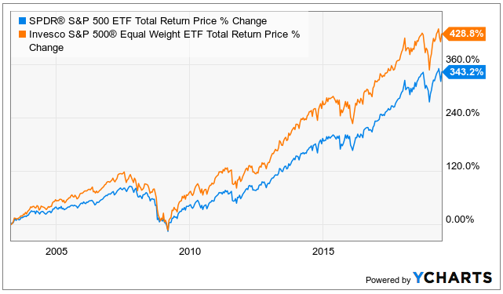

## Table of Contents

## What is a market weight S&P 500 ETF?

A market weight S&P 500 ETF is a type of exchange-traded fund that aims to match the performance of the S&P 500 index. The S&P 500 is a stock market index that measures the stock performance of 500 large companies listed on stock exchanges in the United States. When an ETF is market weight, it means that the fund holds stocks in the same proportions as they appear in the S&P 500 index. For example, if a company makes up 3% of the S&P 500, the ETF will also have 3% of its total assets invested in that company's stock.

This type of ETF is popular among investors who want a simple and diversified way to invest in the overall U.S. stock market. By investing in a market weight S&P 500 ETF, investors get exposure to a broad range of industries and companies, without having to pick individual stocks themselves. This can help reduce risk because the performance of the ETF is tied to the overall market, rather than the success or failure of a few specific companies.

## What is an equal weight S&P 500 ETF?

An equal weight S&P 500 ETF is a type of exchange-traded fund that invests in all the companies in the S&P 500 index, but it gives each company the same amount of money. This means that big companies and small companies get the same share of the ETF's money, unlike a market weight ETF where bigger companies get more money.

This type of [ETF](/wiki/etf-trading-strategies) can be good for investors who want to spread their money evenly across all the companies in the S&P 500. It might give a chance for smaller companies to have a bigger impact on the ETF's performance. But, it can also be riskier because it doesn't follow the market's natural balance, where bigger companies often have a bigger say in how the market moves.

## How do market weight and equal weight S&P 500 ETFs differ in their construction?

Market weight and equal weight S&P 500 ETFs are built differently. A market weight S&P 500 ETF puts money into the companies in the S&P 500 based on their size. Bigger companies get more money, and smaller companies get less. This means the ETF's performance closely follows the overall market because it matches the way the S&P 500 index is set up.

On the other hand, an equal weight S&P 500 ETF gives the same amount of money to every company in the S&P 500, no matter how big or small they are. This can make smaller companies more important in the ETF's performance. Because of this, an equal weight ETF might not move in the same way as the overall market, and it can be riskier but also offer different chances for growth.

## What are the advantages of investing in a market weight S&P 500 ETF?

Investing in a market weight S&P 500 ETF is a good choice for people who want to invest in the overall U.S. stock market without [picking](/wiki/asset-class-picking) individual stocks. This type of ETF follows the S&P 500 index, which means it gives more money to bigger companies and less to smaller ones. This makes it a safe and easy way to invest because it matches the way the market naturally works. By investing in a market weight S&P 500 ETF, you get a piece of the biggest and most important companies in the U.S., which can help your money grow over time.

Another advantage is that market weight S&P 500 ETFs are very popular and easy to buy and sell. Because they follow the well-known S&P 500 index, many people trust them and they are easy to understand. This means you can buy and sell them quickly, and they usually have low costs. This makes them a good choice for both new investors and those who have been investing for a long time.

## What are the advantages of investing in an equal weight S&P 500 ETF?

Investing in an equal weight S&P 500 ETF can be a good choice if you want to spread your money evenly across all the companies in the S&P 500. This means that smaller companies get the same amount of money as bigger ones, which can give them a chance to have a bigger impact on your investment. If smaller companies do well, your ETF might grow faster than one that only gives more money to bigger companies.

Another advantage is that an equal weight S&P 500 ETF can help you find opportunities that you might miss with a market weight ETF. Because it doesn't follow the market's natural balance, it can sometimes do better when the market is changing a lot. This can be good if you're looking for different ways to grow your money, but it also means it might be a bit riskier.

## How do the historical performance trends of market weight and equal weight S&P 500 ETFs compare?

Over the years, market weight and equal weight S&P 500 ETFs have shown different performance trends. Market weight S&P 500 ETFs, which follow the S&P 500 index closely, tend to be more stable because they give more money to bigger companies. This means they usually do well when the overall market is doing well. But, they might not do as well if smaller companies are the ones growing faster. 

On the other hand, equal weight S&P 500 ETFs can sometimes do better than market weight ETFs, especially during times when smaller companies are doing really well. Because equal weight ETFs give the same amount of money to every company, they can benefit more from the growth of smaller companies. However, they can also be riskier and might not do as well during times when bigger companies are leading the market.

## What are the expense ratios typically associated with market weight versus equal weight S&P 500 ETFs?

Market weight S&P 500 ETFs usually have lower expense ratios than equal weight S&P 500 ETFs. This is because market weight ETFs are easier to manage since they just need to follow the S&P 500 index. The expense ratio for a market weight S&P 500 ETF can be very low, often around 0.03% to 0.10%. This means if you invest $10,000, you might pay between $3 and $10 a year in fees.

Equal weight S&P 500 ETFs, on the other hand, have higher expense ratios because they need more work to keep the same amount of money in every company. They have to buy and sell stocks more often to keep everything even, which costs more. The expense ratio for an equal weight S&P 500 ETF can be around 0.20% to 0.30%. So, if you invest $10,000, you might pay between $20 and $30 a year in fees.

## How does sector exposure vary between market weight and equal weight S&P 500 ETFs?

Market weight S&P 500 ETFs give more money to bigger companies, so they have more money in sectors where big companies are. For example, if big tech companies like Apple and Microsoft make up a big part of the S&P 500, a market weight ETF will have a lot of money in the tech sector. This means that the ETF's performance can be heavily influenced by how well these big sectors do. If the tech sector goes up, the ETF might go up a lot, but if it goes down, the ETF could go down a lot too.

Equal weight S&P 500 ETFs, on the other hand, spread money evenly across all companies, no matter their size. This means they will have less money in big sectors like tech and more money in smaller sectors. For example, if a smaller sector like utilities or materials has a lot of smaller companies, an equal weight ETF will give them the same amount of money as the big tech companies. This can make the ETF less dependent on how well the big sectors do, but it might also miss out on big gains if those sectors do really well.

## What impact does company size have on the performance of market weight versus equal weight S&P 500 ETFs?

Company size has a big impact on how market weight and equal weight S&P 500 ETFs perform. In a market weight ETF, bigger companies get more money. So, if big companies like Apple or Microsoft do well, the ETF will do well too. But, if these big companies don't do so well, the ETF might not do as good. This means the ETF's performance can go up and down a lot depending on how the biggest companies are doing.

In an equal weight ETF, every company gets the same amount of money, no matter how big or small they are. This means smaller companies can have a bigger say in how the ETF does. If smaller companies start doing really well, the ETF might grow faster than a market weight ETF. But, if the big companies are the ones doing well, the equal weight ETF might not do as well because it doesn't have as much money in those big companies. So, the performance of an equal weight ETF can be different and sometimes riskier because it depends more on how all the companies, not just the big ones, are doing.

## How do market weight and equal weight S&P 500 ETFs react differently to market cycles?

Market weight and equal weight S&P 500 ETFs can react differently to market cycles because of how they are set up. Market weight ETFs follow the S&P 500 index closely, giving more money to bigger companies. When the market is doing well, these ETFs usually do well too, especially if the big companies are leading the market. But, if the market goes down and big companies are hit hard, the market weight ETF might go down a lot too. This means they can be more stable during good times but can also feel the pain more during bad times.

Equal weight ETFs, on the other hand, spread money evenly across all companies in the S&P 500, no matter their size. This can help them do better during times when smaller companies are growing faster than big ones. In a bull market, if smaller companies start to do really well, an equal weight ETF might grow faster than a market weight ETF. But, during a bear market, if big companies are holding up better than smaller ones, the equal weight ETF might not do as well because it doesn't have as much money in those big companies. So, equal weight ETFs can sometimes do better in different parts of the market cycle, but they can also be riskier.

## What are the tax implications of investing in market weight versus equal weight S&P 500 ETFs?

Investing in market weight and equal weight S&P 500 ETFs can have different tax implications because of how they work. Market weight ETFs usually have lower turnover, which means they buy and sell stocks less often. This can lead to fewer capital gains distributions, which are taxes you have to pay when the ETF sells stocks for a profit. So, if you're looking to keep your taxes low, a market weight ETF might be a better choice because it doesn't change its holdings as much.

On the other hand, equal weight ETFs have to buy and sell stocks more often to keep all the companies at the same weight. This higher turnover can lead to more capital gains distributions, which means you might have to pay more in taxes. If you're in a high tax bracket, this could make a big difference in how much you take home at the end of the year. So, it's good to think about your tax situation when choosing between a market weight and an equal weight ETF.

## How should an investor choose between a market weight and an equal weight S&P 500 ETF based on their investment goals and market outlook?

When deciding between a market weight and an equal weight S&P 500 ETF, an investor should think about what they want to achieve with their money and how they see the market moving in the future. If an investor wants a safe and easy way to invest in the overall U.S. stock market, a market weight ETF might be the best choice. These ETFs follow the S&P 500 closely, which means they do well when the market is doing well. They're also usually cheaper to own because they don't have to buy and sell stocks as often. If the investor believes big companies will keep leading the market, a market weight ETF can be a good fit.

On the other hand, if an investor is looking for a chance to grow their money faster and is okay with taking more risk, an equal weight ETF could be a better option. These ETFs spread money evenly across all companies in the S&P 500, which means smaller companies can have a bigger impact on the ETF's performance. If the investor thinks smaller companies will do better than big ones in the future, an equal weight ETF might be the way to go. But, it's important to remember that these ETFs can be riskier and might cost more in fees and taxes because they have to buy and sell stocks more often to keep everything even.

## References & Further Reading

[1]: ["S&P Dow Jones Indices: Equal Weight Indexes."](https://www.spglobal.com/spdji/en/indices/equity/sp-500-equal-weight-index/) S&P Dow Jones Indices.

[2]: ["ETFs for the Long Run: What They Are, How They Work, and Simple Strategies for Successful Long-Term Investing"](https://www.wiley.com/en-us/ETFs+for+the+Long+Run%3A+What+They+Are%2C+How+They+Work%2C+and+Simple+Strategies+for+Successful+Long+Term+Investing+-p-9780470138946) by Lawrence Carrel

[3]: ["The Little Book of Common Sense Investing: The Only Way to Guarantee Your Fair Share of Stock Market Returns"](https://www.amazon.com/Little-Book-Common-Sense-Investing/dp/1119404509) by John C. Bogle

[4]: ["Strategic ETF Investing: Trading and Managing ETFs for Profit"](https://www.quantifiedstrategies.com/etf-trading-strategies/) by Scott Nations

[5]: ["Algorithmic Trading: Winning Strategies and Their Rationale"](https://www.amazon.com/Algorithmic-Trading-Winning-Strategies-Rationale-ebook/dp/B00CY5HC0U) by Ernie Chan

[6]: ["Optimal Mean Reversion Trading: Mathematical Analysis and Practical Applications"](https://papers.ssrn.com/sol3/papers.cfm?abstract_id=2664588) by Tim Leung and Xin Li

[7]: ["SPDR S&P 500 ETF Trust fact sheet"](https://www.ssga.com/library-content/products/factsheets/etfs/us/factsheet-us-en-spy.pdf) State Street Global Advisors.

[8]: ["iShares Core S&P 500 ETF - Fund Overview"](https://www.ishares.com/us/products/239726/ishares-core-sp-500-etf) BlackRock.

[9]: ["Vanguard S&P 500 ETF Profile"](https://investor.vanguard.com/investment-products/etfs/profile/voo) Vanguard.