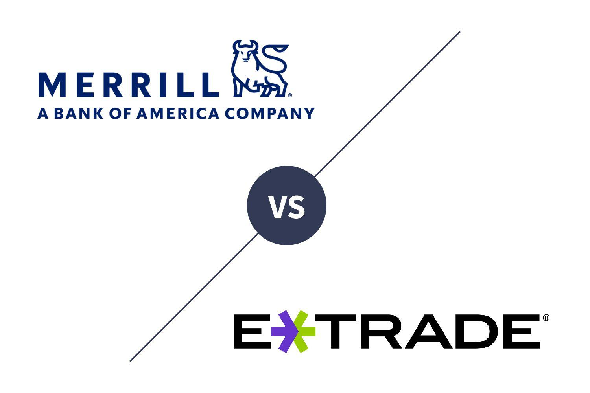

## Table of Contents

## What are Merrill Guided Investing and E*TRADE Core Portfolios?

Merrill Guided Investing is a service from Bank of America's Merrill Lynch. It helps people invest their money easily. You tell them how much risk you want to take, and they pick a mix of investments for you. They use computers to watch your investments and make changes when needed. There is a fee for using this service, but it can be a good choice if you want help with investing without doing all the work yourself.

E*TRADE Core Portfolios is a similar service offered by E*TRADE. It's designed for people who want a simple way to invest. Like Merrill Guided Investing, you answer questions about your goals and how much risk you're okay with. Then, E*TRADE sets up a portfolio for you and keeps an eye on it. They adjust your investments to keep them in line with your goals. This service also has a fee, but it's meant to make investing easier for people who don't want to manage everything on their own.

## How do the fee structures of Merrill Guided Investing and E*TRADE Core Portfolios compare?

Merrill Guided Investing has two different fee structures depending on the level of service you choose. For the basic online version, the fee is 0.45% of your account balance each year. If you want more personalized help and advice from a financial advisor, you can choose the guided investing with advisor version, which costs 0.85% of your account balance per year. These fees cover the management of your investments and any adjustments made by the system or advisor.

E*TRADE Core Portfolios, on the other hand, has a simpler fee structure. They charge a flat fee of 0.30% of your account balance annually. This fee includes the management of your portfolio and any automatic adjustments made to keep it aligned with your investment goals. Unlike Merrill, E*TRADE does not offer a version with advisor access, so the fee remains the same for all users.

## What are the minimum investment requirements for each service?

Merrill Guided Investing has different minimums depending on which version you choose. For the basic online version, you need at least $1,000 to start. If you want the version with advice from a financial advisor, you'll need a higher minimum of $20,000. This lets them give you more personal help with your investments.

E*TRADE Core Portfolios is simpler. You only need $500 to start investing with them. They keep things easy, so you don't need a lot of money to begin. This can be good if you're just starting out and want to invest without a big upfront cost.

## How do the investment options differ between Merrill Guided Investing and E*TRADE Core Portfolios?

Merrill Guided Investing offers a range of investment options that are tailored to your risk tolerance and goals. They mainly use a mix of exchange-traded funds (ETFs) and mutual funds to build your portfolio. Depending on whether you choose the basic online version or the one with advisor access, you might get different types of funds or more personalized choices. The service uses computer algorithms to pick and adjust your investments, aiming to keep your portfolio aligned with your goals over time.

E*TRADE Core Portfolios also uses ETFs to create your investment portfolio. They focus on low-cost ETFs to keep your fees down. Like Merrill, they adjust your investments automatically based on your risk level and goals. However, E*TRADE's options might be more limited compared to Merrill's, especially since they don't offer a version with direct advisor input. Both services aim to make investing easy, but Merrill might give you more variety and customization if you're willing to pay a bit more.

## What kind of account types can be opened with each service?

With Merrill Guided Investing, you can open different types of accounts depending on what you need. They offer individual and joint taxable accounts, which are good if you're saving for something like a new car or a vacation. They also have retirement accounts like Traditional IRAs and Roth IRAs, which help you save for when you stop working. If you have a small business or are self-employed, you can open a SEP IRA or a SIMPLE IRA with them too.

E*TRADE Core Portfolios also gives you choices for your accounts. You can start with a taxable individual or joint account, which is useful for saving money for short-term goals. For retirement, they offer Traditional IRAs and Roth IRAs, just like Merrill. But, E*TRADE doesn't have options for SEP IRAs or SIMPLE IRAs, so if you're self-employed or run a small business, you might need to look elsewhere for those kinds of accounts.

## How do the user interfaces and experiences compare between the two platforms?

Merrill Guided Investing has a clean and easy-to-use website and app. When you first sign up, you answer some questions about your money goals and how much risk you want to take. After that, everything is pretty simple. You can see your investments and how they're doing at a glance. If you pick the version with an advisor, you can also talk to them through the platform. It's designed to be simple so you don't have to spend a lot of time figuring things out.

E*TRADE Core Portfolios also has a user-friendly interface, but it might feel a bit different. When you start, you go through a similar process of answering questions about your goals and risk. The dashboard shows your portfolio and performance in a clear way. Since E*TRADE doesn't offer advisor access, the experience is more about using the tools on your own. Both platforms make it easy to see your money and make changes if you need to, but Merrill might feel a bit more personalized if you go for the advisor option.

## What are the tax strategies employed by Merrill Guided Investing and E*TRADE Core Portfolios?

Merrill Guided Investing uses some smart ways to help you with taxes. They do something called tax-loss harvesting, which means if one of your investments loses money, they might sell it to use that loss to lower your taxes. They also try to put your investments in the right kinds of accounts to save on taxes. For example, they might put things that grow a lot in tax-advantaged accounts like IRAs. If you choose the version with an advisor, they can give you more personal advice on how to handle your taxes better.

E*TRADE Core Portfolios also uses tax-loss harvesting to help you save on taxes. They keep an eye on your investments and will sell ones that are losing money if it can help lower your tax bill. They also try to place your investments in the best accounts to reduce taxes, similar to Merrill. But since E*TRADE doesn't have advisors, all this happens automatically without someone giving you personal advice. Both services want to help you save on taxes, but Merrill might give you more tailored help if you pay for the advisor option.

## How do the performance histories of the two services compare?

Merrill Guided Investing and E*TRADE Core Portfolios both aim to help you make money over time, but their past performance can be a bit different. Merrill has been around longer and has shown good results for many people. They use a mix of investments and try to keep your money growing while managing risk. Their performance can change based on the market, but overall, many users have been happy with how their money has grown.

E*TRADE Core Portfolios is a bit newer but also tries to give you good returns. They focus on low-cost ETFs and keep things simple. Their performance has been solid, and they work to balance growth with risk, just like Merrill. But because they don't have advisors to help, all the changes to your investments are done by computers. Both services have their ups and downs, but they both try to help your money grow over time.

## What level of human advisor access is provided by each service?

Merrill Guided Investing gives you two choices for working with people. If you pick the basic online version, you won't talk to a human advisor. Everything is done by computers. But if you choose the version with an advisor, you can talk to a real person. They can give you advice and help you with your investments. This can be good if you want someone to guide you and answer your questions.

E*TRADE Core Portfolios doesn't let you talk to a human advisor at all. Everything is managed by computers. They use technology to pick and change your investments, but you won't have someone to call if you need help. This can be okay if you're fine with doing things on your own and just want a simple way to invest.

## How do the rebalancing and portfolio management approaches differ?

Merrill Guided Investing uses computers to watch your investments and make changes when needed. They check your portfolio often to make sure it matches your goals and how much risk you want to take. If things get out of balance, they'll sell some investments and buy others to fix it. If you choose the version with an advisor, they can also step in and make changes based on what they think is best for you. This mix of computer help and human advice can make sure your investments stay on track.

E*TRADE Core Portfolios also uses computers to manage your portfolio. They look at your investments regularly and adjust them to keep things in line with your goals and risk level. They do this all automatically, without a person making the decisions. Because there's no human advisor, everything depends on the computer's choices. This can be good if you want a simple, hands-off way to invest, but you won't get personal advice like you might with Merrill's advisor version.

## What are the advanced features available to expert users on each platform?

Merrill Guided Investing has some extra things for people who know a lot about investing. If you pick the version with an advisor, you can talk to them about your investments in detail. They can help you with special strategies and give you advice that fits your exact needs. You can also look at detailed reports and see how your investments are doing in different ways. This can be helpful if you want to dive deep into your portfolio and understand everything better.

E*TRADE Core Portfolios keeps things simpler, even for expert users. They don't have advisors you can talk to, so all the fancy features are done by computers. You can still see detailed information about your investments and how they're doing. But if you want special strategies or personal advice, you won't find it here. E*TRADE focuses on making things easy and automatic, so even if you know a lot about investing, you won't get the extra help that Merrill can offer with their advisor version.

## How do customer reviews and satisfaction rates compare between Merrill Guided Investing and E*TRADE Core Portfolios?

Customer reviews for Merrill Guided Investing are generally positive, with many people liking the mix of computer help and the chance to talk to a real advisor. People often say they feel safe with their money because the advisors can give them personal advice. Some users mention that the fees are a bit high, but they think it's worth it for the extra help. Overall, many customers are happy with how their investments are doing and how easy it is to use the platform.

E*TRADE Core Portfolios also gets good reviews, but some people miss having an advisor to talk to. Users like that it's simple and the fees are low, which can be good if you're just starting out. But if you want more help or special advice, you might not be as happy. Many people are okay with the automatic way E*TRADE manages their money, and they like how easy it is to use. But the lack of personal advice can be a downside for some.

## References & Further Reading

[1]: Bergstra, J., Bardenet, R., Bengio, Y., & Kégl, B. (2011). ["Algorithms for Hyper-Parameter Optimization."](https://proceedings.neurips.cc/paper/2011/file/86e8f7ab32cfd12577bc2619bc635690-Paper.pdf) Advances in Neural Information Processing Systems 24.

[2]: ["Advances in Financial Machine Learning"](https://www.amazon.com/Advances-Financial-Machine-Learning-Marcos/dp/1119482089) by Marcos Lopez de Prado

[3]: ["Evidence-Based Technical Analysis: Applying the Scientific Method and Statistical Inference to Trading Signals"](https://www.amazon.com/Evidence-Based-Technical-Analysis-Scientific-Statistical/dp/0470008741) by David Aronson

[4]: ["Machine Learning for Algorithmic Trading"](https://github.com/PacktPublishing/Machine-Learning-for-Algorithmic-Trading-Second-Edition) by Stefan Jansen

[5]: ["Quantitative Trading: How to Build Your Own Algorithmic Trading Business"](https://www.amazon.com/Quantitative-Trading-Build-Algorithmic-Business/dp/1119800064) by Ernest P. Chan