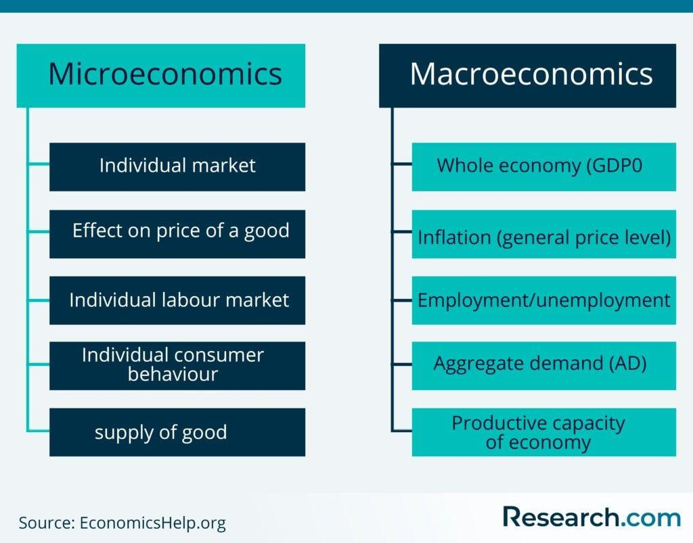

Understanding economics is essential for making informed trading and investment decisions. Economics provides the foundational knowledge needed to interpret market signals and trends. Specifically, economics is divided into microeconomics and macroeconomics, both of which play a crucial role in crafting effective trading strategies.

Microeconomics focuses on the behaviors of individuals and firms in making decisions regarding the allocation of resources. This branch of economics helps traders understand market mechanisms on a smaller scale, such as the effects of supply and demand on price levels and the decisions of individual firms, which can directly impact investments in specific industries or companies.

Macroeconomics, on the other hand, examines large-scale economic factors, including GDP, inflation rates, and governmental fiscal policies. These indicators provide insight into the overall economic environment, influencing investment portfolios and stock market behavior. Understanding macroeconomic trends helps investors anticipate broader market movements, thereby allowing for strategic positioning in global markets.

Algorithmic trading introduces a crucial technological aspect to modern trading. By automating decision-making processes, algorithmic trading enhances speed and accuracy while minimizing human error. The integration of economic analysis with algorithmic models allows traders to utilize complex economic data to create adaptive and efficient trading strategies. The interplay between microeconomic dynamics, macroeconomic trends, and algorithmic trading technologies forms the backbone of effective investment strategies.

This article will explore key themes that include the role of microeconomics in investment strategies, how macroeconomic indicators influence investments, the evolution and significance of algorithmic trading, and the integration of economic analysis within trading algorithms. Additionally, it will address the challenges associated with algorithmic trading, advancements influencing its future, and the potential opportunities it presents for investors.

## Table of Contents

## Understanding Microeconomics in Investment Strategies

Microeconomics is a branch of economics that focuses on the behaviors and decision-making processes of individuals and firms, particularly in relation to the allocation of resources and the prices of goods and services. In the context of investment strategies, microeconomics plays a critical role by offering insights into how various factors such as consumer preferences, production costs, and competitive pressures influence the valuation of individual companies and sectors. 

The fundamental principle of supply and demand underpins much of microeconomic analysis, affecting asset performance significantly. The law of demand posits that, ceteris paribus, a decrease in the price of a good will typically correspond with an increase in quantity demanded, and vice versa. Conversely, the law of supply suggests that an increase in price results in an increase in quantity supplied. The interaction of supply and demand determines the equilibrium price and quantity for goods, services, and assets, thus impacting investment decisions. 

For instance, changes in consumer preferences can shift demand curves, affecting the profitability and stock prices of related companies. If a tech firm launches a revolutionary product that garners positive consumer reception, the increased demand could lead to higher prices and stock performance, assuming supply remains constant or grows slower than demand. Similarly, shifts in supply, perhaps due to advancements in production technology, can result in cost reductions and affect competitive dynamics within an industry.

Examining specific industries or companies can provide valuable case studies of microeconomic factors at work. Consider the energy sector: fluctuations in fuel prices could dramatically shift demand for renewable energy sources. A decrease in oil prices might dampen investments in solar energy as its competitive edge diminishes, altering the stock performance of solar companies. Conversely, increased regulatory pressures to reduce carbon emissions could elevate demand for cleaner energy, benefiting companies focused on sustainable technologies.

Another example is the automotive industry, which can be analyzed through microeconomic lenses like consumer income elasticity and technological substitution. During economic downturns, consumers may prioritize lower-cost vehicles or even delay purchases, affecting the overall demand and stock performance of automotive companies. Additionally, shifts towards electric vehicles are reshaping demand curves, driven by environmental awareness and policy incentives, impacting traditional car manufacturers who must adapt to remain competitive.

In summary, microeconomics provides a framework for understanding the underlying forces that drive asset performance at a granular level. By analyzing how supply and demand dynamics evolve in response to various stimuli, investors can make more informed decisions and tailor their strategies to capture opportunities within specific markets or sectors.

## Macro Trends: How Macroeconomics Influences Investments

Macroeconomics encompasses the broad forces that shape the economic environment, significantly influencing investment landscapes. Key indicators such as Gross Domestic Product (GDP), inflation, and interest rates provide valuable insights into the health and direction of an economy, thereby affecting investment strategies.

Gross Domestic Product (GDP) is a primary macroeconomic indicator, representing the total value of goods and services produced within a country over a specific period. A growing GDP is typically associated with a healthy economy, leading to increased investor confidence and rising stock prices. Conversely, a contracting GDP can signal economic troubles, potentially leading to decreased investment returns.

Inflation measures the rate at which the general level of prices for goods and services rises, eroding purchasing power. Central banks, like the Federal Reserve, monitor inflation closely, adjusting interest rates to maintain stability. Higher inflation often results in increased interest rates to curb spending, making borrowing more expensive and potentially slowing economic growth. Investors must consider inflation's impact on investment returns, as it affects everything from bond yields to stock prices.

Interest rates, set by central banks, influence economic activity by dictating the cost of borrowing. Lower interest rates generally stimulate economic growth by making borrowing cheaper, encouraging spending and investment. However, if rates are too low for too long, they can lead to excessive risk-taking and asset bubbles. Interest rate changes can have immediate and profound effects on the stock market and investment portfolios due to their impact on the cost of capital.

Macroeconomic policies, including fiscal and monetary initiatives, play crucial roles in shaping the investment environment. Fiscal policies, such as government spending and taxation, can stimulate or restrain economic growth, influencing investor strategies. For example, tax cuts might increase disposable income, boosting consumption and corporate profits. Monetary policies, primarily [interest rate](/wiki/interest-rate-trading-strategies) adjustments, can encourage or deter investment by altering borrowing costs.

Historical examples illustrate the profound effects of macroeconomic events on global markets. The 2008 financial crisis, triggered partially by policy misjudgments and economic weaknesses, resulted in a global recession. This event saw significant market downturns, loss of investor confidence, and re-evaluation of risk management practices. Another instance is the COVID-19 pandemic, which led to unprecedented fiscal stimulus worldwide to support struggling economies. These actions affected various asset classes, with equities rebounding strongly due to stimulus measures and low interest rates.

Understanding macroeconomic trends and their potential implications is essential for making informed investment decisions. By closely monitoring these indicators and anticipating policy shifts, investors can better navigate market volatilities and harness opportunities that align with broader economic dynamics.

## The Rise of Algorithmic Trading

Algorithmic trading refers to the use of complex algorithms and automated programs to make trading decisions and execute trades in financial markets. These algorithms leverage mathematical models to decide on the timing, price, and quantity of trades, often executing them at speeds much faster than human traders. The practice revolutionized trading in the late 20th century with the advent of electronic exchanges and the increase in computational power.

The history of [algorithmic trading](/wiki/algorithmic-trading) dates back to the 1970s with the introduction of public exchanges and the early use of computers for data analysis. However, it became more prominent in the 1980s and 1990s when financial markets witnessed a significant technological shift due to the rise of the Internet and high-frequency trading ([HFT](/wiki/high-frequency-trading-strategies)). By the 2000s, algorithmic trading accounted for a substantial [volume](/wiki/volume-trading-strategy) of trade on global financial markets, driven by advancements in computational technologies and the development of sophisticated financial instruments.

One of the key benefits of algorithmic trading is speed. Automated systems can process vast amounts of information and execute trades in milliseconds, much quicker than human traders. This speed advantage is particularly beneficial in high-frequency trading, where the goal is to profit from small price changes over short timeframes.

Another benefit is accuracy. Algorithmic trading reduces the likelihood of human error by minimizing the necessity for manual inputs that could lead to mistakes. Moreover, these algorithms can handle complex calculations and simultaneous execution of multiple trades, which is often beyond human capability.

Algorithmic trading also offers the advantage of reduced emotional bias. Trading decisions based on algorithms are grounded in predefined rules and models, distancing them from human emotional influences which can lead to irrational decision-making.

There are several key types of algorithmic trading strategies used by traders:

1. **Market Making**: This strategy involves placing buy and sell orders for the same security simultaneously to capture the spread—the difference between the bid and the ask price. Algorithms adjust the price dynamically based on market conditions.

2. **Trend Following**: Algorithms analyze historical and real-time data to identify market trends and make trades in the direction of these trends. Moving averages and channel breakouts are commonly used techniques.

3. **Arbitrage**: This strategy aims to exploit price discrepancies of the same asset across different markets. By operating on minimal price disparities, algorithms execute trades quickly and efficiently to capture potential profits.

4. **Statistical Arbitrage**: This involves complex statistical models to identify trading opportunities based on the mean revision of pricing anomalies. It requires high levels of computational power and data analysis.

5. **Sentiment Analysis**: Algorithms scan social media, news, and other data sources to gauge market sentiment and predict future movements, thereby enabling traders to respond to shifts in market mood.

The integration of these strategies into trading systems has not only optimized the efficiency and effectiveness of trading operations but also transformed the nature of financial markets, making them more interconnected and dynamic.

## Integrating Economic Analysis with Algorithmic Trading

Integrating economic analysis with algorithmic trading represents a sophisticated approach that leverages both microeconomic and macroeconomic data to optimize trading strategies. This integration facilitates informed decision-making and the development of adaptive trading models that respond dynamically to market conditions.

Traders incorporate micro and macroeconomic data into algorithms by collecting and analyzing vast datasets that cover various economic indicators. Microeconomic data, such as company earnings reports, consumer behavior, and supply chain information, provide insights into individual asset performance. Conversely, macroeconomic indicators, including GDP, inflation rates, and interest rates, offer a broader perspective on market trends and economic health. By integrating these datasets, traders can enhance their predictive capabilities and refine trading strategies.

Data analysis and [machine learning](/wiki/machine-learning) play a critical role in this integration process. Machine learning algorithms are capable of identifying patterns and relationships within complex datasets that may be imperceptible to human analysts. For instance, supervised learning techniques can be used to train models on historical data, allowing them to predict future asset prices based on identified micro and macroeconomic conditions. Unsupervised learning methods, such as clustering, can also segment markets into distinct behavior patterns, which can inform targeted strategies.

A typical approach might involve using a linear regression model to assess the relationship between economic indicators and asset prices. The basic form of a linear regression model used in this context is:

$$
y = \beta_0 + \beta_1 X_1 + \beta_2 X_2 + \ldots + \beta_n X_n + \epsilon
$$

where $y$ represents the asset price, $X_1, X_2, \ldots, X_n$ are the economic indicators, $\beta_0, \beta_1, \ldots, \beta_n$ are the coefficients, and $\epsilon$ is the error term. Machine learning models can be trained to optimize these coefficients, thereby improving the accuracy of price predictions.

There are successful examples of economic indicators being integrated into algorithmic models. For instance, a popular strategy involves the use of sentiment analysis on economic news, where machine learning algorithms analyze news articles to gauge market sentiment and integrate this data into trading models. This strategy has proven effective in adjusting positions based on predicted market movements caused by sudden changes in sentiment.

Another example is the application of macroeconomic forecasting models aimed at predicting changes in interest rates or currency exchange rates. Algorithms can continuously adapt to newly released economic data, recalibrating models in real time to provide more accurate forecasts.

Incorporating economic analysis into algorithmic trading not only enhances the precision of trading strategies but also improves their adaptability to changing economic environments. As data becomes more abundant and computing power increases, the integration of sophisticated economic analysis with algorithmic models is expected to continue progressing, offering traders a more comprehensive toolkit for tackling complex markets.

## Challenges and Risks of Algorithmic Trading

Algorithmic trading, while revolutionizing financial markets with benefits like speed and precision, also introduces significant challenges and risks. A primary concern is the over-reliance on algorithms, where traders may rely excessively on automated systems without sufficient oversight. This dependence can lead to systemic risks, especially when algorithms react to market data in unforeseen ways or perpetuate errors at a rapid pace due to lack of human judgment.

Data quality and the accuracy of economic forecasts are critical in algorithmic trading. Algorithms depend heavily on input data to make decisions, and poor data quality can lead to inaccurate predictions and suboptimal trading outcomes. Economic forecasts, which are inherently uncertain, can further complicate matters, as algorithms may fail to adapt to sudden shifts in economic conditions. Data preprocessing, cleaning, and validation become vital to ensure that trading decisions are based on reliable information. Historical biases and incomplete data can skew the performance of algorithms, leading to significant financial losses.

High-frequency trading (HFT) exemplifies another area of concern. HFT strategies, characterized by rapidly executed trades within milliseconds, can contribute to market [volatility](/wiki/volatility-trading-strategies). The speed at which HFT operates can amplify market movements and contribute to events like 'flash crashes', where abrupt drops in market prices occur within a very short time. The 2010 Flash Crash is a pertinent example, where the Dow Jones Industrial Average plunged nearly 1,000 points within minutes, partially attributed to high-frequency trading algorithms interacting in an unexpected manner.

Managing these challenges requires a careful approach. Incorporating robust risk management techniques, ongoing monitoring of algorithm performance, and ensuring transparency in trading processes can mitigate some of the potential risks. Additionally, regulatory oversight plays a crucial role in maintaining market stability and preventing abuses in algorithmic trading practices.

In conclusion, while algorithmic trading offers numerous advantages, its potential downsides necessitate comprehensive risk management strategies and a thorough understanding of the underlying economic data used in trading models.

## Future Trends in Economic Analysis and Algorithmic Trading

Emerging technologies are reshaping the landscape of algorithmic trading, introducing novel approaches that enhance decision-making and execution processes. Innovations such as [artificial intelligence](/wiki/ai-artificial-intelligence) (AI) and machine learning have become integral to developing sophisticated trading algorithms. These technologies enable systems to learn from historical data, identify patterns, and adapt to new information, thus enhancing predictive accuracy. Quantum computing, although still in nascent stages concerning practical applications in finance, promises to further revolutionize trading by processing complex datasets at unprecedented speeds. This accelerated computational power could significantly optimize algorithms for pricing models, risk management, and portfolio optimization.

Real-time economic data analysis has gained critical importance, driven by the need for timely responses to market shifts. The integration of big data analytics allows traders to process vast streams of information—from social media sentiment to geopolitical developments—providing a comprehensive view of market conditions. The use of APIs and data feeds enhances the capacity to retrieve and analyze real-time updates seamlessly, which is essential for maintaining competitiveness and profitability in volatile market environments. Cloud computing facilitates the storage and processing of large volumes of data, making real-time analytics more accessible and cost-effective.

As economic landscapes evolve, so too will trading strategies. A key prediction is the increasing personalization of algorithmic strategies through the use of AI, setting the stage for bespoke trading solutions tailored to individual risk appetites and investment goals. Moreover, advancements in machine learning are expected to refine sentiment analysis techniques, improving the ability to gauge market psychology and its impact on trading decisions.

Additionally, regulatory developments will likely influence the trajectory of algorithmic trading. With the growing scrutiny on market practices, there will be a demand for algorithms that ensure compliance and transparency, particularly in high-frequency trading scenarios. Traders and financial institutions will need to balance innovation with adherence to evolving regulatory frameworks, ensuring that new strategies do not compromise market integrity.

To remain competitive, stakeholders must invest in continuous research and development, embracing emerging technologies while adapting to economic and regulatory changes. As these trends continue to unfold, the fusion of economic analysis and technology in algorithmic trading is poised to offer new avenues for achieving financial success in complex, dynamic markets.

## Conclusion

Understanding the intricacies of microeconomics, macroeconomics, and algorithmic trading is essential for investors seeking to navigate the complex financial markets with precision and informed decision-making. Microeconomics allows investors to analyze the specifics of supply and demand that drive individual asset performance, offering insights into how various economic factors may influence specific companies or industries. Conversely, macroeconomics provides a broad perspective on how economic indicators such as GDP, inflation, and interest rates influence the overall market, enabling investors to anticipate and respond to broad economic shifts.

Algorithmic trading represents a technological advance in trading, providing speed, accuracy, and the capability to handle vast amounts of data continuously. By integrating micro and macroeconomic data into trading algorithms, investors can create adaptive trading strategies that respond to real-time economic changes, thus enhancing their potential for investment success. Machine learning and data analysis contribute significantly to this adaptation by enabling the development of models that can predict market trends and adjust strategies accordingly.

However, there are challenges involved with relying heavily on algorithmic trading, such as the need for high-quality data and the potential risks of increased market volatility. Despite these challenges, the convergence of economic analysis with advanced trading strategies presents a promising path for investors to maximize returns and mitigate risks.

Investors can potentially achieve substantial success by comprehensively understanding and applying these economic concepts and trading techniques. As economic landscapes continually evolve, embracing further exploration and conducting in-depth research into these dynamic areas will empower investors to remain competitive and well-prepared for future developments in the financial markets. The integration of economic insights with technological advancements in trading provides a robust framework for making informed investment decisions in increasingly complex and fast-paced environments.

## References & Further Reading

[1]: Bergstra, J., Bardenet, R., Bengio, Y., & Kégl, B. (2011). ["Algorithms for Hyper-Parameter Optimization."](https://dl.acm.org/doi/10.5555/2986459.2986743) Advances in Neural Information Processing Systems 24.

[2]: ["Advances in Financial Machine Learning"](https://www.amazon.com/Advances-Financial-Machine-Learning-Marcos/dp/1119482089) by Marcos Lopez de Prado

[3]: ["Evidence-Based Technical Analysis: Applying the Scientific Method and Statistical Inference to Trading Signals"](https://books.google.com/books/about/Evidence_Based_Technical_Analysis.html?id=jbD47VkOHAEC) by David Aronson

[4]: ["Machine Learning for Algorithmic Trading"](https://github.com/stefan-jansen/machine-learning-for-trading) by Stefan Jansen

[5]: ["Quantitative Trading: How to Build Your Own Algorithmic Trading Business"](https://www.amazon.com/Quantitative-Trading-Build-Algorithmic-Business/dp/1119800064) by Ernest P. Chan