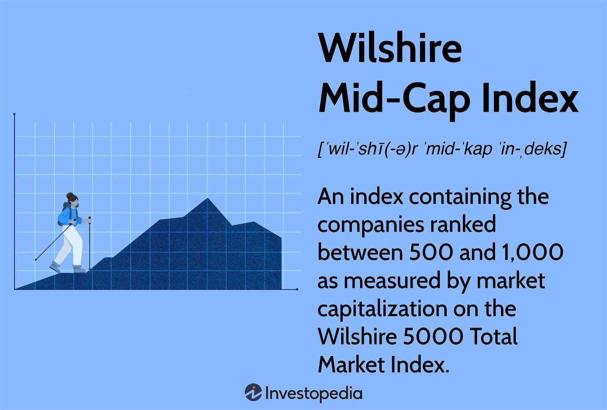

The stock market offers a wide range of investment opportunities, necessitating a thorough understanding of different indices for sound decision-making. Among these opportunities, mid-cap indexes are particularly significant. They represent companies whose market capitalizations fall between large-cap and small-cap stocks, typically ranging from $2 billion to $10 billion. These indices provide exposure to firms that are often in their growth phase, potentially offering a balance between risk and return compared to their large-cap and small-cap counterparts.

This article serves to compare various prominent mid-cap indexes and assess their significance in the field of algorithmic trading. By examining different mid-cap indices, investors can gain insights into the specific components and performance metrics that may influence their trading strategies. It is crucial to recognize how these indices are structured, what benefits they offer, and how they differ from each other, as these factors can significantly impact investment decisions.

Moreover, the application of algorithmic trading to mid-cap indices can optimize trading outcomes. Algorithmic trading employs computer-based systems to execute trades at high speeds, utilizing complex mathematical formulas and historical market data. This approach can enhance investment strategies by precisely targeting the unique characteristics of mid-cap stocks, such as their volatility and performance patterns.

Through a thorough analysis of popular mid-cap indices, this article will help investors understand the nuanced attributes of these financial tools and explore how algorithmic trading can be leveraged to achieve optimized investment results.

## Table of Contents

## Understanding Mid-Cap Stock Market Indexes

Mid-cap stocks are defined as shares of publicly traded companies with a market capitalization typically ranging between $2 billion and $10 billion. This category of stocks serves as a crucial bridge between the larger, more established large-cap companies and the smaller, more volatile small-cap firms. The inclusion of mid-cap stocks in an investment portfolio can offer a blend of stability and growth potential, appealing to a diverse range of investors.

The significance of mid-cap indexes stems from their ability to provide a more comprehensive view of economic dynamics. These indexes capture companies that are frequently in a stage of robust growth, often outperforming their larger counterparts in favorable market conditions. This growth phase is generally characterized by increased earnings potential and market expansion, offering lucrative opportunities for investors.

Several prominent mid-cap indexes serve as benchmarks for this segment of the market:

1. **CRSP U.S. Mid Cap Index**: This index includes roughly 365 stocks and is renowned for its thorough inclusion criteria, providing a detailed representation of the mid-cap segment. Its methodology focuses on capturing a wide array of mid-cap companies, offering investors insight into this specific market sector.

2. **Russell Midcap Index**: Encompassing around 824 companies, the Russell Midcap Index is often considered a broader representation of the mid-cap space. Its expansive coverage allows it to capture a significant portion of the mid-cap universe, making it a popular choice for those seeking diversified exposure.

3. **Dow Jones U.S. Mid-Cap Total Stock Market Index**: With over 502 stocks, this index offers enhanced market exposure by focusing on total market performance, thus appealing to those interested in a comprehensive view of the mid-cap sector.

4. **S&P MidCap 400 Index**: Known for its focused approach, this index comprises 400 constituent stocks, emphasizing stable and liquid mid-cap investments. It is particularly suitable for investors who prioritize liquidity and are seeking a more concentrated exposure to mid-cap stocks.

Mid-cap indexes differ significantly in terms of their constituent numbers, market cap ranges, and sector compositions. These distinct characteristics make them suitable for varied investment strategies and needs. By understanding these differences, investors can select the index that best aligns with their financial goals and market outlook.

## Comparison of Major Mid-Cap Indexes

The CRSP U.S. Mid Cap Index is comprised of approximately 365 stocks and stands out for its comprehensive inclusion criteria. This index selects companies with a market capitalization typically between $2 billion and $10 billion, ensuring a robust representation of mid-cap stocks within the U.S. market. Its broad scope offers a diverse portfolio of companies that are poised for growth and have significant market influence.

The Russell Midcap Index is another prominent index in the mid-cap category, tracking around 824 companies. This extensive list makes it one of the most representative measures of the broader mid-cap space. As part of the Russell Index family, it often reflects the overall performance of mid-cap companies more effectively due to its size and sector diversity.

In contrast, the Dow Jones U.S. Mid-Cap Total Stock Market Index consists of 502 stocks, offering broad market exposure while focusing on total market performance. This index's design captures a wide range of mid-cap stocks, providing investors a comprehensive look at the potential of mid-sized companies across various sectors.

The S&P MidCap 400 Index is recognized for its more focused approach, including 400 constituent stocks. It emphasizes stable and liquid mid-cap investments, which often attract investors looking for reduced [volatility](/wiki/volatility-trading-strategies) and strong financial fundamentals. The [liquidity](/wiki/liquidity-risk-premium) and stability of the companies within this index make it particularly appealing for those focused on secure long-term investments.

These indexes differ significantly in their sector weightings, with each offering varying degrees of exposure to industries such as technology, healthcare, and consumer services. Their geographical focus also varies, with some indexes providing more emphasis on international growth prospects, while others remain concentrated within the U.S. market.

Historically, these indexes demonstrate disparate performance metrics, influenced by their construction and the sectors they emphasize. Each index presents unique opportunities and challenges, making it essential for investors to align index selection with their financial goals and risk tolerance. Understanding these differences allows investors to strategically position their portfolios for optimal growth and stability.

## The Role of Algorithmic Trading in Mid-Cap Indexes

Algorithmic trading utilizes sophisticated computer algorithms to execute trading orders with remarkable speed and accuracy, optimizing the decision-making process in financial markets. For mid-cap indexes, [algorithmic trading](/wiki/algorithmic-trading) presents an opportunity to harness the unique attributes of these indexes for strategic investment endeavors. Algorithms are capable of processing historical data, analyzing price trends, and interpreting various market signals to execute trades with precision, thereby reducing human error and improving trade efficiency.

Mid-cap indexes, defined by their specific market capitalization range, exhibit distinctive volatilities and performance patterns compared to large-cap or small-cap indexes. Such characteristics make them particularly suitable for certain algorithmic trading strategies. Among the popular strategies applied to mid-cap indexes are mean reversion, [momentum](/wiki/momentum) trading, and [arbitrage](/wiki/arbitrage).

Mean reversion strategies are based on the theory that asset prices and historical returns will eventually revert to their long-term mean or average level. In the context of mid-cap indexes, algorithms can monitor price movements and historical averages, executing buy and sell orders when prices deviate significantly from their mean value.

Momentum trading, on the other hand, capitalizes on the strength of market trends. Algorithms in momentum trading identify and exploit these market trends by entering trades based on the directional movement of asset prices. This strategy is advantageous in the mid-cap segment owing to its potential for substantial price movements during growth phases.

Arbitrage strategies involve leveraging price differentials of the same or similar financial instruments across different markets or forms. For mid-cap indexes, algorithms can quickly detect and act upon these mispricings, executing trades that maximize returns from these discrepancies.

Automated trading platforms are essential for enabling traders to efficiently assess and leverage differences inherent in mid-cap index characteristics. Key factors such as sector weight, liquidity, and stock count differences across various mid-cap indexes can be systematically analyzed using these platforms. Additionally, traders can develop and test algorithmic models to ensure these strategies align with their investment goals and market conditions.

By integrating algorithmic trading into mid-cap index investments, traders can enhance their capability for executing fast and informed trades. This approach not only improves the precision and timing of trades but also empowers traders to make data-driven decisions, leading to potentially enhanced portfolio outcomes.

## Choosing the Right Mid-Cap Index for Your Portfolio

When selecting a mid-cap index for a portfolio, investors must consider several critical factors to ensure alignment with their financial strategies and objectives. The primary considerations include risk tolerance, investment goals, and prevailing market outlook. 

The CRSP U.S. Mid Cap Index and S&P MidCap 400 Index are suitable for those focusing on concentrated industry exposure. These indices are often characterized by specific sector weights, providing opportunities to capitalize on robust industries poised for growth. Both indices include companies with stable financials and potentially high earnings growth, appealing to investors seeking greater industry-specific investments.

In contrast, the Russell Midcap Index and Dow Jones U.S. Mid-Cap Total Stock Market Index are ideal for investors seeking broader market diversification. The Russell Midcap Index comprises a larger number of stocks, reflecting a more extensive representation across multiple sectors. Similarly, the Dow Jones U.S. Mid-Cap Total Stock Market Index offers broad exposure by including companies from various industries, helping mitigate risks linked to individual sectors.

Algorithmic traders, in particular, should incorporate considerations such as transaction costs, trading volumes, and liquidity ratios when deploying trading strategies involving mid-cap indices. It's essential to account for transaction costs as frequent trading can accumulate overheads, impacting returns. Additionally, high trading volumes and favorable liquidity ratios are crucial as they ensure trades are executed efficiently without significant price impacts.

Understanding the subtle differences between mid-cap indexes is paramount for aligning investment strategies with personal financial objectives. Investors and traders need to analyze factors such as historical performance metrics, sector exposures, and market conditions to make informed choices. By doing so, they can harness the growth potential of mid-cap stocks, which often offer a balance between risk and return compared to their large-cap and small-cap counterparts.

In summary, carefully choosing the right mid-cap index based on individual requirements can enhance a portfolio's structure and optimize investment outcomes. Making informed decisions enables investors to tap into the unique opportunities presented by mid-cap companies, potentially resulting in robust financial performance.

## Conclusion

Mid-cap indexes represent a dynamic and growth-oriented segment of the stock market, providing investors with opportunities to balance risk and return effectively. These indexes embody the potential of medium-sized companies that are often in a vibrant transition phase, offering robust growth while maintaining a more manageable risk profile compared to small-cap stocks. 

While the large-cap market often attracts most of the investment community's focus due to its stability and established entities, mid-cap stocks offer unique prospects. Their blend of stability and growth potential makes them an attractive asset class, particularly when synergy with algorithmic trading is considered. Algorithmic trading leverages computational power and sophisticated algorithms to exploit market inefficiencies, precisely timing trades to capitalize on the inherent volatility and growth dynamics of mid-cap stocks.

Examining various mid-cap indexes allows investors to select benchmarks aligned with their individual investment philosophies and financial objectives. Whether focusing on industry-specific exposure or seeking broader market representation, investors have multiple options to tailor their portfolio strategies effectively. For example, investors targeting high-growth sectors might prefer specific mid-cap indexes that represent these industries, thus optimizing the potential for substantial returns.

Incorporating mid-cap index strategies within trading activities can significantly enhance portfolio performance, providing a balanced approach to growth and risk management. These strategies offer a practical path for investors looking to leverage the maturation phase of mid-sized companies, allowing them to capitalize on the favorable conditions these enterprises experience during their expansionary periods. Ultimately, mid-cap indexes serve as a pivotal component in diversified investment strategies, offering distinct avenues for achieving financial growth and portfolio robustness.

## References & Further Reading

[1]: ["Mid-Cap Stock Definition"](https://www.investopedia.com/terms/m/midcapstock.asp) by Investopedia

[2]: ["S&P MidCap 400"](https://www.marketwatch.com/investing/index/mid) by S&P Dow Jones Indices

[3]: ["Russell Midcap Index"](https://www.marketwatch.com/investing/index/rmcc) by FTSE Russell

[4]: ["Introduction to Algorithmic Trading Strategies"](https://onlinelibrary.wiley.com/doi/epdf/10.1002/9781119206033.fmatter) by Chris Stucchio

[5]: ["Algorithmic and High-Frequency Trading"](https://www.amazon.com/Algorithmic-High-Frequency-Trading-Mathematics-Finance/dp/1107091144) by Alvaro Cartea, Sebastian Jaimungal, and José Penalva