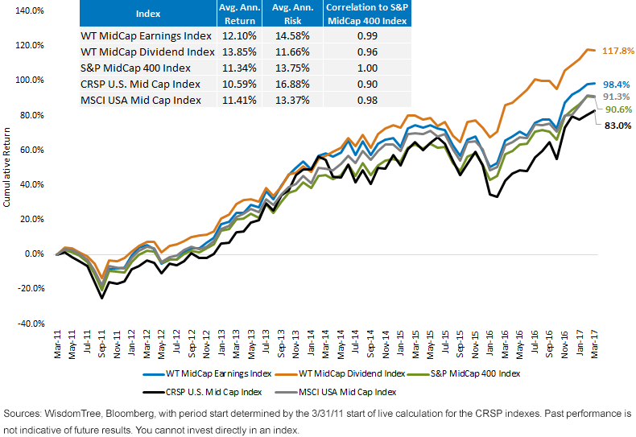

## Table of Contents

## What is a mid-cap index?

A mid-cap index is a type of stock market index that tracks the performance of medium-sized companies. These companies usually have a market value, or market capitalization, that is between that of large-cap and small-cap companies. In the United States, mid-cap companies typically have a market value between $2 billion and $10 billion. The mid-cap index gives investors a way to see how these medium-sized companies are doing overall, without having to look at each company one by one.

Investing in a mid-cap index can be a good choice for people who want to balance risk and reward. Mid-cap companies are often growing faster than large companies, but they are also more stable than small companies. This means they might offer more growth potential than large-caps, but with less risk than small-caps. By investing in a mid-cap index, investors can spread their money across many mid-sized companies, which can help reduce the risk of losing money if one company does poorly.

## How are mid-cap companies defined?

Mid-cap companies are businesses that are neither very big nor very small. They are often defined by their market value, which is called market capitalization. This is figured out by taking the total number of a company's shares and multiplying it by the price of one share. In the United States, a mid-cap company usually has a market value between $2 billion and $10 billion. This is smaller than large-cap companies, which are over $10 billion, but bigger than small-cap companies, which are under $2 billion.

These mid-sized companies are often in a good spot for growth. They have usually been around long enough to have some stability, but they are still small enough to grow quickly. This makes them interesting to investors who want to see their money grow but don't want to take too much risk. By investing in mid-cap companies, people hope to find a good balance between the safety of big companies and the growth potential of smaller ones.

## What are some popular mid-cap indexes?

Some popular mid-cap indexes are the S&P MidCap 400 and the Russell Midcap Index. The S&P MidCap 400 is made by Standard & Poor's and tracks 400 medium-sized companies in the United States. It's a good way to see how these companies are doing overall. The Russell Midcap Index, made by FTSE Russell, looks at around 800 mid-sized companies. It's another useful tool for investors who want to understand the performance of mid-cap stocks.

Both of these indexes are used by people who want to invest in mid-cap companies. They help investors see how these companies are doing without having to look at each one separately. By investing in funds that follow these indexes, people can spread their money across many mid-sized companies, which can help reduce the risk of losing money if one company does poorly. These indexes are important because they give a clear picture of the mid-cap part of the market.

## What is the difference between mid-cap and other market cap indexes?

Market capitalization, or market cap, is how big a company is based on its total value in the stock market. It's figured out by multiplying the number of shares a company has by the price of each share. There are different sizes of companies, and they are put into groups like small-cap, mid-cap, and large-cap. Mid-cap companies are in the middle; they're bigger than small companies but smaller than big ones. In the United States, mid-cap companies usually have a market value between $2 billion and $10 billion. This is different from small-cap companies, which are under $2 billion, and large-cap companies, which are over $10 billion.

The main difference between mid-cap indexes and other market cap indexes is the size of the companies they track. Mid-cap indexes, like the S&P MidCap 400 or the Russell Midcap Index, focus on medium-sized companies. These companies are often growing faster than large companies but are more stable than small ones. On the other hand, small-cap indexes look at very small companies that might grow a lot but are also riskier. Large-cap indexes track the biggest companies, which are usually more stable but might not grow as quickly. By choosing a mid-cap index, investors can find a balance between growth and safety that they might not get with small-cap or large-cap indexes.

## How do mid-cap indexes perform compared to large-cap indexes?

Mid-cap indexes often perform differently than large-cap indexes. Mid-cap companies are usually growing faster than large companies because they are still expanding but have more stability than small companies. This means mid-cap indexes might go up more than large-cap indexes over time. However, they can also be riskier because they are not as big and stable as large-cap companies. So, while mid-cap indexes can offer more growth, they might also have bigger ups and downs.

Over the long term, mid-cap indexes have sometimes done better than large-cap indexes. For example, the S&P MidCap 400 has, on average, beaten the S&P 500, which is a large-cap index, over many years. But this is not always the case, and it can depend on the economy and what's happening in the market. Investors who choose mid-cap indexes are often looking for a balance between the safety of large companies and the growth potential of smaller ones.

## What are the risk and return characteristics of mid-cap indexes?

Mid-cap indexes [carry](/wiki/carry-trading) a unique balance of risk and return. They are often seen as a middle ground between the high growth potential of small-cap companies and the stability of large-cap companies. Because mid-cap companies are still growing but have reached a certain level of stability, they can offer investors higher returns than large-cap indexes over time. For example, the S&P MidCap 400 has historically provided better returns than the S&P 500, which is a large-cap index, over many years. This makes mid-cap indexes attractive to investors looking for growth without taking on the high risk associated with small-cap stocks.

However, mid-cap indexes also come with their own set of risks. These companies are not as big or stable as large-cap companies, so they can experience bigger ups and downs in the stock market. This means that while mid-cap indexes might offer higher returns, they can also be more volatile. Investors need to be prepared for this [volatility](/wiki/volatility-trading-strategies) and understand that while the potential for growth is there, so is the risk of larger losses compared to investing in large-cap indexes. Balancing these risk and return characteristics is key for investors considering mid-cap indexes as part of their investment strategy.

## How can mid-cap indexes be used in portfolio diversification?

Mid-cap indexes can help spread out the risk in an investment portfolio. When you invest in a mid-cap index, you're putting your money into a bunch of medium-sized companies all at once. This is good because if one company doesn't do well, it won't hurt your whole investment as much. It's like not putting all your eggs in one basket. By including mid-cap indexes in your portfolio, you're mixing things up and making it less likely that a problem with one company or industry will mess up all your investments.

Mid-cap indexes can also add a good balance of growth and stability to your portfolio. Since mid-sized companies often grow faster than big companies but are more stable than small ones, they can help your investments grow over time without taking on too much risk. This can be especially helpful if you already have a lot of large-cap stocks, which are usually more stable but grow slower. By adding mid-cap indexes, you can get a bit more growth potential while still keeping things pretty safe. This way, you're not just focusing on one type of investment, and you're giving your portfolio a chance to do better overall.

## What are the methodologies used to construct mid-cap indexes?

Mid-cap indexes are built using specific rules to pick the right companies. One common way is to look at the market value of companies, which is found by multiplying the number of shares by the price of each share. Companies with a market value between $2 billion and $10 billion are usually chosen for mid-cap indexes. The goal is to pick a group of medium-sized companies that represent the whole mid-cap part of the market. This means looking at different industries and making sure the index includes a good mix of companies from all of them.

Another important part of making mid-cap indexes is deciding how much weight to give each company. Some indexes use an equal weighting method, where each company in the index has the same importance. Others use a market cap weighting method, where bigger mid-cap companies have more influence on the index's performance. The choice of weighting method can affect how the index performs, so it's an important decision. By following these rules, mid-cap indexes can give investors a clear and fair way to track the performance of medium-sized companies.

## How do fees and expenses compare across different mid-cap index funds?

Fees and expenses for mid-cap index funds can vary a lot depending on the fund you choose. Some funds have really low fees, which is good for you because it means more of your money can stay invested and grow over time. These funds often try to match the performance of a mid-cap index without spending a lot of money on managing the fund. On the other hand, some mid-cap index funds might have higher fees because they offer extra services or have more active management, which can eat into your returns.

When you're [picking](/wiki/asset-class-picking) a mid-cap index fund, it's smart to look at the expense ratio, which tells you how much you'll pay each year to keep your money in the fund. A lower expense ratio is usually better because it means you're paying less in fees. For example, some mid-cap index funds might have an expense ratio of around 0.05% to 0.20%, while others might be higher, like 0.50% or more. The difference in fees can add up over time, so it's important to compare them and choose a fund that fits your budget and investment goals.

## What are the historical performance trends of mid-cap indexes?

Mid-cap indexes have often done pretty well over the years. They usually grow faster than big companies but are more stable than small ones. For example, the S&P MidCap 400 has, over many years, beaten the S&P 500, which is an index for big companies. This means if you had put your money in a mid-cap index, you might have seen your money grow more than if you had put it in a big company index. But it's not always the case, and it can depend on what's happening in the economy and the stock market.

Even though mid-cap indexes can offer good growth, they can also be a bit risky. They go up and down more than big company indexes because the companies in them are not as stable. So, while you might make more money over time, you also need to be ready for bigger ups and downs. This is why people who invest in mid-cap indexes are often looking for a good balance between growing their money and keeping it safe.

## How do sector allocations differ among various mid-cap indexes?

Different mid-cap indexes can have different mixes of industries, or sectors. For example, the S&P MidCap 400 might have more companies from the industrial sector, while the Russell Midcap Index might have a bigger focus on technology companies. This means that if you invest in one mid-cap index, you might be putting more of your money into certain types of businesses than if you chose a different index. The way the sectors are split up can affect how the index does over time, because some industries might do better or worse than others.

Even though the sector allocations can be different, most mid-cap indexes try to cover a wide range of industries. This is to make sure the index gives a good picture of the whole mid-cap market, not just one part of it. By having a mix of sectors, the index can be less risky because it's not all in one industry. If one sector does badly, the others might do well and balance things out. So, while the exact mix of sectors can change from one mid-cap index to another, they all aim to give investors a broad look at medium-sized companies.

## What are the future growth prospects for mid-cap indexes?

Mid-cap indexes have good chances to grow in the future. These indexes follow medium-sized companies that are often in a sweet spot for growth. They are bigger than small companies but smaller than big ones, so they can grow faster than the big guys but are more stable than the small ones. This means they might do better than large-cap indexes over time. Also, as the economy changes and new industries grow, mid-cap companies can be quick to take advantage of new opportunities. This makes them interesting to investors who want to see their money grow without taking too much risk.

However, the future growth of mid-cap indexes can depend on what's happening in the economy and the stock market. If the economy is doing well, mid-cap companies might do great because they can grow quickly. But if things get tough, these companies might struggle more than big ones because they are not as stable. So, while mid-cap indexes have good growth potential, they can also be more up and down. Investors who choose mid-cap indexes need to be ready for this and understand that while the chance for growth is there, so is the risk of bigger losses compared to investing in large-cap indexes.

## References & Further Reading

[1]: ["Mid-Cap Stock Definition"](https://www.investopedia.com/terms/m/midcapstock.asp) by Investopedia

[2]: ["S&P MidCap 400"](https://www.marketwatch.com/investing/index/mid) by S&P Dow Jones Indices

[3]: ["Russell Midcap Index"](https://www.marketwatch.com/investing/index/rmcc) by FTSE Russell

[4]: ["Introduction to Algorithmic Trading Strategies"](https://onlinelibrary.wiley.com/doi/epdf/10.1002/9781119206033.fmatter) by Chris Stucchio

[5]: ["Algorithmic and High-Frequency Trading"](https://www.amazon.com/Algorithmic-High-Frequency-Trading-Mathematics-Finance/dp/1107091144) by Alvaro Cartea, Sebastian Jaimungal, and José Penalva