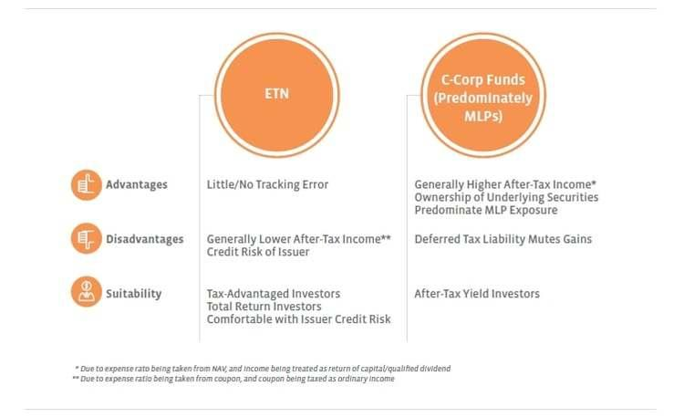

Master Limited Partnerships (MLPs) represent a unique and potentially lucrative asset class within the investment landscape, distinguished by their ability to generate attractive yields and offer tax advantages. MLP Exchange-Traded Notes (ETNs) and MLP Exchange-Traded Funds (ETFs) are crucial instruments that provide investors with convenient access to MLPs. Understanding the differences between these financial vehicles is vital for investors seeking to optimize their portfolios and achieve favorable tax outcomes.

MLP ETNs and ETFs serve as conduits for tracking the performance of MLP indexes. However, each is characterized by distinct structural and tax implications that impact performance and investor returns. MLP ETFs are frequently organized as C-corporations, which subjects them to corporate tax liabilities, potentially eroding returns due to double taxation on distributions. Alternatively, MLP ETNs function as unsecured debt instruments issued by financial institutions. This structure allows ETNs to circumvent corporate taxes, thereby offering a more precise tracking of the underlying index.



The differences in taxation between MLP ETNs and ETFs play a critical role in shaping investment decisions. MLP ETFs may face double taxation, with distributions first taxed at the corporate level and then at the investor level, diminishing net returns. Conversely, while MLP ETNs eliminate corporate taxation, the distributions are nonetheless considered taxable income for the investor, presenting another layer of tax implications to consider.

In terms of performance, MLP ETNs typically exhibit lower tracking errors compared to MLP ETFs, aligning more closely with the index they track. This is largely due to their configuration as debt instruments, which inherently avoids the complications introduced by double taxation within ETFs. However, direct ownership of MLPs might offer superior tax benefits, albeit accompanied by the complexity of K-1 tax filings.

In addition to understanding the structural and tax nuances of MLP ETNs and ETFs, there is growing interest in leveraging algorithmic trading strategies within these markets. Algorithmic trading provides a sophisticated approach to refining investment decision-making, optimizing entry and exit points, and dynamically managing portfolios. By mitigating emotional biases and harnessing data analytics, algorithmic trading can facilitate more consistent returns in MLP-focused investments.

By comprehensively examining MLP ETNs and ETFs alongside the advantages of algorithmic trading, investors can gain valuable insights and navigate the complexities of the MLP asset class more effectively. Ultimately, the choice between MLP ETNs and ETFs hinges on individual investor objectives, risk tolerance, and tax considerations, allowing for tailored strategies to enhance portfolio performance.

## Table of Contents

## What Are MLP ETNs and MLP ETFs?

MLP ETNs (Exchange-Traded Notes) and MLP ETFs (Exchange-Traded Funds) are distinct financial instruments providing investors with access to Master Limited Partnerships (MLPs), a popular investment vehicle primarily engaged in natural resource-related sectors, such as oil and gas pipelines. These instruments are designed to track indices that represent the performance of multiple MLPs, allowing investors to diversify their investments within this asset class. However, the structural differences between MLP ETNs and MLP ETFs significantly impact their taxation, risk profile, and tracking accuracy.

MLP ETFs are investment funds that hold MLP securities but are structured as C-corporations. This structural choice leads to the implication of double taxation. As a C-corporation, an MLP [ETF](/wiki/etf-trading-strategies) must pay taxes on the income it receives from its MLP investments. When the remaining funds are distributed to shareholders as dividends, investors are taxed again on this income. This double layer of taxation can erode returns compared to direct MLP investment or other investment structures.

In contrast, MLP ETNs are unsecured debt instruments issued by financial institutions, typically banks. These notes do not possess the underlying MLP securities directly but instead promise to pay a return based on the performance of an MLP index. The nature of ETNs as debt instruments allows for more accurate index tracking without the imposition of corporate taxes. Since MLP ETNs are not subject to corporate-level taxation, they often provide returns that more closely align with the underlying index performance. However, it is important to note that ETNs [carry](/wiki/carry-trading) the credit risk of the issuer, meaning that if the issuing bank defaults, the value of the ETN may be compromised.

Investors should consider these structural differences when evaluating MLP ETNs and ETFs, as they constitute different risk exposures and tax treatment. MLP ETFs' double taxation may result in lower net returns, while MLP ETNs offer more accurate index tracking at the expense of introducing issuer credit risk. Understanding these distinctions helps investors make informed choices aligned with their financial goals, risk tolerance, and tax strategy.

## Tax Implications of MLP ETNs vs MLP ETFs

The tax implications of MLP ETNs (Exchange-Traded Notes) and MLP ETFs (Exchange-Traded Funds) are pivotal in shaping investment decisions due to their impact on returns and compliance complexities. The primary difference in taxation between these two financial instruments lies in how distributions are treated under tax law, which is crucial for investors to understand.

MLP ETFs are often structured as C-corporations. This structural choice subjects them to two layers of taxation on distributions: once at the corporate level and again at the shareholder level. This phenomenon, known as double taxation, can significantly erode the performance of MLP ETFs compared to direct MLP investments. Investors receive dividends from these funds and must pay taxes on these dividends in addition to the corporate taxes already paid by the ETF itself. Consequently, the tax efficiency of MLP ETFs is typically lower, potentially reducing after-tax returns.

In contrast, MLP ETNs are issued as unsecured debt instruments by banks and do not operate under a corporate structure that accrues corporate income tax. Instead, ETNs are structured to reflect the total returns of an MLP index without the burden of corporate tax. However, distributions from ETNs are taxed as ordinary income, which may result in a higher tax burden for investors compared to capital gains taxes applicable to other investment vehicles. The simplification of tax reporting for ETNs, due to the absence of K-1 forms and primarily dealing with 1099 forms, can be an attractive feature for investors seeking hassle-free compliance.

Investors evaluating MLP ETNs versus MLP ETFs must consider these tax implications in the context of their overall investment strategy. MLP ETNs offer streamlined tax reporting and avoid the double taxation on distributions, but the ordinary income tax treatment of ETN distributions could lead to higher taxable income. Conversely, although MLP ETFs experience double taxation that can diminish performance, the distributions may be partially qualified dividends, potentially taxed at a lower rate than ordinary income, depending on the investor's tax situation. Balancing these variables is crucial for investors aiming to optimize their total after-tax return.

## Performance Considerations

MLP ETFs, or Master Limited Partnership Exchange-Traded Funds, encounter tracking discrepancies due to their C-corporation structure. This structure subjects them to corporate income taxes on distributions received from MLPs, leading to reduced net asset value and diminished tracking fidelity against the underlying MLP index. This double layer of taxation can result in increased tracking errors, where the ETF's performance deviates from the benchmark index it aims to replicate closely.

In contrast, MLP ETNs (Exchange-Traded Notes) offer a more precise method of index tracking. As unsecured debt instruments, MLP ETNs are not subject to corporate income taxes on distributions. Instead, they rely on the creditworthiness of the issuing financial institution, which means that the Note’s value is designed to mirror the index as closely as possible without the tax-related value reduction inherent in C-corporation structures. Consequently, MLP ETNs can provide investors with a tracking experience that is generally more aligned with the actual performance of the MLP index.

Direct ownership of MLPs presents another performance dynamic. While it offers significant tax benefits, such as avoiding corporate tax at the entity level and receiving potentially tax-advantaged distributions, it comes with the complexity of managing a Schedule K-1 tax form. This demands an understanding of partnership tax nuances, potentially complicating personal tax filing processes. Despite this complexity, the tax advantages can be compelling for investors who are able to navigate the intricacies of K-1 filings.

Given these performance considerations, investors prioritizing ease of management and precision in index tracking might favor MLP ETNs. The absence of corporate tax implications means MLP ETNs avoid the performance drag associated with MLP ETFs, although they do entail distinct tax treatments for income received. The decision ultimately rests on the investor’s capacity to handle tax complexities and their preference for accurate index replication versus potential tax savings through direct MLP investment.

## Integration of Algorithmic Trading Strategies

Algorithmic trading can elevate the efficiency and precision of trading strategies for both MLP ETNs and ETFs. By implementing quantitative models and systematic strategies, investors can identify optimal entry and [exit](/wiki/exit-strategy) points in these investment vehicles, thereby enhancing overall portfolio performance. Advanced analytics, which form the core of [algorithmic trading](/wiki/algorithmic-trading), allow for the evaluation of myriad variables and indicators, resulting in more informed trading decisions.

One primary advantage of algorithmic trading is the capability to dynamically adjust investment positions in response to rapid market shifts. The speed and accuracy at which algorithms operate enable investors to capitalize on transient opportunities, thereby optimizing returns. For instance, algorithms can be engineered to respond to real-time data feeds and market signals, executing trades with minimal delay.

A practical example of an algorithmic strategy is mean reversion, where the algorithm identifies securities that have deviated from their historical average prices. This could be implemented using Python:

```python
import numpy as np
import pandas as pd

# Sample data: price history of an MLP ETN
prices = pd.Series([10, 10.5, 9.8, 10.2, 10.7, 9.5])

# Calculate the moving average
moving_average = prices.rolling(window=3).mean()

# Identify deviations from the moving average
deviation = prices - moving_average

# Buy signal: price drops below the mean significantly
buy_signal = prices[deviation < -0.5]
```

By automating such strategies, investors can reduce the influence of emotional biases, a prevalent issue in manual trading, thereby achieving more consistent long-term returns. Furthermore, algorithmic trading empowers investors to effectively manage MLP-focused investments by ensuring that trades align with predefined risk parameters and performance objectives. This systematic approach provides a structured framework for decision-making, enhancing the ability to manage the unique aspects of MLP investments effectively.

## Conclusion

Both MLP ETNs (Exchange-Traded Notes) and MLP ETFs (Exchange-Traded Funds) provide investors with access to the Master Limited Partnership (MLP) asset class, offering distinct benefits and drawbacks that require careful consideration. Comprehending the tax implications and performance potential of these investment vehicles is crucial for making informed decisions. MLP ETFs, structured as C-corporations, often encounter issues such as double taxation, which can impact performance negatively compared to direct MLP investments. Conversely, while MLP ETNs avoid corporate tax, they subject distributions to income tax, creating a trade-off between tax simplicity and burden.

Algorithmic trading stands as a significant tool in enhancing the management efficiency of these vehicles. By optimizing entry and exit points through advanced analytics, algorithmic strategies empower investors to dynamically adjust their positions and reduce emotional decision-making, thus fostering more consistent returns.

Ultimately, the decision between MLP ETNs and ETFs hinges on individual investor goals, risk tolerance, and tax considerations. Investors should align their choice with their long-term financial objectives, understanding that both vehicles offer unique advantages that cater to varying investment strategies and preferences.

## References & Further Reading

[1]: ["Master Limited Partnerships: Understanding These High-Yield Investments"](https://www.simplysafedividends.com/world-of-dividends/posts/9-a-guide-to-investing-in-master-limited-partnerships-mlps) by Nasdaq

[2]: ["The Tax Benefits of Master Limited Partnerships (MLPs)"](https://www.investopedia.com/articles/personal-finance/062515/mlps-how-they-are-taxed.asp) by Investopedia

[3]: ["Master Limited Partnerships and Exchange-Traded Funds: Impacts on Returns and Diversification"](https://www.financestrategists.com/tax/business-entity/master-limited-partnerships-mlps/) by CFA Institute

[4]: ["Algorithmic Trading: Winning Strategies and Their Rationale"](https://www.amazon.com/Algorithmic-Trading-Winning-Strategies-Rationale-ebook/dp/B00CY5HC0U) by Ernest P. Chan

[5]: ["An Introduction to Master Limited Partnerships and Their Investment Characteristics"](https://bhseclaw.com/blog/what-is-a-mlp/) by MLP Association