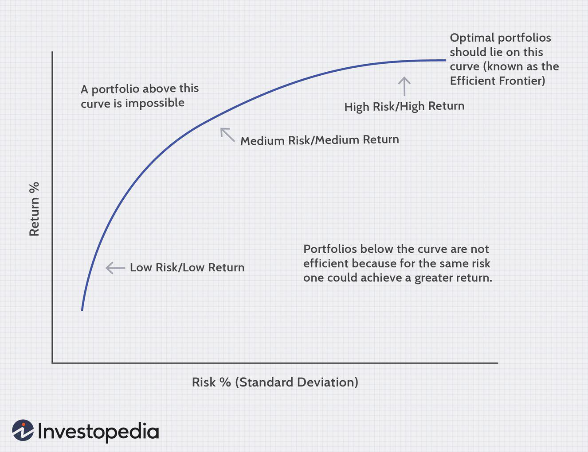

Investment strategies have dramatically evolved over the years, with innovations in technology and finance reshaping how we approach portfolio management. A significant transformation has been the incorporation of advanced financial theories and technological advancements. The Modern Portfolio Theory (MPT), introduced by Harry Markowitz, revolutionized the field by providing a framework focused on maximizing expected return for a given level of risk through diversification. This theory introduced concepts like the efficient frontier, guiding investors in constructing optimal portfolios under the assumption of markets being efficient with rational investors.

However, real-world markets often deviate from these assumptions due to psychological influences and cognitive biases, as highlighted by Behavioral Finance. This field examines how such biases can lead to irrational investment decisions, challenging the rationality presupposed by MPT. By understanding these psychological factors, investors can develop strategies to mitigate biases, thereby enhancing decision-making processes.



The advent of Algorithmic Trading further transformed investment strategies by leveraging computer programs to execute trades at high speeds and volumes based on predefined criteria. These algorithms utilize quantitative models, significantly impacting modern financial markets by improving liquidity and reducing transaction costs. The integration of technology, particularly artificial intelligence and machine learning, in algorithmic frameworks has allowed for more refined and precise trading strategies.

This article explores the synergies between Modern Portfolio Theory, Behavioral Finance, and Algorithmic Trading to provide insights into effective investment strategies in today's volatile markets. Understanding these concepts empowers investors to optimize returns while managing risks, navigating the complexities and dynamics of contemporary financial environments effectively.

## Table of Contents

## Modern Portfolio Theory (MPT)

Modern Portfolio Theory (MPT), formulated by Harry Markowitz in 1952, is a foundational concept in finance that introduces a systematic approach to portfolio construction. The primary objective of MPT is to maximize the expected return for a given level of risk, or conversely, minimize risk for a specified level of expected return. This is achieved through diversification, which reduces the portfolio's overall risk by combining assets with varying degrees of correlation.

A key concept within MPT is the "efficient frontier," which represents the set of portfolios that offer the highest expected return for a given level of risk. Portfolios that lie on the efficient frontier are considered optimal, as they provide the best possible return for their level of risk. Portfolios below the efficient frontier are suboptimal because they do not provide adequate returns for the risk undertaken.

Mathematically, MPT employs mean-variance optimization to determine the optimal asset allocation. This involves calculating the expected returns, variances, and covariances of all assets in the portfolio. The optimization process can be expressed as follows:

$$
\text{Minimize: } \sigma_p^2 = \sum_{i=1}^{n} \sum_{j=1}^{n} w_i w_j \sigma_{ij}
$$

$$
\text{Subject to: } \sum_{i=1}^{n} w_i = 1
$$

$$
\text{and } E(R_p) = \sum_{i=1}^{n} w_i E(R_i)
$$

where:
- $\sigma_p^2$ is the variance of the portfolio,
- $w_i$ and $w_j$ are the weights of assets $i$ and $j$,
- $\sigma_{ij}$ is the covariance between assets $i$ and $j$,
- $E(R_p)$ is the expected return of the portfolio,
- $E(R_i)$ is the expected return of asset $i$.

MPT operates under several assumptions, notably that markets are efficient, meaning all available information is reflected in asset prices, and that investors act rationally, seeking to optimize their utility. However, these assumptions have been critiqued and modified by subsequent theories, such as Behavioral Finance, which considers psychological factors influencing investor behavior.

Despite these criticisms, MPT remains a cornerstone in financial theory and practice, offering a quantitative framework for making informed investment decisions. Its principles continue to guide portfolio managers in structuring diversified portfolios aimed at achieving the best possible risk-return trade-off.

## Behavioral Finance

Behavioral Finance studies the psychological influences and cognitive biases that shape the financial decisions of investors. Unlike traditional financial theories that assume rational behavior, Behavioral Finance recognizes that investors often deviate from rationality. This deviation is attributed to a variety of emotional and psychological factors, resulting in suboptimal investment decisions.

A key aspect of Behavioral Finance is its challenge to the rational decision-making assumption found in Modern Portfolio Theory (MPT). According to MPT, investors are rational actors who aim to maximize returns for a given level of risk. However, Behavioral Finance highlights that emotions such as fear and greed, along with cognitive biases, can significantly impact investment decisions. For example, the phenomenon of loss aversion suggests that investors experience losses more intensely than gains of equivalent value, which often leads to overly conservative investment choices or panic selling during market downturns.

Another important concept within Behavioral Finance is overconfidence bias, where investors overestimate their knowledge or ability to predict market movements. This can lead to excessive trading, increasing transaction costs and potentially destabilizing portfolios. Herd behavior is another bias often observed in financial markets, where investors follow the crowd, leading to bubble formations or abrupt market crashes.

Incorporating Behavioral Finance into investment strategies involves recognizing and mitigating these biases. For instance, structured decision-making processes and algorithmic approaches can provide more systematic and emotion-free investment strategies that are less susceptible to human error. By using tools such as behavioral nudges, investors can be guided towards more rational choices, such as rebalancing portfolios when necessary rather than relying on emotions.

Python code can be used to simulate and analyze behavioral biases in investment strategies, representing a quantitative approach to Behavioral Finance. For example, Monte Carlo simulations can assess the impact of biases on portfolio performance under different market conditions. The following Python snippet demonstrates a simple simulation of loss aversion in an investment portfolio:

```python
import numpy as np

# Parameters
initial_wealth = 10000
prob_gain = 0.5
gain_size = 0.1  # 10% gain
loss_size = 0.2  # 20% loss
n_simulations = 1000

# Simulate portfolio outcomes
np.random.seed(42)
outcomes = []

for _ in range(n_simulations):
    wealth = initial_wealth
    random_event = np.random.rand()
    if random_event < prob_gain:
        wealth *= (1 + gain_size)
    else:
        wealth *= (1 - loss_size)
    outcomes.append(wealth)

# Analyze results
mean_wealth = np.mean(outcomes)
median_wealth = np.median(outcomes)

print("Mean final wealth:", mean_wealth)
print("Median final wealth:", median_wealth)
```

Through such simulations, investors can recognize the potential influence of loss aversion and other biases on their financial outcomes. Overall, Behavioral Finance provides valuable insights that can lead to more robust and rational investment strategies, ultimately enhancing long-term financial success.

## Algorithmic Trading

Algorithmic trading refers to the use of computer algorithms to execute trades in financial markets at high speed and [volume](/wiki/volume-trading-strategy), relying on pre-defined sets of criteria or rules. This method leverages quantitative models to analyze vast amounts of data, making it essential in the modern financial landscape for multiple reasons.

One of the primary benefits of [algorithmic trading](/wiki/algorithmic-trading) is its ability to improve market [liquidity](/wiki/liquidity-risk-premium) and reduce transaction costs. Traditional manual trading might suffer from slower execution times and higher costs due to human limitations. In contrast, algorithmic trading can execute numerous trades simultaneously across multiple markets, ensuring that trades are performed at the most advantageous prices available. This efficiency often leads to tighter bid-ask spreads, thereby benefiting both liquidity providers and takers within the market.

Algorithmic trading strategies incorporate insights from Modern Portfolio Theory (MPT) and Behavioral Finance to enhance decision-making processes. For instance, algorithms can optimize portfolios by adhering to the principles of diversification and risk-return balance as dictated by MPT. Through mean-variance optimization, these algorithms can construct portfolios that aim to maximize returns for a given level of risk. This involves calculating the expected return and standard deviation of various asset combinations to identify the 'efficient frontier'—a curve representing the set of optimal portfolios offering the most expected return for a defined level of risk.

Moreover, integration of Behavioral Finance theories within algorithmic frameworks can help address cognitive biases and emotional influences that often disrupt rational investment decisions. By analyzing patterns that deviate from traditional market theories, algorithmic systems can predict and react to market trends driven by investor behavior, such as herding or overreaction, more effectively than human traders.

Python, with its robust libraries, is commonly used for developing and [backtesting](/wiki/backtesting) algorithmic trading strategies. Here is a simple example using Python's Pandas and NumPy libraries to calculate moving averages, a basic algorithmic trading strategy:

```python
import pandas as pd
import numpy as np

# Sample data
data = {'Price': [110, 112, 111, 113, 115, 114, 116]}
df = pd.DataFrame(data)

# Calculate moving averages
df['Short_MA'] = df['Price'].rolling(window=2).mean()
df['Long_MA'] = df['Price'].rolling(window=3).mean()

# Generate buy/sell signals
df['Signal'] = np.where(df['Short_MA'] > df['Long_MA'], 1, 0)
df['Position'] = df['Signal'].diff()

print(df)
```

In this code snippet, the short-term moving average (Short_MA) and long-term moving average (Long_MA) are calculated over rolling windows. A strategy is implemented to create buy signals when the short-term average exceeds the long-term average, indicative of an upward [momentum](/wiki/momentum).

Algorithmic trading not only optimizes execution speed and accuracy but also allows for strategies that can assimilate vast data insights—ranging from market trends to investor behavior patterns—providing a comprehensive approach to modern investing.

## Market Efficiency and Knowledge Distribution

Modern theories in finance, particularly the Efficient Market Hypothesis (EMH), assert that financial markets are efficient, meaning that asset prices reflect all available information at any given time. Developed by Eugene Fama in the 1960s, EMH posits that because information is instantaneously incorporated into asset prices, it is impossible for investors to consistently achieve returns that exceed average market returns on a risk-adjusted basis, except through luck or possessing inside information.

The Efficient Market Hypothesis is largely based on three forms of market efficiency: weak, semi-strong, and strong. Weak form efficiency suggests that past price movements and volume data do not provide insight into future price movements, rendering technical analysis ineffective. Semi-strong form efficiency proposes that share prices not only reflect all past market data but also all publicly available information, thereby challenging the effectiveness of [fundamental analysis](/wiki/fundamental-analysis). Strong form efficiency takes this a step further by suggesting that share prices reflect all information, public and private, implying that even insider information cannot give an investor a competitive edge.

Despite the theoretical appeal of EMH, real-world observations often reveal market inefficiencies that the hypothesis cannot fully explain. Behavioral Finance, a field that marries psychology and finance, identifies various cognitive biases and emotional responses that lead to irrational decision-making and market anomalies. For instance, phenomena such as overconfidence, anchoring, and herd behavior demonstrate how investors often deviate from rationality, leading to mispricings and opportunities for astute market participants.

Moreover, information asymmetries—situations where certain investors have access to more or better information than others—further exacerbate these inefficiencies. For example, institutional investors frequently benefit from advanced technologies and sophisticated analytical tools that are not accessible to individual investors. This unequal distribution of knowledge can lead to imbalances in the market, creating scenarios where prices do not fully reflect all available information efficiently.

Understanding the interplay between theoretical market efficiency and practical inefficiencies can offer strategic advantages. By recognizing moments when psychological biases or information asymmetries may impact market prices, investors can potentially exploit these inefficiencies. Strategies like [arbitrage](/wiki/arbitrage) exploit price discrepancies to generate profit, assuming that such inefficiencies are temporary and that prices will eventually revert to their fair value.

Ultimately, acknowledging both EMH and the insights from Behavioral Finance can lead to more nuanced and effective investment strategies. Recognizing the conditions under which market efficiency fails allows investors to develop approaches that better account for human behavior and information imbalances, thereby enhancing their ability to make informed investment decisions in complex, dynamic markets.

## Rational vs. Irrational Investment Decisions

While Modern Portfolio Theory (MPT) assumes that investors act rationally, optimizing their portfolios based on the mean-variance framework, Behavioral Finance reveals the pervasive influence of irrational behaviors in investment decisions. Emotions such as fear and greed frequently drive actions that deviate from the predictions of rational models.

Fear, often manifesting during market downturns, can cause investors to sell assets prematurely to avoid further losses. This behavior, commonly referred to as "loss aversion," highlights a cognitive bias where the pain of losing is psychologically more impactful than the pleasure of gaining. On the other hand, greed, often observed during bullish markets, can lead investors to continue purchasing overvalued assets, hoping that prices will rise indefinitely. This behavior might culminate in "speculative bubbles," where asset prices significantly exceed their intrinsic values.

Recognizing and understanding these emotional influences provide a strategic advantage for investors. By identifying patterns of irrational behavior, investors can anticipate potential market trends and make more informed decisions. For instance, an investor who recognizes widespread panic may view it as a buying opportunity, capitalizing on undervalued assets that others are discarding out of fear.

Incorporating insights from Behavioral Finance can refine investment strategies. For instance, employing contrarian strategies—where investors go against prevailing market sentiments—can be profitable. An investor might purchase when the majority are selling due to panic, and vice versa, thereby exploiting the inefficiencies caused by irrational decisions.

To illustrate, consider the following simple Python example that simulates a contrarian investment decision model. This model might aid an investor in making more rational decisions by quantifying emotional biases and suggesting actions based on deviations from rational behavior:

```python
import numpy as np
import pandas as pd

# Simulated market sentiment data (-1: extreme fear, 1: extreme greed)
market_sentiment = np.random.uniform(-1, 1, 100)

# Investor decision model
def contrarian_strategy(sentiment):
    decision = np.where(sentiment < -0.5, 'Buy', 
                        np.where(sentiment > 0.5, 'Sell', 'Hold'))
    return decision

# Apply model to simulated data
decisions = contrarian_strategy(market_sentiment)
decision_df = pd.DataFrame({'Sentiment': market_sentiment, 'Decision': decisions})

# Display a sample of decisions
print(decision_df.head())
```

In this example, if the sentiment index indicates "extreme fear" (values below -0.5), the model suggests buying. For "extreme greed" (values above 0.5), it suggests selling. Otherwise, the strategy is to hold. This approach leverages the understanding of irrational market dynamics to make decisions aligned with potential market corrections.

By blending the rational frameworks of traditional finance with insights from Behavioral Finance, investors can better prepare for emotional market turmoils, optimizing decision-making processes to navigate complex financial landscapes effectively.

## The Role of Technology in Investment Strategies

Technological advancements have significantly transformed the landscape of investment strategies. Artificial Intelligence (AI) and [machine learning](/wiki/machine-learning) are at the forefront of this evolution, providing sophisticated tools that enhance the ability to develop and execute trading strategies with increased precision and efficiency.

Algorithmic trading, a key beneficiary of technology, utilizes computer algorithms to automatically execute trades based on predetermined criteria. These algorithms can analyze vast amounts of data far more efficiently than humans, identifying patterns and making split-second decisions to capitalize on market opportunities. By integrating AI and machine learning into algorithmic trading systems, traders can refine decision-making processes, improving the accuracy and speed of executions. For example, machine learning algorithms can process historical price data to predict future price movements, helping traders to better time their entry and [exit](/wiki/exit-strategy) points.

The application of AI extends to portfolio management by enabling more nuanced risk assessments and asset allocations. AI systems can analyze complex market dynamics and investor behaviors in real time, allowing for dynamic adjustments to portfolios based on changing conditions. This capability aligns with concepts from Modern Portfolio Theory (MPT), which seeks to optimize asset distribution to maximize returns for a given risk level.

The synergy between technology and traditional financial theories creates opportunities for managing complex portfolios. With data-driven AI models, investors can uncover insights that inform investment decisions, reducing biases and improving rationality. Additionally, machine learning algorithms can continuously learn from new data, adapting strategies to evolving market conditions, thus offering a competitive edge.

Moreover, natural language processing (NLP), an AI subfield, enables the analysis of unstructured data, such as news articles and social media, to gauge market sentiment. This can provide valuable inputs for developing sentiment-based trading strategies, contributing further to the predictive power of technological tools.

In conclusion, the integration of AI, machine learning, and algorithmic trading continues to reshape investment strategies, providing investors with powerful resources to navigate and capitalize on complex market environments. This technological leverage not only augments traditional financial theories but also paves the way for innovative approaches to portfolio management and risk optimization.

## The Bottom Line

The integration of Modern Portfolio Theory (MPT), Behavioral Finance, and Algorithmic Trading provides investors with a robust framework for developing effective investment strategies. By understanding both theoretical models and practical implementations, investors can better manage market [volatility](/wiki/volatility-trading-strategies) and construct optimal portfolios.

Modern Portfolio Theory emphasizes diversification to maximize expected returns for a fixed level of risk. The efficient frontier concept helps investors identify optimal portfolio allocations. However, MPT's limitation is its assumption of rational investor behavior, often not observed in real markets.

Behavioral Finance addresses these limitations by considering psychological influences and cognitive biases that affect investor behavior. Recognizing patterns of irrationality enables investors to anticipate market movements and adjust strategies proactively. By considering both MPT and Behavioral Finance, investors can develop more nuanced strategies that account for both rational and irrational behaviors.

Algorithmic Trading introduces precision and speed into the execution of investment decisions. Utilizing quantitative models, algorithms can process vast amounts of market data, ensuring quick responses to market changes. Algorithms enhance the application of insights from MPT and Behavioral Finance by automating complex trading decisions and reducing human error.

Synergies among these frameworks allow for a comprehensive approach to portfolio management. MPT provides the blueprint for diversification, Behavioral Finance offers insights into market inefficiencies, and Algorithmic Trading ensures efficient transaction execution. Together, they enable investors to optimize returns while managing risks, adapting to the dynamic nature of financial markets. Leveraging this integrated approach enhances portfolio resilience, positioning investors for sustained success in volatile environments.

## References & Further Reading

[1]: Markowitz, H. (1952). ["Portfolio Selection."](https://onlinelibrary.wiley.com/doi/abs/10.1111/j.1540-6261.1952.tb01525.x) The Journal of Finance, 7(1), 77-91.

[2]: Thaler, R. H., & Sunstein, C. R. (2008). ["Nudge: Improving Decisions About Health, Wealth, and Happiness."](https://www.researchgate.net/publication/257178709_Nudge_Improving_Decisions_About_Health_Wealth_and_Happiness_RH_Thaler_CR_Sunstein_Yale_University_Press_New_Haven_2008_293_pp) Penguin Books.

[3]: Shefrin, H. (2005). ["A Behavioral Approach to Asset Pricing."](https://www.sciencedirect.com/book/9780123743565/a-behavioral-approach-to-asset-pricing) Academic Press.

[4]: Carhart, M. M. (1997). ["On Persistence in Mutual Fund Performance."](https://onlinelibrary.wiley.com/doi/full/10.1111/j.1540-6261.1997.tb03808.x) The Journal of Finance, 52(1), 57-82.

[5]: Lo, A. W., & MacKinlay, A. C. (1999). ["A Non-Random Walk Down Wall Street."](https://www.amazon.com/Non-Random-Walk-Down-Wall-Street/dp/0691092567) Princeton University Press.

[6]: Fama, E. F. (1970). ["Efficient Capital Markets: A Review of Theory and Empirical Work."](https://www.jstor.org/stable/2325486) The Journal of Finance, 25(2), 383-417.

[7]: Shiller, R. J. (2000). ["Irrational Exuberance."](https://press.princeton.edu/books/paperback/9780691173122/irrational-exuberance) Princeton University Press.

[8]: Chan, E. (2009). ["Quantitative Trading: How to Build Your Own Algorithmic Trading Business."](https://github.com/ftvision/quant_trading_echan_book) Wiley Trading.