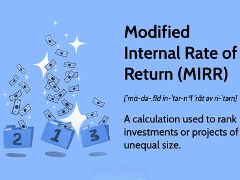

## Table of Contents

## What is the Internal Rate of Return (IRR)?

The Internal Rate of Return (IRR) is a way to figure out how well an investment is doing. It's like a special percentage that shows the growth rate of your money over time. When you put money into something, like a business or a project, IRR helps you see if it's a good choice. You want the IRR to be higher than the rate you could get from safer options, like a savings account or a bond.

To find the IRR, you need to do some math. It's the rate that makes the total amount of money coming in from the investment equal to the total amount of money going out. This can be tricky to calculate because it involves guessing and checking until you find the right number. Once you have the IRR, you can compare it to other investments or to the cost of borrowing money to see if it's worth it. If the IRR is high, it means your investment is doing well, and if it's low, you might want to look for better options.

## What is the Modified Internal Rate of Return (MIRR)?

The Modified Internal Rate of Return (MIRR) is a way to measure how well an investment is doing, just like the regular Internal Rate of Return (IRR). But MIRR fixes some problems that IRR has. When you use IRR, it can sometimes give you weird results if the money coming in and going out happens in a strange pattern. MIRR solves this by using a different way to handle the money. It takes the money you put in and grows it at a safe rate, like what you might get from a savings account. Then, it takes the money you get back from the investment and shrinks it back to the start of the project using a different rate, like the cost of borrowing money.

Once you have these two adjusted amounts, MIRR finds the rate that makes them equal. This gives you a clearer picture of how your investment is doing. MIRR is helpful because it gives you a more realistic idea of the return on your investment. It's especially useful when you're comparing different projects or investments because it's less likely to trick you with odd results. So, if you want a more reliable way to see if your investment is worth it, MIRR is a good tool to use.

## How is IRR calculated?

Calculating the Internal Rate of Return (IRR) is like solving a puzzle. You start with all the money you put into an investment and all the money you get back from it over time. IRR is the special rate that makes the total value of the money you get back equal to the total value of the money you put in. To find this rate, you need to use a guess-and-check method because there's no simple formula that gives you the answer right away. You guess a rate, then use it to see if the money coming in equals the money going out. If it doesn't match, you guess a different rate and try again until you find the right one.

Once you find the IRR, it tells you the average yearly growth rate of your investment. For example, if the IRR is 10%, it means your money is growing at 10% per year on average. This rate is really useful because you can compare it to other investments or to the cost of borrowing money. If the IRR is higher than these other rates, it means your investment is doing better than those options. But if it's lower, you might want to look for something else that could give you a better return.

## How is MIRR calculated?

Calculating the Modified Internal Rate of Return (MIRR) involves a few steps that help you get a clearer picture of your investment's performance. First, you take all the money you put into the investment and grow it at a safe rate, like what you might earn from a savings account. This is called the finance rate. Then, you take all the money you get back from the investment and shrink it back to the start of the project using a different rate, like the cost of borrowing money. This is called the reinvestment rate. These two rates help you adjust the money in a way that makes the calculation more realistic.

Once you have these adjusted amounts, you find the MIRR by figuring out the rate that makes the total value of the money you put in equal to the total value of the money you get back. This rate gives you a better idea of how well your investment is doing because it takes into account the costs of borrowing and the safe ways to reinvest your money. MIRR is especially useful when comparing different investments because it gives you a more reliable measure of their performance.

## What are the key differences between IRR and MIRR?

The main difference between IRR and MIRR is how they handle the money coming in and going out of an investment. IRR looks at the cash flows and tries to find the rate that makes the total money coming in equal to the total money going out. It assumes that any money you get back from the investment can be reinvested at the same rate as the IRR. This can sometimes lead to odd results, especially if the cash flows are not regular. On the other hand, MIRR uses two different rates to handle the money: a finance rate for the money you put in and a reinvestment rate for the money you get back. This makes MIRR a more realistic measure because it takes into account the actual costs of borrowing and the safer rates at which you might reinvest your money.

Another key difference is how they help you make decisions. IRR can be tricky to use because it might give you multiple answers or no answer at all if the cash flows are strange. This can make it hard to compare different investments. MIRR solves this problem by giving you a single, clear rate that you can easily compare to other investments or to the cost of borrowing money. If you want a more reliable way to see if your investment is worth it, MIRR is a better tool. It helps you make better decisions by providing a more accurate picture of your investment's performance.

## Why might MIRR be considered a more accurate measure of investment performance than IRR?

MIRR might be considered a more accurate measure of investment performance than IRR because it fixes some problems that IRR has. When you use IRR, it assumes that any money you get back from the investment can be reinvested at the same high rate as the IRR. This isn't always realistic because you might not be able to find another investment that gives you the same high return. MIRR solves this by using a different rate, called the reinvestment rate, which is usually a safer rate like what you might get from a savings account. This makes MIRR's calculations more realistic because it takes into account what you can actually do with the money you get back.

Another reason MIRR is seen as more accurate is that it handles the money you put into the investment in a better way. IRR can give you weird results if the money coming in and going out happens in a strange pattern. MIRR uses a finance rate, which is the cost of borrowing money, to grow the money you put in until the end of the investment. This gives you a clearer picture of what the investment is really costing you. By using these two different rates, MIRR provides a more reliable measure of how well your investment is doing, making it easier to compare different investments and make better decisions.

## Can you explain the reinvestment rate assumption in IRR and how MIRR addresses this?

The reinvestment rate assumption in IRR is a big reason why it can sometimes give you strange results. IRR assumes that any money you get back from your investment can be put back into another investment that gives you the same high return as the IRR. This is like saying if you get 10% from your investment, you can always find another investment that will also give you 10%. But in real life, it's hard to find investments that always give you such high returns. So, this assumption can make IRR seem too good to be true.

MIRR fixes this problem by using a different rate, called the reinvestment rate, to handle the money you get back. Instead of assuming you can reinvest at the high IRR rate, MIRR uses a safer rate, like what you might get from a savings account. This makes the calculation more realistic because it's easier to find a safe place to put your money. By using this lower reinvestment rate, MIRR gives you a more accurate picture of how well your investment is really doing.

## How do IRR and MIRR handle multiple cash flows differently?

IRR and MIRR handle multiple cash flows in different ways. IRR looks at all the money coming in and going out of an investment and tries to find the rate that makes the total money coming in equal to the total money going out. It assumes that any money you get back can be put back into another investment at the same high rate as the IRR. This can be a problem if the cash flows are not regular or if they change a lot over time. IRR might give you weird results or even multiple answers, which can make it hard to understand how well your investment is doing.

MIRR solves these problems by using two different rates to handle the money. It takes the money you put into the investment and grows it at a safe rate, like what you might get from a savings account. This is called the finance rate. Then, it takes the money you get back and shrinks it back to the start of the project using a different rate, like the cost of borrowing money. This is called the reinvestment rate. By using these two rates, MIRR gives you a clearer and more realistic picture of your investment's performance, even when the cash flows are complicated.

## What are the limitations of using IRR for project evaluation?

One big problem with using IRR for project evaluation is that it can sometimes give you strange results. IRR assumes that any money you get back from the project can be put into another investment that gives you the same high return. But in real life, it's hard to find investments that always give you such high returns. This makes IRR seem too good to be true. Also, if the money coming in and going out of the project happens in a weird pattern, IRR might give you multiple answers or no answer at all. This can make it hard to decide if the project is worth doing.

Another issue with IRR is that it doesn't tell you anything about the size of the project. Two projects might have the same IRR, but one might need a lot more money to start. IRR doesn't show you which one is better in this case. Also, IRR doesn't work well when you're comparing projects that have different lengths of time. A short project might have a high IRR, but a longer project might give you more money overall. So, if you only look at IRR, you might pick the wrong project.

## In what scenarios would MIRR be preferred over IRR?

MIRR is often preferred over IRR when you want a more realistic picture of how well your investment is doing. IRR can be tricky because it assumes that any money you get back from the investment can be put into another investment that gives you the same high return. But this isn't always true in real life. MIRR fixes this by using a safer rate, like what you might get from a savings account, to handle the money you get back. This makes MIRR's calculations more accurate because it takes into account what you can actually do with the money you earn.

MIRR is also better when the money coming in and going out of the investment happens in a strange pattern. IRR might give you weird results or even multiple answers in these cases, making it hard to understand how well your investment is doing. MIRR uses two different rates to handle the money: a finance rate for the money you put in and a reinvestment rate for the money you get back. This gives you a clearer and more reliable picture of your investment's performance, even when the cash flows are complicated. So, if you want to make better decisions about your investments, MIRR is a good choice.

## How do changes in the cost of capital affect IRR and MIRR?

Changes in the cost of capital can affect IRR and MIRR in different ways. For IRR, the cost of capital doesn't directly change the IRR number, but it does change how you use it to make decisions. If the cost of capital goes up, it means it's more expensive to borrow money. So, you'll want your IRR to be higher than this new, higher cost of capital. If your IRR is still higher, your investment is still good. But if it's lower, you might need to find a better investment because the cost of borrowing money is too high compared to what you're getting back.

MIRR, on the other hand, uses the cost of capital more directly in its calculations. MIRR has two rates: the finance rate, which is like the cost of capital, and the reinvestment rate. If the cost of capital goes up, you use this higher number as the finance rate in MIRR. This means the money you put into the investment grows at a higher rate until the end of the project. This can make the MIRR number go down because it's more expensive to borrow money. So, changes in the cost of capital can make a bigger difference in MIRR than in IRR because MIRR takes these costs into account right away.

## What advanced considerations should be taken into account when comparing IRR and MIRR in complex financial models?

When comparing IRR and MIRR in complex financial models, it's important to think about how they handle different kinds of cash flows. IRR can be tricky because it might give you weird results if the money coming in and going out happens in a strange pattern. This can make it hard to decide if an investment is good or not. MIRR, on the other hand, uses two different rates to handle the money: one for the money you put in and another for the money you get back. This makes MIRR a more reliable choice when you're looking at investments with complicated cash flows because it gives you a clearer picture of how well your investment is doing.

Another thing to consider is how changes in the cost of borrowing money can affect IRR and MIRR. IRR doesn't directly change when the cost of capital goes up or down, but it does change how you use IRR to make decisions. If it's more expensive to borrow money, you'll want your IRR to be higher than this new cost. MIRR uses the cost of capital right in its calculations, so if the cost of borrowing goes up, it can make the MIRR number go down. This makes MIRR a better choice when the cost of capital is something you need to keep an eye on because it takes these costs into account right away.

## What is the understanding of IRR and MIRR?

The Internal Rate of Return (IRR) is a widely used financial metric that evaluates the profitability of potential investments. It is defined as the discount rate that makes the net present value (NPV) of all cash flows from a particular project equal to zero. Mathematically, IRR is the solution to the equation:

$$

0 = \sum_{t=0}^{N} \frac{C_t}{(1 + \text{IRR})^t} 
$$

where $C_t$ represents the net cash flow at time $t$, and $N$ is the total number of periods.

Despite its common usage, IRR has inherent limitations. One key assumption of IRR is that it expects all interim positive cash flows to be reinvested at the same rate as the IRR itself, which might not be practical or achievable in real-world scenarios. This can lead to overestimating the investment's profitability.

To overcome some of these limitations, the Modified Internal Rate of Return (MIRR) was developed. MIRR offers a more accurate reflection of an investment's efficiency by incorporating assumptions about reinvestment rates that are more realistic. Instead of assuming reinvestment at the IRR, MIRR allows for reinvestment at the project's cost of capital or another specified rate. The MIRR is calculated as follows:

$$

\text{MIRR} = \left( \frac{\sum_{t=0}^{N} F_{t, r} \cdot (1+r)^{N-t}}{\sum_{t=0}^{N} C_{t, f} \cdot (1+f)^{-t}} \right)^{1/N} - 1 
$$

where $F_{t, r}$ is the future value of positive cash flows, $C_{t, f}$ is the present value of negative cash flows, $r$ is the finance rate, and $f$ is the reinvestment rate.

MIRR is generally considered to provide a clearer perspective on the profitability and risk of an investment because it offers flexibility in defining reinvestment and finance rates separately. This flexibility makes MIRR particularly valuable in practical applications, where real-world dynamics often deviate from theoretical assumptions.

Both IRR and MIRR are indispensable tools for comparing various investment opportunities, each with their own advantages. They form the backbone of sophisticated financial analysis by helping analysts and investors discern a project's potential returns in context with associated risks and assumptions. Understanding these metrics allows for more nuanced decision-making in investment strategies.

## How can MIRR, IRR, and Algo Trading be combined?

The integration of Internal Rate of Return (IRR) and Modified Internal Rate of Return (MIRR) analyses into [algorithmic trading](/wiki/algorithmic-trading) systems presents a transformative approach to evaluating investment opportunities. By automating these calculations, traders can enhance the scale and efficiency of their investment analysis.

IRR and MIRR serve as vital metrics in assessing the profitability and efficiency of investments. The IRR is identified as the discount rate that makes the net present value (NPV) of all cash flows from a particular project equal to zero. Its counterpart, MIRR, refines this analysis by providing a more realistic assumption regarding the reinvestment of the cash flows. The formula for MIRR is:

$$
\text{MIRR} = \left( \frac{FV(\text{Positive Cash Flows})}{PV(\text{Negative Cash Flows})} \right)^{\frac{1}{n}} - 1
$$

where $FV$ is the future value of positive cash flows, compounded at the reinvestment rate, and $PV$ is the present value of negative cash flows, discounted at the finance rate. The variable $n$ denotes the number of periods.

Embedding these analyses into trading algorithms allows for the automation of investment screenings. It targets assets with optimal return potential when adjusted for associated risks. Through real-time data processing, algorithmic trading systems can dynamically incorporate IRR and MIRR calculations, adjusting strategies promptly in response to market fluctuations and ensuring optimal portfolio management.

The use of algorithmic trading platforms equipped with these metrics endows traders with the capability to continuously refine performance indicators. By calculating the potential returns and risks, the integration supports more responsive and adaptive investment decisions. This real-time adaptability is particularly beneficial in volatile markets where conditions can change rapidly, necessitating swift strategic adjustments.

Employing IRR and MIRR within algorithmic trading systems creates a synergy between established financial methodologies and cutting-edge technology. This integration contributes to increased efficiency and profitability in trading activities, offering a competitive advantage to investors who harness these tools effectively.

## References & Further Reading

[1]: ["Advances in Financial Machine Learning"](https://www.amazon.com/Advances-Financial-Machine-Learning-Marcos/dp/1119482089) by Marcos Lopez de Prado

[2]: Bergstra, J., Bardenet, R., Bengio, Y., & Kégl, B. (2011). ["Algorithms for Hyper-Parameter Optimization."](https://dl.acm.org/doi/10.5555/2986459.2986743) Advances in Neural Information Processing Systems 24.

[3]: ["Machine Learning for Algorithmic Trading"](https://github.com/PacktPublishing/Machine-Learning-for-Algorithmic-Trading-Second-Edition) by Stefan Jansen

[4]: ["Evidence-Based Technical Analysis: Applying the Scientific Method and Statistical Inference to Trading Signals"](https://www.amazon.com/Evidence-Based-Technical-Analysis-Scientific-Statistical/dp/0470008741) by David Aronson

[5]: ["Quantitative Trading: How to Build Your Own Algorithmic Trading Business"](https://books.google.com/books/about/Quantitative_Trading.html?id=j70yEAAAQBAJ) by Ernest P. Chan