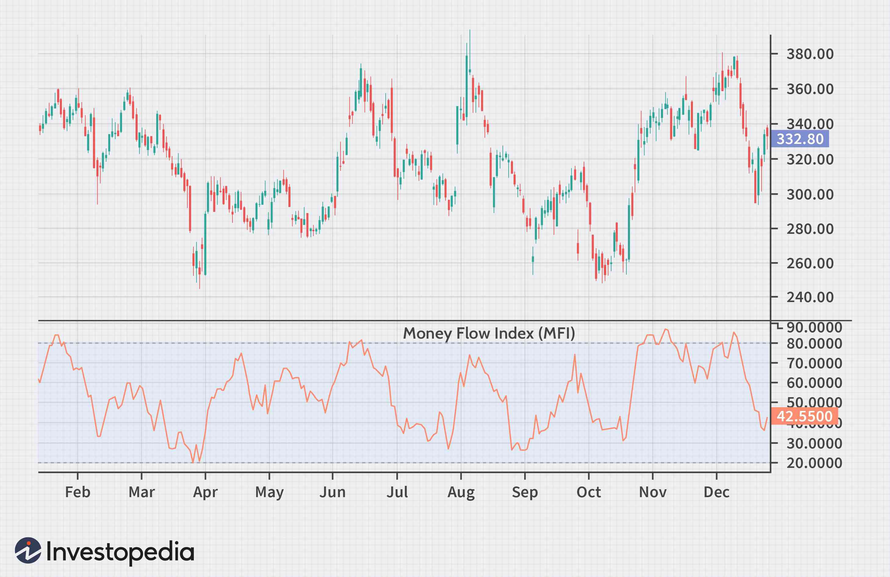

In technical analysis and algorithmic trading, indicators play a crucial role in providing insights into market dynamics. Two noteworthy indicators are the Money Flow Index (MFI) and the Relative Strength Index (RSI), both integral to understanding market momentum and trends. The MFI and RSI each offer unique perspectives—MFI incorporates both price and volume to evaluate buying and selling pressure, while RSI focuses on the speed and change of price movements. This article will explore the use of these indicators in technical analysis and algorithmic trading strategies, detailing how they can improve trading decisions by offering distinct insights. By understanding their differences, strengths, and applications, traders can employ both tools effectively. Additionally, we will discuss how MFI and RSI can work alongside other indicators for a more comprehensive market analysis, contributing to more robust trading strategies.

## Table of Contents



## Understanding the Money Flow Index (MFI)

The Money Flow Index (MFI) is a momentum indicator that incorporates both price and volume data to assess the buying and selling pressure in a market. Unlike many other technical indicators that focus solely on price, the MFI provides a more profound understanding of market dynamics by factoring in volume, thus giving traders an additional layer of insight. The MFI oscillates between values of 0 and 100, helping traders identify potential overbought or oversold conditions. Typically, an MFI reading above 80 indicates an overbought market, suggesting a potential downward price correction, while a reading below 20 signifies an oversold market, implying a possible price increase.

**Calculation of the Money Flow Index:**

The MFI is calculated using the following steps:

1. **Typical Price (TP)**: This is calculated for each period using the formula:
$$
   TP = \frac{(High + Low + Close)}{3}

$$

2. **Money Flow (MF)**: The money flow for each period is determined by multiplying the typical price by the volume:
$$
   MF = TP \times Volume

$$

3. **Positive and Negative Money Flow**: Determine whether the current period's typical price is higher or lower than the previous period's typical price. If it is higher, it is categorized as positive money flow; if lower, negative money flow.

4. **Money Flow Ratio (MFR)**: This is calculated by taking the sum of positive money flows over a set period and dividing it by the sum of negative money flows over the same period.

5. **Money Flow Index (MFI)**: The final MFI value is calculated using the following formula:
$$
   MFI = 100 - \left(\frac{100}{1 + MFR}\right)

$$

**Interpretation of the Money Flow Index:**

The MFI can signal possible market reversals when the indicator reaches extreme levels. A falling MFI in a rising market can signal an impending reversal, suggesting that the buying pressure is waning. Conversely, a rising MFI in a declining market might indicate a potential reversal upward, as selling pressure diminishes. It is crucial to note that while MFI provides valuable insights, traders often use it in conjunction with other indicators to corroborate their analysis and make informed trading decisions. Over-reliance on a single indicator can increase the risk of false signals, emphasizing the importance of comprehensive market analysis.

## Exploring the Relative Strength Index (RSI)

The Relative Strength Index (RSI) is a widely-utilized [momentum](/wiki/momentum) oscillator in technical analysis, designed to quantify the speed and magnitude of price movements. It operates on a scale from 0 to 100, providing insights into potential overbought or oversold market conditions. Developed by J. Welles Wilder Jr., the RSI is pivotal for spotting key moments of price reversals and trend strength.

### Calculation of RSI

The RSI calculation involves a two-part computation process. It begins with the determination of the average gain and loss over a specified period, commonly 14 days:

1. **Average Gain and Loss:**
$$
   \text{Average Gain} = \frac{\sum \text{Gains over the period}}{\text{Number of periods}}

$$
$$
   \text{Average Loss} = \frac{\sum \text{Losses over the period}}{\text{Number of periods}}

$$

2. **Relative Strength (RS):**
   The Relative Strength (RS) is calculated as the ratio of average gain to average loss:
$$
   RS = \frac{\text{Average Gain}}{\text{Average Loss}}

$$

3. **RSI Formula:**
   The RSI itself is then derived using the following formula:
$$
   RSI = 100 - \left(\frac{100}{1 + RS}\right)

$$

### Interpretation and Application

Traders primarily use the RSI to identify potential overbought or oversold conditions in an asset's price. Traditionally, an RSI value above 70 is indicative of an overbought condition, suggesting it might be due for a price correction or reversal. Conversely, an RSI below 30 is regarded as an oversold condition, signaling potential upward movement or reversal. 

### Trading Strategy Implications

The RSI is invaluable in determining the strength and reversal possibilities of bullish or bearish trends. Traders might exploit this by entering or exiting trades at these RSI thresholds (30 and 70) or using convergence/divergence of RSI with price movements to assess trend continuity or potential reversal:

- **Bullish Divergence:** Occurs when the price forms a lower low while RSI forms a higher low, signaling a potential upward reversal.
- **Bearish Divergence:** Arises when the price creates a higher high but the RSI registers a lower high, indicating possible downtrend continuation or reversal.

The RSI can also be used in combination with other technical indicators to build more robust trading strategies, enhancing the reliability of signals about market conditions and trend directions. 

In conclusion, the RSI remains a quintessential tool in technical analysis, enabling traders to glean actionable insights from market data and refine their trading approaches based on the nuanced assessment of market momentum.

## Key Differences Between MFI and RSI

The Money Flow Index (MFI) and the Relative Strength Index (RSI) are both pivotal momentum oscillators used in technical analysis, yet they differ fundamentally in their approach to measuring market trends. 

The RSI, developed by J. Welles Wilder, Jr., is a widely used technical indicator that focuses solely on the price movements of an asset without considering trading [volume](/wiki/volume-trading-strategy). Calculated using average gains and losses over a specified period, typically 14 days, the RSI gauges momentum by reflecting the speed and change of price movements. This is represented mathematically as:

$$
RSI = 100 - \frac{100}{1 + RS}
$$

Where RS (Relative Strength) is the average gain of up periods during the specified time frame divided by the average loss of down periods.

Conversely, the MFI introduces an additional layer by incorporating volume data along with price changes. This makes the MFI a more comprehensive tool as it considers the volume as an indicator of buying and selling pressure. The inclusion of volume is vital since it signifies the strength behind a price movement. The formula for MFI involves several steps, culminating in its own oscillation between 0 and 100, akin to RSI:

1. Calculate the Typical Price:

$$
\text{Typical Price} = \frac{\text{High} + \text{Low} + \text{Close}}{3}
$$

2. Multiply the Typical Price by the day's volume to find the Raw Money Flow.

3. Categorize the Raw Money Flow as positive or negative depending on the typical price's movement compared to the previous period.

4. Compute the Money Flow Ratio by dividing the positive money flow sum by the negative money flow sum over a given period.

5. The MFI is then calculated as:

$$
MFI = 100 - \frac{100}{1 + \text{Money Flow Ratio}}
$$

These differences highlight distinct applications; while RSI is efficient in identifying momentum shifts and potential reversal points, the MFI's incorporation of volume offers significant insights into the sustainability of such moves. By considering volume, the MFI can serve as a leading indicator, potentially signaling reversals earlier than RSI. However, the MFI may also be subject to increased noise due to its volume sensitivity, which could lead to more false signals compared to the more straightforward RSI. Thus, each indicator provides unique insights based on their specific methodologies, enabling traders to adapt their strategies according to their trading objectives.

## Advantages and Disadvantages of MFI and RSI

In technical analysis, the Money Flow Index (MFI) and the Relative Strength Index (RSI) serve as important indicators that aid traders in assessing market conditions and making informed trading decisions. Both indicators have distinct advantages and disadvantages that traders need to consider when integrating them into their strategies.

**Advantages of the Money Flow Index (MFI):**

1. **Incorporation of Volume:**
   The most significant advantage of the MFI is its inclusion of volume data alongside price. This combination offers a more comprehensive view of market dynamics, potentially making the MFI a leading indicator. By analyzing both price movement and trading volume, the MFI can provide insights into the buying and selling pressure in the market, which can be particularly useful in identifying potential reversals or the strength of a trend.

2. **Overbought and Oversold Conditions:**
   Like the RSI, the MFI oscillates between 0 and 100, with readings above 80 indicating overbought conditions and below 20 indicating oversold conditions. This can help traders identify potential entry or [exit](/wiki/exit-strategy) points based on extreme market conditions.

**Disadvantages of the Money Flow Index (MFI):**

1. **False Signals:**
   While the inclusion of volume can offer deeper insights, it also increases the likelihood of generating false signals. This is because volume can often be erratic and influenced by short-term events or anomalies, leading to misleading MFI readings.

2. **Complexity:**
   The calculation of MFI involves more complexity compared to RSI, as it requires volume data. This may limit its accessibility or usability for traders who prefer simpler indicators or those without access to reliable volume data.

**Advantages of the Relative Strength Index (RSI):**

1. **Simplicity and Usability:**
   The RSI is known for its straightforward calculation and ease of use. It solely focuses on price data, making it accessible for traders who utilize basic chart analysis tools. The formula for RSI is:
$$
   \text{RSI} = 100 - \left(\frac{100}{1 + \text{RS}}\right)

$$

   where RS is the average of x days' up closes divided by the average of x days' down closes.

2. **Trusted Indicator:**
   As a well-established tool in technical analysis, the RSI is widely trusted for its ability to identify trends and potential reversal points. It helps determine overbought and oversold conditions with readings above 70 typically seen as overbought and below 30 as oversold.

**Disadvantages of the Relative Strength Index (RSI):**

1. **Lack of Volume Consideration:**
   Since RSI does not incorporate volume data, it may miss critical market dynamics related to trading volume. Consequently, it might not provide a complete picture of market pressure, especially in cases where volume significantly influences price movements.

2. **Lagging Indicator:**
   The RSI, like other momentum indicators, can sometimes lag behind actual price movements, particularly in rapidly changing market conditions. This can result in delayed signals, affecting the timing of trading decisions.

Ultimately, the choice between the MFI and RSI, or the decision to use both in conjunction, depends on a trader’s strategy and market approach. Understanding the strengths and limitations of each indicator is crucial, as it enables traders to deploy them effectively in line with their unique requirements and the prevailing market conditions.

## Application in Algo Trading

Algorithmic trading utilizes the precision and speed of computer systems to execute trading strategies efficiently. In this context, indicators like the Money Flow Index (MFI) and the Relative Strength Index (RSI) play a critical role by generating automated trading signals that help traders make real-time decisions.

**Incorporating MFI and RSI in Algorithms**

Both MFI and RSI can be integrated into trading algorithms to provide insights into market conditions. The MFI, which incorporates both price and volume, is particularly adept at detecting overbought and oversold conditions when these indicators breach certain thresholds (commonly above 80 for overbought and below 20 for oversold). The RSI, on the other hand, focuses on price movements alone, marking overbought or oversold conditions with similar threshold values above 70 and below 30, respectively.

**Example Algorithms**

A simple Python-based trading algorithm could involve using the RSI indicator to trigger buy signals when the RSI value drops below 30 (indicating a potential oversold condition) and sell signals when it rises above 70 (indicating overbought conditions). The MFI can be used to confirm these signals by checking if it is also in the oversold or overbought region, thereby reducing false positives.

```python
import pandas as pd
import numpy as np

def calculate_RSI(data, period=14):
    delta = data.diff()
    gain = (delta.where(delta > 0, 0)).rolling(window=period).mean()
    loss = (-delta.where(delta < 0, 0)).rolling(window=period).mean()
    RS = gain / loss
    RSI = 100 - (100 / (1 + RS))
    return RSI

def calculate_MFI(data, volume, period=14):
    typical_price = (data['high'] + data['low'] + data['close']) / 3
    money_flow = typical_price * volume
    positive_flow = (money_flow.where((typical_price.shift(1) <= typical_price), 0)).rolling(window=period).sum()
    negative_flow = (money_flow.where((typical_price.shift(1) > typical_price), 0)).rolling(window=period).sum()

    MFI = 100 - (100 / (1 + positive_flow / negative_flow))
    return MFI

data = pd.DataFrame({'close': np.random.rand(100), 'high': np.random.rand(100), 'low': np.random.rand(100)})
volume = np.random.rand(100)

data['RSI'] = calculate_RSI(data['close'])
data['MFI'] = calculate_MFI(data, volume)

buy_signals = (data['RSI'] < 30) & (data['MFI'] < 20)
sell_signals = (data['RSI'] > 70) & (data['MFI'] > 80)
```

**Benefits and Challenges**

Using algorithms with MFI and RSI offers several benefits, such as emotion-free trading, faster execution, and the ability to back-test strategies against historical data. The combination of multiple indicators like MFI and RSI can enhance the robustness of trading signals by confirming trends through two different measures, one including volume and one focusing solely on price. 

However, challenges exist. The MFI can sometimes generate false signals due to its sensitivity to volume spikes, while the RSI might miss volume-weighted shifts in the market. Furthermore, market conditions change over time, meaning that algorithm parameters need regular adjustments to remain effective.

The integration of these indicators into trading algorithms provides a systematic approach to trading but requires constant monitoring and re-evaluation to adjust for changing market dynamics and ensure reliability.

## Combining MFI and RSI for Enhanced Analysis

Combining the Money Flow Index (MFI) and Relative Strength Index (RSI) can offer traders a more comprehensive view of market conditions by merging insights derived from both price and volume. While the RSI is well-regarded for detecting overbought and oversold market conditions based purely on price movements, the MFI enriches this analysis by incorporating volume data, making it sensitive to shifts in money flow relative to price changes. This complementary nature can lead to more reliable trading signals.

The process of using MFI and RSI together typically involves looking for confirmation between the two indicators. For instance, when both MFI and RSI indicate an overbought condition, a trader may be more confident in anticipating a potential price pullback or reversal. Conversely, if both indicators highlight an oversold condition, it could suggest a stronger likelihood of a price rebound.

**Example Strategy**

Here is a simple Python script that illustrates how these indicators can be combined for trading signals:

```python
import pandas as pd
import talib

def calculate_mfi_rsi(df, period=14):
    # Calculate MFI and RSI
    mfi = talib.MFI(df['high'], df['low'], df['close'], df['volume'], timeperiod=period)
    rsi = talib.RSI(df['close'], timeperiod=period)
    return mfi, rsi

def generate_signals(df):
    mfi, rsi = calculate_mfi_rsi(df)
    signals = []

    for i in range(len(df)):
        if mfi[i] > 80 and rsi[i] > 70:
            signals.append('Sell')
        elif mfi[i] < 20 and rsi[i] < 30:
            signals.append('Buy')
        else:
            signals.append('Hold')

    df['signal'] = signals
    return df

# Mock DataFrame with high, low, close, and volume data
# df = pd.DataFrame(...) 

# Example usage
# df_with_signals = generate_signals(df)
```

**Practical Application**

By aligning the outputs of MFI and RSI, traders can work towards minimizing false signals, a common risk when using indicators in isolation. This dual-approach is particularly valuable in markets where price actions appear uncertain or where volume changes may not be immediately reflected in price.

### Example of Enhanced Analysis
1. **Confirming Trends**: If the RSI signals an overbought condition, traders should check the MFI to see if buying volume supports this. If the MFI concurs, the signal may be stronger.

2. **Divergence Detection**: Traders can also look for divergences, where the price makes a new high, but RSI and MFI do not, indicating a potential reversal. This can be a potent combination for anticipating market corrections.

3. **Volatility Consideration**: Utilizing both indicators in tandem can account for market volatility, as the MFI’s volume awareness can stabilize the RSI's price-centric perspective.

Overall, combining MFI and RSI presents traders with a nuanced method for evaluating market dynamics, enhancing decision-making by reducing the chance of erroneous signals and ensuring a more robust technical analysis framework.

## Conclusion

The Money Flow Index (MFI) and the Relative Strength Index (RSI) are formidable indicators extensively utilized in technical analysis and [algorithmic trading](/wiki/algorithmic-trading). These tools aid traders in deciphering market momentum and trend shifts, essential components for strategic decision-making. Understanding how these indicators operate individually and synergistically is crucial for traders aiming to enhance their trading strategies.

When applied separately or in combination, MFI and RSI deliver valuable insights into market dynamics. The MFI's incorporation of volume data provides a nuanced look at buying and selling pressures, complementing the RSI's focus on price movement. While each indicator has its strengths, using them together can create a more comprehensive analytical framework that helps reduce the risks associated with false signals.

However, it is vital to recognize that no indicator provides a guarantee of success. Therefore, integrating MFI and RSI within a broader trading plan—considering other tools and market conditions—is fundamental for gaining deeper market insights and making more informed trading decisions. Traders are encouraged to refine their understanding and usage of these indicators continuously, adapting to market developments and aligning with individual trading goals.

Through thoughtful application of the MFI and RSI, traders can enhance their ability to anticipate market movements and tailor their strategies accordingly, paving the way for more effective trading outcomes.

## References & Further Reading

[1]: ["Technical Analysis of the Financial Markets: A Comprehensive Guide to Trading Methods and Applications"](https://www.amazon.com/Technical-Analysis-Financial-Markets-Comprehensive/dp/0735200661) by John J. Murphy

[2]: Wilder, J. W. (1978). ["New Concepts in Technical Trading Systems."](https://archive.org/details/newconceptsintec00wild) Trend Research

[3]: ["Trading for a Living: Psychology, Trading Tactics, Money Management"](https://www.amazon.com/Trading-Living-Psychology-Tactics-Management/dp/0471592242) by Dr. Alexander Elder

[4]: Achelis, S. B. (2000). ["Technical Analysis from A to Z."](https://archive.org/details/technicalanalysi00ache) McGraw Hill

[5]: ["Market Wizards: Interviews with Top Traders"](https://www.amazon.com/Market-Wizards-Interviews-Top-Traders-ebook/dp/B006X50OPW) by Jack D. Schwager