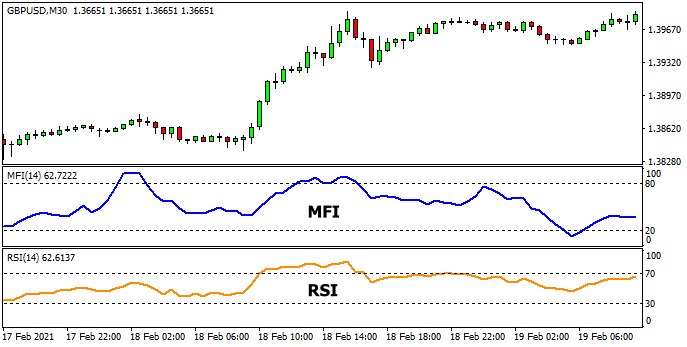

## Table of Contents

## What is the Money Flow Index (MFI)?

The Money Flow Index (MFI) is a tool used in the stock market to measure how much money is moving into and out of a stock. It helps investors understand if a stock is being bought or sold a lot. The MFI is calculated using the price and volume of a stock over a certain period, usually 14 days. If the MFI is high, it means more money is flowing into the stock, which might mean people are buying it a lot. If the MFI is low, it means more money is flowing out, which might mean people are selling it a lot.

The MFI is similar to the Relative Strength Index (RSI), but it also takes into account the volume of trades, not just the price. This makes it a bit different and sometimes more useful for understanding the strength of a trend. Traders often use the MFI to spot when a stock might be overbought or oversold. If the MFI is above 80, it might mean the stock is overbought and could soon go down in price. If it's below 20, it might mean the stock is oversold and could soon go up in price. This helps traders make decisions about when to buy or sell a stock.

## What is the Relative Strength Index (RSI)?

The Relative Strength Index (RSI) is a tool used in the stock market to see if a stock is being bought or sold a lot. It measures how fast and how much the price of a stock is changing over a certain time, usually 14 days. If the RSI is high, it means the stock's price has been going up a lot and it might be overbought. If the RSI is low, it means the stock's price has been going down a lot and it might be oversold.

Traders use the RSI to help them decide when to buy or sell a stock. If the RSI is above 70, it might mean the stock is overbought and could soon go down in price. If the RSI is below 30, it might mean the stock is oversold and could soon go up in price. This helps traders spot good times to make their trades.

## How is the MFI calculated?

The Money Flow Index (MFI) is calculated using the price and volume of a stock over a certain time, usually 14 days. First, you need to find the typical price for each day. The typical price is the average of the highest price, the lowest price, and the closing price of the stock for that day. Then, you multiply the typical price by the volume of the stock traded that day to get the raw money flow.

Next, you compare the typical price of the current day to the typical price of the previous day. If the current day's typical price is higher, it's considered a positive money flow. If it's lower, it's a negative money flow. You then add up all the positive money flows over the 14 days and all the negative money flows over the 14 days. The Money Ratio is calculated by dividing the total positive money flow by the total negative money flow. Finally, the MFI is found using the formula: MFI = 100 - (100 / (1 + Money Ratio)). This gives you a number between 0 and 100, which shows how much money is flowing into or out of the stock.

## How is the RSI calculated?

The Relative Strength Index (RSI) is calculated over a period of time, usually 14 days. To find the RSI, you first need to know how much the stock's price has gone up or down each day. If the price at the end of the day is higher than it was at the start, that's a gain. If it's lower, that's a loss. You add up all the gains and all the losses over the 14 days.

Next, you find the average gain and the average loss. The average gain is the total gains divided by 14. The average loss is the total losses divided by 14. Then, you calculate the Relative Strength (RS) by dividing the average gain by the average loss. Finally, the RSI is calculated using the formula: RSI = 100 - (100 / (1 + RS)). This gives you a number between 0 and 100, which shows if the stock is overbought or oversold.

## What are the typical time periods used for MFI and RSI?

The typical time period used for the Money Flow Index (MFI) is 14 days. This means that when you calculate the MFI, you look at the price and volume of the stock over the last 14 days. Using 14 days helps give a good picture of how money is moving into or out of the stock over a short period. Some traders might use different time periods, but 14 days is the most common.

The Relative Strength Index (RSI) also usually uses a 14-day period. This means you look at the gains and losses of the stock's price over the last 14 days to calculate the RSI. The 14-day period is standard because it gives a good balance between being sensitive to recent price changes and not being too affected by short-term fluctuations. Like with the MFI, some traders might choose different time periods, but 14 days is what most people use.

## How do MFI and RSI differ in their approach to measuring market strength?

The Money Flow Index (MFI) and the Relative Strength Index (RSI) both help traders understand if a stock is being bought or sold a lot, but they do it in slightly different ways. The MFI looks at both the price of the stock and how many shares are being traded. It calculates the typical price for each day and then uses the volume of shares traded to figure out if money is flowing into or out of the stock. This means the MFI takes into account not just if the price is going up or down, but also how much trading is happening. If a lot of shares are being traded at higher prices, the MFI will show that money is flowing into the stock.

On the other hand, the RSI only looks at the price changes of the stock over time. It adds up all the days when the price went up and all the days when the price went down over a period, usually 14 days. The RSI then uses these gains and losses to figure out if the stock is overbought or oversold. Because the RSI doesn't consider the volume of shares traded, it focuses more on the speed and size of price changes. This can be useful for spotting when a stock's price might be about to change direction based on how fast it's been moving.

## What are the overbought and oversold levels for MFI and RSI?

The overbought and oversold levels for the Money Flow Index (MFI) are usually set at 80 and 20. If the MFI goes above 80, it means the stock might be overbought. This can happen when a lot of people are buying the stock and pushing the price up. If the MFI goes below 20, it means the stock might be oversold. This can happen when a lot of people are selling the stock and pushing the price down. Traders watch these levels to decide if it might be a good time to sell or buy the stock.

For the Relative Strength Index (RSI), the overbought and oversold levels are typically set at 70 and 30. If the RSI goes above 70, it means the stock might be overbought. This shows that the stock's price has been going up quickly and might soon go down. If the RSI goes below 30, it means the stock might be oversold. This shows that the stock's price has been going down quickly and might soon go up. Traders use these levels to help them make decisions about when to trade the stock.

## Can you explain a scenario where MFI and RSI might give different signals?

Imagine a stock that's been going up in price a lot over the last few weeks. The RSI, which only looks at price changes, might show that the stock is overbought because its price has been rising quickly. The RSI might be above 70, which means the stock could be due for a price drop soon. But, if you look at the MFI, which also considers how many shares are being traded, you might see a different story. Even though the price is going up, the number of shares being traded might not be very high. So, the MFI might not be above 80, meaning the stock isn't as overbought as the RSI suggests.

In this case, the RSI is telling you to be careful because the stock might be overbought and ready to fall. But the MFI is saying it's not that simple because the volume of trades isn't as high as you'd expect if everyone was buying the stock. This difference in signals can help traders make better decisions. They might decide to wait and see if the volume picks up before selling, or they might think the stock still has room to grow despite the high RSI. By looking at both indicators, traders can get a fuller picture of what's happening with the stock.

## How can MFI and RSI be used together in trading strategies?

Traders can use the MFI and RSI together to get a better understanding of a stock's market strength. The RSI helps traders see if a stock's price is moving too fast, either up or down. If the RSI is above 70, it might mean the stock is overbought and could go down soon. If it's below 30, it might mean the stock is oversold and could go up soon. But the RSI only looks at the price, not how many shares are being traded. That's where the MFI comes in. The MFI also looks at the volume of trades, so it can tell you if a lot of people are buying or selling the stock. If the MFI is above 80, it might mean the stock is overbought, but if it's below 20, it might mean it's oversold.

Using both the MFI and RSI together can help traders make better decisions. For example, if the RSI shows a stock is overbought but the MFI is not as high, it might mean the price is going up, but not many people are buying the stock. This could mean the stock still has room to grow. On the other hand, if both the RSI and MFI are showing the stock is overbought, it might be a good time to sell because a lot of people are buying and the price might drop soon. By looking at both indicators, traders can get a clearer picture of what's happening with the stock and make more informed trading choices.

## What are the limitations of using MFI compared to RSI?

One limitation of using the Money Flow Index (MFI) compared to the Relative Strength Index (RSI) is that the MFI can be affected by the volume of trades. Sometimes, the volume might not tell the whole story. For example, a stock might have a high volume because a big investor is buying or selling a lot of shares, but this might not mean much for the average trader. The RSI, on the other hand, only looks at the price changes, so it's not affected by these big trades. This makes the RSI simpler to use and understand for some people.

Another limitation is that the MFI can give false signals if the volume data is not accurate or if there are unusual trading patterns. For instance, if there's a sudden spike in volume due to news or events, the MFI might show the stock as overbought or oversold when it's not really the case. The RSI might be less likely to give these false signals because it only considers price changes. So, while the MFI can give a more complete picture by including volume, it also means there's more room for mistakes if the volume data is off.

## How do volume considerations in MFI affect its interpretation compared to RSI?

The MFI looks at both the price of a stock and how many shares are being traded, which is different from the RSI that only looks at price changes. This means the MFI can show if a lot of people are buying or selling the stock, not just if the price is going up or down. If the MFI is high, it might mean a lot of money is flowing into the stock because many shares are being traded at higher prices. This can help traders see if the price change is backed by strong buying or selling, which the RSI doesn't show because it doesn't consider volume.

However, including volume in the MFI can sometimes make things more complicated. For example, if there's a sudden big trade by one investor, it can make the volume go up a lot, which might make the MFI say the stock is overbought or oversold when it's not really the case. The RSI won't be affected by this because it only looks at price. So, while the MFI can give a fuller picture by including volume, it can also be trickier to interpret because volume can be affected by things that don't really change how most people feel about the stock.

## What advanced techniques can be applied to enhance the predictive power of MFI and RSI?

One advanced technique to enhance the predictive power of MFI and RSI is using moving averages. By applying a moving average to the MFI or RSI, traders can smooth out the data and see clearer trends. For example, a 9-day moving average of the MFI can help traders spot when the money flow is changing direction. If the MFI crosses above its moving average, it might be a good time to buy because more money is flowing into the stock. If it crosses below, it might be a good time to sell because money is flowing out. The same idea works with the RSI, where a moving average can help traders see when the stock is moving from being overbought to oversold, or vice versa.

Another technique is using divergence between the MFI or RSI and the stock's price. Divergence happens when the indicator and the price are moving in opposite directions. For example, if the stock's price is going up but the MFI or RSI is going down, this might mean the price increase isn't strong and could soon reverse. Traders can use this to predict when a stock might change direction. If they see a bearish divergence, where the price is going up but the MFI or RSI is going down, they might decide to sell before the price drops. If they see a bullish divergence, where the price is going down but the MFI or RSI is going up, they might decide to buy before the price goes up again.

## What is the Money Flow Index (MFI) and how does it work?

The Money Flow Index (MFI) is a momentum indicator that incorporates both price and volume data to assess the buying and selling pressure in a market. Unlike many other technical indicators that focus solely on price, the MFI provides a more profound understanding of market dynamics by factoring in volume, thus giving traders an additional layer of insight. The MFI oscillates between values of 0 and 100, helping traders identify potential overbought or oversold conditions. Typically, an MFI reading above 80 indicates an overbought market, suggesting a potential downward price correction, while a reading below 20 signifies an oversold market, implying a possible price increase.

**Calculation of the Money Flow Index:**

The MFI is calculated using the following steps:

1. **Typical Price (TP)**: This is calculated for each period using the formula:
$$
   TP = \frac{(High + Low + Close)}{3}

$$

2. **Money Flow (MF)**: The money flow for each period is determined by multiplying the typical price by the volume:
$$
   MF = TP \times Volume

$$

3. **Positive and Negative Money Flow**: Determine whether the current period's typical price is higher or lower than the previous period's typical price. If it is higher, it is categorized as positive money flow; if lower, negative money flow.

4. **Money Flow Ratio (MFR)**: This is calculated by taking the sum of positive money flows over a set period and dividing it by the sum of negative money flows over the same period.

5. **Money Flow Index (MFI)**: The final MFI value is calculated using the following formula:
$$
   MFI = 100 - \left(\frac{100}{1 + MFR}\right)

$$

**Interpretation of the Money Flow Index:**

The MFI can signal possible market reversals when the indicator reaches extreme levels. A falling MFI in a rising market can signal an impending reversal, suggesting that the buying pressure is waning. Conversely, a rising MFI in a declining market might indicate a potential reversal upward, as selling pressure diminishes. It is crucial to note that while MFI provides valuable insights, traders often use it in conjunction with other indicators to corroborate their analysis and make informed trading decisions. Over-reliance on a single indicator can increase the risk of false signals, emphasizing the importance of comprehensive market analysis.

## What is the Relative Strength Index (RSI) and how can it be explored?

The Relative Strength Index (RSI) is a widely-utilized [momentum](/wiki/momentum) oscillator in technical analysis, designed to quantify the speed and magnitude of price movements. It operates on a scale from 0 to 100, providing insights into potential overbought or oversold market conditions. Developed by J. Welles Wilder Jr., the RSI is pivotal for spotting key moments of price reversals and trend strength.

### Calculation of RSI

The RSI calculation involves a two-part computation process. It begins with the determination of the average gain and loss over a specified period, commonly 14 days:

1. **Average Gain and Loss:**
$$
   \text{Average Gain} = \frac{\sum \text{Gains over the period}}{\text{Number of periods}}

$$
$$
   \text{Average Loss} = \frac{\sum \text{Losses over the period}}{\text{Number of periods}}

$$

2. **Relative Strength (RS):**
   The Relative Strength (RS) is calculated as the ratio of average gain to average loss:
$$
   RS = \frac{\text{Average Gain}}{\text{Average Loss}}

$$

3. **RSI Formula:**
   The RSI itself is then derived using the following formula:
$$
   RSI = 100 - \left(\frac{100}{1 + RS}\right)

$$

### Interpretation and Application

Traders primarily use the RSI to identify potential overbought or oversold conditions in an asset's price. Traditionally, an RSI value above 70 is indicative of an overbought condition, suggesting it might be due for a price correction or reversal. Conversely, an RSI below 30 is regarded as an oversold condition, signaling potential upward movement or reversal. 

### Trading Strategy Implications

The RSI is invaluable in determining the strength and reversal possibilities of bullish or bearish trends. Traders might exploit this by entering or exiting trades at these RSI thresholds (30 and 70) or using convergence/divergence of RSI with price movements to assess trend continuity or potential reversal:

- **Bullish Divergence:** Occurs when the price forms a lower low while RSI forms a higher low, signaling a potential upward reversal.
- **Bearish Divergence:** Arises when the price creates a higher high but the RSI registers a lower high, indicating possible downtrend continuation or reversal.

The RSI can also be used in combination with other technical indicators to build more robust trading strategies, enhancing the reliability of signals about market conditions and trend directions. 

In conclusion, the RSI remains a quintessential tool in technical analysis, enabling traders to glean actionable insights from market data and refine their trading approaches based on the nuanced assessment of market momentum.

## What are the key differences between MFI and RSI?

The Money Flow Index (MFI) and the Relative Strength Index (RSI) are both pivotal momentum oscillators used in technical analysis, yet they differ fundamentally in their approach to measuring market trends. 

The RSI, developed by J. Welles Wilder, Jr., is a widely used technical indicator that focuses solely on the price movements of an asset without considering trading [volume](/wiki/volume-trading-strategy). Calculated using average gains and losses over a specified period, typically 14 days, the RSI gauges momentum by reflecting the speed and change of price movements. This is represented mathematically as:

$$
RSI = 100 - \frac{100}{1 + RS}
$$

Where RS (Relative Strength) is the average gain of up periods during the specified time frame divided by the average loss of down periods.

Conversely, the MFI introduces an additional layer by incorporating volume data along with price changes. This makes the MFI a more comprehensive tool as it considers the volume as an indicator of buying and selling pressure. The inclusion of volume is vital since it signifies the strength behind a price movement. The formula for MFI involves several steps, culminating in its own oscillation between 0 and 100, akin to RSI:

1. Calculate the Typical Price:

$$
\text{Typical Price} = \frac{\text{High} + \text{Low} + \text{Close}}{3}
$$

2. Multiply the Typical Price by the day's volume to find the Raw Money Flow.

3. Categorize the Raw Money Flow as positive or negative depending on the typical price's movement compared to the previous period.

4. Compute the Money Flow Ratio by dividing the positive money flow sum by the negative money flow sum over a given period.

5. The MFI is then calculated as:

$$
MFI = 100 - \frac{100}{1 + \text{Money Flow Ratio}}
$$

These differences highlight distinct applications; while RSI is efficient in identifying momentum shifts and potential reversal points, the MFI's incorporation of volume offers significant insights into the sustainability of such moves. By considering volume, the MFI can serve as a leading indicator, potentially signaling reversals earlier than RSI. However, the MFI may also be subject to increased noise due to its volume sensitivity, which could lead to more false signals compared to the more straightforward RSI. Thus, each indicator provides unique insights based on their specific methodologies, enabling traders to adapt their strategies according to their trading objectives.

## What are the advantages and disadvantages of MFI and RSI?

In technical analysis, the Money Flow Index (MFI) and the Relative Strength Index (RSI) serve as important indicators that aid traders in assessing market conditions and making informed trading decisions. Both indicators have distinct advantages and disadvantages that traders need to consider when integrating them into their strategies.

**Advantages of the Money Flow Index (MFI):**

1. **Incorporation of Volume:**
   The most significant advantage of the MFI is its inclusion of volume data alongside price. This combination offers a more comprehensive view of market dynamics, potentially making the MFI a leading indicator. By analyzing both price movement and trading volume, the MFI can provide insights into the buying and selling pressure in the market, which can be particularly useful in identifying potential reversals or the strength of a trend.

2. **Overbought and Oversold Conditions:**
   Like the RSI, the MFI oscillates between 0 and 100, with readings above 80 indicating overbought conditions and below 20 indicating oversold conditions. This can help traders identify potential entry or [exit](/wiki/exit-strategy) points based on extreme market conditions.

**Disadvantages of the Money Flow Index (MFI):**

1. **False Signals:**
   While the inclusion of volume can offer deeper insights, it also increases the likelihood of generating false signals. This is because volume can often be erratic and influenced by short-term events or anomalies, leading to misleading MFI readings.

2. **Complexity:**
   The calculation of MFI involves more complexity compared to RSI, as it requires volume data. This may limit its accessibility or usability for traders who prefer simpler indicators or those without access to reliable volume data.

**Advantages of the Relative Strength Index (RSI):**

1. **Simplicity and Usability:**
   The RSI is known for its straightforward calculation and ease of use. It solely focuses on price data, making it accessible for traders who utilize basic chart analysis tools. The formula for RSI is:
$$
   \text{RSI} = 100 - \left(\frac{100}{1 + \text{RS}}\right)

$$

   where RS is the average of x days' up closes divided by the average of x days' down closes.

2. **Trusted Indicator:**
   As a well-established tool in technical analysis, the RSI is widely trusted for its ability to identify trends and potential reversal points. It helps determine overbought and oversold conditions with readings above 70 typically seen as overbought and below 30 as oversold.

**Disadvantages of the Relative Strength Index (RSI):**

1. **Lack of Volume Consideration:**
   Since RSI does not incorporate volume data, it may miss critical market dynamics related to trading volume. Consequently, it might not provide a complete picture of market pressure, especially in cases where volume significantly influences price movements.

2. **Lagging Indicator:**
   The RSI, like other momentum indicators, can sometimes lag behind actual price movements, particularly in rapidly changing market conditions. This can result in delayed signals, affecting the timing of trading decisions.

Ultimately, the choice between the MFI and RSI, or the decision to use both in conjunction, depends on a trader’s strategy and market approach. Understanding the strengths and limitations of each indicator is crucial, as it enables traders to deploy them effectively in line with their unique requirements and the prevailing market conditions.

## References & Further Reading

[1]: ["Technical Analysis of the Financial Markets: A Comprehensive Guide to Trading Methods and Applications"](https://www.amazon.com/Technical-Analysis-Financial-Markets-Comprehensive/dp/0735200661) by John J. Murphy

[2]: Wilder, J. W. (1978). ["New Concepts in Technical Trading Systems."](https://archive.org/details/newconceptsintec00wild) Trend Research

[3]: ["Trading for a Living: Psychology, Trading Tactics, Money Management"](https://www.amazon.com/Trading-Living-Psychology-Tactics-Management/dp/0471592242) by Dr. Alexander Elder

[4]: Achelis, S. B. (2000). ["Technical Analysis from A to Z."](https://archive.org/details/technicalanalysi00ache) McGraw Hill

[5]: ["Market Wizards: Interviews with Top Traders"](https://www.amazon.com/Market-Wizards-Interviews-Top-Traders-ebook/dp/B006X50OPW) by Jack D. Schwager