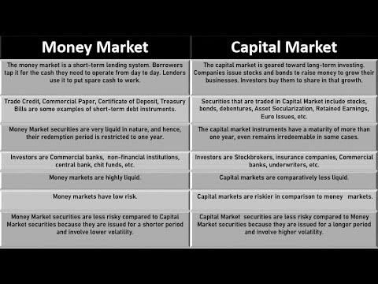

## Table of Contents

## What is a money market?

A money market is a part of the financial market where short-term borrowing and lending happen. It's where big organizations like banks, companies, and governments go to manage their short-term cash needs. They can borrow money for a short time, usually less than a year, or invest their extra cash in safe, liquid assets. These assets are easy to turn into cash and have low risk.

The money market is important because it helps keep the financial system stable. It makes sure that there's enough cash flowing around so that businesses and governments can operate smoothly. Common tools in the money market include Treasury bills, commercial paper, and certificates of deposit. These tools help everyone involved to manage their money better and keep the economy running smoothly.

## What is a capital market?

A capital market is where people and companies can buy and sell long-term investments like stocks and bonds. It's different from the money market because it deals with investments that last for more than a year. Companies use the capital market to raise money by selling stocks or bonds to investors. When a company sells stocks, it's giving a piece of ownership to the investors. When it sells bonds, it's borrowing money that it promises to pay back with interest.

The capital market is important because it helps companies grow and create new jobs. When a company needs money to build a new factory or start a new project, it can go to the capital market to get the funds it needs. Investors, on the other hand, can buy stocks and bonds to save for the future or earn money from their investments. The capital market helps connect those who need money with those who have money to invest, making it a key part of the economy.

## What are the main differences between money markets and capital markets?

Money markets and capital markets are both important parts of the financial world, but they have different jobs. Money markets are where short-term borrowing and lending happen. This means the loans or investments are for less than a year. Big organizations like banks and governments use money markets to manage their cash quickly and safely. The tools they use, like Treasury bills and commercial paper, are easy to turn into cash and have low risk. This helps keep the financial system stable by making sure there's enough money flowing around for everyone to use.

On the other hand, capital markets are where long-term investments are made. These investments, like stocks and bonds, last for more than a year. Companies use capital markets to raise money for big projects, like building new factories or starting new businesses. When a company sells stocks, it's giving ownership to investors. When it sells bonds, it's borrowing money to be paid back with interest. Capital markets help companies grow and create jobs by connecting them with investors who want to save for the future or earn money from their investments.

In simple terms, money markets are for quick, safe, short-term money management, while capital markets are for long-term growth and investment. Both are essential for a healthy economy, but they serve different needs and use different tools to do their jobs.

## What types of instruments are traded in money markets?

Money markets are where big organizations like banks and governments go to borrow or lend money for short periods of time. The instruments they use are safe and easy to turn into cash. One common instrument is Treasury bills, which are short-term loans to the government. They are very safe because they are backed by the government. Another instrument is commercial paper, which is like a short-term IOU from big companies. They use it to borrow money quickly without going to a bank.

Certificates of deposit are another type of instrument in money markets. Banks offer these to people who want to save money for a short time. In return, the bank pays them interest. Repurchase agreements, or repos, are also used. These are like short-term loans where one party sells securities to another and agrees to buy them back later at a higher price. All these instruments help keep money flowing smoothly in the economy, making sure there's enough cash for everyone to use.

## What types of instruments are traded in capital markets?

In capital markets, people and companies buy and sell long-term investments. The most common instruments are stocks and bonds. Stocks are pieces of ownership in a company. When you buy a stock, you own a small part of that company and can make money if the company does well. Bonds are like loans to a company or government. They promise to pay back the money with interest over time. These instruments help companies raise money for big projects like building new factories or starting new businesses.

Other instruments in capital markets include mutual funds and exchange-traded funds (ETFs). Mutual funds are pools of money from many investors that are used to buy a variety of stocks, bonds, or other assets. This helps spread out the risk. ETFs are similar but can be bought and sold like stocks on a stock exchange. They often track an index, like the S&P 500, and offer an easy way for people to invest in a broad range of assets. All these instruments help investors save for the future and earn money from their investments, while helping companies grow and create jobs.

## How do money markets contribute to liquidity in the financial system?

Money markets help keep the financial system running smoothly by making sure there's enough cash available for everyone who needs it. Big organizations like banks and governments use money markets to borrow or lend money for short periods of time. This quick and easy access to cash means that businesses can pay their bills and keep operating without running out of money. It's like having a safety net that helps prevent financial problems from getting worse.

The instruments used in money markets, like Treasury bills and commercial paper, are safe and easy to turn into cash. This means that if someone needs money quickly, they can sell these instruments without losing much value. This easy access to cash helps keep the economy stable because it makes sure there's always enough money flowing around. When everyone can get the cash they need, it helps keep the whole financial system working well.

## How do capital markets facilitate long-term investment?

Capital markets help companies and people invest for the long term by offering ways to buy and sell stocks and bonds. When a company needs money for big projects like building a new factory, it can sell stocks. This gives people a chance to own a piece of the company and possibly make money if the company does well. Or, the company can sell bonds, which are like loans that the company promises to pay back with interest. This gives investors a steady way to earn money over time.

These investments help companies grow and create jobs, which is good for the whole economy. When people buy stocks and bonds, they're not just helping the company, they're also saving for their future. Stocks can grow in value, and bonds pay interest regularly. This makes capital markets a great place for people to invest their money for the long term. By connecting those who need money with those who have money to invest, capital markets help make the economy stronger and more stable.

## What are the typical maturities of instruments in money markets versus capital markets?

Money markets are all about short-term borrowing and lending. The instruments traded here, like Treasury bills and commercial paper, usually have maturities of less than one year. This short time frame makes them perfect for big organizations like banks and governments that need to manage their cash quickly and safely. Because these instruments are easy to turn into cash and have low risk, they help keep the financial system stable by making sure there's enough money flowing around.

On the other hand, capital markets are where long-term investments happen. The instruments here, like stocks and bonds, have maturities that go beyond one year, often stretching into many years or even decades. Companies use these markets to raise money for big projects like building new factories or starting new businesses. Investors buy these long-term instruments to save for the future or earn money over time, helping companies grow and create jobs while securing their own financial future.

## Who are the primary participants in money markets?

The main players in money markets are big organizations like banks, governments, and big companies. These groups use money markets to borrow or lend money for short periods of time, usually less than a year. Banks might use money markets to manage their cash flow, making sure they have enough money to cover their daily operations. Governments, like the U.S. government, use money markets to borrow money by selling Treasury bills, which helps them manage their short-term financial needs.

Big companies also use money markets to borrow money quickly without going to a bank. They do this by selling commercial paper, which is like a short-term IOU. These companies need money markets to keep their operations running smoothly, making sure they can pay their bills and keep their business going. All these players help keep the money flowing in the economy, making sure there's enough cash for everyone to use.

## Who are the primary participants in capital markets?

The main players in capital markets are companies and investors. Companies use capital markets to raise money for big projects like building new factories or starting new businesses. They do this by selling stocks, which give people a piece of ownership in the company, or bonds, which are like loans that the company promises to pay back with interest. This helps companies grow and create jobs, which is good for the whole economy.

Investors are the other big group in capital markets. They buy stocks and bonds to save for the future or earn money over time. When they buy stocks, they can make money if the company does well. When they buy bonds, they get regular interest payments. By investing their money in capital markets, people help companies grow while also planning for their own financial future.

## How do interest rates in money markets affect the broader economy?

Interest rates in money markets have a big impact on the whole economy. When interest rates are low, it's easier and cheaper for businesses and people to borrow money. This can lead to more spending and investment, which helps the economy grow. For example, if a company can borrow money at a low rate, it might decide to build a new factory, which creates jobs and boosts the economy. On the other hand, if interest rates are high, borrowing money becomes more expensive, so businesses and people might spend less. This can slow down the economy because there's less money moving around.

The central bank, like the Federal Reserve in the U.S., plays a key role in setting these interest rates. By changing the rates in money markets, the central bank can control how much money is available and how easy it is to borrow. If the economy is growing too fast and there's a risk of inflation, the central bank might raise interest rates to cool things down. If the economy is slowing down and needs a boost, the central bank might lower interest rates to make borrowing easier. This way, money market interest rates help the central bank manage the economy and keep it stable.

## What role do capital markets play in economic development and growth?

Capital markets help the economy grow by giving companies a way to get money for big projects. When a company wants to build a new factory or start a new business, it can sell stocks or bonds in the capital market. Selling stocks gives people a piece of the company, and if the company does well, the stock value can go up. Selling bonds is like borrowing money that the company promises to pay back with interest. This money helps companies grow and create new jobs, which makes the economy stronger.

Investors also play a big role in capital markets. They buy stocks and bonds to save for the future or earn money over time. When people invest their money in the capital market, it helps companies get the money they need to grow. This connection between companies and investors helps the economy because it keeps money moving and supports new projects and jobs. By making it easier for companies to raise money and for people to invest, capital markets help the economy grow and stay strong.

## What is the Money Market?

The money market is a crucial component of the financial market specializing in the trade of short-term securities. These securities typically have maturities of less than one year and include instruments such as Treasury bills, commercial paper, and certificates of deposit. Treasury bills are government-issued short-term debt obligations, often considered risk-free due to the government's backing. Commercial paper represents unsecured, short-term corporate debt used to meet immediate financial needs. Certificates of deposit (CDs) are time deposits offered by banks, providing a fixed [interest rate](/wiki/interest-rate-trading-strategies) over a specified term.

Money markets are characterized by their high [liquidity](/wiki/liquidity-risk-premium) and relatively low risk, making them attractive for managing liquidity. They allow participants to quickly convert their holdings into cash with minimal impact on the value of those holdings. This characteristic ensures that governments, financial institutions, and corporations can efficiently manage their short-term funding needs. For instance, corporations often rely on money markets to bridge temporary gaps between revenue inflows and outflows, while governments use them to manage daily cash flow fluctuations.

The function of the money market can be mathematically represented by the liquidity ratio, which is critical for measuring the ease of trading within the market:

$$
\text{Liquidity Ratio} = \frac{\text{Cash or Cash Equivalents}}{\text{Short-term Liabilities}}
$$

This ratio indicates the ability of an entity to meet its short-term obligations using liquid assets. A higher liquidity ratio implies better liquidity and indicates a robust money market.

The high liquidity and short maturity profiles of money market instruments make them less susceptible to long-term interest rate fluctuations, thus contributing to their stability and predictability. As a result, they play a vital role in stabilizing the broader financial system, particularly during periods of economic uncertainty when the need for quick access to funds increases.

In summary, the money market is an essential segment for facilitating short-term borrowing and lending, ensuring liquidity across the financial system, and allowing entities to efficiently manage their cash flow needs.

## References & Further Reading

[1]: Mishkin, F.S. (2012). *The Economics of Money, Banking, and Financial Markets*. Pearson. 

[2]: Fabozzi, F.J., Modigliani, F., & Jones, F.J. (2018). *Foundations of Financial Markets and Institutions*. Pearson.

[3]: Harris, L. (2002). *Trading and Exchanges: Market Microstructure for Practitioners*. Oxford University Press.

[4]: O'Hara, M. (1998). *Market Microstructure Theory*. Blackwell Publishers.

[5]: Haldane, A.G. (2011). ["The Race to Zero."](https://www.bankofengland.co.uk/speech/2011/the-race-to-zero-speech-by-andy-haldane) Bank of England.

[6]: Aldridge, I. (2013). *High-Frequency Trading: A Practical Guide to Algorithmic Strategies and Trading Systems*. Wiley.

[7]: Hasbrouck, J. (2007). *Empirical Market Microstructure: The Institutions, Economics, and Econometrics of Securities Trading*. Oxford University Press.