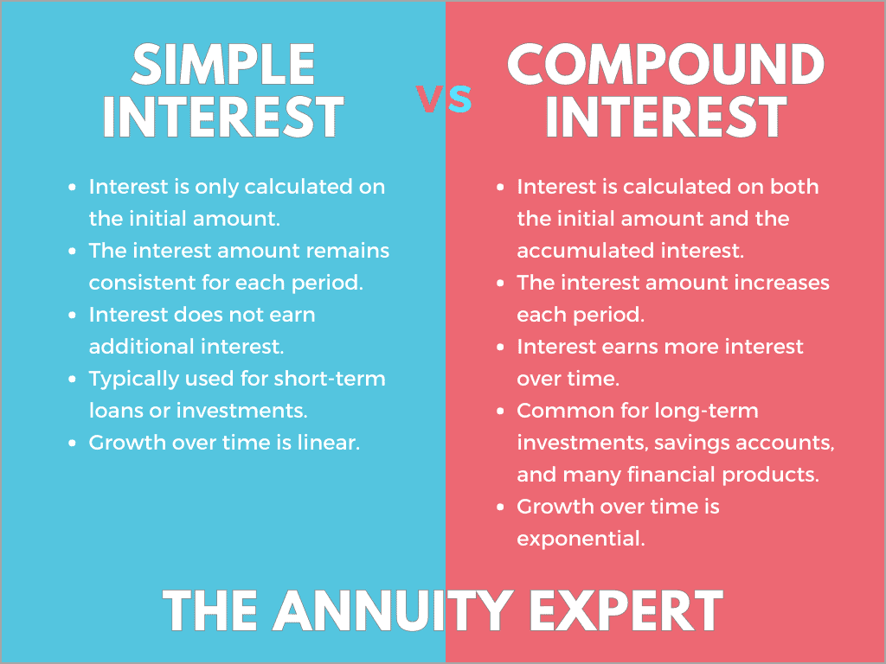

## Table of Contents

## What are money market funds?

Money market funds are a type of mutual fund that invests in very safe, short-term assets like government securities, certificates of deposit, and commercial paper. These funds aim to maintain a stable value, usually at $1 per share, and provide investors with a place to park their cash while earning a small amount of interest. They are considered low-risk investments, which makes them attractive to people who want to keep their money safe but still earn a bit more than they would in a regular savings account.

These funds are popular among investors who need easy access to their money because they can usually be bought and sold without any penalties. However, the returns on money market funds are typically lower than those of other types of investments like stocks or bonds. This trade-off between safety and return is what makes money market funds a good choice for short-term savings or as a part of a diversified investment portfolio.

## What are short-term bonds?

Short-term bonds are debt securities that have a maturity of one to three years. When you buy a short-term bond, you are lending money to the issuer, which could be a government, a corporation, or another entity. In return, the issuer promises to pay you back the amount you lent, called the principal, when the bond matures. They also pay you interest, usually every six months, until the bond reaches its maturity date.

These bonds are considered less risky than long-term bonds because they are due to be paid back sooner. This means there's less time for things like interest rate changes or economic downturns to affect the bond's value. Short-term bonds can be a good choice for investors who want a bit more return than they would get from a savings account or money market fund, but who also want to keep their investment relatively safe.

## How do money market funds generate returns?

Money market funds make money by investing in safe, short-term things like government securities, certificates of deposit, and commercial paper. These investments pay interest to the money market fund, and the fund then shares that interest with its investors. The interest rates are usually low, but because the investments are very safe, the fund can keep the value of each share close to $1.

The returns from money market funds come from the interest they earn on these short-term investments. The fund managers work to pick the best short-term investments to keep the fund's value stable and to earn as much interest as possible. This way, investors can earn a little bit of money while keeping their investment safe and easy to access.

## How do short-term bonds generate returns?

Short-term bonds make money by paying interest to the people who buy them. When you buy a short-term bond, you are lending money to the issuer, like a government or a company. They promise to pay you back the money you lent them, called the principal, when the bond reaches its maturity date. Until then, they also pay you interest, usually every six months. This interest is how short-term bonds generate returns for investors.

Because short-term bonds are due to be paid back in one to three years, they are seen as safer than long-term bonds. This means there's less time for things like changes in interest rates or economic problems to affect the bond's value. Investors like short-term bonds because they offer a bit more return than a savings account or money market fund, but they are still pretty safe. This makes them a good choice for people who want to earn some interest without taking on too much risk.

## What are the typical durations of investments in money market funds?

Money market funds invest in very short-term things. Usually, the investments they make last from a few days up to about a year. This short time frame helps keep the money safe and makes it easy for people to get their money back when they need it.

Because the investments are so short, money market funds can quickly change what they invest in. This helps them keep the value of each share close to $1 and earn a little bit of interest for the people who invest in them. It's a good choice for people who want to keep their money safe but still earn a bit more than they would in a regular savings account.

## What are the typical durations of investments in short-term bonds?

Short-term bonds are a type of investment that lasts from one to three years. When you buy a short-term bond, you are lending money to a government or a company. They promise to pay you back the money you lent them, called the principal, when the bond reaches its maturity date. This short time frame makes short-term bonds safer than long-term bonds because there is less time for things like interest rate changes or economic problems to affect the bond's value.

Because short-term bonds last for a shorter time, they are a good choice for people who want to earn some interest without taking on too much risk. These bonds pay interest to the people who buy them, usually every six months. This interest is how short-term bonds make money for investors. They offer a bit more return than a savings account or money market fund, making them a popular choice for people looking to keep their investment relatively safe while still [earning](/wiki/earning-announcement) some income.

## What are the risk levels associated with money market funds?

Money market funds are considered low-risk investments. They invest in very safe, short-term things like government securities, certificates of deposit, and commercial paper. These investments are chosen because they are less likely to lose value, which helps keep the money in the fund safe. The goal of money market funds is to keep the value of each share at $1, so people know their money is secure.

Even though they are low-risk, money market funds are not completely risk-free. There is a small chance that the investments could lose value, especially if something unexpected happens in the economy or with the companies the fund invests in. However, these risks are usually small, and money market funds are still a good choice for people who want to keep their money safe while earning a little bit of interest.

## What are the risk levels associated with short-term bonds?

Short-term bonds are seen as safer than long-term bonds because they last for a shorter time, usually one to three years. This means there is less time for things like interest rate changes or economic problems to affect the bond's value. When you buy a short-term bond, you are lending money to a government or a company, and they promise to pay you back the money you lent them, called the principal, when the bond reaches its maturity date. They also pay you interest, usually every six months, until the bond matures.

Even though short-term bonds are considered low-risk, they are not completely risk-free. There is still a chance that the issuer could have trouble paying back the money they borrowed. This risk is called credit risk. Also, if interest rates go up, the value of the bond might go down if you want to sell it before it matures. This is called interest rate risk. However, because short-term bonds mature quickly, these risks are usually smaller than with long-term bonds.

## How do the liquidity features of money market funds compare to those of short-term bonds?

Money market funds are very easy to buy and sell. You can usually get your money out of a money market fund quickly, often within a day. This makes them a good choice for people who might need their money soon. The investments in money market funds are very short-term, usually lasting from a few days up to a year, so the fund can quickly change what it invests in to keep the value stable.

Short-term bonds are not as easy to turn into cash as money market funds. When you buy a short-term bond, you have to wait until it matures, which can take one to three years, to get your full money back. If you need to sell the bond before it matures, you might not get back the full amount you paid, especially if interest rates have changed. This makes short-term bonds less liquid than money market funds, but they still offer more [liquidity](/wiki/liquidity-risk-premium) than long-term bonds.

## What are the tax implications of investing in money market funds versus short-term bonds?

When you invest in money market funds, you might have to pay taxes on the interest you earn. This interest is usually taxed as regular income, which means it could be taxed at your normal income tax rate. Some money market funds invest in things like government securities, and the interest from these might be free from state and local taxes, but you still have to pay federal taxes on it. It's a good idea to check with a tax professional to understand how your money market fund investments will be taxed.

Short-term bonds also earn interest, and you have to pay taxes on this interest too. Like money market funds, the interest from short-term bonds is usually taxed as regular income. If you buy short-term bonds from the government, like Treasury bonds, the interest might be free from state and local taxes, but you still have to pay federal taxes on it. If you sell a short-term bond before it matures and make a profit, you might have to pay capital gains tax on that profit. Talking to a tax professional can help you understand how your short-term bond investments will be taxed.

## How do the yields of money market funds compare to those of short-term bonds in different economic conditions?

The yields of money market funds and short-term bonds can change based on what's happening in the economy. Money market funds usually have lower yields because they invest in very safe, short-term things like government securities and commercial paper. These investments don't pay much interest, but they are very safe. When the economy is doing well and interest rates are low, the yields on money market funds might be even lower. But when the economy is not doing well and interest rates go up, the yields on money market funds might go up a bit too.

Short-term bonds can have higher yields than money market funds because they last a bit longer, usually one to three years, and can be a bit riskier. When the economy is doing well and interest rates are low, short-term bonds might offer better yields than money market funds. But when the economy is not doing well and interest rates go up, the yields on short-term bonds might go up too, but they could also go down if people think the bonds are riskier. So, short-term bonds might offer more return, but they also come with a bit more risk than money market funds.

## What advanced strategies can investors use to optimize returns from money market funds and short-term bonds?

Investors can use a strategy called laddering to optimize returns from money market funds and short-term bonds. Laddering means buying bonds or investing in funds that mature at different times. For example, you could buy some short-term bonds that mature in one year, some in two years, and some in three years. This way, you can take advantage of different interest rates over time. When one bond matures, you can reinvest the money in a new bond at the current interest rate, which might be higher. This can help you earn more interest over time and keep your money safe.

Another strategy is to pay attention to interest rate changes. When interest rates are expected to go up, you might want to invest in money market funds because they are very short-term and can quickly adjust to new rates. But if you think interest rates will stay the same or go down, short-term bonds might be a better choice because they usually offer higher yields. Keeping an eye on what's happening in the economy and adjusting your investments can help you get the best returns from money market funds and short-term bonds.

## What are the key aspects to consider when examining short-term bonds?

Short-term bonds are debt instruments that generally mature within a period of one to five years, offering a balance between risk and return that attracts many investors. These bonds are typically issued by corporations and governments, providing a range of options to suit different risk appetites and investment objectives.

The appeal of short-term bonds lies in their potential to offer higher yields compared to money market funds. This is primarily due to the maturity risk premium, where investors demand increased returns for the longer time commitment and the additional risk compared to more liquid, short-term investments. The relationship between bond yields ($Y$), price ($P$), and coupon payments ($C$) can often be expressed as:

$$
Y = \frac{C + \frac{(F - P)}{n}}{\frac{(F + P)}{2}}
$$

where $F$ is the face value of the bond, and $n$ is the number of years to maturity.

Despite their higher yields, short-term bonds remain less sensitive to [interest rate](/wiki/interest-rate-trading-strategies) fluctuations than their longer-term counterparts. This reduced sensitivity, or lower duration, makes them appealing for income generation, even in volatile interest rate environments. Consequently, investors can enjoy a relatively stable income through regular interest payments and the return of the principal upon maturity.

Moreover, tax advantages can enhance the attractiveness of short-term bonds, particularly municipal bonds. These bonds, often issued to finance local and state projects, may offer tax-free interest income at the federal level, and sometimes at state and local levels, depending on the investor's residency.

In summary, short-term bonds present a compelling option for individuals seeking a combination of higher yields, interest rate stability, and potential tax benefits. They serve as a strategic addition to a diversified investment portfolio, aligning with the goals of investors looking for moderate risk and predictable income streams.

## References & Further Reading

[1]: D'Arcy, Jud. (2020). ["Money Market Funds, Risks, and Regulations."](https://www.reuters.com/markets/us/why-is-us-sec-reforming-money-market-funds-2023-07-12/) Journal of Financial Regulation.

[2]: Bodie, Z., Kane, A., & Marcus, A. J. (2013). ["Investments"](https://www.mheducation.com/highered/product/investments-bodie-kane/M9781264412662.html) (10th edition). McGraw-Hill Education.

[3]: Mishkin, F. S. (2015). ["The Economics of Money, Banking, and Financial Markets"](https://www.pearsonhighered.com/assets/preface/0/1/3/4/0134855388.pdf) (11th edition). Pearson.

[4]: Hull, J. C. (2018). ["Options, Futures, and Other Derivatives"](https://www.semanticscholar.org/paper/Options%2C-Futures%2C-and-Other-Derivatives-Hull/89bdee500c8623864fc9eb7a471546aa713acc44) (10th edition). Pearson.

[5]: Moore, A. (2019). ["The Bogleheads' Guide to Retirement Planning"](https://www.bogleheads.org/wiki/Bogleheads%27_Guide_to_Retirement_Planning) by Taylor Larimore, Mel Lindauer, Richard A. Ferri, and Laura F. Dogu.

[6]: Lopez de Prado, M. (2018). ["Advances in Financial Machine Learning."](https://www.amazon.com/Advances-Financial-Machine-Learning-Marcos/dp/1119482089) Wiley.

[7]: Chan, E. (2009). ["Quantitative Trading: How to Build Your Own Algorithmic Trading Business."](https://github.com/ftvision/quant_trading_echan_book) Wiley.

[8]: Jansen, S. (2018). ["Machine Learning for Algorithmic Trading: Predictive models to extract signals from market and alternative data for systematic trading strategies with Python."](https://www.amazon.com/Machine-Learning-Algorithmic-Trading-alternative/dp/1839217715) Packt Publishing.