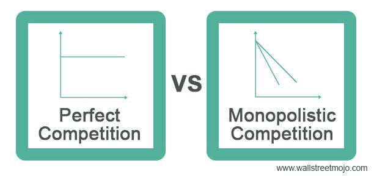

## Table of Contents

## What is a monopolistic market?

A monopolistic market is a type of market where there is only one seller or company that provides a certain product or service. This means that the company has complete control over the prices and the supply of the product. Because there are no other companies offering the same thing, customers have no choice but to buy from this one company if they want that particular product or service.

In a monopolistic market, the single company can often set high prices because customers have no other options. This can lead to less competition and innovation, as the company doesn't need to worry about other businesses trying to offer better products or lower prices. However, governments sometimes step in to regulate these markets to protect consumers and ensure fair prices.

## What is perfect competition?

Perfect competition is a type of market where there are many buyers and sellers, and everyone is selling the same thing. In this market, no single buyer or seller can control the price because there are so many of them. If one seller tries to charge more, people will just buy from someone else who is cheaper. This means that the price stays the same for everyone, and it's set by the market itself.

Because of this, companies in perfect competition have to work hard to keep their costs low. If they can't, they might not make any profit. It's also easy for new companies to start selling in this market because there are no big barriers to entry. This keeps the market competitive and helps make sure that prices stay fair for everyone.

## How do the number of sellers differ in monopolistic markets and perfect competition?

In a monopolistic market, there is only one seller. This means that one company has complete control over the product or service they offer. Because there are no other sellers, this company can set the prices and decide how much of the product to make. Customers have to buy from this one company if they want that specific product or service.

On the other hand, in perfect competition, there are many sellers. All these sellers offer the same product, so no single seller can control the price. If one seller tries to charge more, people will just go to another seller who is cheaper. This keeps the prices fair and the same for everyone.

## What are the entry barriers in a monopolistic market compared to perfect competition?

In a monopolistic market, entry barriers are very high. This means it's really hard for new companies to start selling the same thing as the one company that already controls the market. The main reason is that the existing company might have special rights, like patents or licenses, that stop others from competing. They might also need a lot of money to start up, or they might find it hard to get the resources they need. Because of these high barriers, the one company can keep its control over the market.

In perfect competition, entry barriers are very low. This means it's easy for new companies to start selling in the market. They don't need special rights or a lot of money to begin. Since everyone is selling the same thing, new sellers can easily join in. This keeps the market open and competitive, with lots of sellers trying to offer the best prices and products.

## How does product differentiation affect monopolistic markets and perfect competition?

In a monopolistic market, product differentiation doesn't really matter because there's only one seller. The company has complete control over what they offer, and customers have to buy from them if they want that product or service. Since there's no competition, the company doesn't need to make their product different or better to attract customers. They can keep selling the same thing without worrying about other companies trying to offer something new or better.

In perfect competition, product differentiation is not important either, but for a different reason. In this market, all sellers offer the same product, so there's no way to make their product different from others. Because everyone is selling the same thing, customers choose based on price alone. If a seller tries to make their product different, it won't matter because customers can just go to another seller who offers the same product at a lower price. This keeps the focus on keeping costs low and prices fair for everyone.

## What kind of pricing power do firms have in monopolistic markets versus perfect competition?

In a monopolistic market, the single firm has a lot of pricing power. This means they can decide how much to charge for their product or service because they are the only ones selling it. If customers want that specific thing, they have to pay the price set by the company. Because there's no competition, the company can set high prices and still make a lot of money. This can lead to higher prices for customers who have no other choice.

In perfect competition, firms have almost no pricing power. There are many sellers offering the same product, so if one firm tries to charge more, customers will just buy from someone else who is cheaper. This keeps the prices the same for everyone, and they are set by the market, not by any one company. Because of this, firms in perfect competition have to focus on keeping their costs low to make any profit, as they can't raise prices without losing customers.

## How do profit levels compare between monopolistic markets and perfect competition in the long run?

In a monopolistic market, the single company can make a lot of profit in the long run. Since they are the only ones selling the product or service, they can set high prices and keep making money. There's no competition to push prices down, so the company can keep [earning](/wiki/earning-announcement) big profits as long as people want to buy what they're selling. This can lead to the company making more money than they would if they had to compete with other businesses.

In perfect competition, profit levels are usually low in the long run. Because there are many sellers offering the same thing, they all have to keep their prices low to stay in business. If one company tries to make more profit by raising prices, they'll lose customers to other sellers. Over time, new companies can easily enter the market, which keeps pushing prices down until they just cover the costs of making the product. This means that in the long run, companies in perfect competition usually only make enough profit to keep going, but not much more.

## What are the efficiency implications of monopolistic markets versus perfect competition?

In monopolistic markets, efficiency can be lower than in perfect competition. Because the single company has control over the market, they can set high prices and not worry about improving their product or lowering costs. This means they might not use resources in the best way possible. They might also make less of the product than people want because they can make more money by keeping the supply low. This can lead to a situation where the market isn't working as well as it could.

In perfect competition, efficiency is usually higher. With many sellers trying to offer the best prices, everyone has to use their resources in the best way to keep costs down. If they don't, they won't make any profit. This competition pushes companies to make more of the product and at lower prices, which is good for customers. Because new companies can easily enter the market, it keeps everyone on their toes, making sure that the market works efficiently.

## How does advertising play a role in monopolistic markets compared to perfect competition?

In monopolistic markets, advertising can be important for the single company that controls the market. Even though they don't have to worry about other companies taking their customers, they might still want to use ads to make people think their product is the best. They can spend a lot of money on ads to keep their customers happy and to make sure new customers know about their product. This can help them keep their prices high and their profits big.

In perfect competition, advertising doesn't play a big role. Since all sellers are offering the same thing, there's no point in spending money on ads to make their product look different. If one company tries to use ads to charge more, people will just buy from another seller who is cheaper. Because of this, companies in perfect competition focus more on keeping their costs low and their prices fair, rather than on advertising.

## What are the welfare effects of monopolistic markets versus perfect competition?

In monopolistic markets, the welfare of consumers can be lower because the single company can set high prices. This means people have to pay more for the product or service, and they might not be able to buy as much as they want. The company might also make less of the product to keep prices high, which can lead to shortages. Because the company doesn't have to worry about other businesses, they might not work hard to make their product better or cheaper. This can make life harder for customers who have no other choices.

In perfect competition, the welfare of consumers is usually better. With many sellers offering the same thing, prices stay low because everyone is trying to be the cheapest. This means people can buy more of what they need without spending too much money. Companies also have to work hard to keep their costs down and make their products better, which is good for customers. Because new companies can easily start selling in the market, it keeps everyone trying to do their best, making sure that people get good products at fair prices.

## How do innovation and research and development differ in monopolistic markets and perfect competition?

In monopolistic markets, the single company might not spend a lot on innovation and research and development (R&D). They don't have to worry about other companies taking their customers, so they might not feel the need to make their product better or create new things. They can keep making money by selling the same thing at high prices. But sometimes, they might still do some R&D to keep their customers happy or to make sure they stay ahead if new companies ever try to enter the market.

In perfect competition, companies usually spend more on innovation and R&D. Because there are many sellers trying to offer the same thing, they have to find ways to make their product a little better or cheaper. If they don't, they might not make any profit. This competition pushes them to keep working on new ideas and improving their products. It's good for customers because they get better products over time, and it keeps the market moving forward.

## What are the regulatory approaches to monopolistic markets and how do they contrast with those in perfect competition?

In monopolistic markets, governments often step in to make rules because they want to protect people from high prices and bad service. They might make laws that stop the company from charging too much or not making enough of the product. Sometimes, they break up the big company into smaller ones so more people can sell the same thing. They might also watch the company closely to make sure they're doing a good job and not hurting customers. This helps make the market fairer and better for everyone.

In perfect competition, there's usually less need for rules because the market takes care of itself. With lots of sellers, prices stay low and everyone works hard to make good products. Governments don't have to do much because the competition keeps things running smoothly. But they might still make some rules to make sure everyone is playing fair and no one is cheating. This helps keep the market working well without too much help from the government.

## References & Further Reading

[1]: Mankiw, N. G. (2014). *Principles of Economics* (7th ed.). Cengage Learning.

[2]: Samuelson, P. A., & Nordhaus, W. D. (2021). *Economics* (20th ed.). McGraw-Hill Education.

[3]: Stiglitz, J. E., & Walsh, C. E. (2006). *Economics*. W.W. Norton & Company.

[4]: Lopez de Prado, M. (2018). ["Advances in Financial Machine Learning."](https://books.google.com/books/about/Advances_in_Financial_Machine_Learning.html?id=oU9KDwAAQBAJ) Wiley.

[5]: Carrion, A. (2013). "Very fast money: High-frequency trading on the NASDAQ." *Journal of Financial Markets, 16*(4), 680-711.

[6]: Gürkaynak, R. S., & Wright, J. H. (2012). "Macroeconomics and the term structure." *Journal of Economic Literature, 50*(2), 331-367.

[7]: Bloomfield, R., O'Hara, M., & Saar, G. (2015). "Hidden Liquidity: Some New Light on Dark Trading." *Journal of Finance, 70*(5), 2227-2272.