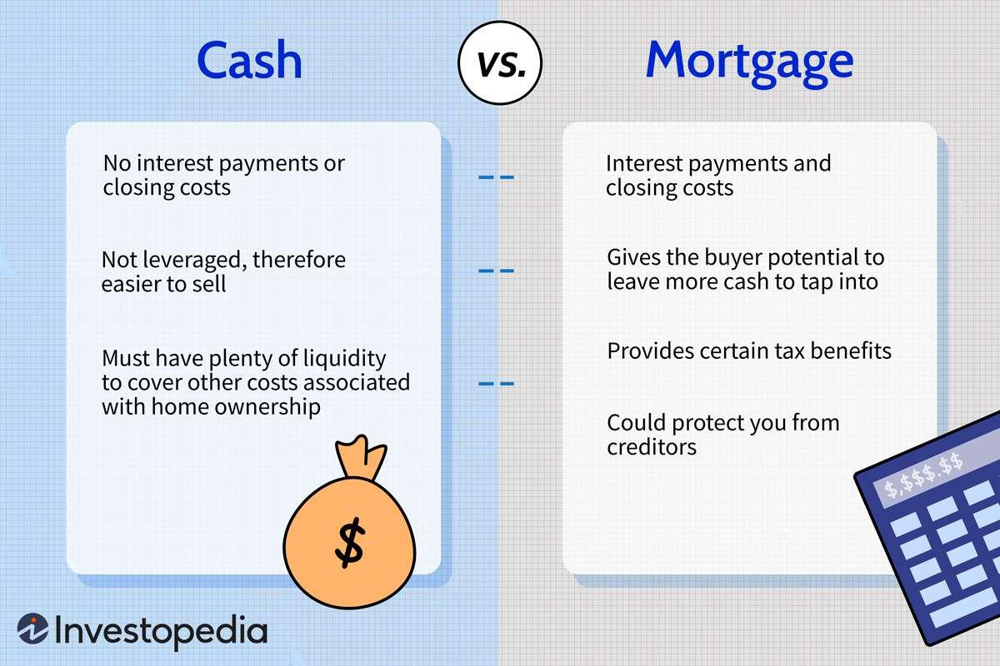

The real estate market provides various options for purchasing property, with the two primary methods being taking out a mortgage or paying in cash. Mortgages involve borrowing capital from financial institutions, enabling buyers to leverage their investments potentially for higher returns, while cash purchases eliminate borrowing costs and complexities associated with loans. However, both methods have distinct advantages and drawbacks that must be considered when planning property investments.

A relatively recent development in finance that could impact real estate investment is algorithmic trading. This sophisticated approach uses computer programs to make data-driven financial transaction decisions, often at speeds and efficiencies unattainable by human traders. Algorithmic trading has gained traction as it allows investors to automate investment strategies, optimize their financial portfolios, and potentially generate enhanced returns. This technology can provide investors with additional funds to allocate towards real estate ventures, thus offering a modern complement to traditional investment strategies.

Understanding these strategies—mortgages, cash purchases, and algorithmic trading—is essential for making informed decisions in the real estate sector. Each method carries its own set of potential benefits and inherent risks. For example, while leveraging through mortgages can maximize returns, it also poses a risk of amplified losses. Conversely, cash purchases offer simplicity but may limit one's ability to diversify investments and maintain liquidity. Algorithmic trading, when used as a supplementary tool, requires knowledge of both its capabilities and limitations.

This article will examine the nuances of these financial methods, considering their impact on real estate investments. By weighing the pros and cons and exploring the intersection of technology and property acquisition, investors can chart a strategic path in a continually evolving market.

## Table of Contents

## Getting a Mortgage for Real Estate Purchases

A mortgage is a prevalent method for acquiring real estate, offering the potential for higher returns through leverage. When an investor takes out a mortgage, they borrow funds to purchase a property with the expectation that the investment will generate a profit higher than the cost of borrowing. Leveraging increases the investor's purchasing power, enabling them to potentially diversify across multiple properties. This can lead to a more balanced portfolio, spread out across different geographical locations and property types, potentially reducing risk.

The primary considerations for obtaining a mortgage include interest rates, loan terms, and the overall lending process. Interest rates are a critical component as they determine the cost of borrowing money. Lower interest rates reduce the expense of a mortgage, potentially increasing the net return on investment. Conversely, higher rates can make real estate investments less attractive due to the increased cost of borrowing. It is also essential to consider fixed versus variable interest rates. Fixed rates offer stability, whereas variable rates might offer lower initial rates with potential future fluctuations.

Loan terms, such as the loan duration and the down payment requirement, also significantly impact the investment. Longer loan terms typically result in lower monthly payments but may incur more interest over the life of the loan. Shorter terms often mean higher payments but less total interest. The down payment, often a percentage of the property's purchase price, represents the initial investment and can affect both the loan terms and the investor's equity in the property.

The lending process involves credit checks, appraisals, and financial assessments conducted by lenders to determine the borrower's eligibility and the loan amount. Strong credit history and stable income streams enhance approval prospects and might secure better terms. Lenders also evaluate the property's value and condition, affecting the mortgage offer.

Leverage can amplify gains, as it allows for acquiring assets that may appreciate faster than the loan's interest, thereby increasing the overall return on investment. For example, if an investor buys a property for $500,000 with a 20% down payment and the property value appreciates by 10%, the gain in property value is $50,000, representing a 50% return on the $100,000 invested.

However, leverage equally amplifies losses. If the property value decreases, the investor might owe more than the property's worth, known as being "underwater" on a mortgage. External factors like economic downturns, changes in market demand, and fluctuations in national interest rates can significantly affect property values, impacting leveraged investments.

In conclusion, while mortgages present an opportunity to enhance real estate investment returns, it is vital to carefully evaluate interest rates, loan terms, and personal financial conditions. Understanding the impact of leverage on gains and losses is crucial for making informed decisions that align with investment goals and risk tolerance.

## Pros and Cons of Paying Cash for Real Estate

Paying cash for real estate offers several distinct advantages, primarily by eliminating the need for interest payments and reducing closing costs. When purchasing a property with cash, you do not incur the interest charges that accompany traditional financing methods like mortgages. This can result in significant savings over the life of the transaction, as interest can substantially increase the cost of owning a property.

Additionally, cash transactions can expedite the buying process. Without the need for mortgage approval, which can be lengthy and complex, buyers can close deals more swiftly, providing an edge in competitive markets where sellers may prefer cash offers for their immediacy and reliability. This swift process can be particularly valuable in volatile markets where property values can fluctuate rapidly.

Cash buyers are also less exposed to risks associated with market fluctuations. Without an outstanding mortgage, the pressure of maintaining payments during economic downturns is removed, offering peace of mind and financial stability. This stability can also present opportunities to act independently of market trends, allowing cash buyers to sell or hold properties based on optimal conditions rather than financial necessity.

However, using cash to purchase real estate can limit investment diversification. By tying up substantial capital in a single asset, investors might miss out on other lucrative opportunities that could generate higher returns. Diversification is a key investment principle, commonly summarized by the adage "don't put all your eggs in one basket." By concentrating funds in one property, investors accept the risk that the asset may not appreciate as expected.

Understanding the balance between [liquidity](/wiki/liquidity-risk-premium) and investment return is crucial. Liquidity refers to the ease with which an asset can be converted into cash without affecting its market price. Paying cash for a property can reduce liquidity, as significant financial resources are allocated to a non-liquid asset, potentially limiting an investor's ability to respond to other lucrative financial opportunities swiftly.

In conclusion, while paying cash for real estate can offer advantages in terms of speed, cost savings, and market risk mitigation, it also carries the caveat of reduced liquidity and diversification. Prospective investors should carefully assess their financial situation, investment goals, and market conditions to determine whether this approach aligns with their broader strategy.

## Algroithmic Trading and Its Role in Real Estate Investment

Algorithmic trading is redefining how investors engage with the real estate market by utilizing computer programs to automate and optimize financial transaction decisions. This modern approach allows for the rapid analysis of large datasets, enabling investors to make more informed decisions and potentially enhance the return on their investments. 

The core advantage of [algorithmic trading](/wiki/algorithmic-trading) lies in its ability to process vast amounts of financial data swiftly, identifying patterns and trends that might be missed by human analysts. By examining historical data and market indicators, algorithms can predict future price movements and make buy or sell decisions with precision and speed that are unattainable through manual methods. This capability is crucial in the real estate sector, where market conditions can fluctuate based on a multitude of variables, from economic indicators to shifts in consumer behavior.

Investors are increasingly harnessing algorithmic trading to fund real estate purchases. The returns generated through these trading strategies can be used to finance the acquisition of real estate assets, offering a novel way to augment capital without relying solely on traditional financing methods like mortgages or leveraging personal savings. The synergy of quick capital accumulation through trading and the inherent stability of real estate investments presents an attractive proposition for portfolio diversification.

One significant opportunity presented by algorithmic trading in real estate is the potential for more opportunistic and nimble investment strategies. Algorithms can monitor market trends and execute trades around the clock, which allows investors to react to international markets and invest in real estate opportunities worldwide without delay. This global perspective is particularly advantageous in real estate markets, where timing is often critical to securing investments at optimal prices.

Besides offering access to global markets, algorithmic trading can help investors mitigate risks associated with real estate investments. By utilizing hedging strategies within the algorithmic framework, investors can protect their portfolios against adverse market movements. For example, an algorithm might simultaneously short a related financial instrument to offset potential losses in the real estate market, providing a cushion against [volatility](/wiki/volatility-trading-strategies).

The integration of technology and real estate investing is expanding, offering a glimpse into a future where data-driven investment decisions become the norm rather than the exception. As technology continues to evolve, the sophistication and efficacy of algorithmic trading strategies will likely improve, further cementing their role in facilitating real estate transactions. However, investors should remain cognizant of the risks associated with algorithmic trading, including reliance on accurate data inputs and potential technological malfunctions, ensuring that these innovative methods are employed judiciously within a balanced and diversified investment strategy.

Overall, algorithmic trading introduces a paradigm shift in real estate investment, merging technological advancements with financial strategies to unlock new opportunities for investors. It challenges traditional practices and presents a dynamic framework for optimizing real estate portfolios through intelligent data analytics.

## Balancing Risks and Rewards

When evaluating real estate investment strategies, both mortgages and cash payments present distinct risks and rewards that investors must carefully assess. Understanding market conditions and financial implications is crucial for selecting an appropriate approach.

Mortgages allow investors to leverage their purchases, potentially enhancing returns through amplified buying power. However, it's important to consider the costs associated with this method, such as interest rates and the duration of the loan. For instance, high-interest rates increase the cost of borrowing, impacting overall profitability. Additionally, mortgage payments constitute a fixed financial obligation, irrespective of market fluctuations, thus increasing financial risk during economic downturns.

On the other hand, paying cash offers benefits such as eliminating interest payments and reducing transaction fees. The absence of mortgage approval requirements also speeds up the buying process, providing an advantage in competitive real estate markets. Despite these advantages, cash payments involve tying up substantial capital in a single asset, which may hinder diversification and liquidity. This concentration risk could limit investors' ability to respond to other potential opportunities.

Algorithmic trading provides a supplementary strategy, enabling investors to utilize sophisticated computer programs to make financial decisions rapidly. These algorithms analyze extensive datasets, facilitating the optimization of investment strategies. However, algorithmic trading introduces its own set of risks, including potential technical failures, market volatility impacts, and the need for substantial understanding of finance and technology.

When balancing these strategies, it's essential for investors to evaluate their risk tolerance and investment objectives. For example, a risk-averse investor might prefer the stability of a cash purchase, while someone with a higher risk appetite could leverage mortgages or incorporate algorithmic trading to maximize potential returns. Additionally, maintaining awareness of market trends and economic conditions can guide strategic decisions, helping to manage potential risks and capitalize on rewards.

In summary, achieving a balanced real estate investment strategy requires careful consideration of the risks and benefits associated with mortgages, cash payments, and algorithmic trading. Adapting to market conditions and aligning strategies with personal risk tolerance and investment goals are key to optimizing investments.

## Conclusion

Real estate investments, facilitated through options like mortgages, cash purchases, or evolving technologies such as algorithmic trading, present investors with varied opportunities to grow their portfolios. Each method carries its own set of advantages and challenges that should be carefully considered to formulate strategic investment decisions. Mortgages offer the potential for leveraging one's capital across multiple properties, increasing potential returns while exposing investors to the risk of amplified losses. Paying cash, on the other hand, eliminates interest payments and accelerates transaction times, though it can concentrate financial resources into a single asset, potentially affecting diversification.

As technology progresses, the integration of algorithmic trading in real estate investment reflects an emerging trend. This method could offer a compelling supplement to traditional investment strategies, leveraging data-driven insights to potentially enhance financial outcomes. However, it is imperative for investors to comprehend the risks associated with technological investments and to ensure they align with personal risk tolerance and financial goals.

The dynamic nature of the real estate market compels investors to continuously educate themselves and evolve their strategies accordingly. As future trends seem poised to lean increasingly toward technological integration, being proactive and adaptable becomes essential. Staying informed and flexible in approach will help navigate this ever-changing landscape and pave the way for successful investments.

## References & Further Reading

[1]: Bergstra, J., Bardenet, R., Bengio, Y., & Kégl, B. (2011). ["Algorithms for Hyper-Parameter Optimization."](https://dl.acm.org/doi/10.5555/2986459.2986743) Advances in Neural Information Processing Systems 24.

[2]: ["Advances in Financial Machine Learning"](https://www.amazon.com/Advances-Financial-Machine-Learning-Marcos/dp/1119482089) by Marcos Lopez de Prado

[3]: ["Evidence-Based Technical Analysis: Applying the Scientific Method and Statistical Inference to Trading Signals"](https://www.amazon.com/Evidence-Based-Technical-Analysis-Scientific-Statistical/dp/0470008741) by David Aronson

[4]: ["Machine Learning for Algorithmic Trading"](https://github.com/stefan-jansen/machine-learning-for-trading) by Stefan Jansen

[5]: ["Quantitative Trading: How to Build Your Own Algorithmic Trading Business"](https://www.amazon.com/Quantitative-Trading-Build-Algorithmic-Business/dp/1119800064) by Ernest P. Chan