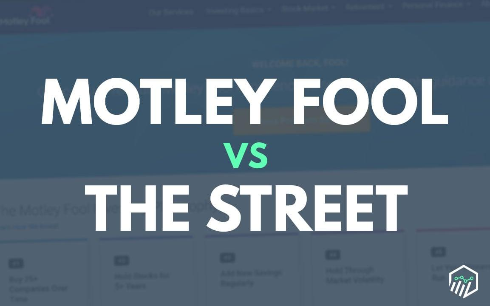

## Table of Contents

## What are The Motley Fool and TheStreet?

The Motley Fool is a company that helps people learn about investing and managing money. They started in 1993 and offer advice through their website, newsletters, and podcasts. They focus on long-term investing and believe in making smart choices to grow wealth over time. They also have a community where people can share ideas and learn from each other.

TheStreet is another company that provides financial news and analysis. It was founded in 1996 by Jim Cramer and Marty Peretz. TheStreet offers articles, videos, and tools to help people understand the stock market and make better investment decisions. They cover a wide range of topics, from stocks and bonds to economic trends, and aim to give useful information to both new and experienced investors.

## What types of services do The Motley Fool and TheStreet offer?

The Motley Fool offers many services to help people with their money. They have a website where you can read articles and get advice on investing. They also send out newsletters that give specific stock recommendations and tips on how to grow your wealth over time. If you like listening, they have podcasts too. Plus, they have a community where you can talk to other people who are interested in investing and learn from each other. They focus on helping you make good choices for the long term.

TheStreet provides different services to help people understand the stock market and make smart investment choices. They have a website with lots of articles and videos that explain what's happening in the market. They also offer tools that can help you analyze stocks and see how they might perform. If you want more detailed information, they have subscription services that give you access to special reports and data. TheStreet covers many topics, from stocks and bonds to big economic trends, so both new and experienced investors can find useful information.

## How do the subscription models of The Motley Fool and TheStreet differ?

The Motley Fool has different subscription services that you can choose from, depending on what you need. They have a service called Motley Fool Stock Advisor, which gives you two stock picks every month and other investing tips. They also have Motley Fool Rule Breakers, which focuses on finding companies that could grow a lot in the future. If you want more detailed advice, you can get Motley Fool Epic Bundle, which includes several services for one price. Their subscriptions are usually for a year, and they often have special deals to make it cheaper.

TheStreet also offers subscriptions, but they work a bit differently. They have a service called TheStreet Premium, which gives you access to special reports, data, and tools to help you make better investment choices. They also have Real Money, which is run by Jim Cramer and his team, and it gives you daily stock picks and market analysis. TheStreet's subscriptions can be monthly or yearly, and they sometimes offer discounts too. Both services want to help you make smart investment decisions, but they do it in their own way.

## What are the pricing structures for The Motley Fool and TheStreet?

The Motley Fool has different subscription services with different prices. Their most popular service, Motley Fool Stock Advisor, costs $99 for the first year if you sign up during a special offer, and $199 a year after that. Motley Fool Rule Breakers is another service that costs $99 for the first year during a special offer, and then $299 a year. If you want more services, you can get the Motley Fool Epic Bundle, which includes several services and costs $499 for the first year during a special offer, and then $799 a year. They often have deals to make it cheaper to start.

TheStreet also has different subscription options with different prices. Their TheStreet Premium service costs $14.99 a month or $149 a year, and it gives you special reports and tools to help with investing. They also have Real Money, which costs $29.95 a month or $299.50 a year, and it includes daily stock picks and market analysis from Jim Cramer and his team. Both services sometimes offer discounts, so you can save money if you sign up during a special offer.

## How do the investment philosophies of The Motley Fool and TheStreet compare?

The Motley Fool focuses on long-term investing and helping people grow their wealth over time. They believe in [picking](/wiki/asset-class-picking) good companies and holding onto them for years, not just trying to make quick money. They often talk about the importance of patience and making smart choices based on a company's future potential. Their advice is meant to be easy to understand, even if you're new to investing. They also encourage people to learn from each other in their community.

TheStreet, on the other hand, offers a mix of short-term and long-term investment advice. They cover a lot of different topics, from daily stock picks to big economic trends. TheStreet is known for its detailed analysis and tools that help investors make decisions. Their service, Real Money, run by Jim Cramer, focuses more on active trading and trying to find opportunities in the market every day. So while The Motley Fool is all about taking your time and investing for the long haul, TheStreet gives you tools to make both short-term and long-term decisions.

## What kind of content can be found on The Motley Fool versus TheStreet?

The Motley Fool has lots of content that helps people learn about investing and grow their money over time. They have articles that explain how to pick good companies and why it's important to be patient with your investments. They also send out newsletters with specific stock picks and tips. If you like listening, they have podcasts where they talk about investing in a way that's easy to understand. Plus, they have a community where you can chat with other people who are interested in investing and share ideas.

TheStreet offers different kinds of content to help people understand the stock market and make smart choices. They have articles and videos that explain what's happening in the market and how it might affect your investments. They also have tools that help you analyze stocks and see how they might do in the future. If you want more detailed information, their subscription services give you special reports and data. TheStreet covers a wide range of topics, from daily stock picks to big economic trends, so both new and experienced investors can find useful information.

## How do user experiences and interfaces differ between The Motley Fool and TheStreet?

The Motley Fool has a user-friendly website that's easy to navigate. When you visit their site, you'll see lots of articles and videos that explain investing in simple terms. They also have a community where you can talk to other people and share ideas. If you sign up for their newsletters, you'll get emails with stock picks and tips. Their podcasts are another way to learn about investing while you're on the go. Overall, The Motley Fool tries to make investing feel friendly and easy to understand, no matter if you're new to it or have been doing it for a while.

TheStreet's website is more focused on giving you lots of information quickly. When you go to their site, you'll see news articles, stock charts, and tools to help you analyze the market. Their interface might feel a bit more complicated because it's packed with data and tools, but it's still easy to use once you get the hang of it. If you subscribe to their services like TheStreet Premium or Real Money, you'll get even more detailed reports and daily stock picks. TheStreet is great if you want to dive deep into the market and make decisions based on lots of information.

## What are the educational resources provided by The Motley Fool and TheStreet?

The Motley Fool offers a lot of educational resources to help people learn about investing. They have articles and videos that explain things in a simple way, so even if you're new to investing, you can understand. They also have podcasts where they talk about different investing topics. If you join their community, you can ask questions and learn from other people who are interested in investing too. Their newsletters give you specific stock picks and tips, which can help you learn by doing.

TheStreet also has many educational resources, but they focus more on giving you detailed information and tools. They have articles and videos that explain what's happening in the stock market and how it might affect your investments. They also offer tools that help you analyze stocks and see how they might do in the future. If you subscribe to their services like TheStreet Premium or Real Money, you get even more detailed reports and data. This can help you learn a lot about the market and make smart decisions.

## How do the community features of The Motley Fool and TheStreet compare?

The Motley Fool has a big community where people can talk to each other about investing. They have message boards where you can ask questions and share ideas. It's a friendly place where people help each other learn about picking good stocks and growing their money over time. If you're new to investing, this community can be really helpful because you can learn from people who have been doing it for a while.

TheStreet also has a community, but it's different. They have a section where you can read comments from other people about the market and stocks. It's more about sharing information and less about talking back and forth. Their community is good if you want to see what other people think about certain stocks or market news, but it might not be as interactive as The Motley Fool's community.

## What is the track record of investment recommendations from The Motley Fool and TheStreet?

The Motley Fool has a good track record with their investment recommendations. They often share how well their stock picks have done over time. For example, their Stock Advisor service has beaten the market by a lot since it started. They focus on finding good companies to hold for a long time, and this has worked well for many people who follow their advice. Of [course](/wiki/best-algorithmic-trading-courses), not every pick is a winner, but overall, their long-term approach has helped a lot of investors grow their money.

TheStreet also has a solid track record, but it's a bit different. They give both short-term and long-term picks, so their results can vary more. Their Real Money service, run by Jim Cramer, often shares how their daily stock picks are doing. Some picks do really well, while others don't. TheStreet's approach is more about giving you lots of information and tools to make your own decisions, so their success can depend on how you use what they offer. Overall, they have helped many investors, but the results can be up and down because of the short-term focus.

## How do The Motley Fool and TheStreet cater to different levels of investor expertise?

The Motley Fool is great for people who are new to investing and for those who have been doing it for a while. They explain things in a simple way, so if you're just starting out, you can still understand what they're talking about. They have articles, videos, and podcasts that break down investing into easy-to-follow steps. If you're more experienced, they give you more detailed stock picks and tips through their newsletters. Their community is also a big help because you can ask questions and learn from others, no matter your level of experience.

TheStreet is good for both beginners and experts too, but in a different way. They give a lot of information and tools that can help you understand the stock market. If you're new, their articles and videos can teach you about the market and how to make smart choices. For experienced investors, TheStreet offers special reports and data through their subscription services like TheStreet Premium and Real Money. These services give you a lot of detailed information that you can use to make more advanced decisions. So, while TheStreet might feel a bit more complicated at first, it can be really useful for investors at any level.

## What are the advanced tools and analytics offered by The Motley Fool and TheStreet for expert investors?

The Motley Fool offers advanced tools and analytics for expert investors through their premium services like Stock Advisor and Rule Breakers. These services give you detailed stock picks and analysis, helping you find good companies to invest in for the long term. They also provide performance trackers that show how their past picks have done, so you can see how well their advice works. If you're an expert, you can use this information to make smart choices and build a strong investment portfolio over time.

TheStreet provides a lot of advanced tools and analytics for expert investors, especially through their subscription services like TheStreet Premium and Real Money. They give you access to detailed reports, stock ratings, and market data that can help you make better decisions. For example, Real Money, run by Jim Cramer, offers daily stock picks and market analysis, which can be useful if you like to trade more often. TheStreet's tools are great for experts who want to dive deep into the market and use a lot of information to guide their investments.

## References & Further Reading

[1]: ["The Motley Fool Investment Guide: How The Fools Beat Wall Street's Wise Men and How You Can Too"](https://www.amazon.com/Motley-Fool-Investment-Guide-Streets/dp/1501155555) by David Gardner and Tom Gardner

[2]: ["Jim Cramer's Real Money: Sane Investing in an Insane World"](https://www.amazon.com/Jim-Cramers-Real-Money-Investing/dp/0743224906) by James J. Cramer

[3]: ["Technical Analysis of the Financial Markets: A Comprehensive Guide to Trading Methods and Applications"](https://www.amazon.com/Technical-Analysis-Financial-Markets-Comprehensive/dp/0735200661) by John J. Murphy

[4]: ["Common Stocks and Uncommon Profits and Other Writings"](https://www.amazon.com/Common-Stocks-Uncommon-Profits-Writings/dp/0471445509) by Philip A. Fisher

[5]: ["A Random Walk Down Wall Street: The Time-Tested Strategy for Successful Investing"](https://www.amazon.com/Random-Walk-Down-Wall-Street/dp/0393358380) by Burton G. Malkiel