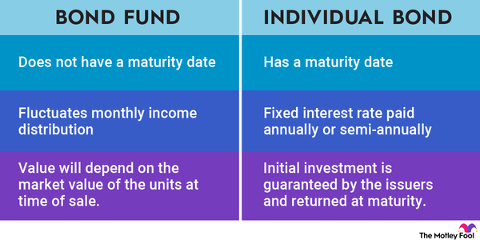

## Table of Contents

## What are municipal bonds?

Municipal bonds, often called "munis," are loans that people give to local governments or public organizations. These loans help pay for things like building schools, roads, or hospitals. When you buy a municipal bond, you are lending money to the government, and in return, they promise to pay you back with interest over time.

There are two main types of municipal bonds: general obligation bonds and revenue bonds. General obligation bonds are backed by the full faith and credit of the issuing government, meaning they can use taxes to pay you back. Revenue bonds, on the other hand, are paid back using money made from the project they funded, like tolls from a bridge or fees from a hospital.

One big advantage of municipal bonds is that the interest you earn is often free from federal taxes, and sometimes from state and local taxes too. This makes them attractive to investors looking for a steady income without a big tax bill. However, like any investment, they come with risks, such as the possibility that the government might not be able to pay you back.

## What are bond funds?

Bond funds are a type of investment where a lot of people pool their money together to buy a bunch of bonds. Instead of buying one bond, you buy shares in the fund, and the fund managers use the money to buy many different bonds. This can be a good way to spread out your risk because you're not just relying on one bond to do well.

These funds can hold different kinds of bonds, like government bonds, corporate bonds, or municipal bonds. They can also focus on bonds with different lengths of time until they pay back, called the maturity. Some bond funds pay out the interest they earn to the people who own shares in the fund, which can give you a regular income. But like any investment, bond funds can go up or down in value, so they're not completely safe.

## How do municipal bonds differ from bond funds in terms of investment structure?

When you invest in municipal bonds, you are buying a single bond directly from a local government or public organization. This means you lend them money, and they promise to pay you back with interest over time. You own that specific bond and get the interest payments until the bond matures. If you want to sell the bond before it matures, you can do so in the bond market, but the price you get can change based on many things, like interest rates or the financial health of the issuer.

On the other hand, bond funds are a way for you to invest in a bunch of bonds all at once. When you buy into a bond fund, you're buying shares in the fund, not individual bonds. The fund managers use the money from all the investors to buy a mix of bonds, which can include municipal bonds but also other types. This means your investment is spread out over many bonds, which can help lower your risk. The value of your shares in the fund can go up or down based on how all the bonds in the fund are doing, and you might get regular interest payments from the fund, but these payments can change.

In simple terms, with municipal bonds, you own a single bond and get fixed payments, while with bond funds, you own a piece of a bigger pool of bonds, and your payments and the value of your investment can change more. Both have their own risks and benefits, so it depends on what you're looking for in an investment.

## What are the tax advantages of investing in municipal bonds?

One of the big perks of investing in municipal bonds is that the interest you earn is often free from federal taxes. This means you don't have to pay taxes on the money you make from the interest to the federal government. This can save you a lot of money, especially if you're in a high tax bracket. Sometimes, if you live in the state where the bond was issued, you might not have to pay state or local taxes on the interest either. This makes municipal bonds a good choice for people who want to keep more of their investment income.

Another advantage is that even though the interest is tax-free, you still get to report it on your taxes. This can help if you're trying to meet certain income levels for things like qualifying for certain benefits or loans. So, while you're saving on taxes, you're also able to use the interest to help with other financial planning. Overall, the tax benefits of municipal bonds can make them a smart choice for investors looking to grow their money without a big tax hit.

## How does the risk profile of municipal bonds compare to bond funds?

Municipal bonds can be a bit safer than bond funds because when you buy a municipal bond, you know exactly what you're getting. You own one bond from a specific city or town, and they promise to pay you back with interest. The risk is mostly about whether that one city or town can keep its promise. If they run into money trouble, your bond might be at risk. But if they do well, your bond is pretty safe.

Bond funds, on the other hand, can be riskier because they hold a bunch of different bonds. While this spreads out your risk, it also means the value of your investment can go up and down more. The fund managers are always buying and selling bonds, so the mix of bonds in the fund can change. This means your investment isn't as predictable as owning one municipal bond. Plus, if a lot of people want to sell their shares in the fund at the same time, the price of your shares might drop.

In simple terms, municipal bonds are more straightforward and can be safer if you pick a stable issuer. Bond funds offer more variety and can be less risky in some ways because they're spread out, but they can also be more unpredictable and affected by what's happening in the whole bond market.

## What is the liquidity difference between municipal bonds and bond funds?

Municipal bonds can be less liquid than bond funds. When you own a municipal bond, it might be harder to sell it quickly if you need your money back. You have to find someone who wants to buy your specific bond, and the price they're willing to pay can change a lot. This means you might have to wait or accept a lower price if you need to sell in a hurry.

Bond funds, on the other hand, are usually more liquid. When you invest in a bond fund, you're buying shares in the fund, and these shares can be bought and sold more easily. You can usually sell your shares back to the fund or to other investors pretty quickly, often on the same day. This makes bond funds a good choice if you might need your money back soon.

## How do the costs and fees associated with municipal bonds compare to those of bond funds?

When you buy a municipal bond, you usually pay a fee to the broker who helps you buy it. This fee can be a flat amount or a percentage of the bond's value. Once you own the bond, there are no more fees to pay, but you might have to pay taxes on any profit if you sell the bond before it matures. Overall, the costs for municipal bonds are pretty straightforward, but they can add up if you're buying and selling a lot.

Bond funds, on the other hand, often have more costs and fees. You might have to pay a fee when you buy into the fund, and then there are ongoing management fees. These fees pay for the people who run the fund and decide which bonds to buy and sell. The management fees are usually a percentage of your investment, taken out each year. These fees can eat into your returns over time, so it's important to know what you're paying.

## What are the typical yields one might expect from municipal bonds versus bond funds?

Municipal bonds usually offer lower yields than other types of bonds because the interest you earn is often free from federal taxes, and sometimes from state and local taxes too. This tax advantage makes up for the lower yield. For example, if a municipal bond yields 3%, that might be as good as a taxable bond yielding 4% or more, depending on your tax bracket. The exact yield on a municipal bond can change based on things like how safe the bond is and how long you have to wait for your money back.

Bond funds that focus on municipal bonds can offer similar yields to individual municipal bonds, but the exact yield can vary more because the fund holds a mix of different bonds. The yield of a bond fund can go up or down based on what's happening in the bond market and what the fund managers decide to do. Also, the fees you pay to the fund can eat into your yield, so you might end up with a bit less than you would with a single municipal bond, but the difference can be small if the fees are low.

## How does diversification vary between investing in municipal bonds directly versus through bond funds?

When you invest in municipal bonds directly, you own just one bond. This means you're putting all your money into one place. If something goes wrong with that city or town, like if they run out of money, your investment could be in trouble. This is called having less diversification because your money isn't spread out. So, if you want to be safer, you might need to buy many different municipal bonds from different places, which can be a lot of work and cost more in fees.

On the other hand, bond funds give you more diversification right away. When you buy into a bond fund, your money is used to buy a bunch of different bonds. This means your investment is spread out over many cities, towns, and types of bonds. This can make your investment safer because if one bond doesn't do well, the others might still be okay. Plus, it's easier to get this diversification through a bond fund because the fund managers do all the work of [picking](/wiki/asset-class-picking) and managing the bonds for you.

## What are the considerations for interest rate risk when comparing municipal bonds and bond funds?

When you invest in municipal bonds, [interest rate](/wiki/interest-rate-trading-strategies) risk means that if interest rates go up, the price of your bond might go down. This happens because new bonds will be issued with higher interest rates, making your older bond less attractive to other buyers. So, if you want to sell your bond before it matures, you might have to sell it for less than what you paid. The longer you have to wait for your bond to mature, the more interest rate risk you face because there's more time for rates to change.

Bond funds also face interest rate risk, but it can be different because they hold a bunch of bonds. If interest rates go up, the prices of all the bonds in the fund might drop, which can lower the value of your shares in the fund. But since the fund has many bonds with different times until they mature, the impact might be spread out a bit. Still, if you need to sell your shares in the fund quickly when rates go up, you might get less money than you expected.

## How do credit ratings impact the investment decision between municipal bonds and bond funds?

Credit ratings are like report cards for bonds. They tell you how likely it is that the people who issued the bond will pay you back. When you're looking at a single municipal bond, its credit rating is super important. If the bond has a high credit rating, it means the city or town is pretty safe and likely to pay you back. But if the rating is low, there's more risk that they might not be able to pay, so you might want a higher interest rate to make up for that risk. You need to check the rating of each bond you're thinking about buying to decide if it's worth the risk.

With bond funds, credit ratings still matter, but in a different way. A bond fund holds a bunch of different bonds, so it's more about the average credit rating of all the bonds in the fund. If the fund has a lot of high-rated bonds, it's generally safer. But if it has a lot of low-rated bonds, it's riskier. The fund's managers will try to balance this out to give you a mix of safety and return. So, when you're choosing a bond fund, you should look at the overall credit quality of the fund to see if it matches what you're comfortable with in terms of risk.

## What are advanced strategies for optimizing a portfolio that includes both municipal bonds and bond funds?

To optimize a portfolio with both municipal bonds and bond funds, you can start by balancing the mix of these investments. Since municipal bonds are usually safer but less liquid, you might want to use them as the steady part of your portfolio. Bond funds, which can be more liquid and have more variety, can help you spread out your risk. You could put more money into bond funds if you need to get your money back quickly or if you want to invest in a lot of different bonds without buying each one yourself. But if you're okay with holding onto your investments for a long time, you might put more into individual municipal bonds for their tax benefits.

Another strategy is to pay attention to interest rates and credit ratings. When interest rates are low, it might be a good time to buy municipal bonds because their prices are higher. But if rates are going up, you might want to stick with shorter-term bonds or bond funds that can adjust to the changes more easily. Also, look at the credit ratings of the bonds or the overall rating of the bond funds. If you want to be safer, go for higher-rated bonds or funds. But if you're willing to take more risk for possibly higher returns, you could include some lower-rated bonds in your mix. By keeping an eye on these things and adjusting your portfolio, you can make the most of what both municipal bonds and bond funds have to offer.

## References & Further Reading

[1]: Barnhill, T. M., & Maxwell, W. F. (2002). ["Modeling correlated interest rate, spread risk, and default risk in fixed-income portfolios."](https://pmc.ncbi.nlm.nih.gov/articles/PMC2408919/)00257-2) Journal of Banking & Finance, 26(2-3), 347-374.

[2]: O'Hara, M. (1995). ["Market Microstructure Theory."](https://www.wiley.com/en-us/Market+Microstructure+Theory-p-9781557864437) Blackwell Publishers.

[3]: Fabozzi, F. J. (2016). ["Handbook of Fixed-Income Securities."](https://www.amazon.com/Handbook-Fixed-Income-Securities-Ninth/dp/1260473899) McGraw-Hill Education.

[4]: Hasbrouck, J. (1996). ["Order characteristics and stock price evolution: An empirical investigation of the limit order book."](https://www.sciencedirect.com/science/article/pii/0304405X9500858C) Journal of Financial Studies, 9(2), 385-416.

[5]: Carhart, M. M. (1997). ["On persistence in mutual fund performance."](https://www.jstor.org/stable/2329556) The Journal of Finance, 52(1), 57-82.