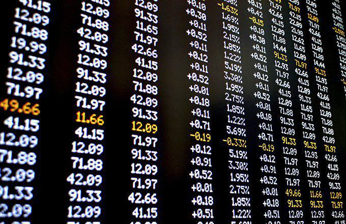

In the rapidly evolving landscape of financial markets, modern investors are continuously seeking effective strategies to optimize their portfolios. Among these strategies, municipal bonds, bond funds, and algorithmic trading have emerged as prominent options for diverse investment objectives. Each strategy presents unique opportunities and challenges, necessitating a careful evaluation to make informed decisions that align with individual financial goals.

Municipal bonds, often referred to as "munis," are debt securities issued by state, local, or other government entities to finance public projects. These bonds are particularly attractive to conservative investors due to their tax-exempt status and relatively low risk of default. In contrast, bond funds, which pool together funds from multiple investors to purchase a diversified portfolio of bonds, offer a more accessible route to fixed-income investing by mitigating the default risk associated with single issuers. Bond funds, including mutual funds and exchange-traded funds (ETFs), cater to varying investment horizons and risk appetites, providing a flexible approach to diversification and capital appreciation.



Algorithmic trading represents a leap forward in investment strategy through the use of advanced algorithms to execute trades. With the integration of automation, algorithmic trading has gained significant traction in fixed-income markets, including municipal bonds. By leveraging data analytics and real-time market insights, algorithmic strategies enhance trading efficiency and reduce transaction costs, offering investors improved market access and execution speed.

Comparing these investment strategies is crucial for investors aiming to navigate the complexities of fixed-income markets. Traditional approaches, such as municipal bonds, carry different risk and tax considerations compared to the diversified structure of bond funds and the technologically driven efficiency of algorithmic trading. Understanding the distinctions and synergies among these strategies empowers investors to align their investments with their risk tolerance, liquidity needs, and long-term financial aspirations.

As automation continues to influence traditional fixed-income markets, it's imperative to recognize how these advancements intersect with investor objectives. The growing interest in technology-driven strategies highlights the need for active engagement with emerging tools and methodologies. Consequently, a comprehensive analysis of municipal bonds, bond funds, and algorithmic trading sets the stage for investors to make educated, strategic choices in an increasingly dynamic investment environment.

## Table of Contents

## Understanding Municipal Bonds

Municipal bonds, often referred to as "munis," are debt securities issued by state, municipal, or county governments to finance public projects such as roads, schools, and water systems. When an investor purchases a municipal bond, they are essentially lending money to the issuer in exchange for periodic interest payments, known as coupon payments, and the return of the bond's face value when it matures.

A notable characteristic of municipal bonds is their tax advantages. Generally, the interest income generated by municipal bonds is exempt from federal income taxes and, in some cases, from state and local taxes if the investor resides in the state where the bond was issued. This tax-exempt status can lead to higher effective yields compared to taxable bonds, especially for investors in higher tax brackets.

Despite these advantages, municipal bonds are not without risk. Default risk, although historically low, is present—particularly when debt obligations from the issuer exceed their financial capacity. Ratings from agencies like Moody's and S&P provide insights into the default risk associated with a particular municipal bond, guiding investors accordingly.

Municipal bonds have specific features appealing to conservative investors. Their stability and relatively low default rates offer a level of safety while the tax-exempt interest aligns ideally with income-generating strategies for tax-averse investors. However, it is essential to consider [liquidity](/wiki/liquidity-risk-premium) concerns, as the market for municipal bonds can be less liquid than corporate bonds.

There are two primary types of municipal bonds: general obligation bonds and revenue bonds. 

1. **General Obligation Bonds**: These bonds are secured by the full faith and credit of the issuing government unit, which often has the authority to levy taxes to fulfill its repayment obligation. As they are supported by the issuer's taxing power, they present a lower risk of default to investors.

2. **Revenue Bonds**: Unlike general obligation bonds, revenue bonds are repaid from the income generated by the specific project or source that the bond is issued to finance, such as a toll road or utility plant. This specificity translates into a higher risk profile, as their repayment is contingent on the success and revenue potential of the financed project.

In summary, municipal bonds offer tax advantages and potential safety for conservative investors, but come with risks that vary according to the type of bond and the issuer’s creditworthiness. Investing in municipal bonds requires careful consideration of these attributes to align with an investor’s risk tolerance and financial goals.

## Bond Funds: A Diversified Approach

Bond funds represent pooled investments that focus on purchasing debt securities, such as government, municipal, or corporate bonds. These funds offer investors an opportunity to diversify their portfolios without needing to purchase individual bonds. By pooling resources, bond funds provide exposure to a broad range of debt instruments, thereby spreading risk and reducing the impact of a single bond default.

One of the main advantages of bond funds is their role in mitigating default risks. Unlike individual bonds, which rely on the creditworthiness of a single issuer, bond funds spread investments across various issuers and sectors. This diversification minimizes the impact that any one issuer's potential default could have on the overall portfolio. The inherent diversification in bond funds is advantageous for investors seeking stable returns while minimizing the risks associated with individual bond defaults.

Bond mutual funds and exchange-traded funds (ETFs) offer distinct benefits for long-term investment strategies. Bond mutual funds are actively managed by professional fund managers who make strategic investment decisions to maximize returns and manage risks. They typically reinvest income, allowing investors to benefit from compounding returns over time. Bond ETFs, on the other hand, trade like stocks on major exchanges, offering liquidity and flexibility in buying and selling. ETFs generally have lower fees and provide transparency, as they often track a bond index.

Tax implications are crucial considerations when investing in bond funds. Interest income from most bond funds is subject to federal income tax, and potentially state and local taxes. However, some bond funds, such as municipal bond funds, offer tax advantages by generating income that is often exempt from federal, and sometimes state, taxes. This feature makes them an attractive option for investors in higher tax brackets. It is important for investors to understand the specific tax treatment of bond funds to optimize their after-tax returns.

In summary, bond funds offer a diversified approach to investing in the fixed-income market, reducing default risks and offering benefits tailored to long-term strategies. Both bond mutual funds and ETFs present viable options depending on an investor’s preference for active management or liquidity. Understanding the tax implications associated with bond funds can further enhance investment outcomes.

## Algorithmic Trading in Fixed-Income Markets

Algorithmic trading, often known as algo trading, has become increasingly significant in fixed-income markets, including the municipal bond sector. It involves using computer algorithms to execute trading strategies at speeds and efficiencies far superior to traditional trading methods. In recent years, municipal bonds have seen an upswing in algo trading adoption, driven by advances in technology and the growing need for operational efficiency.

Algo trading enhances efficiency in the bond market primarily by automating the trading process, which reduces the time needed to execute trades and minimizes human errors. This automation allows traders to react swiftly to market changes, leading to improved market liquidity and tighter bid-ask spreads. Additionally, [algorithmic trading](/wiki/algorithmic-trading) harnesses the power of data analytics to optimize trading strategies, providing insights into market trends and helping in the formulation of predictive models. For instance, statistical [arbitrage](/wiki/arbitrage) models can be used to identify and exploit momentary discrepancies in bond prices. A basic example of such a model in Python might involve analyzing historical price data to establish patterns and predict future price movements:

```python
import numpy as np
import pandas as pd
from sklearn.linear_model import LinearRegression

# Hypothetical historical bond price data
data = {
    'Price': [100, 101, 99, 105, 104, 103, 108, 110],
    'Volume': [2000, 2300, 2100, 2500, 2400, 2600, 2700, 2800]
}

# Convert to DataFrame
df = pd.DataFrame(data)

# Simple linear regression for price prediction
X = np.array(df[['Volume']])
y = np.array(df['Price'])

model = LinearRegression().fit(X, y)
predicted_price = model.predict(np.array([[2900]]))  # Predicting for a volume of 2900
```

Despite these advantages, implementing algorithmic trading in the municipal bond market is fraught with challenges. One of the most significant is the market's fragmented nature. Unlike equities, municipal bonds are not traded on a centralized exchange, leading to disparate market information and liquidity issues. This fragmentation makes it difficult to gather comprehensive data analytics, often requiring sophisticated data aggregation techniques to construct a full market view.

Furthermore, while algo trading reduces some costs by eliminating the need for large trading floors and reducing human capital requirements, it necessitates substantial investment in technology infrastructure and expertise in quantitative analysis. Regulatory scrutiny also adds complexity, as regulators may impose constraints to ensure fair market practices and protect investors.

Nevertheless, the benefits of algorithmic trading in terms of speed, efficiency, and improved trading outcomes continue to propel its integration into the municipal bond market. Its capacity to innovate trading approaches could transform traditional fixed-income sectors, influencing broader investment strategies.

## Comparative Analysis: Municipal Bonds, Bond Funds, and Algo Trading

### Comparative Analysis: Municipal Bonds, Bond Funds, and Algo Trading

Municipal bonds, bond funds, and algorithmic trading each exhibit distinct risk and return profiles, appealing to different types of investors.

**Risk and Return Profiles**

Municipal bonds are generally considered low-risk investments because they are issued by government entities. They tend to offer lower yields compared to corporate bonds due to their tax advantages, but they are attractive for investors seeking predictable and stable returns. Default risks, though relatively low, can vary based on the issuing municipality's creditworthiness.

Bond funds, consisting of various municipal and corporate bonds, offer diversified risk which can reduce the impact of any single bond defaulting. However, they are subject to [interest rate](/wiki/interest-rate-trading-strategies) risks and can experience fluctuations in net asset value. Over the long term, bond funds can offer modest returns that are higher than those of individual municipal bonds due to this diversification.

Algorithmic trading in the fixed-income domain introduces a different risk-return scenario. Algo trading strategies can lead to higher returns through faster execution and exploiting market inefficiencies. They come with substantial technology and execution risks, and their returns can be volatile based on market conditions and the efficiency of the algorithm employed.

**Suitability Based on Investor Risk Tolerance and Goals**

Municipal bonds are suitable for risk-averse investors focused on capital preservation and tax-efficient income, such as retirees. They offer a known income stream with lower variability.

Bond funds suit moderate risk-tolerant investors seeking diversification and moderate-income growth. Investors looking for a blend of income and growth potential may find bond funds aligning with their goals.

Algorithmic trading caters to high-risk-tolerant investors and institutions aiming for capital appreciation and high-frequency trading gains. It is appropriate for individuals with significant capital and access to sophisticated trading infrastructure.

**Liquidity, Tax Considerations, and Diversification**

Municipal bonds can lack liquidity, particularly for bonds from smaller issuers, and may involve a longer time horizon for buying or selling. They offer significant tax benefits, with many offering tax-free interest at the federal and state level, which can enhance after-tax returns.

Bond funds offer higher liquidity as investors can trade shares daily on exchanges. While they may not provide the same tax benefits as individual municipal bonds, they reduce single issuer risk due to diversification.

Algorithmic trading, while offering potentially rapid trading and liquidity, does not extend specific tax advantages. The choice of assets in the trading strategy governs tax liability, which can be complex if strategies involve frequent capital gains and losses.

**Case Scenarios**

- **Municipal Bonds** are beneficial in economic downturns where investors prioritize capital safety and tax advantages.
- **Bond Funds** provide a balanced approach for investors interested in diversification and slightly higher yields than individual bonds, especially suitable during periods of interest rate shifts.
- **Algorithmic Trading** excels in highly volatile markets where speed and technological edge allow investors to capitalize on short-term pricing inefficiencies.

This comparison illustrates that the choice between municipal bonds, bond funds, and algorithmic trading depends on an investor's risk tolerance, financial objectives, and need for liquidity and tax optimization.

## The Future of Fixed-Income Investing

Trends and innovations are continuously shaping the future of fixed-income investing, particularly within municipal bonds, bond funds, and algorithmic trading. The role of technology is pivotal in transforming these investment strategies, driven largely by the surge in data analytics and automation. Algorithmic trading, in particular, benefits from advancements in [artificial intelligence](/wiki/ai-artificial-intelligence) and [machine learning](/wiki/machine-learning), which increase trading efficiency and reduce costs. Algorithms are optimized to predict market trends and execute trades at optimal times, enhancing decision-making processes.

In municipal bonds and bond funds, technology facilitates enhanced data analytics, allowing investors to better assess risk, return, and other critical metrics. By leveraging vast datasets, investors can refine strategies to maximize gains while minimizing exposure to potential defaults or liquidity issues. The integration of blockchain technology promises improvements in transparency and security, streamlining processes such as settlement and regulatory compliance.

Regulatory frameworks governing these investment options may also evolve to accommodate these technological advancements. Governments and financial institutions are likely to adapt to innovations by updating existing regulations or introducing new ones to ensure fair and secure trading environments. For instance, regulations might focus on the ethical use of algorithms or the implementation of blockchain in municipal bonds to ensure investor protection and data integrity.

Investors must adapt to this rapidly evolving landscape by staying informed and agile. Continuous education and awareness of technological trends can help investors make informed decisions aligned with their financial goals. Furthermore, engaging with financial advisors who are well-versed in these advancements can provide a competitive edge. Preparing for and embracing technological changes will be key to navigating and thriving in the future of fixed-income investing.

## Conclusion

In this article, we explored the unique characteristics and benefits of three key investment strategies: municipal bonds, bond funds, and algorithmic trading. Each of these approaches offers distinct advantages and risks, which are critical to understand for making informed investment decisions. Municipal bonds provide tax benefits and a secure option for conservative investors, while bond funds offer diversification and reduced default risks. Algorithmic trading, with its technological advancements, introduces efficiency and cost reduction to the market.

Understanding these strategies is crucial because the financial goals and risk tolerance of each investor are unique. Carefully selecting an investment path that aligns with one's specific situation can result in improved financial outcomes. Municipal bonds might appeal to those seeking tax advantages, whereas bond funds could suit investors looking for diversification. On the other hand, algorithmic trading may offer value to those interested in leveraging technology for faster and possibly more cost-effective trades.

As investment environments continuously evolve, staying informed about new trends, technological advancements, and regulatory changes becomes increasingly important. This knowledge can help investors adapt and thrive, ensuring their strategies remain optimized for future developments. As such, a thorough understanding of various investment options and ongoing adaptation to changes are essential components of successful investment planning.

## References & Further Reading

[1]: Barnhill, T. M., & Maxwell, W. F. (2002). ["Modeling correlated interest rate, spread risk, and default risk in fixed-income portfolios."](https://pmc.ncbi.nlm.nih.gov/articles/PMC2408919/)00257-2) Journal of Banking & Finance, 26(2-3), 347-374.

[2]: O'Hara, M. (1995). ["Market Microstructure Theory."](https://www.wiley.com/en-us/Market+Microstructure+Theory-p-9781557864437) Blackwell Publishers.

[3]: Fabozzi, F. J. (2016). ["Handbook of Fixed-Income Securities."](https://www.amazon.com/Handbook-Fixed-Income-Securities-Ninth/dp/1260473899) McGraw-Hill Education.

[4]: Hasbrouck, J. (1996). ["Order characteristics and stock price evolution: An empirical investigation of the limit order book."](https://www.sciencedirect.com/science/article/pii/0304405X9500858C) Journal of Financial Studies, 9(2), 385-416.

[5]: Carhart, M. M. (1997). ["On persistence in mutual fund performance."](https://www.jstor.org/stable/2329556) The Journal of Finance, 52(1), 57-82.