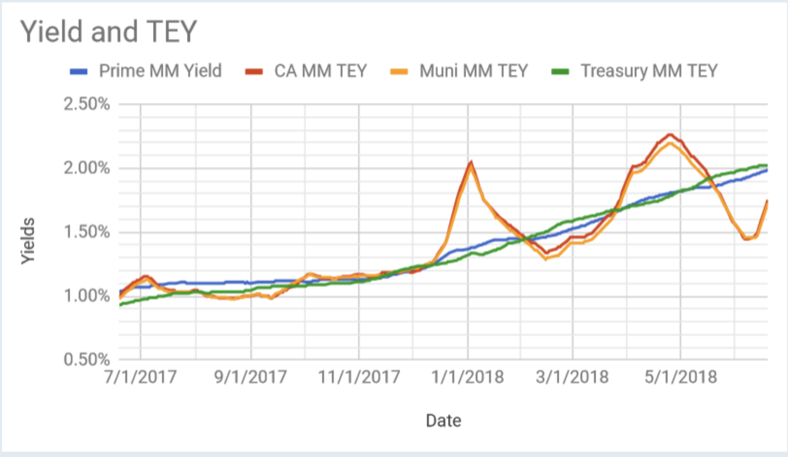

## Table of Contents

## What are municipal bonds?

Municipal bonds are loans that people give to local governments, like cities or towns, to help them pay for big projects. These projects can be things like building new schools, fixing roads, or improving water systems. When you buy a municipal bond, you are essentially lending money to the local government. In return, the government promises to pay you back the money you lent them, plus some extra money as interest, over a certain period of time.

These bonds are popular because they often come with tax benefits. For example, the interest you earn from municipal bonds is usually not taxed by the federal government, and sometimes not by state or local governments either. This can make them a good choice for people looking to save on taxes while still earning a steady income from their investments. However, like any investment, municipal bonds come with risks, such as the possibility that the local government might not be able to pay back the money they borrowed.

## What are money market funds?

Money market funds are a type of investment where you pool your money with other people's money to buy safe, short-term investments. These investments can be things like government securities, certificates of deposit, or commercial paper. The goal is to keep your money safe while still earning a little bit of interest. Money market funds are often seen as a good place to park your cash if you want to keep it safe but still earn more than you would in a regular savings account.

These funds are managed by professionals who try to keep the value of each share at $1. This makes them less risky than other types of investments, like stocks or bonds. However, the interest you earn from money market funds is usually pretty low compared to other investments. They are a good choice if you want to keep your money safe and accessible, but they might not help your money grow as much as other options.

## How do municipal bonds generate returns for investors?

Municipal bonds generate returns for investors by paying them interest over time. When you buy a municipal bond, you are lending money to a city or town. In return, they promise to pay you back the money you lent them, plus extra money as interest. This interest is usually paid out to you twice a year until the bond reaches its end date, which can be anywhere from a few years to several decades. The amount of interest you get depends on the bond's [interest rate](/wiki/interest-rate-trading-strategies), which is set when the bond is first sold.

The other way municipal bonds can generate returns is through the bond's value. Sometimes, you can sell your bond to someone else before it reaches its end date. If interest rates have gone down since you bought the bond, the value of your bond might go up because it pays a higher interest rate than new bonds. You can then sell it for more than you paid for it, making a profit. However, if interest rates have gone up, the value of your bond might go down, and you might have to sell it for less than you paid. So, while the interest payments are a steady source of returns, the bond's value can also affect your overall return.

## How do money market funds generate returns for investors?

Money market funds generate returns for investors by investing in safe, short-term securities like government bonds, certificates of deposit, and commercial paper. These securities pay interest, and the money market fund collects this interest and then shares it with the investors. The interest rate you get from a money market fund is usually higher than what you would get from a regular savings account, but it's still pretty low compared to other types of investments.

The goal of a money market fund is to keep your money safe while still [earning](/wiki/earning-announcement) a little bit of interest. The fund managers work hard to make sure the value of each share stays at $1, which makes it less risky than other investments like stocks or bonds. However, because the returns are low, money market funds are best for people who want to keep their money safe and easy to get to, rather than for people who want to make their money grow a lot.

## What are the tax benefits associated with municipal bonds?

One of the big reasons people like municipal bonds is because of the tax benefits they offer. The interest you earn from municipal bonds is usually not taxed by the federal government. This means you get to keep all of the interest money you earn, without having to give any of it to the IRS. This can make a big difference in how much money you actually get to keep from your investment.

Sometimes, the interest from municipal bonds is also not taxed by your state or local government, especially if you live in the same state where the bond was issued. So, if you buy a bond from your own state, you might not have to pay any state or local taxes on the interest you earn. These tax benefits can make municipal bonds a smart choice for people who want to save on taxes while still earning a steady income from their investments.

## Are there any tax implications for investing in money market funds?

When you invest in money market funds, the interest you earn is usually taxable. This means you have to pay federal income tax on the interest you get from the fund. Depending on where you live, you might also have to pay state and local taxes on this interest. So, unlike municipal bonds, the money you earn from money market funds is not tax-free.

However, money market funds can still be a good choice if you want to keep your money safe and easy to get to. They are less risky than other investments like stocks or bonds, and even though you have to pay taxes on the interest, it's usually more than you would get from a regular savings account. Just remember that the tax you pay can affect how much money you actually get to keep from your investment.

## What is the risk profile of municipal bonds compared to money market funds?

Municipal bonds and money market funds have different risk profiles. Municipal bonds are generally considered to be safer than stocks but riskier than money market funds. The biggest risk with municipal bonds is that the city or town might not be able to pay back the money they borrowed. This can happen if the local government runs into financial trouble. Also, the value of a municipal bond can go up or down depending on interest rates. If interest rates go up, the value of your bond might go down, and you could lose money if you have to sell it before it matures.

Money market funds, on the other hand, are designed to be very safe. They invest in short-term securities like government bonds and certificates of deposit, which are less likely to lose value. The goal of a money market fund is to keep the value of each share at $1, which makes it very stable. However, the returns you get from money market funds are usually low, and they don't grow your money as much as other investments might. So, while money market funds are safer, they also offer less potential for high returns compared to municipal bonds.

## How does the liquidity of municipal bonds compare to that of money market funds?

Municipal bonds and money market funds have different levels of [liquidity](/wiki/liquidity-risk-premium). Liquidity means how easy it is to get your money back when you want it. With municipal bonds, you usually have to wait until the bond reaches its end date to get all your money back. If you need your money before then, you can try to sell the bond to someone else. But selling a bond before it matures can be hard, and you might not get as much money as you hoped. So, municipal bonds are not very liquid.

Money market funds are much more liquid. When you put money into a money market fund, you can usually get it back quickly, often in just a day or two. This is because money market funds invest in short-term securities that are easy to sell. So, if you need your money, you can take it out of the fund without much trouble. This makes money market funds a good choice if you want to keep your money safe and easy to get to.

## What are the typical investment durations for municipal bonds versus money market funds?

Municipal bonds usually have longer investment durations than money market funds. When you buy a municipal bond, you are lending money to a city or town for a set period of time. This period can be anywhere from a few years to as long as 30 years or more. The exact duration depends on the specific bond you buy. So, if you invest in municipal bonds, you need to be ready to keep your money tied up for a while.

Money market funds, on the other hand, have much shorter investment durations. They invest in things like government securities and certificates of deposit that mature in a short time, usually less than a year. This means the money in a money market fund is always moving in and out of different short-term investments. So, if you put money into a money market fund, you can usually get it back quickly, which makes it a good choice if you need your money to be available soon.

## How do interest rate changes affect municipal bonds and money market funds differently?

When interest rates change, it can affect municipal bonds a lot. If interest rates go up, the value of the bond you already own might go down. This is because new bonds being sold will have higher interest rates, making your old bond less attractive to other people. If you need to sell your bond before it reaches its end date, you might have to sell it for less than you paid for it. On the other hand, if interest rates go down, the value of your bond might go up because it pays a higher interest rate than new bonds. But remember, the interest payments you get from the bond stay the same no matter what happens to interest rates.

Money market funds are affected by interest rate changes too, but in a different way. These funds invest in short-term securities, so they can quickly switch to new investments that pay the new interest rate. When interest rates go up, the money market fund can start earning more interest on its new investments, which means you might start getting a little more money from the fund. When interest rates go down, the fund will earn less interest, and so will you. But because the investments are short-term, the value of the money market fund stays pretty stable, usually staying at $1 per share.

## What are the credit quality considerations for municipal bonds versus money market funds?

Municipal bonds are loans to cities or towns, and the credit quality of these bonds depends on how likely the city or town is to pay back the money they borrowed. Some cities or towns are very good at paying back their loans and have high credit ratings, which makes their bonds safer. But other places might have money problems and a lower credit rating, which makes their bonds riskier. You can check the credit rating of a municipal bond before you buy it to see how safe it is. If you buy a bond with a lower credit rating, you might get a higher interest rate, but there's also a bigger chance you won't get your money back.

Money market funds invest in very safe, short-term things like government securities and certificates of deposit. These investments are usually very high quality, which means they are less likely to lose value. Money market funds are designed to be safe, and they try to keep the value of each share at $1. So, the credit quality of money market funds is generally very high, which makes them a good choice if you want to keep your money safe. But because they are so safe, the interest you earn from them is usually pretty low.

## How do the costs and fees associated with municipal bonds compare to those of money market funds?

When you buy municipal bonds, you might have to pay a fee to the broker who sells you the bond. This fee can be a percentage of the bond's value, and it's usually called a commission. Sometimes, you might also have to pay other fees, like if you need to keep the bond in a special account. But once you own the bond, you usually don't have to pay any more fees until you sell it. So, the costs for municipal bonds can be a bit high when you buy them, but they don't keep going up over time.

Money market funds have different costs. Instead of a big fee when you buy them, money market funds usually charge a small fee every year. This fee is called an expense ratio, and it's a percentage of the money you have in the fund. The expense ratio covers the costs of running the fund, like paying the people who manage it. So, the costs for money market funds are lower when you first put your money in, but they keep going up a little bit every year as long as your money is in the fund.

## References & Further Reading

[1]: Fabozzi, F. J. (2012). ["Handbook of Municipal Bonds"](https://onlinelibrary.wiley.com/doi/book/10.1002/9781119198093). John Wiley & Sons.

[2]: Kimmel, M. (2019). ["Municipal Bonds: A Basic Guide for Beginners"](https://www.municipalbonds.com/education/the-basics-of-municipal-bonds/). M.I.K. Publishing.

[3]: Poitras, G. (2008). ["Municipal Bond Market: Recent Trends and Key Drivers"](https://www.sciencedirect.com/science/article/pii/S0304405X12001547). Nova Science Publishers, Inc.

[4]: Wagner, W. H., & Lau, S. C. (1998). ["The Effect of Reinvestment Rate Aggressiveness on the Returns and Risks of Money Market Mutual Funds"](https://www.foot.theclinics.com/article/S1083-7515(24)00193-1/abstract). The Journal of Financial Research, 21(3), 299–310.

[5]: Narang, R. K. (2013). ["Inside the Black Box: A Simple Guide to Quantitative and High Frequency Trading"](https://onlinelibrary.wiley.com/doi/book/10.1002/9781118662717). John Wiley & Sons.