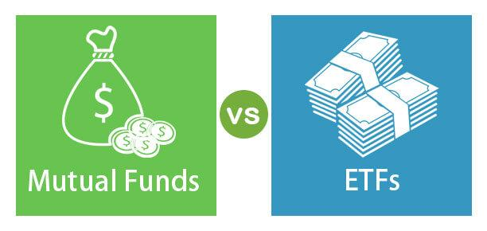

Investment options have evolved significantly over the years, catering to a diverse spectrum of investor preferences and risk appetites. Among these options, Exchange-Traded Funds (ETFs), mutual funds, and algorithmic trading have emerged as popular choices, attracting both novice and seasoned investors alike. Each of these investment vehicles offers distinct features and benefits that can be strategically leveraged to achieve specific financial goals.

Exchange-Traded Funds are investment funds traded on stock exchanges, comparable to individual stocks. They provide a unique advantage with their intra-day liquidity, allowing investors to buy and sell throughout the trading day. This feature contrasts with mutual funds, which are typically purchased at the end of the trading day at the net asset value price. The passive management style of ETFs generally results in lower fees and can offer superior tax efficiency, making them an attractive option for cost-conscious investors.



Mutual funds, conversely, involve the pooling of capital from numerous investors to invest in a broad array of securities, managed by professional fund managers. This professional management offers a hands-off approach for investors who prefer not to engage directly in market decision-making. The diversity of mutual funds, which includes stock, bond, balanced, and index funds, provides a range of strategies to match different investment objectives and risk tolerance levels.

Algorithmic trading represents a technological revolution in investment strategies. Utilizing sophisticated computer algorithms, it facilitates trading financial securities at high speed and volume. This advanced approach enhances market liquidity and execution efficiency, thereby often reducing transaction costs. However, it demands a robust infrastructure and an in-depth understanding of programming, statistics, and financial markets.

The distinctions among these investment options are crucial for devising informed strategies tailored to individual goals. While ETFs and mutual funds offer structured paths to diversification and professional management, algorithmic trading brings technological advantages to investment efficiency and performance. An understanding of these vehicles equips investors to make judicious choices aligned with personal financial aspirations and risk preferences. This article will explore these aspects, examining how each can be effectively integrated into a comprehensive investment strategy. Through careful consideration and strategic planning, investors can optimize their portfolios to achieve desired financial outcomes.

## Table of Contents

## Understanding ETFs

Exchange-Traded Funds (ETFs) are a type of investment fund traded on stock exchanges, much like individual stocks. These funds hold a diversified portfolio of assets, which may include stocks, commodities, bonds, or a combination thereof. The design of ETFs allows them to trade throughout the day at market prices, providing investors with the flexibility to execute buy or sell orders at any point during the trading session. This intra-day liquidity is a significant advantage over mutual funds, which are priced and traded only at the end of the trading day.

One essential mechanism underpinning ETFs is [arbitrage](/wiki/arbitrage). This ensures that the trading price of an [ETF](/wiki/etf-trading-strategies) is kept closely aligned with its net asset value (NAV). Arbitrage involves the simultaneous buying and selling of ETF shares and the underlying assets to exploit pricing discrepancies. Authorized participants (typically large financial institutions) can create or redeem ETF shares in large blocks, known as creation units, which helps to maintain price parity with the NAV.

ETFs are predominantly passively managed, tracking a specific index or market segment. This passive management often results in lower fees compared to actively managed mutual funds. The decreased need for significant management intervention also contributes to enhanced tax efficiency. When investors redeem ETF shares, the fund can deliver a pro-rata share of the underlying assets ''in-kind'' rather than selling securities and incurring taxable capital gains.

A notable trend in the ETF market has been the emergence of thematic ETFs. These funds focus on specific investment themes or market trends, such as [artificial intelligence](/wiki/ai-artificial-intelligence), renewable energy, healthcare innovation, or cybersecurity. Thematic ETFs enable investors to target growth opportunities in niche sectors of the economy without needing to select individual stocks, offering both diversification and exposure to potential high-growth areas.

The automation and lower cost of trade execution in ETFs, combined with diverse investment options, have made them increasingly popular among both retail and institutional investors. They play a crucial role in democratizing access to a variety of investment strategies, facilitating more inclusive participation in global financial markets.

## Exploring Mutual Funds

Mutual funds are collective investment vehicles that aggregate capital from multiple investors to purchase a diversified portfolio of securities. These funds are managed by professional fund managers who make investment decisions on behalf of the investors. This pooling of resources allows for an economy of scale, enabling individual investors to access a broad range of securities that might otherwise be inaccessible due to high per-unit costs.

Mutual funds are typically bought and sold at the net asset value (NAV), which is calculated at the end of each trading day. The NAV represents the fund's per-share value after accounting for all liabilities and assets at the market close. This means that investors transact at a price reflective of the actual value of the fund's holdings, as opposed to intra-day fluctuating prices typical in individual stock trading.

There are various types of mutual funds, each catering to different investment preferences and risk profiles. Common categories include stock funds, which primarily invest in equities; bond funds, focused on debt securities; balanced funds, which combine stocks and bonds; and index funds, which aim to replicate the performance of a specific market index. Investors can select funds based on their goals, whether seeking growth, income, or a balanced approach to risk and return.

The fees associated with mutual funds are generally higher compared to those of passively managed funds like ETFs. These fees are attributable to the active management and operational costs incurred in the process of buying, selling, and continuously selecting securities. Management fees can include the salaries of the fund managers and research expenses, as well as administrative costs.

Mutual funds appeal to investors seeking a less hands-on investment approach, offering the convenience of professional management. This setup is advantageous for individuals who prefer to entrust their investment decisions to experienced managers, allowing them to focus on broader financial planning rather than daily market fluctuations. By leveraging the expertise of fund managers, investors can access diversified investment strategies without the need for direct market involvement.

## Algo Trading: Revolutionizing Investments

Algorithmic trading, frequently referred to as algo trading, utilizes sophisticated computer programs and algorithms to execute a multitude of financial securities trades at high speed and large [volume](/wiki/volume-trading-strategy). Central to its operation is the implementation of advanced mathematical models and complex calculations, allowing the system to determine optimal trading conditions and execute orders at a pace beyond human capability.

### Mathematical Modeling and Decision-Making
The core of [algorithmic trading](/wiki/algorithmic-trading) is its capacity to leverage mathematical models for decision-making. These models analyze market data, price trends, and trading volumes to execute buy or sell decisions. Typically, these models incorporate statistical and econometric analysis, harnessing techniques such as time series analysis, regression models, and even [machine learning](/wiki/machine-learning) algorithms. For example, a basic moving average crossover strategy can be represented as follows:

```python
import pandas as pd
import numpy as np

# Assuming 'data' is a DataFrame with columns 'Date' and 'Close'
def simple_moving_average(data, short_window, long_window):
    signals = pd.DataFrame(index=data.index)
    signals['signal'] = 0.0

    # Short moving average
    signals['short_mavg'] = data['Close'].rolling(window=short_window, min_periods=1).mean()

    # Long moving average
    signals['long_mavg'] = data['Close'].rolling(window=long_window, min_periods=1).mean()

    # Generate signals
    signals.loc[signals['short_mavg'] > signals['long_mavg'], 'signal'] = 1.0
    signals.loc[signals['short_mavg'] < signals['long_mavg'], 'signal'] = -1.0

    return signals
```

### Enhancing Market Liquidity and Execution Efficiency
Algo trading contributes significantly to market [liquidity](/wiki/liquidity-risk-premium) and execution efficiency. By executing trades at optimal moments within milliseconds, it enables more fluid market transactions and often achieves better pricing. The high-frequency nature of these transactions reduces bid-ask spreads, enhancing price stability and benefiting all market participants through reduced transaction costs.

### Supporting Complex Trading Strategies
Algorithmic trading allows for the execution of complex trading strategies that can adjust rapidly to market conditions. Strategies such as [statistical arbitrage](/wiki/statistical-arbitrage), pairs trading, and [market making](/wiki/market-making) require real-time analysis and swift execution, something that algorithms facilitate with precision. The execution of these strategies often relies on continuous market data feeds and near-real-time analytical processing.

### Infrastructure and Expertise Requirements
While offering numerous advantages, algorithmic trading requires a robust infrastructure, encompassing both hardware and software. High-speed internet connections, powerful computing systems for real-time data processing, and resilient security protocols are foundational elements. Additionally, creating and managing these systems necessitates a profound understanding of programming, [statistics](/wiki/bayesian-statistics), and comprehensive knowledge of market operations.

Developers and traders need expertise in programming languages such as Python and C++, as well as proficiency in utilizing statistical packages or libraries like NumPy and pandas. Moreover, the successful application of algo trading is deeply linked to understanding intricate financial concepts and market dynamics, which are vital in designing effective algorithms. As technology continues to evolve, so too does the potential for enhancing the capabilities and performance of algorithmic trading systems.

## Comparative Analysis

When evaluating Exchange-Traded Funds (ETFs) and mutual funds, it is crucial to consider their distinctive characteristics. ETFs are often lauded for their tax efficiency and liquidity, primarily because they trade on stock exchanges throughout the day. This intra-[day trading](/wiki/day-trading-spy) capability allows investors to react swiftly to market changes, potentially capitalizing on short-term price movements. Moreover, the structure of ETFs generally results in fewer taxable events compared to mutual funds. Mutual funds, on the other hand, are transacted at the net asset value at the end of the trading day, offering investors access to professional management and diverse strategies. The expertise of fund managers can be beneficial for those seeking a hands-off investment approach, though it can come with higher operating fees due to active management.

In comparing ETFs with algorithmic trading, ETFs can be integrated within algorithmic strategies to enhance investment potential. Algorithmic trading, leveraging advanced software and mathematical models, operates at high speed and volume, making rapid trading decisions for optimal execution. This technology layer can automate and optimize ETF trades, enhancing efficiency through predictive analytics. However, the effectiveness of algorithmic trading relies heavily on the quality of algorithms and the infrastructure employed.

When contrasting mutual funds with algorithmic trading, mutual funds depend on the insights of human fund managers. These professionals analyze market trends and economic factors to make informed investment decisions. Conversely, algorithmic trading uses automated systems to execute trades with precision and speed, often beyond human capability. The automation aspect can potentially reduce human error and emotional biases, providing a systematic approach to trading.

Investors should weigh several considerations when deciding between these investment vehicles. Key factors include the cost implications, with ETFs generally having lower expense ratios compared to mutual funds due to their passive management style. Liquidity is another critical aspect, where the ability to trade ETFs throughout the day provides an advantage over mutual funds. The management style—be it active or passive—also influences the choice, as does the investor's own objectives and risk tolerance. A thorough evaluation should align an investor's selection with their financial goals and market understanding, optimizing the benefits of diversified investment strategies.

## Conclusion

The decision between Exchange-Traded Funds (ETFs), mutual funds, and algorithmic trading must align closely with individual investor goals, risk tolerance, and market knowledge. Each investment vehicle presents unique characteristics and advantages that can cater to various financial strategies.

Diversification remains a pivotal advantage inherent in these investment options. By spreading investments across different asset classes and sectors, investors can mitigate risks associated with market [volatility](/wiki/volatility-trading-strategies). For example, ETFs often provide exposure to a broad index or specific sectors, mutual funds offer diversified portfolios managed by professionals, and algorithmic trading can implement multifaceted strategies across different markets.

Conducting thorough research or consulting with financial advisors is crucial for investors aiming to tailor their portfolios to match personal and financial aspirations. This step ensures that the selected investment vehicles align with specific risk profiles and long-term financial goals. For instance, individuals with a low-risk tolerance might prefer the steady management of mutual funds, whereas those comfortable with technology may explore the dynamic nature of algorithmic trading.

Emerging trends in artificial intelligence (AI) and financial technology (fintech) are continuously reshaping the investment landscape. These innovations offer novel opportunities to optimize financial outcomes through enhanced predictive analytics and automation. As these technologies evolve, they promise to provide investors with tools to not only maximize returns but also make informed decisions with greater efficiency. Ultimately, staying informed about these advances can empower investors to better optimize their financial portfolios in an ever-changing market environment.

## References & Further Reading

[1]: ["Advances in Financial Machine Learning"](https://www.amazon.com/Advances-Financial-Machine-Learning-Marcos/dp/1119482089) by Marcos Lopez de Prado

[2]: ["Evidence-Based Technical Analysis: Applying the Scientific Method and Statistical Inference to Trading Signals"](https://www.amazon.com/Evidence-Based-Technical-Analysis-Scientific-Statistical/dp/0470008741) by David Aronson

[3]: ["Machine Learning for Algorithmic Trading"](https://github.com/PacktPublishing/Machine-Learning-for-Algorithmic-Trading-Second-Edition) by Stefan Jansen

[4]: ["Quantitative Trading: How to Build Your Own Algorithmic Trading Business"](https://books.google.com/books/about/Quantitative_Trading.html?id=j70yEAAAQBAJ) by Ernest P. Chan

[5]: Kinnel, R. (2010). ["Fund Spy: Morningstar's Inside Secrets to Selecting Mutual Funds that Outperform"](https://archive.org/details/fundspymorningst0000kinn) by Russel Kinnel

[6]: Bogle, J. C. (2009). ["The Little Book of Common Sense Investing: The Only Way to Guarantee Your Fair Share of Stock Market Returns"](https://www.amazon.com/Little-Book-Common-Sense-Investing/dp/1119404509) by John C. Bogle

[7]: Hill, J. M., Nadig, D., & Hougan, M. (2015). ["A Comprehensive Guide to Exchange-Traded Funds (ETFs)"](https://papers.ssrn.com/sol3/papers.cfm?abstract_id=2616223) by Jim M. Hill, Dave Nadig, and Matt Hougan