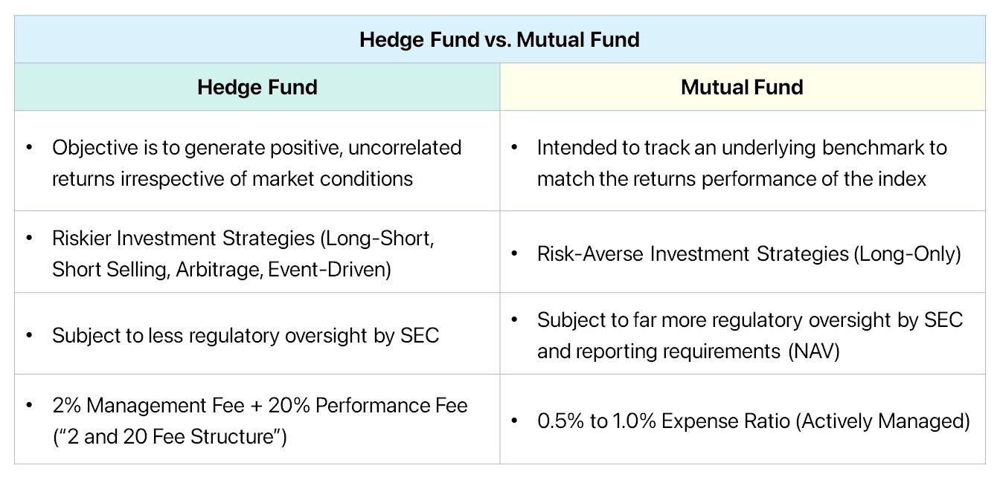

## Table of Contents

## What is a mutual fund?

A mutual fund is a type of investment where many people pool their money together to buy a variety of stocks, bonds, or other assets. This is managed by a professional who makes decisions on what to buy and sell. It's like a big basket where everyone's money goes in, and the professional decides how to spread it out to hopefully make more money for everyone.

Investing in a mutual fund can be easier than buying stocks or bonds on your own because it's already diversified. This means your money is spread out over many different investments, which can lower the risk. Instead of putting all your money into one company, you're investing in a little bit of many companies. This can be a good way for people to start investing without needing to know a lot about the stock market.

## What is a hedge fund?

A hedge fund is a type of investment fund that pools money from investors to buy different assets, like stocks, bonds, or even things like real estate. The big difference between hedge funds and mutual funds is that hedge funds can use riskier strategies to try to make more money. They might borrow money to invest more, or they might bet that certain assets will go down in value. Because of these riskier moves, hedge funds are usually only open to people who can afford to lose their investment, like rich people or big organizations.

Hedge funds are managed by professionals who are trying to beat the market. They aim to make money no matter if the market is going up or down. This is different from a mutual fund, which usually just tries to match the market's performance. Hedge funds charge higher fees than mutual funds because of the special strategies they use and the expertise of the managers. But because they're riskier, they're not for everyone. You need to be ready to take on more risk and have the money to back it up.

## How do mutual funds and hedge funds differ in terms of investment strategies?

Mutual funds and hedge funds have different ways of investing money. Mutual funds usually stick to safer and simpler strategies. They buy a mix of stocks, bonds, or other assets to match the performance of a certain market, like the S&P 500. The goal is to grow your money over time by following the market's ups and downs. They don't usually take big risks because they want to be safe for everyday investors. 

Hedge funds, on the other hand, use riskier strategies to try to make more money. They might borrow money to invest more than they have, or they might bet that certain assets will lose value. This is called "short selling." They aim to make money no matter if the market goes up or down. Because of these riskier moves, hedge funds can make big gains, but they can also lose a lot of money. That's why they're usually only for people who can afford to take big risks.

## Who typically invests in mutual funds versus hedge funds?

People who invest in mutual funds are often everyday folks saving for things like retirement or a big goal. They might not know a lot about investing, but they want to grow their money safely. Mutual funds are good for them because they're easy to buy and they spread the risk by investing in many different things. You don't need to be rich to invest in mutual funds, so lots of regular people choose them.

On the other hand, hedge funds are usually for people who have a lot of money and can handle bigger risks. These investors might be wealthy individuals, big companies, or even other funds. They're okay with the chance of losing money because they're looking for bigger rewards. Hedge funds often require a big amount of money to start investing, so they're not for everyone.

## What are the minimum investment requirements for mutual funds and hedge funds?

Mutual funds usually have lower minimum investment requirements than hedge funds. You can start investing in a mutual fund with as little as $1,000 or even less, depending on the fund. Some mutual funds even let you start with just $50 if you agree to keep adding money every month. This makes mutual funds a good choice for people who don't have a lot of money to invest at once but want to start saving for the future.

Hedge funds, on the other hand, have much higher minimum investment requirements. Usually, you need at least $100,000 to $1 million to get started. This is because hedge funds are meant for people who can afford to take bigger risks with their money. The high minimums help make sure that only people who can handle the risk and potential loss of money invest in hedge funds.

## How do the fee structures of mutual funds compare to those of hedge funds?

Mutual funds usually charge two main types of fees: an expense ratio and sometimes a sales load. The expense ratio is a small percentage of your investment that goes to pay for managing the fund and other costs. It might be around 0.5% to 1.5% a year. A sales load is a one-time fee you pay when you buy or sell shares of the fund, but not all mutual funds have this. These fees are lower than [hedge fund](/wiki/hedge-fund-trading-strategies) fees because mutual funds are designed for everyday investors and aim to keep costs down.

Hedge funds, on the other hand, charge much higher fees. They often use a "two and twenty" fee structure. This means they charge a 2% management fee on the total amount of money in the fund every year, and they also take 20% of any profits the fund makes. These fees are higher because hedge funds use riskier strategies and need skilled managers. The high fees are part of why hedge funds are usually only for rich people who can afford them.

## What are the regulatory differences between mutual funds and hedge funds?

Mutual funds are tightly regulated by the government. In the United States, they are overseen by the Securities and Exchange Commission (SEC) under the Investment Company Act of 1940. This means they have to follow strict rules about what they can invest in, how they report their performance, and how they treat investors. They need to be open and honest about their fees and risks, and they can't do risky things like borrowing a lot of money to invest. This makes mutual funds safer for everyday people who want to invest their money.

Hedge funds, on the other hand, have less strict rules to follow. They are also regulated by the SEC, but under different rules that let them take more risks. Hedge funds can borrow money to invest more than they have, and they can use strategies that mutual funds can't. This means they can do things like betting that stocks will go down in value. Because of these risks, hedge funds are usually only for people who have a lot of money and can handle losing it. The lighter regulation lets hedge funds try to make more money, but it also makes them riskier.

## How do the liquidity and redemption policies differ between mutual funds and hedge funds?

Mutual funds are pretty easy to get your money out of. You can usually sell your shares any time you want during the trading day. This means if you need your money back, you can get it pretty quickly, often within a few days. Mutual funds are set up to be easy for regular people to use, so they make it simple to buy and sell shares. This is called high [liquidity](/wiki/liquidity-risk-premium) because you can turn your investment into cash without much trouble.

Hedge funds work differently. They don't let you take your money out whenever you want. Instead, you might have to wait for certain times of the year, called redemption periods, to get your money back. This can be every three months, every six months, or even once a year. If you try to pull your money out at the wrong time, you might have to pay a big fee. This is because hedge funds use riskier strategies and need to keep their money invested for longer periods to try to make more money. So, they have lower liquidity, meaning it's harder and can take longer to get your cash back.

## What are the performance metrics used to evaluate mutual funds and hedge funds?

When people want to see how well a mutual fund is doing, they look at a few key numbers. One important one is the fund's total return, which shows how much money the fund made or lost over a certain time. Another thing people check is the fund's performance compared to a benchmark, like the S&P 500. If the fund does better than the benchmark, it's doing a good job. People also look at the fund's expense ratio, which is how much it costs to run the fund. A lower expense ratio means more of your money stays in your pocket. Other things to consider are the fund's risk, measured by things like standard deviation, and its consistency, often shown by the Sharpe ratio.

Hedge funds are a bit different because they use riskier strategies. To see how well a hedge fund is doing, people still look at the total return, but they also pay a lot of attention to how much risk the fund took to get that return. The Sharpe ratio is important here too because it shows if the fund's returns are good compared to the risks it took. Another key metric is the fund's alpha, which shows how much better the fund did compared to what you'd expect from the market. Because hedge funds can make money even when the market is down, people also look at how the fund performs in different market conditions. This gives a fuller picture of the fund's performance and helps investors decide if it's worth the high fees and risks.

## How do tax implications vary between investing in mutual funds versus hedge funds?

When you invest in mutual funds, you have to think about taxes. Mutual funds often pay out dividends and capital gains to their investors. Dividends are payments from the companies the fund owns, and capital gains are profits from selling stocks or bonds. You have to pay taxes on these payouts, even if you don't take the money out of the fund. The tax rate depends on how long the fund held the investments. If it was less than a year, it's taxed as regular income. If it was more than a year, it's taxed at a lower rate as long-term capital gains. This can make mutual funds a bit tricky for taxes, especially if you're trying to keep your tax bill low.

Hedge funds have different tax rules because they use different strategies. They might do things like short selling or using borrowed money, which can change how taxes work. Hedge funds often use something called a "pass-through" structure, which means the fund's profits and losses go straight to the investors. This can be good because it might let you use losses to lower your taxes. But hedge funds can also create something called "unrelated business taxable income" (UBTI), which can make your taxes more complicated. Because hedge funds are riskier and can lead to more complex tax situations, it's a good idea to talk to a tax expert if you're thinking about investing in them.

## What role do mutual funds and hedge funds play in portfolio diversification?

Mutual funds are a great way to spread out your money and lower risk. When you put your money in a mutual fund, it gets divided into many different stocks, bonds, or other investments. This means you're not putting all your eggs in one basket. If one company does badly, it won't hurt your whole investment as much because you own a little bit of many companies. This can help you sleep better at night knowing your money is safer. Plus, since mutual funds are easy to buy and manage, they're a good choice for anyone looking to diversify their investments without a lot of work.

Hedge funds also help with diversification, but they do it in a different way. They use riskier strategies and might invest in things like real estate or commodities, not just stocks and bonds. This can add a whole new layer to your investment mix. Because hedge funds can make money even when the market is down, they can help balance out your portfolio. But remember, hedge funds are for people who can handle more risk and have more money to invest. So, if you're looking to diversify and can take on that risk, hedge funds might be a good fit for part of your portfolio.

## What advanced strategies do hedge funds employ that are typically not available to mutual funds?

Hedge funds use some special tricks to try to make more money that mutual funds can't do. One big trick is called short selling. This is when a hedge fund borrows a stock and sells it, hoping the price will go down. Then, they buy it back cheaper and give it back to who they borrowed it from, making a profit. Mutual funds can't do this because it's too risky. Hedge funds also use something called leverage, which means they borrow money to invest more than they have. This can make big gains, but it can also lead to big losses.

Another thing hedge funds do is invest in things that mutual funds usually don't touch, like real estate, commodities, or even art. They might also use complicated math and computer models to find good investments. These strategies let hedge funds try to make money no matter what the market is doing. But because they're riskier, hedge funds are usually only for people who can handle losing money and have a lot to invest.

## References & Further Reading

[1]: Anthony, M. (1996). ["Artificial Intelligence in Financial Markets."](https://link.springer.com/book/10.1057/978-1-137-48880-0) Econometrica.

[2]: Hasbrouck, J. (2007). ["Empirical Market Microstructure: The Institutions, Economics, and Econometrics of Securities Trading."](https://archive.org/details/empiricalmarketm0000hasb) Oxford University Press.

[3]: Cohen, L. R., & Cohen, G. (2014). ["The Evolution of Hedge Fund Regulation."](https://static1.squarespace.com/static/5f9317d72cc97f5572a7fd8a/t/5f99aa335b714966e3b0a833/1603906106474/elizabeth-cohen-rachel-lotan-designing-groupwork-2014.pdf) Working paper, Harvard Law School.

[4]: Aldridge, I. (2013). ["High-Frequency Trading: A Practical Guide to Algorithmic Strategies and Trading Systems."](https://www.amazon.com/High-Frequency-Trading-Practical-Algorithmic-Strategies/dp/1118343506) Wiley.

[5]: Brown, K. C., & Reilly, F. K. (2009). ["Analysis of Investments and Management of Portfolios."](https://archive.org/details/analysisofinvest0000reil) Cengage Learning.

[6]: Lo, A. W. (2008). ["Hedge Funds: An Analytic Perspective."](https://www.jstor.org/stable/j.ctt7rq28) Princeton University Press.

[7]: Pardo, R. (2008). ["Evaluation and Optimization of Trading Strategies."](https://onlinelibrary.wiley.com/doi/book/10.1002/9781119196969) Wiley.

[8]: Wigglesworth, R. (2019). ["The Denial of Risk in Differentiated Investment Strategies."](https://journals.sagepub.com/doi/full/10.1177/09636625231223425) Financial Times.