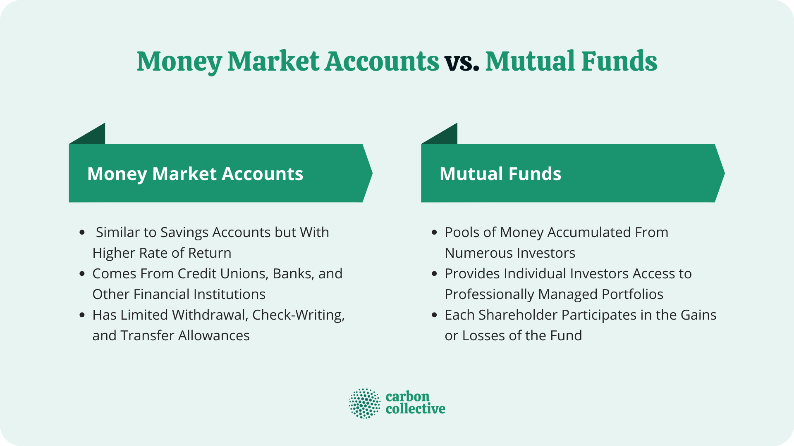

Investing can be a daunting task with many options available. Understanding the differences between investment types such as money market funds, mutual funds, and the use of algorithmic trading can significantly impact your financial strategies. This article aims to explore the distinctions between money market funds and mutual funds while also considering how algorithmic trading influences investment strategies.

Money market funds and mutual funds are vital components of the investment ecosystem, each serving different financial goals. Money market funds are typically low-risk and invest in short-term debt instruments, focusing on capital preservation and liquidity. They are often preferred by investors seeking safety and easy access to their funds.

In contrast, mutual funds provide diversified portfolios across asset classes such as stocks and bonds, offering the potential for higher returns. These funds aim to surpass market performance through strategic asset allocation and professional management, making them a fitting choice for those seeking growth and income over time.

Algorithmic trading, a rising force in fund management, employs computational algorithms to automate trading decisions, improving speed and accuracy. This technology offers both money market and mutual fund managers the ability to optimize returns and manage risks more effectively.

By examining the advantages and disadvantages of these investment options, this article aims to equip investors with the insights needed to make informed decisions. The evolving nature of financial markets necessitates an understanding of these investment vehicles for both novice and experienced investors.

Let's begin by exploring the basic definitions and functionalities of money market and mutual funds.

## Table of Contents

## Understanding Money Market Funds

Money market funds are a specific category within mutual funds, differentiated by their investment focus on low-risk, short-term debt securities. These funds frequently invest in highly liquid, near-cash assets such as Treasury bills, which are government debt securities with maturities of less than one year, commercial paper, which consists of unsecured, short-term promissory notes issued by corporations, and certificates of deposit (CDs) from banks. The emphasis on short-term debt instruments underpins their stability and [liquidity](/wiki/liquidity-risk-premium), allowing investors to quickly access their cash when needed.

The design of money market funds aims to maintain the net asset value (NAV) at a constant $1 per share, although this is not guaranteed. Their primary objective is to minimize exposure to the [volatility](/wiki/volatility-trading-strategies) typically associated with financial markets, thereby offering modest but stable returns. This feature makes them a preferable choice for investors seeking capital preservation alongside easy accessibility of funds, especially for short-term financial needs.

Despite the attractive safety profile offered by money market funds, several limitations are worth noting. The conservative strategy employed in their investments inherently leads to lower yields compared to other investment vehicles focused on higher growth potential. In periods of low-interest rates, returns from money market funds might not keep pace with inflation, leading to a potential decrease in purchasing power over time.

Advantages of investing in money market funds include their high degree of liquidity, which is nearly equivalent to that of cash, making them suitable for parking funds temporarily. Additionally, they provide a low-risk investment opportunity, especially beneficial during economic uncertainty when capital preservation becomes a priority.

Understanding these characteristics is crucial for investors in determining the suitability of money market funds within their broader investment strategy, particularly when prioritizing objectives such as safety, liquidity, or short-term savings goals.

## Exploring Mutual Funds

Mutual funds serve as diversified investment portfolios pooling funds from numerous investors to acquire various securities, such as stocks, bonds, and mixed asset classes. This investment vehicle allows investors access to a broad spectrum of assets, providing varying levels of risk and diverse management styles, including actively managed funds and index funds. Actively managed funds involve professional managers who make strategic decisions to buy or sell securities aiming to outperform market benchmarks. In contrast, index funds aim to replicate market indices, offering a more passive investment approach.

The primary objective of mutual funds is to surpass market performance by employing strategic investments and relying on professional management expertise. Depending on the investment strategy, these funds can address different financial objectives, including growth, income generation, or capital preservation. For instance, growth-oriented funds focus on capital appreciation and may invest in high-growth companies, while income funds prioritize dividend or interest income, often investing in bonds or dividend-paying stocks.

A critical component of investing in mutual funds is understanding the fee structures inherent in these financial products. Common fees include management fees, which compensate the fund managers for their expertise and services, and expense ratios, which cover the ordinary operating expenses of the fund. These fees directly impact an investor's net returns. For example, a mutual fund with an expense ratio of 1% signifies that 1% of the fund's assets are used annually to cover expenses, reducing the investor’s overall returns.

Investors must evaluate these costs when considering mutual funds as part of their investment strategy. While mutual funds offer the advantage of diversification and professional management, the associated fees can erode potential gains, especially in funds where performance does not significantly exceed that of lower-cost alternatives, such as index funds. As a result, the choice of mutual funds should align with the investor’s financial goals, risk tolerance, and investment horizon.

## Algorithmic Trading in Fund Management

Algorithmic trading involves the use of quantitative models and sophisticated computer algorithms to automate the process of buying and selling securities. This trading strategy is increasingly prevalent in fund management, including both money market and mutual funds, due to its ability to enhance the efficiency and precision of executing trades.

The core principle of [algorithmic trading](/wiki/algorithmic-trading) lies in its capacity to identify and exploit market inefficiencies that are not easily perceptible to the human eye. By leveraging advanced statistical models and real-time data analysis, algorithmic systems can place trades at optimal times, ensure competitive pricing, and manage large transactions with minimal market impact. Moreover, these algorithms are programmed to adhere to predefined criteria, such as timing, price, and [volume](/wiki/volume-trading-strategy), which are crucial for maintaining discipline and consistency in trading operations.

One of the primary advantages of algorithmic trading in fund management is the significant enhancement it offers in the speed and efficiency of trade executions. Traditional trading methods, which rely heavily on human intervention, can be slower and more prone to mistakes. In contrast, algorithmic systems can execute thousands of transactions in fractions of a second, thereby providing funds with the ability to respond rapidly to market changes and capitalize on fleeting opportunities.

Algorithmic trading also plays a critical role in risk management within funds. By using quantitative risk models, algorithms can assess the risk associated with different trading strategies and optimize portfolios to align with the fund's risk tolerance. This capability enables fund managers to mitigate potential losses while maximizing returns.

Furthermore, algorithmic trading contributes to enhanced transparency and reduced transaction costs. By automating trades, funds can achieve lower spreads and gain access to a broader range of liquidity sources. This is particularly beneficial in the context of mutual funds, where large volumes of transactions occur regularly.

In examining the impact of algorithmic trading on fund performance, it is crucial to consider its influence on both market efficiency and portfolio diversification. The sophisticated data analysis tools embedded in algorithmic systems allow for better-informed investment decisions, which can lead to improved fund performance and a well-balanced risk-return profile. However, it is also important to be aware of the potential risks involved, such as the reliance on complex models that may not always accurately predict market movements.

In conclusion, the integration of algorithmic trading into fund management represents a significant advancement in the investment landscape. It enhances the ability of funds to operate efficiently and effectively, providing them with a competitive edge in today's fast-paced financial markets. As algorithmic trading continues to evolve, its role in shaping modern investment practices will likely expand, ensuring it remains a foundational element of fund management strategies.

## Comparative Analysis: Money Market Funds vs. Mutual Funds

When comparing money market funds and mutual funds, one must consider the inherent strategic differences that cater to varied investment objectives and risk tolerances. Money market funds primarily focus on safety and liquidity, investing in low-risk, short-term debt instruments such as Treasury bills, certificates of deposit, and commercial paper. This conservative approach makes them suitable for investors keen on capital preservation and minimal exposure to market volatility. The stability offered by money market funds comes at the expense of potentially higher returns, as the yields are generally lower than those found in more aggressive investment vehicles.

Conversely, mutual funds encompass a broader array of securities, allowing for diversified portfolios through equity, fixed income, or a mix of asset classes. This diversity aims to optimize risk-adjusted returns, potentially offering higher yields compared to money market funds—but with increased variability. Mutual funds are designed to exceed market performance via active management or passive strategies, such as index funds, and suit investors with a longer time horizon and higher risk tolerance.

When determining the appropriate fund type, investors must consider several factors:

1. **Risk Tolerance:** Money market funds are ideal for risk-averse investors, while mutual funds cater to those willing to endure market fluctuations for the prospect of greater returns.

2. **Time Horizon:** Short-term financial goals align with money market funds due to their liquidity and stability. Conversely, mutual funds are better suited for long-term objectives, where diversifying can mitigate risks over time.

3. **Expected Returns:** The conservative nature of money market funds results in lower returns. Investors seeking substantial growth might find mutual funds more appealing due to their potential for higher performance.

Analyzing these investments using case studies and statistical data can further elucidate their performance trends and appropriateness across different investor demographics. For instance, data might show that over a ten-year period, equity-oriented mutual funds significantly outperformed money market funds in terms of average annual returns, though they also exhibited higher standard deviation due to market volatility.

Other considerations include examining fees, such as expense ratios and management costs, which can erode returns over time. Money market funds often have lower fees owing to their straightforward management, whereas mutual funds may incur higher fees, particularly if actively managed, impacting the net gains of investors.

Ultimately, understanding each fund's distinct benefits and drawbacks aids investors in aligning their portfolio with individual financial goals and market expectations, facilitating informed decisions that optimize investment strategies according to personal growth ambitions and risk capacity.

## Conclusion

Choosing between money market funds and mutual funds ultimately hinges on individual investment objectives and risk tolerance. Money market funds present a viable option for those seeking safety and high liquidity, making them ideal for short-term financial goals and emergency funds. These funds are typically invested in low-risk, short-term debt instruments such as Treasury bills and certificates of deposit, which offer minimal exposure to market volatility. Their primary advantage lies in providing a stable investment environment with lesser risk, albeit with correspondingly lower returns.

Conversely, mutual funds offer the potential for higher returns through diversified asset allocations. By pooling money from multiple investors, mutual funds invest in a diverse range of assets, including stocks, bonds, and other securities, which can capture growth opportunities across various sectors and markets. These funds can cater to an array of investment strategies, from conservative income-focused funds to aggressive growth funds. While they provide higher return potential compared to money market funds, they do come with increased risk, influenced by market conditions and the specific assets selected by the fund managers.

The integration of algorithmic trading has further refined fund management processes. By leveraging quantitative models and high-speed computing, algorithmic trading improves market efficiency, reduces human error, and allows for more precise execution of investment strategies. This technological advancement enhances the ability of fund managers to capitalize on market opportunities and adjust portfolios dynamically in response to market changes.

Investors should conduct comprehensive research and consider consulting financial advisors when crafting their investment strategies. An understanding of the unique characteristics and risks associated with each fund type will enable investors to align their choices with their financial goals and risk appetite effectively. Remaining informed and adaptable to shifts in the financial environment will empower investors to make strategic decisions and optimize capital growth prospects.

## References & Further Reading

[1]: ["The Little Book of Common Sense Investing: The Only Way to Guarantee Your Fair Share of Stock Market Returns"](https://www.amazon.com/Little-Book-Common-Sense-Investing/dp/1119404509) by John C. Bogle

[2]: ["Fundamentals of Investing"](https://www.coursera.org/learn/investing-fundamentals) by Scott B. Smart, Lawrence J. Gitman, and Michael D. Joehnk

[3]: ["Advances in Financial Machine Learning"](https://www.amazon.com/Advances-Financial-Machine-Learning-Marcos/dp/1119482089) by Marcos Lopez de Prado

[4]: ["Quantitative Trading: How to Build Your Own Algorithmic Trading Business"](https://books.google.com/books/about/Quantitative_Trading.html?id=j70yEAAAQBAJ) by Ernest P. Chan

[5]: ["Money Market Funds: Risk, Regulation, and Reform"](https://www.reuters.com/markets/us/why-is-us-sec-reforming-money-market-funds-2023-07-12/) by Christopher Amerig and Oren Kiazim