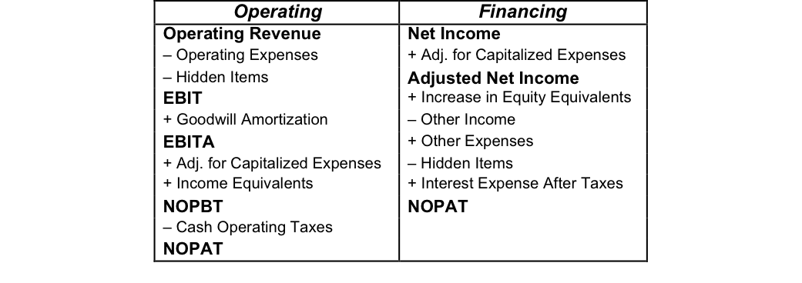

## Table of Contents

## What is Net Operating Profit After Tax (NOPAT)?

Net Operating Profit After Tax (NOPAT) is a measure of a company's profit after subtracting the taxes it would have to pay if it had no debt. It shows how well a company is doing at making money from its main business activities, without considering how it is financed. NOPAT is useful for comparing the performance of different companies because it removes the effects of different tax situations and financing methods.

To calculate NOPAT, you start with the company's operating profit, which is the profit from its regular business activities before interest and taxes. Then, you subtract the taxes the company would owe if it had no debt. This gives you a clear picture of the company's operational efficiency and profitability. NOPAT is often used in financial analysis and valuation models, like the Economic Value Added (EVA) model, to assess a company's true earning power.

## What is Net Income?

Net income is the money a company has left after it pays all its expenses, including taxes and interest on loans. It is also called the bottom line because it is the last number on the income statement, showing how much profit the company made during a certain time, like a year or a quarter.

You can think of net income as what's left in your pocket after you've paid all your bills. For a company, it's important because it shows if the business is making money or losing it. If net income is positive, the company is profitable. If it's negative, the company is losing money. Investors and business owners look at net income to see how well the company is doing.

## How is NOPAT calculated?

NOPAT stands for Net Operating Profit After Tax. It's a way to see how much money a company makes from its main business activities, without worrying about how it's financed. To find NOPAT, you start with the company's operating profit. This is the money the company makes before it pays any interest on loans or taxes. Then, you figure out how much tax the company would have to pay if it had no debt. You subtract this tax amount from the operating profit, and that gives you NOPAT.

NOPAT is helpful because it lets you compare different companies fairly. It takes away the effects of different tax situations and how companies borrow money. This makes it easier to see which companies are doing a good job at making money from their main business. People use NOPAT in financial analysis and models like Economic Value Added (EVA) to understand a company's real [earning](/wiki/earning-announcement) power.

## How is Net Income calculated?

Net income is the money a company has left after it pays all its costs, including taxes and interest on loans. It's the profit that shows up at the bottom of the income statement, which is why it's also called the bottom line. To find net income, you start with the company's total revenue, which is all the money it made from selling its products or services. Then, you subtract all the costs the company had to pay to run its business. These costs include things like the cost of goods sold, operating expenses, interest on loans, and taxes.

Net income is important because it tells you if a company made money or lost money during a certain time, like a year or a quarter. If the net income is positive, the company made a profit. If it's negative, the company lost money. People who invest in the company or own it look at net income to see how well the business is doing. It's a key number that helps them decide if the company is a good investment or if it needs to make changes to become more profitable.

## What are the main differences between NOPAT and Net Income?

NOPAT and Net Income are two ways to measure a company's profit, but they look at different things. NOPAT stands for Net Operating Profit After Tax. It shows how much money a company makes from its main business activities, without considering how it's financed. To find NOPAT, you start with the company's operating profit and then subtract the taxes it would owe if it had no debt. This helps compare different companies fairly, because it removes the effects of different tax situations and how companies borrow money.

Net Income, on the other hand, is the money a company has left after it pays all its costs, including taxes and interest on loans. It's the final profit number on the income statement, often called the bottom line. To calculate Net Income, you take the company's total revenue and subtract all the costs, like the cost of goods sold, operating expenses, interest, and taxes. Net Income tells you if a company made or lost money during a certain time, which is important for investors and owners to see how well the business is doing.

The main difference between NOPAT and Net Income is that NOPAT focuses on the profit from a company's main business activities and ignores financing costs, while Net Income includes all costs, including interest on loans. This makes NOPAT useful for comparing the operational efficiency of different companies, while Net Income gives a complete picture of a company's overall profitability.

## Why is NOPAT important for assessing a company's operational efficiency?

NOPAT is important for assessing a company's operational efficiency because it shows how well a company is making money from its main business activities, without worrying about how it's financed. When you look at NOPAT, you see the profit the company makes before it pays any interest on loans. This means you can compare different companies fairly, even if they have different ways of borrowing money or different tax situations. NOPAT helps you focus on the core business and see if the company is good at turning its operations into profit.

By using NOPAT, you can get a clear picture of a company's operational efficiency. It's like looking at how well a company can make money just from doing what it does best, without the distractions of how it's paying for its business. This is really helpful for investors and analysts who want to understand if a company is strong at its core business. They can use NOPAT to see if the company is efficient and profitable in its day-to-day operations, which is key to long-term success.

## How does Net Income reflect a company's overall financial health?

Net Income is a key number that shows how healthy a company is financially. It tells you how much money the company has left after paying all its bills, including taxes and interest on loans. If a company's Net Income is positive, it means the company made a profit during that time. This is a good sign that the business is doing well and can keep running, paying its workers, and maybe even growing. But if Net Income is negative, it means the company lost money, which can be a warning sign that the business might need to make changes or find more money to keep going.

People who invest in the company or own it look at Net Income to see if the business is a good place to put their money. A company with a strong, positive Net Income is usually seen as a safer bet because it shows the business can make more money than it spends. This can make investors feel confident about the company's future. On the other hand, if a company keeps having negative Net Income, it might scare investors away because it shows the business is struggling to make ends meet. So, Net Income is a simple but powerful way to check a company's overall financial health.

## Can NOPAT be used to compare companies across different industries?

NOPAT, or Net Operating Profit After Tax, can be a helpful tool for comparing companies across different industries. It looks at the profit a company makes from its main business activities, without considering how it's financed. This means you can see how well a company is doing at making money from what it does best, no matter what industry it's in. For example, you could compare a tech company with a manufacturing company and see which one is better at turning its operations into profit.

However, there are some things to keep in mind when using NOPAT to compare companies in different industries. Different industries have different ways of making money and different costs. What's normal for one industry might not be normal for another. So, while NOPAT can give you a good starting point for comparing companies, you might also need to look at other things, like industry-specific metrics or how the companies are growing, to get a full picture.

## What role do non-operating expenses and incomes play in the difference between NOPAT and Net Income?

Non-operating expenses and incomes are the main reason why NOPAT and Net Income are different. NOPAT looks at the profit a company makes from its main business activities, without thinking about how it's financed. It doesn't include non-operating expenses like interest on loans or non-operating incomes like money made from selling investments. So, NOPAT focuses on the core business and how well it's doing, without the distractions of other financial activities.

Net Income, on the other hand, includes everything. It takes the company's total revenue and subtracts all costs, including non-operating expenses like interest on loans and non-operating incomes like profits from selling investments. This means Net Income shows the complete picture of a company's profit, including all the money it made and all the money it spent, no matter where it came from or went. So, the difference between NOPAT and Net Income comes down to whether you're looking at just the main business or the whole financial story.

## How do tax treatments affect the calculation of NOPAT versus Net Income?

NOPAT and Net Income are affected by taxes in different ways. NOPAT looks at the profit a company makes from its main business activities, without thinking about how it's financed. To find NOPAT, you start with the operating profit and then subtract the taxes the company would owe if it had no debt. This means NOPAT uses a special tax number that's just about the business itself, not about how the company borrows money. So, NOPAT gives you a clear view of how well the main business is doing, without the distractions of tax benefits or costs from loans.

Net Income, on the other hand, includes all the taxes a company actually has to pay. This means it takes into account not just the taxes on the main business activities, but also the taxes on non-operating incomes and expenses, like interest on loans. So, when you calculate Net Income, you're looking at the total profit after all taxes, which can be different from the tax number used in NOPAT. This makes Net Income a more complete picture of the company's profit, including all the tax effects of how it's financed.

## In what scenarios would NOPAT be a more useful metric than Net Income?

NOPAT is a more useful metric than Net Income when you want to see how well a company is doing at its main business, without worrying about how it's borrowing money or paying taxes. Imagine you're comparing two companies that do the same thing but have different ways of financing their business. One might have a lot of loans and pay a lot of interest, while the other doesn't. NOPAT helps you see which company is better at making money from what it does, not just how it's paying for it. This is really helpful for investors and analysts who want to focus on the core business and see if it's strong and efficient.

Another time when NOPAT is more useful is when you're trying to figure out if a company is creating value. NOPAT is used in models like Economic Value Added (EVA), which looks at whether a company is making more money than the cost of running it. If you use Net Income instead, the numbers can be thrown off by things like interest payments or tax breaks from loans. NOPAT gives a clearer picture of the company's true earning power, which is important for deciding if it's a good investment or if it's using its resources well.

## How can investors use both NOPAT and Net Income to make informed investment decisions?

Investors can use NOPAT to see how well a company is doing at its main business, without worrying about how it's borrowing money or paying taxes. NOPAT shows the profit from the company's core operations, which helps investors compare different companies fairly. If a company has a high NOPAT, it means it's good at making money from what it does best. This is important for investors who want to know if the company's main business is strong and efficient. They can use NOPAT to figure out if the company is creating value and if it's a good investment for the long term.

Net Income, on the other hand, gives investors a complete picture of a company's profit, including all the money it made and all the money it spent. It shows how much money the company has left after paying all its bills, like taxes and interest on loans. A positive Net Income means the company made a profit, which is a good sign that the business is doing well and can keep running and growing. Investors can use Net Income to see the overall financial health of the company and decide if it's a safe place to put their money. By looking at both NOPAT and Net Income, investors can get a full understanding of a company's performance and make better investment decisions.

## What is the difference between NOPAT and Net Income?

Net Operating Profit After Tax (NOPAT) is a key financial metric that gauges a company's profitability by reflecting earnings derived strictly from core operations, post-tax, and excluding financing costs. This measure highlights the operational efficiency of a firm by isolating its earnings from activities central to its business model. In contrast, net income encompasses total company earnings, taking into account all expenses, interest, and taxes, providing a more comprehensive but sometimes muddled perspective of a company's financial performance. 

To understand the practical differentiation between these metrics, consider the NOPAT formula: 

$$
\text{NOPAT} = \text{EBIT} \times (1 - \text{Tax Rate})
$$

Where EBIT stands for Earnings Before Interest and Taxes. This formula emphasizes profits generated from the company's operations irrespective of how the business is financed, in contrast to net income which combines operational success with financial and investment activities. 

Since NOPAT focuses solely on core business profitability, it provides a cleaner view of a company’s operational success by stripping away the effects of capital structure and tax strategies. For stakeholders, particularly those interested in operational performance unmarred by financial engineering, NOPAT serves as an invaluable tool in assessing a business's true economic value.

## What is the Importance of NOPAT in Financial Analysis?

NOPAT, or Net Operating Profit After Tax, plays a significant role in financial analysis by providing an unobscured view of a company's operational performance. By excluding the effects of capital structure and tax strategies, NOPAT enables analysts and investors to evaluate a company's efficiency and profitability from its core activities. 

A crucial advantage of NOPAT is its ability to facilitate more accurate comparisons between companies with different debt structures or financial strategies. For instance, companies with high debt may have lower net income due to interest expenses, but their NOPAT can reveal a more accurate picture of their operational performance without the distortion caused by financing decisions. This distinction is vital in assessing firms on their true operational merits, irrespective of their capital structures.

Investors leverage NOPAT as a key metric to gauge operational efficiency. By focusing on operating profits excluding taxes and interest, NOPAT reflects the effectiveness of a company's operations without the noise created by financial engineering or tax optimization strategies. This focus can guide investors in identifying companies with strong operational performance and sustainable profitability.

NOPAT is also central in the calculation of Economic Value Added (EVA). EVA is a measure of a company's financial performance that calculates the value created over the required return of the company's shareholders. It is given by the formula:

$$
EVA = NOPAT - (Capital \times Cost\_of\_Capital)
$$

By assessing whether a company's returns exceed its cost of capital, EVA, and indirectly NOPAT, inform decisions on whether a company is generating sufficient returns to justify its capital investments. This insight is crucial for long-term investors and stakeholders interested in sustainable growth and value creation.

In summary, NOPAT's emphasis on isolating a company's core operational results makes it indispensable for financial analysis. Its exclusion of capital structure and tax strategy influences ensures consistency in evaluating operational success, paving the way for informed, strategic investment decisions.

## What are the key differences between NOPAT and Net Income?

Net Operating Profit After Tax (NOPAT) and net income are two financial metrics that serve different purposes in evaluating a company's performance. 

Net income offers a comprehensive view of a company's financial health by including all aspects of its operations, such as operating income, interest, taxes, and extraordinary items. This breadth accounts for interest expenses, which reflect the cost of debt financing, and potential tax advantages from leveraging. Consequently, net income can vary considerably depending on a company’s capital structure and tax management strategies, potentially clouding the accurate assessment of its fundamental operations.

Conversely, NOPAT focuses solely on the core operational profit, providing a clearer picture of how well a company performs its primary business functions without the confounding effects of financing decisions and tax strategies. The formula for calculating NOPAT is:

$$
\text{NOPAT} = \text{EBIT} \times (1 - \text{Tax Rate})
$$

Here, EBIT (Earnings Before Interest and Taxes) serves as a proxy for core operational earnings, and the tax rate adjustment ensures that the result reflects net profit after tax obligations, devoid of interest influences.

These distinctions render NOPAT a particularly valuable measure when comparing companies with different capital structures or in various sectors. By isolating operational efficiency, NOPAT provides a stable basis for evaluating and benchmarking a company's performance, free from the distortions caused by unique financing or tax approaches. Therefore, NOPAT is often preferred in certain financial analyses where understanding the underlying operational success is critical, such as in industries with disparate debt levels or tax regimes.

## What is a Practical Example of NOPAT Calculation?

To understand how Net Operating Profit After Tax (NOPAT) is calculated, let's consider a hypothetical company, XYZ Corp. We will walk through the steps using financial data typically found in income statements and notes to financial statements.

### Hypothetical Financial Data for XYZ Corp.

- **Operating Income (EBIT):** \$500,000
- **Tax Rate:** 30%

### Step-by-Step NOPAT Calculation

1. **Identify the Operating Income (EBIT):**
   - Operating Income, also known as Earnings Before Interest and Taxes (EBIT), represents the profit generated from core business operations, excluding costs associated with capital structure, such as interest expenses. For XYZ Corp., the EBIT is \$500,000.

2. **Determine the Tax Rate:**
   - The tax rate is the combined federal and state tax rate that the company is subject to. In this example, XYZ Corp. is subject to a tax rate of 30%.

3. **Apply the NOPAT Formula:**

   The formula to calculate NOPAT is:
$$
   \text{NOPAT} = \text{EBIT} \times (1 - \text{Tax Rate})

$$

   Plugging the values from XYZ Corp. into the formula:
$$
   \text{NOPAT} = 500,000 \times (1 - 0.30)

$$
$$
   \text{NOPAT} = 500,000 \times 0.70

$$
$$
   \text{NOPAT} = 350,000

$$

Therefore, the Net Operating Profit After Tax for XYZ Corp. is \$350,000.

### Significance of the Calculation

Calculating NOPAT provides investors and analysts with a baseline measure of a company's operational efficiency, excluding the effects of leverage and tax strategy. This allows for a more accurate comparison of XYZ Corp.'s core operational performance with other companies within the same industry, facilitating informed investment decisions.

## References & Further Reading

[1]: Youngman, R. (2009). ["Understanding NOPAT and Free Cash Flow"](https://fastercapital.com/content/NOPAT-and-Free-Cash-Flow--Evaluating-a-Company-s-Financial-Health.html) Investopedia.

[2]: "Corporate Finance and Valuation: What Makes a Company Valuable". (2020). CFA Institute.

[3]: ["Corporate Finance"](https://www.investopedia.com/terms/c/corporatefinance.asp) by Stephen Ross, Randolph Westerfield, and Bradford Jordan.

[4]: Damodaran, A. (2012). ["Investment Valuation: Tools and Techniques for Determining the Value of Any Asset"](https://books.google.com/books/about/Investment_Valuation.html?id=5SRHAAAAQBAJ) Wiley Finance.

[5]: ["The Essentials of Corporate Finance"](https://www.amazon.com/Essentials-Corporate-Finance-Mcgraw-hill-Insurance/dp/0073382469) by Stephen A. Ross, Randolph W. Westerfield, and Bradford D. Jordan.